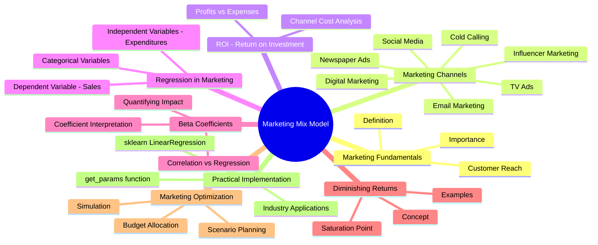
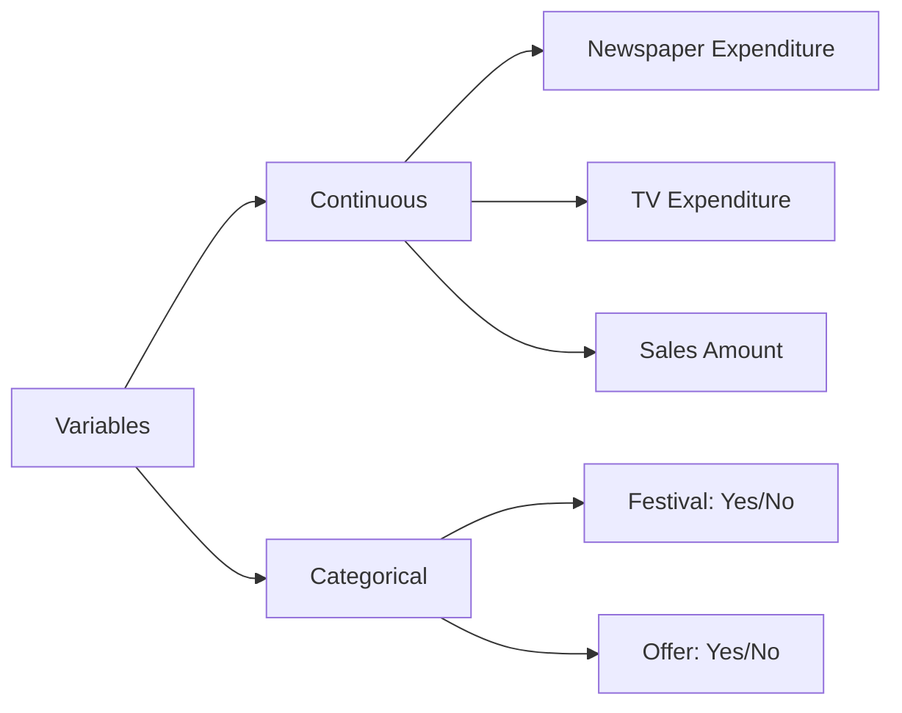
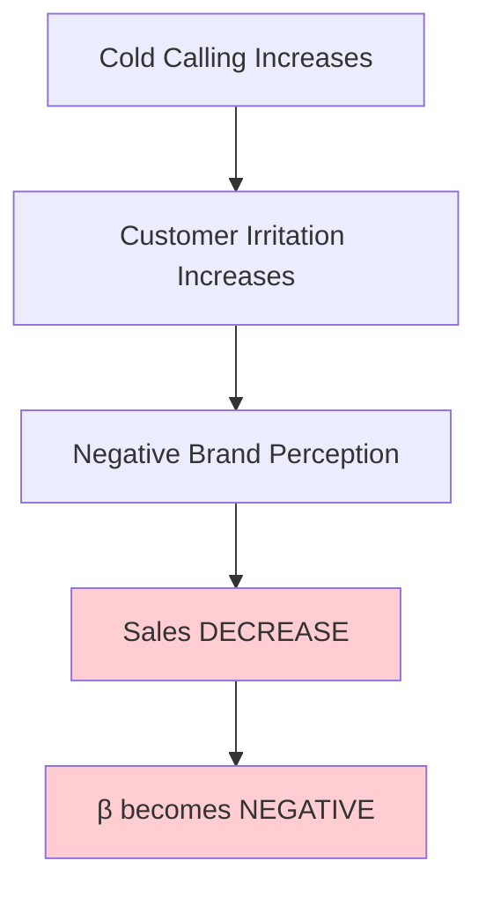
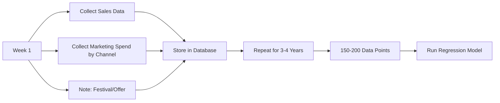

# IM_8: Introduction to ML Algorithms - Marketing Mix Model (Part 1)

> 📚 **This is Part 1** covering: Marketing Fundamentals, Channel Types, ROI, Regression in Marketing, Dependent/Independent Variables
> 📘 **Next:** [Part 2](./IM_8_IntroToMLAlgorithmsMixModel2.md), [Part 3](./IM_8_IntroToMLAlgorithmsMixModel3.md)

---

## 🗺️ Mind Map - Topics to Cover



---

## 🎓 Classroom Conversation

### Topic 1: Introduction to Marketing and Its Importance

**Teacher:** Good morning students! Ippudu mana ML session lo oka chala interesting and industry-relevant topic chuddam - Marketing Mix Model. Idi regression concept real-world lo ela use avuthundo chupistundi.

**Beginner Student:** Sir, marketing ante enti? Adi data science ki ela connect avuthundi?

**Teacher:** Very good starting question! Marketing ante simplega cheppali ante - meeru oka product or service create chesaru, daanni correct customers ki reach cheyyadam ante marketing.

Think about it this way - meeru oka wonderful drone-based service create chesaru. But meeru correct customers ni find cheyakapothe, me product fail avuthundi...not because product is bad, but because it didn't reach the RIGHT people!

> 💡 **Jargon Alert - Marketing**
> Simple Explanation: Meeru build chesina product ni correct customers ki aware cheyyadam. Like oka teacher student ki concept clear cheyyadam, marketing ante product benefit customer ki clear cheyyadam.
> Example: Diwali ki iPhone ad TV lo chupistaru - that's marketing!

**Practical Student:** Sir, interview lo marketing gurinchi ML context lo adugutara?

**Teacher:** Absolutely! Marketing Mix Modeling is a BILLION DOLLAR industry application. Any data scientist working in retail, FMCG, pharma, e-commerce needs to understand this. Interviewers love candidates who can connect ML to business impact!

---

### Topic 2: Marketing Channels - The Different Ways to Reach Customers

**Teacher:** Ippudu let's understand - customers ni reach cheyyadaniki different channels enti?

**Clever Student:** Sir, social media popular ga undi kadha? Instagram, Facebook, YouTube lo ads chustam.

**Teacher:** Correct! But let me list ALL the major channels:

| Channel | Description | Cost Level | Audience Type |
|---------|-------------|------------|---------------|
| **TV Ads** | Advertisements on television | Very High | All ages, especially 40+ |
| **Newspaper Ads** | Print media advertisements | Medium-High | Senior citizens, 40+ |
| **Social Media Ads** | Facebook, Instagram, YouTube | Medium | Youth, Gen Z, Millennials |
| **Email Marketing** | Bulk emails to customers | Low-Medium | Existing customers |
| **Cold Calling** | Direct phone calls to prospects | Medium | All, but often annoying |
| **Digital Marketing** | Google Ads, website banners | Medium-High | Internet users |
| **Influencer Marketing** | Celebrity/influencer promotions | High | Followers of influencers |

**Beginner Student:** Sir, intha channels unnai ante, companies anni use chesthaya?

**Teacher:** Great observation! Companies generally use a COMBINATION of channels. For example, Apple iPhone launch chusthe:
1. First - Social media announcement
2. Next day - Newspaper ads
3. During IPL - TV ads
4. If you signed up - Email notification

They don't put all money in ONE channel - that's the key insight!

**Debate Student:** Sir, why not just use the cheapest channel, like email?

**Teacher:** Excellent question! Let me explain with data:

```
Email Marketing:
✅ Cheap
❌ Goes to spam
❌ Need white-listing
❌ Limited reach to new customers

TV Ads:
✅ Mass reach
✅ Credibility
❌ Very expensive
❌ Can't target specific demographics

Social Media:
✅ Targeted advertising
✅ Young audience reach
❌ Misses older demographic
❌ Ad fatigue

Each channel has pros and cons!
```

---

### Topic 3: ROI - Return on Investment

**Teacher:** Ippudu most important business concept - ROI. Every rupee you spend, how much profit do you get back?

**Formula:**
$$ROI = \frac{Profits}{Expenses}$$

**Beginner Student:** Sir, ROI simple lagundi. Ippudu AI/ML ikkada ela vastundi?

**Teacher:** The question is - if I have 100 rupees budget, how do I divide it among channels to get MAXIMUM ROI?

- Option A: 25% each in 4 channels?
- Option B: 50% in TV, 30% in Social, 20% in Email?
- Option C: 80% in one best channel?

**WITHOUT data science**, this is just guessing! **WITH data science**, we can actually CALCULATE which allocation is optimal!

> 💡 **Jargon Alert - ROI (Return on Investment)**
> Simple Explanation: Like exam marks (output) divided by study hours (input). Higher ROI = better efficiency.
> Example: If you spend ₹1,000 on ads and get ₹5,000 sales, ROI = 5.0 (500% return)

**Critique Student:** Sir, but ROI calculation accurate untunda? Data correct avvali kadha?

**Teacher:** Absolutely right! That's why data scientists spend 80% time on DATA CLEANING. Garbage in = Garbage out!

---

### Topic 4: Building the Marketing Mix Model - Variables

**Teacher:** Now let's get into the DATA SCIENCE part. How do we structure this as a regression problem?

**Clever Student:** Sir, regression means we need Y (target) and X (features) right?

**Teacher:** Perfect! Here's how we set it up:

#### Dependent Variable (Y):
- **Weekly Sales** → Continuous variable (in rupees/dollars)

#### Independent Variables (X):
| Variable | Type | Example Values |
|----------|------|----------------|
| Newspaper Ads Expenditure | Continuous | ₹10,000, ₹25,000 |
| TV Ads Expenditure | Continuous | ₹50,000, ₹1,00,000 |
| Social Media Ads Expenditure | Continuous | ₹15,000, ₹35,000 |
| Email Marketing Expenditure | Continuous | ₹5,000, ₹8,000 |
| Cold Calling Expenditure | Continuous | ₹14,000, ₹20,000 |
| Festival Season | Categorical | 1 (Yes), 0 (No) |
| Special Offers | Categorical | 1 (Yes), 0 (No) |

**Beginner Student:** Sir, festival season continuous kaada? Why categorical?

**Teacher:** Wonderful doubt! Let me explain:

**Continuous Variable:** Can take any numerical value (₹10,000, ₹10,001, ₹10,002...)
**Categorical Variable:** Fixed categories (Yes/No, Diwali/Regular Week)

Festival season is either "happening" (1) or "not happening" (0). There's no "half festival"!



**Curious Student:** Sir, what other variables can affect sales apart from marketing?

**Teacher:** Great thinking! Many factors:
- Product quality
- After-sales service
- Economic conditions
- Interest rates (for real estate)
- Competitor pricing
- Weather (for seasonal products)

**BUT** - for Marketing Mix Model, we ONLY focus on marketing variables. Why? Because we're trying to optimize MARKETING budget specifically!

---

### Topic 5: How Data Looks in Practice

**Teacher:** Let me show you how this data actually looks:

```
| Week | Weekly_Sales | Newspaper_Exp | TV_Exp | Social_Exp | Email_Exp | Cold_Call | Offer | Festival |
|------|--------------|---------------|--------|------------|-----------|-----------|-------|----------|
| 1    | 1,00,000     | 10,000        | 25,000 | 35,000     | 5,000     | 14,000    | 0     | 0        |
| 2    | 1,50,000     | 12,000        | 30,000 | 40,000     | 6,000     | 16,000    | 1     | 1        |
| 3    | 80,000       | 8,000         | 20,000 | 25,000     | 4,000     | 10,000    | 0     | 0        |
| ...  | ...          | ...           | ...    | ...        | ...       | ...       | ...   | ...      |
```

**Practical Student:** Sir, how many weeks of data kavali accurate model ki?

**Teacher:** Industry standard is 3-4 YEARS of weekly data. That's approximately 150-200 rows minimum. More data = better model!

**Beginner Student:** Sir, oka doubt. Weekly sales increase avvali ante definitely marketing cheyyala?

**Teacher:** Not necessarily! That's the interesting part. Let me give examples:

**Case 1: Festival Effect**
- Diwali week lo sales automatically increase
- People are already planning to buy
- Marketing just reminds them of your brand

**Case 2: Word of Mouth**
- D-Mart example: Low prices, quality products
- People tell friends → Sales increase
- No marketing spend, still sales go up!

**Case 3: Negative Marketing**
- Cold calling too much
- Customers get irritated
- Sales actually DECREASE!

---

### Topic 6: Regression Equation - The Mathematical Foundation

**Teacher:** Now let's build the actual regression equation. After fitting the model, this is what we get:

$$Y = \alpha + \beta_1 X_1 + \beta_2 X_2 + \beta_3 X_3 + \beta_4 X_4 + \beta_5 X_5 + \beta_6 X_6 + \beta_7 X_7$$

Where:
- Y = Weekly Sales (Dependent Variable)
- α = Intercept
- β₁ = Coefficient for Newspaper Ads (X₁)
- β₂ = Coefficient for TV Ads (X₂)
- β₃ = Coefficient for Social Media (X₃)
- β₄ = Coefficient for Email (X₄)
- β₅ = Coefficient for Cold Calling (X₅)
- β₆ = Coefficient for Offers (X₆)
- β₇ = Coefficient for Festival (X₇)

**Clever Student:** Sir, coefficients (beta values) enti exactly? Ela interpret cheyyali?

**Teacher:** THIS IS THE MOST IMPORTANT PART! Let me explain:

Each **β (beta)** tells you:
1. **Direction** - Positive or Negative impact
2. **Magnitude** - How MUCH impact per rupee spent

**Example:**
- β₁ (Newspaper) = 0.5
- β₂ (TV) = 0.25

**Interpretation:**
- For every ₹1 spent on Newspaper → Sales increase by ₹0.50
- For every ₹1 spent on TV → Sales increase by ₹0.25

**Which is better? NEWSPAPER!** (Higher coefficient)

> 💡 **Jargon Alert - Beta Coefficient (β)**
> Simple Explanation: Like exam marks per hour of study. If Math gives 5 marks/hour and Science gives 3 marks/hour, you should study more Math!
> Example: β = 0.5 means for every ₹1 investment, you get ₹0.50 additional sales.

**Debate Student:** Sir, then why not just invest ALL money in highest beta channel?

**Teacher:** EXCELLENT question! This brings us to the concept of DIMINISHING RETURNS. But before that, let me clarify one more thing...

---

### Topic 7: Regression vs Correlation - The Key Difference

**Teacher:** This is a VERY important interview question! What's the difference between regression and correlation?

**Beginner Student:** Sir, dono same kaadha? Relationship chupisthayi kadha?

**Teacher:** NO! They are DIFFERENT. Let me explain:

| Aspect | Correlation | Regression |
|--------|-------------|------------|
| **What it tells** | Direction only (positive/negative) | Direction + Magnitude |
| **Output** | Single number (-1 to +1) | Full equation with coefficients |
| **Can predict?** | NO | YES |
| **Quantifies impact?** | NO | YES |
| **Example** | "X and Y are related" | "1 unit X → 0.5 units Y" |

**Correlation says:** "Newspaper ads and sales are positively related" ✅
**Regression says:** "For every ₹1 in newspaper ads, sales increase by ₹0.50" ✅✅

**Practical Student:** Sir, this is definitely interview question! How should I answer?

**Teacher:** Perfect answer template:

> "Correlation only tells us the direction and strength of relationship between variables, but regression QUANTIFIES the impact. With regression, we can say exactly how much the dependent variable changes for each unit change in independent variable. This makes regression much more useful for business decisions."

---

### Topic 8: Negative Coefficients - When Marketing Backfires

**Teacher:** Here's an interesting case - what if a beta coefficient is NEGATIVE?

**Curious Student:** Sir, negative beta matlab sales decrease hoga? But marketing kiya toh sales badna chahiye!

**Teacher:** Not always! Let me give a real example:

**Cold Calling Case Study:**
- Bajaj Finance calls people 10 times a day
- Star Health Insurance calls repeatedly
- Customers get IRRITATED
- They BLOCK the numbers
- When they need insurance, they specifically AVOID these companies!

**Result:** Higher cold calling expenditure → LOWER sales!

β₅ (Cold Calling) = -0.3 (Negative!)

**Interpretation:** For every ₹1 spent on cold calling, sales DECREASE by ₹0.30!



**Critique Student:** Sir, then why do companies still do cold calling?

**Teacher:** Because they don't MEASURE properly! Without Marketing Mix Model, they can't see the negative impact. They think "Any marketing is good marketing" - but data proves otherwise!

---

### Topic 9: Understanding the Data Collection Process

**Teacher:** Let me explain how companies actually collect this data:



**Practical Student:** Sir, TV ads ki exact spend kaise pata chalta hai?

**Teacher:** Companies maintain detailed expense records:
- TV channel invoices
- Newspaper advertising bills
- Social media ad dashboard (Facebook Ads Manager, Google Ads)
- Email platform subscriptions (Mailchimp, SendGrid)
- Cold calling agency bills

Everything is documented because it's TAX deductible!

---

## 📝 Teacher Summary - Part 1

**Teacher:** Okay students, let's summarize Part 1:

### Key Takeaways

1. **Marketing Mix Model** uses regression to optimize marketing budget
2. **ROI** = Profits / Expenses - goal is to maximize this
3. **Multiple channels** exist, each with different costs and effectiveness
4. **Regression equation** gives us β coefficients for each channel
5. **β interpretation:** For every ₹1 spent → How much sales increase
6. **Negative β** means channel is HURTING sales
7. **Regression vs Correlation:** Regression QUANTIFIES, correlation only shows direction

### Common Mistakes

| Mistake | Correct Understanding |
|---------|----------------------|
| "All marketing increases sales" | Some channels can have NEGATIVE impact |
| "Correlation = Regression" | Regression quantifies, correlation doesn't |
| "Put all money in best channel" | Diminishing returns (covered in Part 2) |
| "More data = always better" | Quality matters more than quantity |

---

> 📘 **Continue to Part 2:** [IM_8_IntroToMLAlgorithmsMixModel2.md](./IM_8_IntroToMLAlgorithmsMixModel2.md) for Diminishing Returns, Non-Linear Relationships, and Optimization Simulation.
