# IM_8: Introduction to ML Algorithms - Marketing Mix Model (Part 2)

> 📚 **This is Part 2** covering: Diminishing Returns, Non-Linear Relationships, Marketing Optimization, Simulation Techniques
> 📘 **Previous:** [Part 1](./IM_8_IntroToMLAlgorithmsMixModel1.md)
> 📘 **Next:** [Part 3](./IM_8_IntroToMLAlgorithmsMixModel3.md)

---

## 🎓 Classroom Conversation (Continued)

### Topic 10: Diminishing Returns - Why You Can't Keep Investing in One Channel

**Teacher:** Ippudu oka very important economic concept - Diminishing Returns. Idi understand cheyakapothe marketing mix model use cheyaleru!

**Beginner Student:** Sir, diminishing returns ante enti? Simple ga explain cheyandi.

**Teacher:** Perfect! Let me explain with a delicious example - APPLES! 🍎

Imagine you are VERY hungry. Your hunger satisfaction level starts at 0%.

| Apple # | Satisfaction Level |
|---------|-------------------|
| 1st Apple | 100% (Perfect!) |
| 2nd Apple | 85% (Still good) |
| 3rd Apple | 50% (Getting full) |
| 4th Apple | 25% (Barely enjoying) |
| 5th Apple | 15% (Don't want more) |
| 6th Apple | 5% (Feeling uncomfortable) |
| 7th Apple | 0% (Can't eat more) |
| 8th Apple | -5% (Feeling sick) |
| 9th Apple | -15% (Will vomit!) |

**Key Insight:** First apple gives MAXIMUM satisfaction. Each additional apple gives LESS satisfaction. After a point, eating MORE actually makes you SICK!


**Clever Student:** Sir, this apple example marketing ki ela connect avuthundi?

**Teacher:** EXACTLY the same concept! Replace "apples" with "newspaper ads":

| Newspaper Ads | Sales Increase |
|---------------|----------------|
| First ₹10,000 | +₹8,000 sales (0.8 ROI) |
| Next ₹10,000 | +₹5,000 sales (0.5 ROI) |
| Next ₹10,000 | +₹2,000 sales (0.2 ROI) |
| Next ₹10,000 | +₹500 sales (0.05 ROI) |
| Next ₹10,000 | +₹0 sales (0 ROI) |
| Next ₹10,000 | -₹1,000 sales (NEGATIVE!) |

**Critique Student:** Sir, why does satisfaction/sales decrease? What's happening internally?

**Teacher:** Multiple reasons:

1. **Market Saturation:** Everyone who wanted to buy, already bought
2. **Ad Fatigue:** People get bored seeing same ad
3. **Suspicion:** "Why are they advertising so much? Something fishy?"
4. **Irritation:** Too many calls/ads = negative brand perception

---

### Topic 11: Real-World Examples of Diminishing Returns

**Teacher:** Let me give you REAL company examples:

**Example 1: Sahara Group (Negative Returns)**
- 20 years ago, Sahara had newspaper ads EVERY SINGLE DAY
- People started suspecting: "Why so much advertising?"
- Later found out: They were running a Ponzi scheme!
- Too much advertising created NEGATIVE perception

**Example 2: Freedom 251 (₹251 Smartphone)**
- Advertised a smartphone for ₹251
- Massive TV ads, newspaper ads
- People thought: "Too good to be true"
- Company turned out to be fraud!
- Marketing created suspicion, not sales

**Example 3: Star Health Insurance / Bajaj Finance**
- Cold calling 5-10 times per day
- Customers BLOCK their numbers
- When customers actually need insurance
- They specifically AVOID these companies!

> 💡 **Jargon Alert - Diminishing Returns**
> Simple Explanation: Like eating too much of same food - first bite is amazing, 10th bite is boring, 20th bite makes you sick!
> Example: First newspaper ad might give ₹5 return per ₹1 spent. 10th ad might give only ₹0.50 return.

**Debate Student:** Sir, how do companies know when to stop investing in one channel?

**Teacher:** That's where DATA SCIENCE comes in! By analyzing historical data, we can identify the "saturation point" - where returns become zero or negative.

---

### Topic 12: Non-Linear Relationship - The S-Curve

**Teacher:** Marketing spend and sales do NOT have a LINEAR relationship. It's more like an S-curve or saturation curve.

```
Sales
  ^
  |                    ******* (Saturation)
  |               ****
  |           ***
  |        **
  |      *
  |    *
  |   *  (Initial rapid growth)
  | *
  +-----------------------> Marketing Spend
```

**What this curve shows:**
1. **Initial Phase:** Small investment → Large sales increase (steep slope)
2. **Growth Phase:** Investment continues → Sales grow proportionally
3. **Saturation Phase:** More investment → Sales barely increase (flat slope)
4. **Negative Phase:** Too much investment → Sales might decrease!

**Beginner Student:** Sir, idi linear regression lo ela capture chestaru? Linear ante straight line kadha?

**Teacher:** EXCELLENT question! That's why we sometimes use:
- **Polynomial Regression** (curves)
- **Log Transformations** (better fit)
- **Ridge/Lasso Regression** (regularization)

But for simplicity, many companies start with linear regression and add complexity if needed.

---

### Topic 13: Different Beta Values for Different Products

**Teacher:** One more important point - beta values are NOT constant across products!

**Example 1: iPhone (Premium Electronics)**
- Target: Young professionals, tech enthusiasts
- Best channels: Social Media, YouTube, Tech blogs
- β (Social Media) might be HIGH
- β (Newspaper) might be LOW

**Example 2: Adult Shoes (Health Products for Seniors)**
- Target: 50-70 year olds
- Best channels: TV ads, Newspaper
- β (TV) might be HIGH
- β (Social Media) might be LOW (elderly not on Instagram!)

**Example 3: Fashion Brand**
- Target: Young, trendy
- Best channels: Instagram, Influencers
- β (Influencer) might be VERY HIGH
- β (Cold Calling) = NEGATIVE!

```mermaid
flowchart TD
    A[Product Type] --> B{Target Audience}
    B -->|Youth| C[Social Media β = HIGH]
    B -->|Seniors| D[TV/Newspaper β = HIGH]
    B -->|Tech Enthusiasts| E[Digital/Blog β = HIGH]
    B -->|Everyone| F[Mix of channels]
```



**Practical Student:** Sir, interview lo different products ke different strategies ani mention karu?

**Teacher:** Absolutely! Show you understand that:
1. There's no "one size fits all" solution
2. Target audience determines best channel
3. Data-driven decisions beat assumptions
4. Beta values must be recalculated for each product/market

---

### Topic 14: Marketing Optimization - Using Regression for Decisions

**Teacher:** Now comes the EXCITING part - how do we USE the regression results to make decisions?

After running regression, we get:
- Y = α + 0.5X₁ + 0.25X₂ + 0.35X₃ + 0.15X₄ - 0.3X₅ + 0.8X₆ + 0.6X₇

Where:
- X₁ = Newspaper (β = 0.5)
- X₂ = TV (β = 0.25)
- X₃ = Social (β = 0.35)
- X₄ = Email (β = 0.15)
- X₅ = Cold Calling (β = -0.3) ← NEGATIVE!
- X₆ = Festival effect (β = 0.8)
- X₇ = Offers (β = 0.6)

**Clever Student:** Sir, ippudu inka decision ela chestaru?

**Teacher:** We create SCENARIOS and SIMULATE!

---

### Topic 15: Simulation Scenarios

**Teacher:** Marketing teams create different scenarios and use the model to predict outcomes:

#### Scenario 1: "I want to achieve ₹10 Lakh sales. Which channels should I use?"

The optimizer will:
1. Look at all β coefficients
2. Find combination that maximizes return
3. Consider budget constraints
4. Output: "Invest ₹X in Newspaper, ₹Y in Social, ₹0 in Cold Calling"

#### Scenario 2: "I have only ₹20,000 budget. How to maximize ROI?"

The optimizer will:
1. Rank channels by β value (return per rupee)
2. Allocate budget to highest β first
3. Move to next channel until budget exhausted
4. Avoid NEGATIVE β channels completely!

**Beginner Student:** Sir, ye optimization manually kaise karte hain?

**Teacher:** Actually, we DON'T do it manually! We use optimization algorithms:

| Optimization Type | Use Case |
|-------------------|----------|
| **Linear Programming** | When relationships are linear |
| **Non-linear Optimization** | When relationships are curved |
| **Integer Programming** | When variables must be whole numbers |
| **Constraint Optimization** | When there are budget limits |

Tools like scipy.optimize, PuLP, or even Excel Solver can do this!

---

### Topic 16: sklearn Implementation - Getting Coefficients

**Teacher:** Let me show you how to get these coefficients in Python:

```python
from sklearn.linear_model import LinearRegression
from sklearn.model_selection import train_test_split
import pandas as pd
import numpy as np

# Sample data (simplified)
data = {
    'newspaper_exp': [10000, 12000, 8000, 15000, 11000],
    'tv_exp': [25000, 30000, 20000, 35000, 28000],
    'social_exp': [35000, 40000, 25000, 45000, 38000],
    'email_exp': [5000, 6000, 4000, 7000, 5500],
    'cold_call_exp': [14000, 16000, 10000, 18000, 15000],
    'weekly_sales': [100000, 150000, 80000, 180000, 120000]
}

df = pd.DataFrame(data)

# Separate features and target
X = df[['newspaper_exp', 'tv_exp', 'social_exp', 'email_exp', 'cold_call_exp']]
y = df['weekly_sales']

# Create and fit model
model = LinearRegression()
model.fit(X, y)

# Get coefficients (beta values)
print("Intercept (α):", model.intercept_)
print("Coefficients (β):")
for feature, coef in zip(X.columns, model.coef_):
    print(f"  {feature}: {coef:.4f}")
```

**Output Example:**
```
Intercept (α): 15000.0
Coefficients (β):
  newspaper_exp: 0.4523
  tv_exp: 0.2891
  social_exp: 0.3217
  email_exp: 0.1854
  cold_call_exp: -0.2103
```

**Interpretation:**
- Newspaper gives ₹0.45 return per ₹1 spent (BEST)
- TV gives ₹0.29 return per ₹1 spent
- Social gives ₹0.32 return per ₹1 spent
- Email gives ₹0.19 return per ₹1 spent
- Cold Calling LOSES ₹0.21 per ₹1 spent (STOP THIS!)

---

### Topic 17: get_params() Function

**Teacher:** sklearn has a function to get model parameters:

```python
# Get all model parameters
params = model.get_params()
print(params)

# Output:
# {'copy_X': True, 'fit_intercept': True, 'n_jobs': None, 'positive': False}

# More importantly, get coefficients
print("Coefficients:", model.coef_)
print("Intercept:", model.intercept_)
```

**Curious Student:** Sir, ye params marketing team ko kaise help karte hain?

**Teacher:** 
1. **Coefficients** → Which channel is most effective
2. **Intercept** → Baseline sales (even with zero marketing)
3. **R-squared** → How well does model explain sales variation

```python
# Model score (R-squared)
from sklearn.metrics import r2_score
y_pred = model.predict(X)
print(f"R-squared: {r2_score(y, y_pred):.4f}")
```

---

### Topic 18: Tracking Offline Marketing Effectiveness

**Teacher:** Important question from earlier - how do we track TV/Newspaper ads effectiveness?

**Beginner Student:** Sir, digital marketing easy hai na track karne ke liye. But TV ad kaise track karein?

**Teacher:** Great question! Different methods for different channels:

#### TV Ads:
- **TRP (Television Rating Points):** Set-top boxes with tracking devices
- Measures how many people watched during ad time
- Sampling based (not 100% accurate)

#### Newspaper Ads:
- **Subscription data** - Who subscribes, where they live
- **"How did you hear about us?"** surveys
- Geographic targeting possible

#### Digital Marketing:
- **Google Analytics** - Exact clicks, conversions
- **Facebook Ads Manager** - Detailed demographics
- **UTM Parameters** - Track source of traffic
- MOST ACCURATE!


**Critique Student:** Sir, offline tracking is not accurate. Then how can regression give accurate results?

**Teacher:** You're absolutely right! That's why:
1. We use MULTIPLE years of data (150-200 weeks)
2. Errors average out over time
3. We focus on RELATIVE comparisons (Channel A vs B)
4. Perfect accuracy is not possible, but direction is reliable

---

### Topic 19: Digital Marketing Deep Dive

**Teacher:** Let me explain digital marketing channels in detail:

#### Google Ads (Search Engine Marketing)
1. You bid on KEYWORDS (e.g., "iPhone 17 discount")
2. Higher bid = Higher position in search results
3. Pay per click (PPC model)
4. Example: Apple pays for "iPhone" keyword

```
Google Search: "iPhone 17 discount"
[Ad] Apple - Official Apple Store
[Ad] iplanet.in - Best iPhone Deals
[Ad] Flipkart - iPhone Sale
[Normal] Times of India article...
```

#### Social Media Marketing
1. Facebook/Instagram Ads Manager
2. Target by demographics (age, gender, location)
3. Target by interests (tech, fashion, sports)
4. Pay per impression or click

**Practical Student:** Sir, which is better - Google Ads or Social Media?

**Teacher:** Depends on the goal:

| Goal | Best Channel |
|------|--------------|
| **People searching for product** | Google Ads |
| **Brand awareness** | Social Media |
| **Specific demographic** | Social Media |
| **Immediate purchase intent** | Google Ads |

---

### Topic 20: Industry vs Academic Differences

**Teacher:** Finally, let me share practical insights:

**In Academics:**
- Clean datasets
- Perfect correlations
- Textbook scenarios
- Easy optimization

**In Industry:**
- Messy, incomplete data
- Missing values for some weeks
- External factors (pandemic, election, strikes)
- Budget constraints
- Stakeholder politics!

**Clever Student:** Sir, how do we handle missing data in marketing?

**Teacher:** Multiple approaches:
1. **Imputation:** Fill with average of nearby weeks
2. **Interpolation:** Estimate based on trends
3. **Remove:** If too many missing values
4. **Flag:** Create a separate "data_quality" column

---

## 📝 Teacher Summary - Part 2

**Teacher:** Let's summarize Part 2:

### Key Takeaways

1. **Diminishing Returns:** More spending ≠ Proportionally more sales
2. **S-Curve:** Initial high returns, then plateau, then possible negative
3. **Different products = Different optimal channels**
4. **Simulation:** Use regression to create "what-if" scenarios
5. **Optimization:** Algorithms find best budget allocation
6. **sklearn:** Use `model.coef_` and `model.intercept_` for coefficients
7. **Offline tracking:** TRP for TV, surveys for newspapers
8. **Digital marketing:** Highly trackable (Google Analytics)

### Common Mistakes

| Mistake | Correct Understanding |
|---------|----------------------|
| "More spending = More sales always" | Diminishing returns exist |
| "Same strategy for all products" | Target audience determines channel |
| "Offline can't be tracked" | TRP, surveys, subscription data help |
| "Linear regression is perfect" | Non-linear methods often needed |

---

> 📘 **Continue to Part 3:** [IM_8_IntroToMLAlgorithmsMixModel3.md](./IM_8_IntroToMLAlgorithmsMixModel3.md) for Complete Implementation, Interview Questions, and Final Summary.
