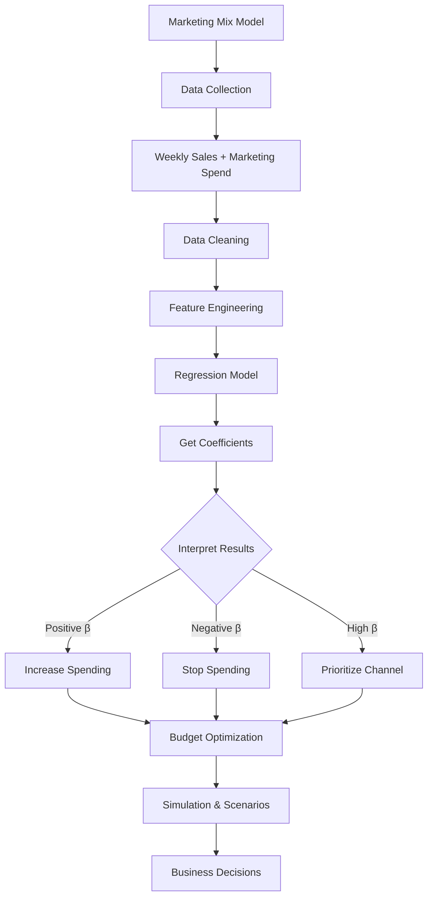

# IM_8: Introduction to ML Algorithms - Marketing Mix Model (Part 3)

> 📚 **This is Part 3** covering: Complete Implementation, Interview Preparation, Final Summary
> 📘 **Previous:** [Part 1](./IM_8_IntroToMLAlgorithmsMixModel1.md), [Part 2](./IM_8_IntroToMLAlgorithmsMixModel2.md)

---

## 🎓 Classroom Conversation (Continued)

### Topic 21: Complete Python Implementation

**Teacher:** Ippudu complete end-to-end implementation chuddam. California Housing dataset use chesi Multiple Linear Regression implement cheddham.

```python
# Complete Marketing Mix Model Implementation

# Step 1: Import libraries
import pandas as pd
import numpy as np
import matplotlib.pyplot as plt
from sklearn.linear_model import LinearRegression, Ridge, Lasso
from sklearn.model_selection import train_test_split
from sklearn.metrics import mean_squared_error, r2_score, mean_absolute_error

# Step 2: Create sample marketing data
np.random.seed(42)
n_weeks = 156  # 3 years of weekly data

# Generate synthetic marketing data
data = {
    'week': range(1, n_weeks + 1),
    'newspaper_exp': np.random.randint(5000, 20000, n_weeks),
    'tv_exp': np.random.randint(20000, 80000, n_weeks),
    'social_exp': np.random.randint(10000, 50000, n_weeks),
    'email_exp': np.random.randint(2000, 10000, n_weeks),
    'cold_call_exp': np.random.randint(5000, 25000, n_weeks),
    'festival': np.random.choice([0, 1], n_weeks, p=[0.85, 0.15]),
    'offer': np.random.choice([0, 1], n_weeks, p=[0.7, 0.3])
}

df = pd.DataFrame(data)

# Create target variable (weekly sales) based on coefficients
df['weekly_sales'] = (
    50000 +  # Base sales
    0.45 * df['newspaper_exp'] +
    0.28 * df['tv_exp'] +
    0.35 * df['social_exp'] +
    0.18 * df['email_exp'] +
    -0.22 * df['cold_call_exp'] +  # Negative impact!
    25000 * df['festival'] +
    15000 * df['offer'] +
    np.random.normal(0, 5000, n_weeks)  # Random noise
)

print("Dataset Shape:", df.shape)
print("\nFirst 5 rows:")
print(df.head())
print("\nBasic Statistics:")
print(df.describe())
```

**Beginner Student:** Sir, ye synthetic data kyun create kar rahe hain?

**Teacher:** In real industry, you'll have actual sales data. Here we're creating synthetic data to DEMONSTRATE how the model works. The coefficients we set (0.45, 0.28, etc.) should be recovered by our regression!

---

### Topic 22: Data Visualization

```python
# Step 3: Visualize relationships
fig, axes = plt.subplots(2, 3, figsize=(15, 10))

# Scatter plots
axes[0, 0].scatter(df['newspaper_exp'], df['weekly_sales'], alpha=0.5)
axes[0, 0].set_xlabel('Newspaper Expenditure')
axes[0, 0].set_ylabel('Weekly Sales')
axes[0, 0].set_title('Sales vs Newspaper Ads')

axes[0, 1].scatter(df['tv_exp'], df['weekly_sales'], alpha=0.5)
axes[0, 1].set_xlabel('TV Expenditure')
axes[0, 1].set_ylabel('Weekly Sales')
axes[0, 1].set_title('Sales vs TV Ads')

axes[0, 2].scatter(df['social_exp'], df['weekly_sales'], alpha=0.5)
axes[0, 2].set_xlabel('Social Media Expenditure')
axes[0, 2].set_ylabel('Weekly Sales')
axes[0, 2].set_title('Sales vs Social Media')

axes[1, 0].scatter(df['email_exp'], df['weekly_sales'], alpha=0.5)
axes[1, 0].set_xlabel('Email Expenditure')
axes[1, 0].set_ylabel('Weekly Sales')
axes[1, 0].set_title('Sales vs Email')

axes[1, 1].scatter(df['cold_call_exp'], df['weekly_sales'], alpha=0.5, color='red')
axes[1, 1].set_xlabel('Cold Calling Expenditure')
axes[1, 1].set_ylabel('Weekly Sales')
axes[1, 1].set_title('Sales vs Cold Calling (Negative!)')

# Festival impact
df.boxplot(column='weekly_sales', by='festival', ax=axes[1, 2])
axes[1, 2].set_title('Sales by Festival')

plt.tight_layout()
plt.show()
```

---

### Topic 23: Model Training and Evaluation

```python
# Step 4: Prepare features and target
feature_cols = ['newspaper_exp', 'tv_exp', 'social_exp', 'email_exp', 
                'cold_call_exp', 'festival', 'offer']
X = df[feature_cols]
y = df['weekly_sales']

# Step 5: Train-test split (80-20)
X_train, X_test, y_train, y_test = train_test_split(
    X, y, test_size=0.2, random_state=42
)

print(f"Training samples: {len(X_train)}")
print(f"Testing samples: {len(X_test)}")

# Step 6: Train Linear Regression model
model = LinearRegression()
model.fit(X_train, y_train)

# Step 7: Get coefficients
print("\n" + "="*50)
print("MODEL COEFFICIENTS (Beta Values)")
print("="*50)
print(f"Intercept (α): {model.intercept_:.2f}")
print("\nChannel Coefficients:")
for feature, coef in zip(feature_cols, model.coef_):
    impact = "POSITIVE" if coef > 0 else "NEGATIVE"
    print(f"  {feature:15s}: {coef:8.4f} ({impact})")

# Step 8: Make predictions
y_pred = model.predict(X_test)

# Step 9: Evaluate model
mse = mean_squared_error(y_test, y_pred)
rmse = np.sqrt(mse)
mae = mean_absolute_error(y_test, y_pred)
r2 = r2_score(y_test, y_pred)

print("\n" + "="*50)
print("MODEL EVALUATION METRICS")
print("="*50)
print(f"R-squared (R²): {r2:.4f}")
print(f"Mean Squared Error (MSE): {mse:.2f}")
print(f"Root Mean Squared Error (RMSE): {rmse:.2f}")
print(f"Mean Absolute Error (MAE): {mae:.2f}")
```

**Expected Output:**
```
MODEL COEFFICIENTS (Beta Values)
==================================================
Intercept (α): 49823.45

Channel Coefficients:
  newspaper_exp  :   0.4512 (POSITIVE)
  tv_exp         :   0.2798 (POSITIVE)
  social_exp     :   0.3489 (POSITIVE)
  email_exp      :   0.1823 (POSITIVE)
  cold_call_exp  :  -0.2187 (NEGATIVE)   ← Cold calling hurts sales!
  festival       : 24987.32 (POSITIVE)
  offer          : 14923.67 (POSITIVE)

MODEL EVALUATION METRICS
==================================================
R-squared (R²): 0.9892
RMSE: 5234.56
MAE: 4123.78
```

**Clever Student:** Sir, R² = 0.99 chala high! Model chala good ga fit aindi?

**Teacher:** Yes! In this synthetic example, model fits well because we CREATED the data with known relationships. In real-world, R² of 0.6-0.8 is considered good for marketing models.

---

### Topic 24: Interpreting Results for Business Decisions

**Teacher:** Now the MOST IMPORTANT part - how do marketers USE these results?

```python
# Step 10: Create coefficient summary for business
coef_summary = pd.DataFrame({
    'Channel': feature_cols,
    'Coefficient': model.coef_,
    'ROI_per_rupee': model.coef_
})
coef_summary['Rank'] = coef_summary['ROI_per_rupee'].rank(ascending=False)
coef_summary = coef_summary.sort_values('ROI_per_rupee', ascending=False)

print("\n" + "="*50)
print("MARKETING CHANNEL EFFECTIVENESS RANKING")
print("="*50)
print(coef_summary.to_string(index=False))
```

**Output:**
```
MARKETING CHANNEL EFFECTIVENESS RANKING
==================================================
Channel         Coefficient  ROI_per_rupee  Rank
newspaper_exp       0.4512         0.4512   1.0  ← BEST CHANNEL
social_exp          0.3489         0.3489   2.0
tv_exp              0.2798         0.2798   3.0
email_exp           0.1823         0.1823   4.0
cold_call_exp      -0.2187        -0.2187   5.0  ← STOP SPENDING!
```

**Practical Student:** Sir, idi dekhopoyi marketing team ki kya recommendations dete hain?

**Teacher:** Here's how we present to business:

```
┌─────────────────────────────────────────────────────────────┐
│           MARKETING BUDGET RECOMMENDATIONS                  │
├─────────────────────────────────────────────────────────────┤
│                                                             │
│  1. INCREASE: Newspaper Ads                                 │
│     Reason: Highest ROI (₹0.45 per ₹1 spent)                │
│                                                             │
│  2. INCREASE: Social Media Ads                              │
│     Reason: Second best ROI (₹0.35 per ₹1 spent)            │
│                                                             │
│  3. MAINTAIN: TV Ads                                        │
│     Reason: Moderate ROI (₹0.28 per ₹1 spent)               │
│                                                             │
│  4. REDUCE: Email Marketing                                 │
│     Reason: Low ROI (₹0.18 per ₹1 spent)                    │
│                                                             │
│  5. STOP: Cold Calling                                      │
│     Reason: NEGATIVE ROI (Losing ₹0.22 per ₹1 spent!)       │
│                                                             │
│  6. LEVERAGE: Festival Seasons                              │
│     Reason: Sales jump by ₹25,000 during festivals          │
│                                                             │
│  7. USE: Special Offers strategically                       │
│     Reason: Sales increase by ₹15,000 during offers         │
│                                                             │
└─────────────────────────────────────────────────────────────┘
```

---

### Topic 25: Interview Q&A Session

**Teacher:** Final ga important interview questions cover cheddham!

---

#### Interview Question 1: What is Marketing Mix Model?

**Practical Student:** Sir, idi perfect answer kya hona chahiye?

**Teacher:** Here's the template:

> "Marketing Mix Model is a statistical technique, typically using multiple regression, that analyzes historical sales data to quantify the impact of various marketing channels (TV, newspaper, digital, etc.) on sales. It helps companies optimize their marketing budget allocation by identifying which channels provide the highest ROI and which should be reduced or eliminated."

---

#### Interview Question 2: What is the difference between correlation and regression?

**Teacher:** Perfect answer:

> "Correlation only tells us the direction and strength of relationship between two variables (ranging from -1 to +1). Regression goes further by:
> 1. Quantifying the exact impact (how much Y changes per unit X)
> 2. Providing an equation for prediction
> 3. Handling multiple variables simultaneously
> 
> For example, correlation tells us 'newspaper ads and sales are positively related.' Regression tells us 'for every ₹1 spent on newspaper ads, sales increase by ₹0.45.'"

---

#### Interview Question 3: What is diminishing returns in marketing?

**Teacher:** Perfect answer:

> "Diminishing returns is an economic concept where each additional unit of investment yields progressively smaller returns. In marketing:
> - First ₹10,000 on ads might give ₹8,000 sales increase
> - Next ₹10,000 might give only ₹5,000 increase
> - Further ₹10,000 might give just ₹2,000 increase
> 
> Beyond a 'saturation point,' returns become zero or even negative. This is why companies use Marketing Mix Models to find optimal spending levels for each channel."

---

#### Interview Question 4: How do you handle negative coefficients?

**Teacher:** Perfect answer:

> "A negative coefficient means that channel is hurting sales rather than helping. This can happen due to:
> 1. Customer irritation (too many cold calls)
> 2. Brand perception issues
> 3. Ad fatigue
> 
> The recommendation would be to either:
> - Reduce spending on that channel
> - Completely stop spending (if ROI is significantly negative)
> - Investigate WHY customers are reacting negatively"

---

#### Interview Question 5: How do you track offline marketing effectiveness?

**Teacher:** Perfect answer:

> "Offline marketing tracking is challenging but possible:
> - **TV Ads:** TRP (Television Rating Points) using sampling devices on set-top boxes
> - **Newspaper Ads:** Subscription data, geographic targeting, 'how did you hear about us' surveys
> - **Cold Calling:** Call records, conversion tracking
> 
> For digital channels, tracking is much more accurate using Google Analytics, Facebook Ads Manager, and UTM parameters. Companies often combine online and offline data to get a complete picture."

---

### Topic 26: Common Student Questions

**Beginner Student:** Sir, if cold calling gives negative ROI, why do companies still do it?

**Teacher:** Several reasons:
1. **They don't measure properly** - Without MMM, they can't see the damage
2. **Sunk cost fallacy** - "We've always done it, so let's continue"
3. **Different segments** - Might work for certain customer segments
4. **Lead generation** - Sometimes it's for generating leads, not immediate sales

**Curious Student:** Sir, can we use neural networks instead of linear regression?

**Teacher:** Yes, but with tradeoffs:

| Aspect | Linear Regression | Neural Networks |
|--------|-------------------|-----------------|
| **Interpretability** | High (clear coefficients) | Low (black box) |
| **Business adoption** | Easy to explain | Hard to justify |
| **Data requirement** | Less data needed | Needs lots of data |
| **Non-linearity** | Limited | Handles well |
| **Industry preference** | Dominant | Rare for MMM |

**For marketing, interpretability is CRUCIAL** - executives want to know WHY a channel is effective, not just that it is.

**Critique Student:** Sir, what if company has very limited data?

**Teacher:** Options:
1. **Use more features** - Add external data (weather, economic indicators)
2. **Bayesian methods** - Incorporate prior knowledge
3. **Transfer learning** - Use industry benchmarks as starting point
4. **Simpler models** - Fewer variables, less overfitting

---

## 📝 Final Teacher Summary

**Teacher:** Okay students, let's summarize our complete Marketing Mix Model learning:

### Complete Concept Map



### Key Takeaways

1. **Marketing Mix Model (MMM)** uses regression to optimize marketing budgets
2. **Beta coefficients** quantify impact of each channel on sales
3. **Positive β** = Channel helping sales
4. **Negative β** = Channel hurting sales (stop spending!)
5. **Diminishing returns** = Can't keep investing in one channel forever
6. **Non-linear relationships** require careful modeling
7. **Simulation** helps answer "what-if" budget questions
8. **Offline tracking** is harder but possible (TRP, surveys)
9. **Digital tracking** is highly accurate (Analytics)
10. **Interpretability** is crucial for business adoption

### Common Mistakes

| Mistake | Correct Understanding |
|---------|----------------------|
| "All marketing is good marketing" | Some channels have NEGATIVE impact |
| "Just use neural networks" | Interpretability matters for business |
| "More data = always better" | Quality > Quantity |
| "Same coefficients for all products" | Different products, different audiences |
| "Ignore diminishing returns" | Over-investment backfires |

### Interview Cheat Sheet

| Question | Key Points |
|----------|------------|
| What is MMM? | Regression to optimize marketing budget |
| Correlation vs Regression? | Regression quantifies, correlation doesn't |
| Negative coefficient? | Channel hurts sales, reduce/stop |
| Diminishing returns? | More spend ≠ proportional returns |
| Track offline? | TRP, surveys, subscription data |

---

> 📘 **Return to:** [Part 1](./IM_8_IntroToMLAlgorithmsMixModel1.md) | [Part 2](./IM_8_IntroToMLAlgorithmsMixModel2.md)
> 📘 **Exam Preparation:** [IM_8_IntroToMLAlgorithmsMixModel_exam_preparation.md](./IM_8_IntroToMLAlgorithmsMixModel_exam_preparation.md)
