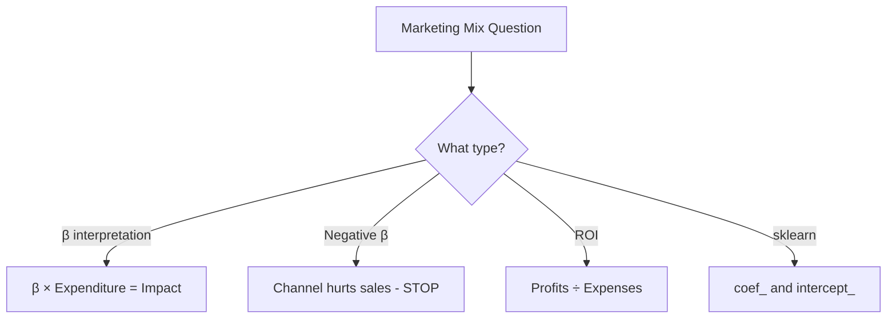

# IM_8: Introduction to ML Algorithms - Marketing Mix Model - Exam Preparation

---

## Section A: Multiple Choice Questions (MCQ) - 15 Questions

### MCQ 1
**Question:** What is the primary purpose of a Marketing Mix Model (MMM)?

**Options:**
- A) To create advertisements
- B) To optimize marketing budget allocation based on channel effectiveness
- C) To predict stock prices
- D) To manage customer complaints

**✅ Correct Answer:** B

**📖 Explanation:** Marketing Mix Model uses regression analysis to quantify the impact of different marketing channels on sales, helping companies optimize their budget allocation for maximum ROI.

**❌ Why Others Are Wrong:**
- A) MMM analyzes effectiveness, doesn't create ads
- C) Stock prediction uses different models
- D) Customer complaints are handled by CRM systems

---

### MCQ 2
**Question:** In a Marketing Mix Model, what does a negative beta coefficient indicate?

**Options:**
- A) The channel is highly effective
- B) There's a calculation error
- C) The channel is negatively impacting sales
- D) More data is needed

**✅ Correct Answer:** C

**📖 Explanation:** A negative coefficient means that spending on this channel actually DECREASES sales, possibly due to customer irritation (e.g., excessive cold calling).

**❌ Why Others Are Wrong:**
- A) Negative means harmful, not effective
- B) Negative coefficients are mathematically valid
- D) Data amount doesn't cause negative coefficients

---

### MCQ 3
**Question:** Which variable is typically the dependent variable (Y) in Marketing Mix Model?

**Options:**
- A) Marketing expenditure
- B) Weekly sales
- C) Number of advertisements
- D) Customer complaints

**✅ Correct Answer:** B

**📖 Explanation:** Weekly/monthly sales is the target variable that we're trying to predict based on marketing expenditures (independent variables).

**❌ Why Others Are Wrong:**
- A) Marketing expenditure is an independent variable
- C) Number of ads is an input, not output
- D) Not related to MMM

---

### MCQ 4
**Question:** What is the relationship between marketing expenditure and sales called when additional spending yields progressively smaller returns?

**Options:**
- A) Linear relationship
- B) Exponential growth
- C) Diminishing returns
- D) Compound interest

**✅ Correct Answer:** C

**📖 Explanation:** Diminishing returns describes the phenomenon where each additional unit of investment yields progressively smaller increases in returns, eventually reaching zero or negative returns.

**❌ Why Others Are Wrong:**
- A) Linear means constant returns per unit
- B) Exponential means increasing returns
- D) Compound interest is a financial concept

---

### MCQ 5
**Question:** TRP (Television Rating Points) is used primarily to measure effectiveness of which marketing channel?

**Options:**
- A) Social media ads
- B) Email marketing
- C) TV advertisements
- D) Cold calling

**✅ Correct Answer:** C

**📖 Explanation:** TRP uses tracking devices on sample set-top boxes to measure how many people watched specific TV channels during ad time.

**❌ Why Others Are Wrong:**
- A) Social media uses digital analytics
- B) Email uses open rates, click rates
- D) Cold calling uses call records

---

### MCQ 6
**Question:** What distinguishes regression from correlation?

**Options:**
- A) Correlation quantifies impact, regression shows direction
- B) Regression quantifies impact, correlation only shows direction
- C) They are exactly the same
- D) Correlation is for categorical data only

**✅ Correct Answer:** B

**📖 Explanation:** Regression provides coefficients that quantify the exact impact (e.g., ₹1 spent → ₹0.45 sales increase), while correlation only indicates direction and strength of relationship.

**❌ Why Others Are Wrong:**
- A) Opposite of the truth
- C) They are different techniques
- D) Correlation works on numerical data too

---

### MCQ 7
**Question:** In sklearn, which method is used to get the coefficients of a linear regression model?

**Options:**
- A) model.params_
- B) model.coef_
- C) model.weights_
- D) model.beta_

**✅ Correct Answer:** B

**📖 Explanation:** In sklearn's LinearRegression, `model.coef_` returns the coefficients (beta values) for each feature, and `model.intercept_` returns the intercept (alpha).

**❌ Why Others Are Wrong:**
- A) Not a valid sklearn attribute
- C) Not a valid sklearn attribute
- D) Not a valid sklearn attribute

---

### MCQ 8
**Question:** If β (beta) for newspaper ads is 0.5 and for TV ads is 0.25, which channel should receive MORE budget?

**Options:**
- A) TV ads (lower coefficient means less saturated)
- B) Newspaper ads (higher ROI per rupee)
- C) Both equally
- D) Neither, coefficients don't matter

**✅ Correct Answer:** B

**📖 Explanation:** Higher β means higher return per rupee spent. β=0.5 means ₹0.50 sales per ₹1 spent on newspaper vs ₹0.25 for TV. Newspaper is more efficient.

**❌ Why Others Are Wrong:**
- A) Lower coefficient means LESS effective
- C) Different effectiveness = different allocation
- D) Coefficients are the core of decision-making

---

### MCQ 9
**Question:** Which type of variable is "Festival Season" (Yes/No) in Marketing Mix Model?

**Options:**
- A) Continuous variable
- B) Dependent variable
- C) Categorical variable
- D) Time series variable

**✅ Correct Answer:** C

**📖 Explanation:** Festival Season takes discrete values (1 for Yes, 0 for No), making it a categorical/binary variable. It cannot take values like 0.5 or 1.5.

**❌ Why Others Are Wrong:**
- A) Continuous means any value possible
- B) Festival is independent, sales is dependent
- D) Time series refers to temporal ordering

---

### MCQ 10
**Question:** What happens to sales when a company invests in a channel with β = -0.3?

**Options:**
- A) Sales increase by ₹0.30 per ₹1 spent
- B) Sales decrease by ₹0.30 per ₹1 spent
- C) Sales remain unchanged
- D) The model is invalid

**✅ Correct Answer:** B

**📖 Explanation:** Negative coefficient means sales DECREASE. For every ₹1 spent on this channel, sales go DOWN by ₹0.30. This indicates the channel is harming the business.

**❌ Why Others Are Wrong:**
- A) Negative sign means decrease, not increase
- C) Non-zero coefficient means there IS an effect
- D) Negative coefficients are valid

---

### MCQ 11
**Question:** How many years of weekly data is typically recommended for Marketing Mix Model?

**Options:**
- A) 1 month
- B) 6 months
- C) 3-4 years
- D) 10+ years

**✅ Correct Answer:** C

**📖 Explanation:** Industry standard is 3-4 years of weekly data, providing approximately 150-200 data points to capture seasonality, trends, and various marketing scenarios.

**❌ Why Others Are Wrong:**
- A) Too little to capture patterns
- B) Still insufficient for reliable coefficients
- D) Older data may not be relevant

---

### MCQ 12
**Question:** ROI (Return on Investment) is calculated as:

**Options:**
- A) Expenses / Profits
- B) Profits / Expenses
- C) Profits - Expenses
- D) Profits + Expenses

**✅ Correct Answer:** B

**📖 Explanation:** ROI = Profits / Expenses. Higher ROI means more profit per unit of expense, which is the goal of marketing optimization.

**❌ Why Others Are Wrong:**
- A) This is inverted (expense ratio)
- C) This is net profit, not ROI
- D) This doesn't measure efficiency

---

### MCQ 13
**Question:** In digital marketing, what tool precisely tracks website visitor behavior?

**Options:**
- A) TRP meters
- B) Google Analytics
- C) Newspaper subscription data
- D) Call recordings

**✅ Correct Answer:** B

**📖 Explanation:** Google Analytics tracks exact website visits, page views, time spent, conversions, and can attribute traffic to specific marketing campaigns using UTM parameters.

**❌ Why Others Are Wrong:**
- A) TRP is for TV
- C) Tracks newspaper readers, not website
- D) Tracks calls, not web behavior

---

### MCQ 14
**Question:** What is the intercept (α) in a regression equation?

**Options:**
- A) The slope of the line
- B) The baseline sales when all marketing spend is zero
- C) The maximum possible sales
- D) The error term

**✅ Correct Answer:** B

**📖 Explanation:** The intercept represents the expected value of Y (sales) when all independent variables (X) are zero. It represents baseline sales from non-marketing factors.

**❌ Why Others Are Wrong:**
- A) Slope is the coefficient (β)
- C) Maximum is not captured by intercept
- D) Error term is separate from intercept

---

### MCQ 15
**Question:** Why is linear regression preferred over neural networks for Marketing Mix Model?

**Options:**
- A) Neural networks are not accurate
- B) Linear regression is faster to train
- C) Interpretability - executives need to understand WHY
- D) Neural networks can't handle multiple variables

**✅ Correct Answer:** C

**📖 Explanation:** Business stakeholders need to understand and trust the model. Linear regression provides clear coefficients showing exactly how much each channel contributes to sales.

**❌ Why Others Are Wrong:**
- A) Neural networks can be very accurate
- B) Speed is not the primary concern
- D) Neural networks handle multiple inputs well

---

## Section B: Multiple Select Questions (MSQ) - 10 Questions

### MSQ 1
**Question:** Which are valid marketing channels used in Marketing Mix Model? (Select ALL that apply)

**Options:**
- A) TV advertisements
- B) Newspaper ads
- C) Social media marketing
- D) Cold calling
- E) Product manufacturing

**✅ Correct Answers:** A, B, C, D

**📖 Explanation:** All marketing channels that involve reaching customers are included in MMM - TV, newspaper, social media, and cold calling.

**❌ Why Others Are Wrong:**
- E) Manufacturing is operations, not marketing

---

### MSQ 2
**Question:** What does a positive beta coefficient indicate? (Select ALL that apply)

**Options:**
- A) The channel increases sales
- B) Higher spending leads to higher sales
- C) The channel should receive budget allocation
- D) The relationship is linear
- E) There are no diminishing returns

**✅ Correct Answers:** A, B, C

**📖 Explanation:** Positive β indicates positive relationship - more spending leads to more sales, making it worth investing in.

**❌ Why Others Are Wrong:**
- D) Positive coefficient doesn't mean relationship is strictly linear
- E) Diminishing returns can exist even with positive coefficient

---

### MSQ 3
**Question:** Which are examples of categorical variables in MMM? (Select ALL that apply)

**Options:**
- A) Festival season (Yes/No)
- B) Weekly sales amount
- C) Special offers active (Yes/No)
- D) TV ad expenditure
- E) Month of year

**✅ Correct Answers:** A, C, E

**📖 Explanation:** Categorical variables take discrete values - Festival (0/1), Offers (0/1), Month (Jan, Feb, etc. or 1-12).

**❌ Why Others Are Wrong:**
- B) Sales is continuous (can be any value)
- D) Expenditure is continuous (₹10,000, ₹10,001, etc.)

---

### MSQ 4
**Question:** What can cause a marketing channel to have negative coefficient? (Select ALL that apply)

**Options:**
- A) Customer irritation from excessive contact
- B) Ad fatigue
- C) Suspicion about the brand
- D) Perfect marketing execution
- E) Too many calls leading to blocking

**✅ Correct Answers:** A, B, C, E

**📖 Explanation:** All these represent scenarios where marketing backfires - customers get annoyed, bored, suspicious, or block the company.

**❌ Why Others Are Wrong:**
- D) Perfect execution should give positive returns

---

### MSQ 5
**Question:** Which are differences between correlation and regression? (Select ALL that apply)

**Options:**
- A) Regression quantifies exact impact
- B) Regression allows prediction
- C) Correlation ranges from -1 to +1
- D) Correlation can be used for budget decisions
- E) Regression provides an equation

**✅ Correct Answers:** A, B, C, E

**📖 Explanation:** Regression gives coefficients for prediction and quantification. Correlation only shows direction and strength (-1 to +1).

**❌ Why Others Are Wrong:**
- D) Correlation alone is insufficient for budget decisions

---

### MSQ 6
**Question:** What information does sklearn's LinearRegression model provide after fitting? (Select ALL that apply)

**Options:**
- A) Coefficients (coef_)
- B) Intercept (intercept_)
- C) Customer names
- D) Predictions via predict()
- E) Model parameters via get_params()

**✅ Correct Answers:** A, B, D, E

**📖 Explanation:** After fitting, sklearn provides coefficients, intercept, prediction capability, and model parameters.

**❌ Why Others Are Wrong:**
- C) Customer data is not part of model output

---

### MSQ 7
**Question:** How can offline marketing effectiveness be tracked? (Select ALL that apply)

**Options:**
- A) TRP ratings for TV ads
- B) Subscription data for newspapers
- C) "How did you hear about us?" surveys
- D) Google Analytics
- E) Call records for cold calling

**✅ Correct Answers:** A, B, C, E

**📖 Explanation:** Offline channels use sampling (TRP), subscription data, surveys, and call logs for tracking.

**❌ Why Others Are Wrong:**
- D) Google Analytics is for digital/online tracking

---

### MSQ 8
**Question:** Which statements about diminishing returns are TRUE? (Select ALL that apply)

**Options:**
- A) Initial investment gives highest returns
- B) Returns eventually become zero
- C) Returns can become negative with over-investment
- D) It applies to all marketing channels
- E) It creates an S-curve relationship

**✅ Correct Answers:** A, B, C, D, E

**📖 Explanation:** All statements are true about diminishing returns in marketing - initial high returns, eventual zero/negative returns, applies universally, creates S-curve.

---

### MSQ 9
**Question:** What should a company do with a channel showing β = -0.25? (Select ALL that apply)

**Options:**
- A) Increase budget for this channel
- B) Reduce or stop spending on this channel
- C) Investigate root cause of negative impact
- D) Consider alternative approaches
- E) Ignore and continue as usual

**✅ Correct Answers:** B, C, D

**📖 Explanation:** Negative coefficient means channel hurts sales - reduce/stop spending, investigate why, try alternatives.

**❌ Why Others Are Wrong:**
- A) Increasing would cause more damage
- E) Ignoring wastes money and hurts sales

---

### MSQ 10
**Question:** For a product targeting elderly customers, which channels might have higher β? (Select ALL that apply)

**Options:**
- A) TV advertisements
- B) Newspaper ads
- C) Instagram marketing
- D) TikTok ads
- E) Radio advertisements

**✅ Correct Answers:** A, B, E

**📖 Explanation:** Elderly customers are more likely to watch TV, read newspapers, and listen to radio than use TikTok or Instagram.

**❌ Why Others Are Wrong:**
- C) Instagram is popular with younger demographics
- D) TikTok is primarily used by Gen Z

---

## Section C: Numerical/Calculation Questions - 6 Questions

### Numerical 1
**Question:** If β (newspaper) = 0.45 and a company spends ₹50,000 on newspaper ads, calculate the expected sales increase from this channel.

**Given:**
- β = 0.45
- Expenditure = ₹50,000

**Solution Steps:**
1. Expected sales increase = β × Expenditure
2. = 0.45 × 50,000
3. = ₹22,500

**✅ Final Answer:** ₹22,500 increase in sales

---

### Numerical 2
**Question:** A company has the following regression equation: Y = 50000 + 0.3X₁ + 0.2X₂ - 0.15X₃

If X₁ = ₹20,000, X₂ = ₹30,000, X₃ = ₹10,000, calculate expected sales.

**Given:**
- Intercept = 50,000
- β₁ = 0.3, X₁ = 20,000
- β₂ = 0.2, X₂ = 30,000
- β₃ = -0.15, X₃ = 10,000

**Solution Steps:**
1. Y = 50,000 + (0.3 × 20,000) + (0.2 × 30,000) + (-0.15 × 10,000)
2. Y = 50,000 + 6,000 + 6,000 - 1,500
3. Y = 60,500

**✅ Final Answer:** Expected sales = ₹60,500

---

### Numerical 3
**Question:** Calculate ROI if a company spent ₹1,00,000 on marketing and generated ₹3,50,000 in profits.

**Given:**
- Expenses = ₹1,00,000
- Profits = ₹3,50,000

**Solution Steps:**
1. ROI = Profits / Expenses
2. ROI = 3,50,000 / 1,00,000
3. ROI = 3.5

**✅ Final Answer:** ROI = 3.5 (or 350%)

---

### Numerical 4
**Question:** If Channel A has β = 0.5 and Channel B has β = 0.2, and you have ₹1,00,000 budget, how much should go to each to maximize returns (ignoring diminishing returns)?

**Given:**
- Channel A β = 0.5
- Channel B β = 0.2
- Total Budget = ₹1,00,000

**Solution Steps:**
1. Channel A gives higher ROI (0.5 > 0.2)
2. To maximize returns (ignoring diminishing returns): All to Channel A
3. Expected return = 0.5 × 1,00,000 = ₹50,000

**✅ Final Answer:** ₹1,00,000 to Channel A, ₹0 to Channel B (returns = ₹50,000)

**Note:** In practice, diminishing returns would suggest splitting the budget.

---

### Numerical 5
**Question:** Company spent ₹50,000 on cold calling (β = -0.2). How much did this hurt sales? What would ROI be if they had spent ₹0?

**Given:**
- Cold calling expenditure = ₹50,000
- β = -0.2

**Solution Steps:**
1. Impact on sales = β × Expenditure
2. = -0.2 × 50,000
3. = -₹10,000 (sales DECREASED by ₹10,000)

**✅ Final Answer:** Sales reduced by ₹10,000. By spending ₹0, company would have ₹10,000 MORE in sales AND saved ₹50,000 in expenses!

---

### Numerical 6
**Question:** R-squared of a marketing model is 0.75. What percentage of sales variation is explained by marketing channels?

**Given:**
- R² = 0.75

**Solution Steps:**
1. R² represents the proportion of variance explained
2. 0.75 = 75%
3. Remaining 25% is unexplained (due to other factors or noise)

**✅ Final Answer:** 75% of sales variation is explained by the marketing channels in the model.

---

## Section D: Fill in the Blanks - 6 Questions

### Fill 1
**Question:** In Marketing Mix Model, weekly sales is the _______ variable and marketing expenditures are _______ variables.

**Answer:** dependent, independent

**Explanation:** Sales is what we're predicting (Y/dependent), based on marketing spend (X/independent).

---

### Fill 2
**Question:** The phenomenon where each additional unit of investment yields progressively smaller returns is called _______.

**Answer:** diminishing returns

**Explanation:** Like eating apples - first gives maximum satisfaction, each subsequent gives less.

---

### Fill 3
**Question:** In sklearn, model coefficients are accessed using _______ and intercept using _______.

**Answer:** model.coef_, model.intercept_

**Explanation:** These are the standard sklearn attributes for linear regression coefficients.

---

### Fill 4
**Question:** TRP stands for _______ and is used to measure _______ ad effectiveness.

**Answer:** Television Rating Points, TV

**Explanation:** TRP uses sampling devices on set-top boxes to estimate viewership.

---

### Fill 5
**Question:** A negative beta coefficient means the channel is _______ sales rather than helping.

**Answer:** hurting (or decreasing/harming)

**Explanation:** Negative relationship means more spending leads to less sales.

---

### Fill 6
**Question:** ROI formula is _______ divided by _______.

**Answer:** Profits, Expenses

**Explanation:** ROI = Profits / Expenses measures return on each unit spent.

---

## 📚 Quick Revision Points

### Key Formulas
| Formula | Description |
|---------|-------------|
| Y = α + Σ(βᵢXᵢ) | Regression equation |
| ROI = Profits / Expenses | Return on Investment |
| Expected Impact = β × Expenditure | Sales change from a channel |
| R² = Explained Variance / Total Variance | Model fit quality |

### Key Concepts Summary
| Concept | One-Line Definition | When to Use |
|---------|---------------------|-------------|
| MMM | Regression to optimize marketing budget | Budget allocation decisions |
| Beta (β) | Impact per ₹1 spent | Channel ranking |
| Diminishing Returns | Less returns per additional unit | Avoid over-investment |
| Negative β | Channel hurts sales | Stop spending |

### Common Exam Traps
1. **Trap:** "Higher spending = Higher sales always"
   → **Correct:** Diminishing returns exist

2. **Trap:** "Correlation = Regression"
   → **Correct:** Regression quantifies, correlation doesn't

3. **Trap:** "Negative coefficient = Model error"
   → **Correct:** Valid result, channel hurts sales

---

## 🚀 Section E: Shortcuts & Cheat Codes for Exam

### ⚡ One-Liner Shortcuts
| Concept | Shortcut | When to Use |
|---------|----------|-------------|
| β interpretation | β = sales change per ₹1 spent | Any coefficient question |
| Negative β | Channel HURTS sales | Negative value questions |
| ROI | Profits ÷ Expenses | ROI calculation |
| R² | % variance explained | Model quality questions |

### 🎯 Memory Tricks (Mnemonics)
1. **MMM** → "Money Makes More (if spent wisely)" 
2. **β positive** → "Better" (helps sales)
3. **β negative** → "Bad" (hurts sales)
4. **ROI** → "Returns Over Investment"

### 🔢 Quick Calculation Hacks
| Scenario | Hack | Example |
|----------|------|---------|
| Expected sales | β × Expenditure | 0.5 × ₹10,000 = ₹5,000 |
| Negative impact | Same formula, but subtract | -0.2 × ₹10,000 = -₹2,000 |

### 📝 Last-Minute Formula Sheet
```
📌 Y = α + β₁X₁ + β₂X₂ + ... → Marketing Mix equation
📌 ROI = Profits / Expenses → Higher = Better
📌 Expected Impact = β × X → Per-channel contribution
📌 model.coef_ → Get coefficients in sklearn
📌 model.intercept_ → Get baseline sales
```

### 🎓 Interview One-Liners
| Question Pattern | Safe Answer Template |
|------------------|---------------------|
| "What is MMM?" | "Regression to optimize marketing budget based on channel effectiveness" |
| "What if β is negative?" | "Channel hurts sales - reduce or stop spending" |
| "Correlation vs Regression?" | "Regression quantifies impact, correlation only shows direction" |
| "How to track offline ads?" | "TRP for TV, surveys and subscriptions for newspapers" |

### ⚠️ "If You Forget Everything, Remember This"
1. **Golden Rule 1:** β = Impact per ₹1 spent (sales change)
2. **Golden Rule 2:** Negative β = Channel hurts sales
3. **Golden Rule 3:** Higher β = Better channel for investment

### 🔄 Quick Decision Flowchart


### 🎯 Safe Answer Patterns
- **For "What is β?"** → Impact on sales per ₹1 spent on that channel
- **For "Negative coefficient?"** → Channel is hurting sales, recommend stopping
- **For "Calculate expected sales"** → Intercept + Σ(β × X)
- **For "Compare channels"** → Higher β = More efficient = Prioritize
- **For "Track offline?"** → TRP (TV), Surveys (newspaper), Analytics (digital)
