```mermaid
graph LR
    subgraph ReLU["ReLU: max(0, x)"]
        R1["x < 0 → 0"]
        R2["x ≥ 0 → x"]
    end
    
    subgraph Sigmoid["Sigmoid: 1/(1+e^-x)"]
        S1["x → 0 as x → -∞"]
        S2["x → 0.5 at x = 0"]
        S3["x → 1 as x → +∞"]
    end
    
    subgraph Tanh["Tanh"]
        T1["x → -1 as x → -∞"]
        T2["x → 0 at x = 0"]
        T3["x → 1 as x → +∞"]
    end
```

# Concepts Explained: MLP Decision Boundaries

---

## 📚 Concept 1: Neural Networks (Multi-Layer Perceptron)

### 1. Definition
A **Neural Network** is a computer program that learns patterns from data, inspired by how the human brain works. It consists of layers of interconnected "neurons" that process information.

**Exam-friendly definition**: A computational model consisting of input, hidden, and output layers that learns to map inputs to outputs through training.

### 2. Why it is used
- **Problem it solves**: Can learn complex, non-linear relationships in data
- **Why needed here**: The make_moons dataset cannot be separated by a straight line; we need a neural network to learn curved boundaries

### 3. When to use it
- Classification problems (cats vs dogs, spam vs not-spam)
- Regression problems (predicting house prices)
- When data has complex, non-linear patterns

### 4. Where to use it
- Image recognition
- Natural language processing
- Medical diagnosis
- Fraud detection
- Self-driving cars

### 5. Is this the only way?
| Approach | When to Use | Pros | Cons |
|----------|-------------|------|------|
| **Neural Network (MLP)** | Complex non-linear data | Very flexible, learns complex patterns | Needs more data, slower |
| **Logistic Regression** | Linearly separable data | Fast, interpretable | Can't handle non-linear |
| **Decision Tree** | Any data | Interpretable, no scaling needed | Can overfit |
| **SVM with RBF** | Non-linear, smaller datasets | Good with limited data | Slow on large data |

**Why MLP here?** Best for learning curved boundaries with moderate data.

### 6. Explanation with Diagram



```mermaid
flowchart LR
    subgraph Input["Input Layer"]
        I1["x₁ (Feature 1)"]
        I2["x₂ (Feature 2)"]
    end
    
    subgraph Hidden["Hidden Layer (8 neurons)"]
        H1["h₁"]
        H2["h₂"]
        H3["h₃"]
        H4["..."]
        H5["h₈"]
    end
    
    subgraph Output["Output Layer"]
        O1["Class (0 or 1)"]
    end
    
    I1 --> H1
    I1 --> H2
    I1 --> H3
    I1 --> H4
    I1 --> H5
    I2 --> H1
    I2 --> H2
    I2 --> H3
    I2 --> H4
    I2 --> H5
    H1 --> O1
    H2 --> O1
    H3 --> O1
    H4 --> O1
    H5 --> O1
```

**Real-life analogy**: Think of a neural network like a team of workers:
- **Input layer**: Receives raw data (like a receptionist taking your order)
- **Hidden layer**: Processes and transforms data (like kitchen staff preparing food)
- **Output layer**: Gives final answer (like a waiter delivering your order)

### 7. How to use it (Syntax)
```python
from sklearn.neural_network import MLPClassifier

# Create
model = MLPClassifier(hidden_layer_sizes=(8,), activation='relu')

# Train
model.fit(X_train, y_train)

# Predict
predictions = model.predict(X_test)
```

### 8. How it works internally
1. **Forward Pass**: Input flows through the network
   - Each neuron computes: output = activation(weights × inputs + bias)
2. **Loss Calculation**: Compare prediction to true label (cross-entropy loss)
3. **Backpropagation**: Calculate how much each weight contributed to error
4. **Weight Update**: Adjust weights to reduce error
5. **Repeat**: Until max_iter or convergence

### 9. Visual Summary
- Input → Hidden Layer (with activation) → Output
- Training = adjusting weights to minimize errors
- More neurons = more complex patterns but risk overfitting

### 10. Advantages
- Can learn very complex patterns
- Universal function approximator
- Works with various types of data

### 11. Disadvantages / Limitations
- Needs more data than simpler models
- "Black box" - hard to interpret
- Computationally expensive
- Risk of overfitting

### 12. Exam & Interview Points
**Key points to memorize:**
1. MLP = Multi-Layer Perceptron = Neural network with ≥1 hidden layer
2. hidden_layer_sizes=(8,) means 1 layer with 8 neurons
3. Training uses backpropagation + gradient descent

**Common questions:**
- Q: "What is a hidden layer?"
  A: Layer between input and output that transforms data.
- Q: "Why do we need hidden layers?"
  A: To learn non-linear patterns.

---

## 📚 Concept 2: Activation Functions

### 1. Definition
An **Activation Function** is a mathematical function applied to each neuron's output, determining whether and how much that neuron should "fire."

**Exam-friendly**: The non-linear transformation applied after the weighted sum in a neuron.

### 2. Why it is used
- **Problem it solves**: Without activation functions, neural networks would be just linear models
- **Why needed here**: Enables learning of curved decision boundaries

### 3. When to use each
| Activation | Use When |
|------------|----------|
| ReLU | Default for hidden layers in deep networks |
| Sigmoid | Binary classification output layer |
| Tanh | RNNs, when zero-centered output needed |

### 4. Where to use it
- **ReLU**: CNNs, Transformers, most modern architectures
- **Sigmoid**: Output layer for binary classification
- **Tanh**: LSTM gates, older RNNs

### 5. Is this the only way?

| Activation | Formula | Range | Pros | Cons |
|------------|---------|-------|------|------|
| **ReLU** | max(0, x) | [0, ∞) | Fast, no vanishing gradient | Dead neurons |
| **Sigmoid** | 1/(1+e^-x) | (0, 1) | Probability interpretation | Vanishing gradient |
| **Tanh** | (e^x-e^-x)/(e^x+e^-x) | (-1, 1) | Zero-centered | Vanishing gradient |
| LeakyReLU | max(0.01x, x) | (-∞, ∞) | No dead neurons | Slightly slower |
| Swish | x × sigmoid(x) | (-∞, ∞) | Smooth | Computationally expensive |

### 6. Explanation with Diagram



**Real-life analogy**:
- **ReLU**: Like a one-way valve - positive flows through, negative is blocked
- **Sigmoid**: Like a dimmer switch - smoothly scales between off (0) and on (1)
- **Tanh**: Like a steering wheel - can turn left (-1) or right (+1)

### 7. How to use it
```python
# In sklearn MLPClassifier
model = MLPClassifier(activation='relu')    # ReLU
model = MLPClassifier(activation='logistic')  # Sigmoid
model = MLPClassifier(activation='tanh')    # Tanh
```

### 8. How it works internally
**ReLU**: f(x) = max(0, x)
- If input > 0: output = input (passes through)
- If input ≤ 0: output = 0 (blocked)

**Sigmoid**: f(x) = 1/(1+e^-x)
- Takes any real number and squishes it between 0 and 1
- Larger positive → closer to 1
- Larger negative → closer to 0

**Tanh**: f(x) = (e^x - e^-x)/(e^x + e^-x)
- Similar to sigmoid but ranges from -1 to 1
- Zero-centered

### 9. Visual Summary

| Property | ReLU | Sigmoid | Tanh |
|----------|------|---------|------|
| Output Range | [0, ∞) | (0, 1) | (-1, 1) |
| Zero-Centered | ❌ | ❌ | ✅ |
| Max Gradient | 1 | 0.25 | 1 |
| Vanishing Gradient | ❌ | ✅ | ✅ |

### 10. Advantages
- **ReLU**: Fast computation, no vanishing gradient
- **Sigmoid**: Probability interpretation, bounded output
- **Tanh**: Zero-centered, bounded

### 11. Disadvantages
- **ReLU**: Dead neurons (always output 0)
- **Sigmoid**: Vanishing gradient, slow computation
- **Tanh**: Vanishing gradient

### 12. Exam & Interview Points
**Key points:**
1. ReLU = max(0, x), default for modern networks
2. Sigmoid outputs (0, 1), good for probability
3. Tanh outputs (-1, 1), zero-centered

**Common questions:**
- Q: "Why is ReLU preferred over sigmoid?"
  A: ReLU doesn't have vanishing gradient problem and is computationally faster.

---

## 📚 Concept 3: Decision Boundaries

### 1. Definition
A **Decision Boundary** is the line, curve, or surface that separates different classes in the feature space. Points on one side are classified as one class, points on the other side as another.

**Exam-friendly**: The region where the classifier's prediction changes from one class to another.

### 2. Why it is used
- **Problem it solves**: Visualizes how the model "sees" the classification problem
- **Why needed here**: To compare how different activations shape the boundaries

### 3. When to use it
- When you have 2D or 3D data
- For comparing classifiers
- For understanding model behavior

### 4. Where to use it
- Educational demonstrations
- Model comparison
- Debugging classifiers

### 5. Is this the only way?

| Visualization | Works For | Pros | Cons |
|---------------|-----------|------|------|
| **Decision Boundary Plot** | 2D data | Very intuitive | Only 2D |
| Confusion Matrix | Any dimension | Shows all predictions | No spatial insight |
| Feature Importance | Any dimension | Shows what matters | No boundary shape |
| t-SNE + Clustering | High dimension | Reduces to 2D | May distort |

### 6. Explanation with Diagram


**Real-life analogy**: 
- Imagine a map of a country with different regions (like states)
- The borders between states are the "decision boundaries"
- Each state represents a class

### 7. How to create it
```python
# 1. Create meshgrid
xx, yy = np.meshgrid(np.arange(-2, 3, 0.01), np.arange(-2, 3, 0.01))

# 2. Predict on grid
Z = model.predict(np.c_[xx.ravel(), yy.ravel()])
Z = Z.reshape(xx.shape)

# 3. Plot colored regions
plt.contourf(xx, yy, Z, alpha=0.8)

# 4. Overlay data
plt.scatter(X[:, 0], X[:, 1], c=y)
```

### 8. How it works internally
1. Create dense grid of points covering feature space
2. For each point, ask model "what would you predict here?"
3. Store predictions in 2D array matching grid shape
4. Use contourf to color regions by prediction
5. Add scatter plot of actual data points

### 9. Visual Summary
- **Linear boundary**: Straight line (logistic regression)
- **Non-linear boundary**: Curves (neural networks, SVM with RBF)
- **Different activations** create different boundary shapes

### 10. Advantages
- Very intuitive visualization
- Easy to compare models
- Shows overfitting clearly

### 11. Disadvantages
- Only works for 2D (or 3D with difficulty)
- Can be slow for high-resolution grids
- Doesn't show confidence levels

### 12. Exam & Interview Points
**Key points:**
1. Decision boundary = where classifier prediction changes
2. Neural networks create non-linear boundaries
3. More complex models = more complex boundaries

**Common questions:**
- Q: "How do you visualize decision boundaries?"
  A: Create meshgrid, predict on each point, use contour plot.

---

## 📚 Concept 4: make_moons Dataset

### 1. Definition
**make_moons** is a synthetic dataset generator from sklearn that creates two interleaving half-moon shapes, perfect for testing non-linear classifiers.

### 2. Why it is used
- Creates non-linearly separable data
- Easy to visualize (2D)
- Good for demonstrating neural network capabilities

### 3. When to use it
- Teaching/demonstrations
- Testing classifiers
- Benchmarking algorithms

### 4. Where to use it
- Machine learning education
- Algorithm testing
- Decision boundary visualization

### 5. Key Parameters

| Parameter | Default | Purpose |
|-----------|---------|---------|
| n_samples | 100 | Number of points |
| noise | 0 | Gaussian noise std |
| random_state | None | Reproducibility seed |

### 6. Diagram


### 7. How to use it
```python
from sklearn.datasets import make_moons
X, y = make_moons(n_samples=300, noise=0.2, random_state=42)
```

---

## 📚 Jargon Glossary

| Term | Simple Explanation |
|------|-------------------|
| **Neuron** | A single calculating unit in a neural network |
| **Layer** | A group of neurons at the same level |
| **Weights** | Numbers that the network learns to make better predictions |
| **Bias** | An extra number added to help the neuron adjust |
| **Epoch** | One complete pass through all training data |
| **Gradient** | Direction to adjust weights to reduce error |
| **Backpropagation** | Process of calculating how to update weights |
| **Forward Pass** | Data flowing through the network to make prediction |
| **Loss** | How wrong the prediction was |
| **Overfitting** | Model memorizes training data but fails on new data |
