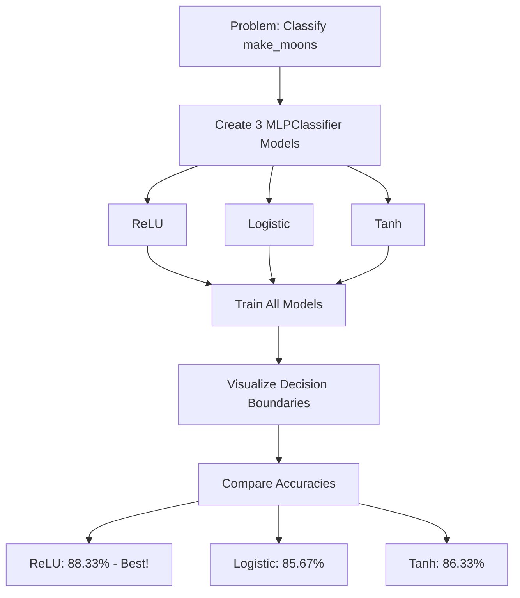

# Interview Preparation: MLP Decision Boundaries

## Quick Revision Sheet - Read in 10 Minutes

---

## 1. High-Level Project Summary

**Problem (2-3 lines)**:
Compare how different activation functions (ReLU, Sigmoid, Tanh) in neural networks create different decision boundaries when classifying the non-linearly separable make_moons dataset.

**Solution Approach**:
1. Generate make_moons dataset (300 samples, noise=0.2)
2. Create 3 MLPClassifier models with different activations
3. Train all models on the same data
4. Visualize decision boundaries side-by-side
5. Compare accuracies and analyze results

**Key Result**: ReLU achieved 88.33% (best), Tanh 86.33%, Sigmoid 85.67%

---

## 2. Core Concepts - Interview & Exam View

### Neural Network (MLP)
- **What**: Computational model with layers of neurons that learn patterns
- **Why**: Can learn complex, non-linear relationships
- **When to use**: Classification/regression with complex patterns
- **When NOT to use**: Simple linear relationships, very small datasets

### Activation Functions
- **What**: Non-linear transformations applied to neuron outputs
- **Why**: Without them, multi-layer network = single linear model
- **When to use**:
  - ReLU: Hidden layers (default)
  - Sigmoid: Binary output layer
  - Tanh: RNNs, zero-centered needed

### Decision Boundary
- **What**: Surface separating different predicted classes
- **Why**: Visualizes how model "sees" classification problem
- **When to use**: 2D/3D data visualization

---

## 3. Key Terms Glossary

| Term | 30-Second Definition |
|------|---------------------|
| **MLP** | Multi-Layer Perceptron - neural network with hidden layers |
| **ReLU** | max(0, x) - outputs input if positive, else 0 |
| **Sigmoid** | 1/(1+e^-x) - squashes input to (0, 1) |
| **Tanh** | (e^x-e^-x)/(e^x+e^-x) - squashes to (-1, 1) |
| **Gradient** | Direction to adjust weights to reduce error |
| **Backpropagation** | Algorithm to compute gradients using chain rule |
| **Vanishing Gradient** | Gradients shrinking to near-zero in deep networks |
| **Epoch** | One complete pass through training data |

---

## 4. Comparison Tables

### Activation Functions Comparison
| Property | ReLU | Sigmoid | Tanh |
|----------|------|---------|------|
| Formula | max(0, x) | 1/(1+e^-x) | (e^x-e^-x)/(e^x+e^-x) |
| Output Range | [0, ∞) | (0, 1) | (-1, 1) |
| Zero-Centered | ❌ No | ❌ No | ✅ Yes |
| Max Gradient | 1 | 0.25 | 1 |
| Vanishing Gradient | ❌ No | ✅ Yes | ✅ Yes |
| Dead Neurons | ✅ Yes | ❌ No | ❌ No |
| Speed | Fast | Slow | Slow |
| Best For | Hidden layers | Binary output | RNNs |

### MLPClassifier vs From Scratch
| Aspect | MLPClassifier | From Scratch |
|--------|---------------|--------------|
| Ease of use | Very easy | Complex |
| Flexibility | Limited | Full control |
| Learning | Just use it | Deep understanding |
| Speed | Optimized | May be slower |

---

## 5. Top 10 Points to Remember

1. **ReLU = max(0, x)** - default for hidden layers
2. **Sigmoid = 1/(1+e^-x)** - outputs (0, 1), good for probabilities
3. **Tanh** - like sigmoid but (-1, 1), zero-centered
4. **Vanishing gradient** - sigmoid/tanh have it, ReLU doesn't
5. **hidden_layer_sizes=(8,)** - tuple! One layer, 8 neurons
6. **random_state** - for reproducibility, same results every run
7. **Decision boundary** - where classifier's prediction changes
8. **ReLU creates angular**, Sigmoid/Tanh create smooth boundaries
9. **make_moons** - non-linearly separable 2D dataset
10. **Backpropagation** - computes gradients using chain rule

---

## 6. Frequently Asked Interview Questions

### Q1: Why is ReLU preferred over Sigmoid for hidden layers?
**Answer**: ReLU doesn't have vanishing gradient (constant gradient of 1 for positive inputs) and is computationally faster (just max operation).

### Q2: When would you use Sigmoid over ReLU?
**Answer**: For binary classification output layer where you need probability interpretation (0-1 output).

### Q3: What is the vanishing gradient problem?
**Answer**: In deep networks with sigmoid/tanh, gradients shrink exponentially as they propagate backwards, making early layers train very slowly.

### Q4: How do you visualize decision boundaries?
**Answer**: Create a meshgrid covering the feature space, predict at each point, use contourf to color regions by prediction.

### Q5: What does hidden_layer_sizes=(8,) mean?
**Answer**: One hidden layer with 8 neurons. The comma makes it a tuple.

---

## 7. Common Mistakes & Traps

### Mistake 1: Forgetting the comma in (8,)
```python
# WRONG - just an integer
hidden_layer_sizes=(8)

# CORRECT - tuple with 1 element
hidden_layer_sizes=(8,)
```

### Mistake 2: Calling it 'sigmoid' in sklearn
```python
# WRONG
activation='sigmoid'

# CORRECT
activation='logistic'
```

### Mistake 3: Expecting ReLU to always win
- On simple datasets, all activations may perform similarly
- ReLU advantages show more in deep networks

### Mistake 4: Not setting random_state
- Results won't be reproducible
- Makes debugging and comparison difficult

---

## 8. Parameter & Argument Quick Reference

### MLPClassifier Key Parameters
| Parameter | Default | What It Does |
|-----------|---------|--------------|
| hidden_layer_sizes | (100,) | Network architecture |
| activation | 'relu' | Activation function |
| solver | 'adam' | Optimization algorithm |
| max_iter | 200 | Maximum training epochs |
| random_state | None | Random seed |
| alpha | 0.0001 | L2 regularization |

### make_moons Parameters
| Parameter | Default | What It Does |
|-----------|---------|--------------|
| n_samples | 100 | Total number of points |
| noise | 0 | Gaussian noise std |
| random_state | None | Random seed |

---

## 9. Mermaid Summary Diagram



---

## 10. One-Minute Elevator Pitch

> "I built a project comparing how ReLU, Sigmoid, and Tanh activation functions affect neural network decision boundaries on the make_moons dataset. Using sklearn's MLPClassifier with 8 hidden neurons, I trained three identical networks with different activations. ReLU achieved the highest accuracy at 88.33%, creating angular, piecewise-linear boundaries, while Sigmoid and Tanh created smoother curves at around 86% accuracy. This demonstrates why ReLU is the default choice for modern deep learning - it avoids the vanishing gradient problem and is computationally efficient."
