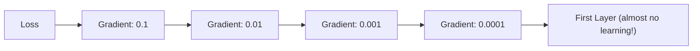
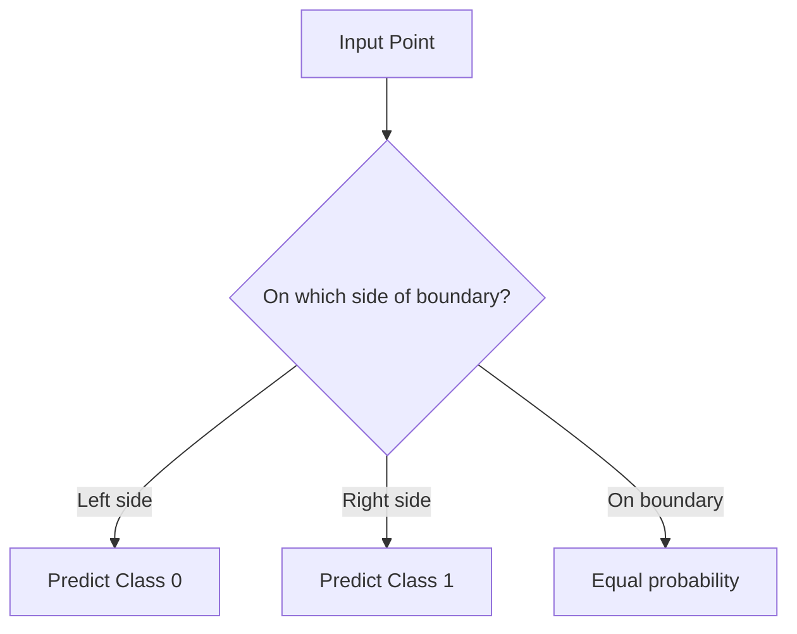
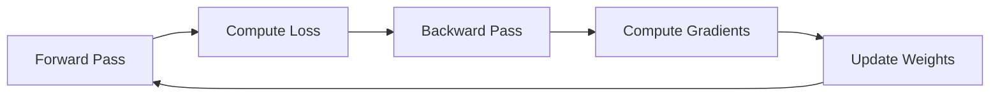

# Interview Questions: MLP Decision Boundaries

---

## 📋 Question 1: What is a Neural Network?

### Simple Answer (for 10-year-old)
A neural network is like a team of workers who learn to solve puzzles. Each worker (neuron) looks at a small piece of information, makes a decision, and passes it to the next worker. After seeing many examples, the team gets really good at solving similar puzzles!

### Technical Answer (for interviewer)
A neural network is a computational model inspired by biological neural networks. It consists of interconnected nodes (neurons) organized in layers. Each neuron computes a weighted sum of its inputs, applies a non-linear activation function, and outputs the result. Training uses backpropagation and gradient descent to minimize a loss function.

### Key Points to Remember
1. Input layer → Hidden layer(s) → Output layer
2. Each connection has a learnable weight
3. Activation functions introduce non-linearity
4. Training = adjusting weights via backpropagation

### Common Mistakes
❌ Saying neural networks "think like humans"
✅ They are mathematical function approximators

---

## 📋 Question 2: What is an Activation Function?

### Simple Answer
An activation function is like a filter that decides how much a neuron should "fire." It's like a volume knob that controls how much signal passes through.

### Technical Answer
An activation function is a non-linear transformation applied to the weighted sum of a neuron's inputs. It introduces non-linearity into the network, enabling it to learn complex patterns. Without activation functions, a multi-layer network collapses to a linear model.

### Diagram
```mermaid
flowchart LR
    A[Weighted Sum: z = Σ(w×x) + b] --> B[Activation: a = f(z)]
    B --> C[Output to Next Layer]
```

### Common Mistakes
❌ Thinking activation functions are optional
✅ Without them, neural network = linear regression

---

## 📋 Question 3: Explain ReLU, Sigmoid, and Tanh

### Simple Answer
- **ReLU**: Like a one-way door - positive goes through, negative blocked
- **Sigmoid**: Like a dimmer switch - smoothly scales between 0 and 1
- **Tanh**: Like sigmoid but goes from -1 to 1

### Technical Answer

| Activation | Formula | Range | Gradient at x=0 |
|------------|---------|-------|-----------------|
| ReLU | max(0, x) | [0, ∞) | Undefined (0 from left, 1 from right) |
| Sigmoid | 1/(1+e^-x) | (0, 1) | 0.25 |
| Tanh | (e^x-e^-x)/(e^x+e^-x) | (-1, 1) | 1.0 |

### Key Points
1. ReLU is default for hidden layers (no vanishing gradient)
2. Sigmoid for binary output (probability interpretation)
3. Tanh for RNNs (zero-centered)

---

## 📋 Question 4: What is the Vanishing Gradient Problem?

### Simple Answer
When we have many layers, the learning signal gets weaker and weaker as it travels backwards. By the time it reaches the first layers, it's so small that those layers barely learn anything!

### Technical Answer
In deep networks, gradients computed during backpropagation tend to shrink exponentially as they propagate to earlier layers. For sigmoid/tanh, the maximum gradient is ≤1, so repeated multiplication makes gradients vanishingly small. Early layers train extremely slowly or not at all.

### Diagram


### Real-life Analogy
Like a game of telephone - by the time the message reaches the first person, it's completely distorted!

---

## 📋 Question 5: Why Does ReLU Not Have Vanishing Gradient?

### Simple Answer
ReLU lets positive signals pass through completely unchanged. So the learning signal stays strong even through many layers!

### Technical Answer
ReLU's gradient is exactly 1 for all positive inputs (and 0 for negative). Unlike sigmoid (max gradient 0.25) or tanh (max gradient 1.0 but decays), ReLU maintains constant gradient magnitude for positive activations. This prevents exponential decay of gradients.

### Key Points
- Gradient of ReLU: 1 for x > 0, 0 for x < 0
- No multiplication of small numbers = no vanishing

### Common Mistakes
❌ "ReLU never has gradient problems"
✅ ReLU has "dying ReLU" problem (neurons stuck at 0)

---

## 📋 Question 6: What is a Decision Boundary?

### Simple Answer
A decision boundary is like an invisible fence that separates different groups. Points on one side belong to class A, points on the other side belong to class B.

### Technical Answer
A decision boundary is the hypersurface in feature space where the classifier's predicted probability for each class is equal (typically 0.5 for binary classification). It represents the transition zone between predicted classes.

### Diagram


---

## 📋 Question 7: Why Do Different Activations Create Different Boundary Shapes?

### Simple Answer
Different activations process information differently. ReLU works in straight lines (piecewise), while sigmoid/tanh work in smooth curves. The combination of these shapes creates different boundary patterns!

### Technical Answer
The activation function determines the type of transformations the network can learn. ReLU is piecewise linear, so compositions of ReLU neurons create piecewise-linear decision boundaries. Sigmoid/Tanh are smooth functions, producing smoother boundaries. The boundary shape is also affected by the number of neurons and their learned weights.

---

## 📋 Question 8: When Would You Choose Sigmoid Over ReLU?

### Simple Answer
Use sigmoid when you need your answer to be between 0 and 1, like "what's the probability this email is spam?"

### Technical Answer
Sigmoid is preferred for:
1. **Binary classification output layer**: Outputs interpretable as probabilities
2. **Gating mechanisms**: In LSTM/GRU gates (values between 0 and 1)
3. **When bounded output is required**: Ensuring output stays in (0, 1)

ReLU is preferred for hidden layers due to training stability.

---

## 📋 Question 9: What is the make_moons Dataset?

### Simple Answer
A practice dataset with points arranged in two curved shapes like crescent moons facing each other. It's good for testing because a straight line can't separate the two groups!

### Technical Answer
make_moons is a synthetic 2D dataset generator in sklearn that creates two interleaving half-circles. It's non-linearly separable, making it ideal for testing non-linear classifiers. Parameters include n_samples (size), noise (Gaussian std), and random_state (reproducibility).

---

## 📋 Question 10: What Does hidden_layer_sizes=(8,) Mean?

### Simple Answer
It means "make one hidden layer with 8 workers (neurons) in it."

### Technical Answer
`hidden_layer_sizes=(8,)` is a tuple specifying the architecture:
- `(8,)` = one hidden layer with 8 neurons
- `(8, 4)` = two hidden layers: first with 8 neurons, second with 4
- `(16, 16, 8)` = three hidden layers with 16, 16, and 8 neurons

The comma in `(8,)` is crucial - it makes it a tuple, not just a parenthesized number.

---

## 📋 Question 11: Why Use random_state=42?

### Simple Answer
So everyone gets the same results! If we don't set it, the answers would be different every time we run the code.

### Technical Answer
`random_state` seeds the random number generator, ensuring:
1. **Reproducibility**: Same data/weights every run
2. **Fair comparison**: All models start from same initialization
3. **Debugging**: Can reproduce exact issues
4. **Scientific rigor**: Others can verify results

The value 42 is arbitrary (Douglas Adams reference) - any integer works.

---

## 📋 Question 12: What is Backpropagation?

### Simple Answer
Backpropagation is like figuring out "who made the mistake." If the team gets a wrong answer, we trace back to find which workers contributed most to the error and ask them to adjust.

### Technical Answer
Backpropagation is an algorithm for computing gradients in neural networks using the chain rule of calculus. It propagates error signals backward from the output to input layers, computing the gradient of the loss with respect to each weight. These gradients are then used by optimization algorithms (SGD, Adam) to update weights.

### Diagram


---

## 📋 Question 13: What is Adam Optimizer?

### Simple Answer
Adam is a smart way to adjust the learning speed for each weight. It goes faster when confident and slower when unsure.

### Technical Answer
Adam (Adaptive Moment Estimation) combines:
1. **Momentum**: Running average of gradients
2. **RMSprop**: Running average of squared gradients

This adapts learning rates per-parameter, typically achieving faster convergence than vanilla SGD with fewer hyperparameters to tune.

---

## 📋 Question 14: Why 1000 max_iter?

### Simple Answer
We let the computer try up to 1000 times to learn the pattern. Usually it figures it out sooner and stops automatically!

### Technical Answer
`max_iter=1000` sets the maximum number of training epochs. The actual training may stop earlier if:
1. The loss converges (stops decreasing)
2. The tolerance threshold is met
3. Validation metrics stabilize

1000 is generous for simple datasets but necessary for complex ones.

---

## 📋 Question 15: How Do You Create a Meshgrid?

### Simple Answer
A meshgrid is like graph paper - we create points at every tiny intersection so we can color each square based on what the model predicts.

### Technical Answer
```python
xx, yy = np.meshgrid(
    np.arange(x_min, x_max, step),
    np.arange(y_min, y_max, step)
)
# xx contains x-coordinates, yy contains y-coordinates
# Stack them to get all (x, y) pairs:
grid_points = np.c_[xx.ravel(), yy.ravel()]
```

---

## 📋 Questions 16-20: Quick-Fire

### Q16: MLPClassifier vs building from scratch?
A: MLPClassifier is faster to use, building from scratch teaches fundamentals.

### Q17: What does .fit() do?
A: Trains the model by adjusting weights to minimize prediction error.

### Q18: What does .score() return?
A: Classification accuracy (correct predictions / total predictions).

### Q19: What does .predict() do?
A: Takes new data and returns predicted class labels.

### Q20: What is contourf?
A: Matplotlib function that creates filled contour plots (colored regions).
