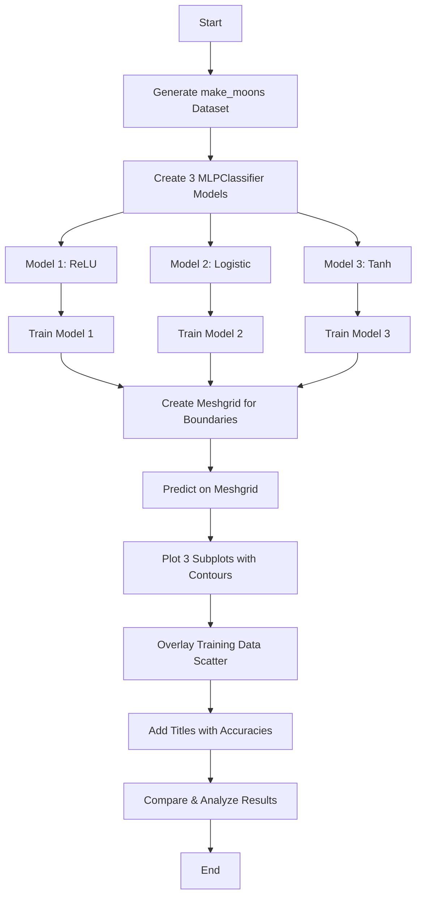

# Problem Statement: MLP Decision Boundaries

## 🧩 Problem Statement

### What Problem Are We Solving?

Imagine you have a mix of red and blue candies scattered on a table, but they're not in neat separate piles - they're mixed in a **curved pattern** like two crescent moons facing each other. Your job is to draw a line (or curve) that separates the red candies from the blue ones as best as possible.

**The Challenge**: A straight line won't work! The candies are arranged in a curved pattern, so we need something smarter - a **neural network** that can learn to draw curved boundaries.

**The Experiment**: We'll train 3 different neural networks, each using a different "brain function" (activation function):
1. **ReLU** (Rectified Linear Unit) - like a one-way valve
2. **Sigmoid** - like a smooth dimmer switch
3. **Tanh** - like sigmoid but centered at zero

We want to see: *How does each "brain function" affect the boundary shape?*

### Why Does This Matter?

In the real world, data is rarely perfectly separable by a straight line:
- **Medical diagnosis**: Separating healthy vs. sick patients based on multiple test results
- **Email spam detection**: Separating spam from legitimate emails
- **Image recognition**: Separating cats from dogs in photos

Understanding how activation functions shape decision boundaries helps us choose the right one for our problem!

---

## 🪜 Steps to Solve the Problem


### Step 1: Create the Candy Scatter (Generate Data)
```python
from sklearn.datasets import make_moons
X, y = make_moons(n_samples=300, noise=0.2, random_state=42)
```

---

#### 🍬 What is make_moons? (Explained for a 10-year-old)

Imagine you're playing a game where you throw red candies and blue candies on a table. But instead of throwing them randomly, you throw them in a special pattern - like **two banana shapes** or **two curved smiles** facing each other!

**`make_moons`** is a function that creates this exact pattern on a computer. It's like a candy-throwing robot that always throws candies in this curved pattern.

---

#### 📊 What Does make_moons Give Us?

When we call `make_moons()`, it gives us **two things**:

| Variable | What It Is | Real-Life Analogy |
|----------|-----------|-------------------|
| **X** | The **positions** of all candies on the table | Like writing down "candy is at position (3, 5)" |
| **y** | The **color** of each candy (0 = red, 1 = blue) | Like writing down "this candy is red" |

---

#### 🔍 Understanding X (The Positions)

**X** is a table with **300 rows** (one for each candy) and **2 columns** (x-position and y-position).

Think of it like a treasure map with coordinates:

| Column | Name | What It Means | Sample Values |
|--------|------|--------------|---------------|
| **Column 1** (X[:, 0]) | **x-coordinate** | How far LEFT or RIGHT the candy is | -1.2, 0.5, 1.8, 2.1 |
| **Column 2** (X[:, 1]) | **y-coordinate** | How far UP or DOWN the candy is | -0.5, 0.3, 0.8, -0.2 |

**Example - First 5 candies:**
```
Candy 1: Position (0.89, 0.43)  → A bit to the right, a bit up
Candy 2: Position (-0.12, 0.91) → A tiny bit left, quite high up
Candy 3: Position (1.45, -0.23) → Right side, slightly below center
Candy 4: Position (0.23, 0.67)  → Near center, above middle
Candy 5: Position (1.78, 0.12)  → Far right, near center
```

**Visual Understanding:**
```
          ↑ y-axis (up/down)
          |
          |    (0.5, 0.8) ← This candy is right and up
          |        •
          |
    ------+-------- → x-axis (left/right)
          |
          |   • (0.3, -0.5) ← This candy is right and down
          |
```

---

#### 🔍 Understanding y (The Labels/Colors)

**y** is a simple list telling us which "moon" (group/color) each candy belongs to:

| Value | Meaning | Analogy |
|-------|---------|---------|
| **0** | First moon (Class 0) | Red candies 🔴 |
| **1** | Second moon (Class 1) | Blue candies 🔵 |

**Example:**
```
y = [0, 1, 0, 1, 1, 0, 0, 1, ...]
     ↓  ↓  ↓  ↓
    Red Blue Red Blue
```

---

#### 🎯 The Complete Picture

When we combine X and y, we get:

| Candy # | x-position | y-position | Color (y) |
|---------|------------|------------|-----------|
| 1 | 0.89 | 0.43 | 0 (Red 🔴) |
| 2 | -0.12 | 0.91 | 1 (Blue 🔵) |
| 3 | 1.45 | -0.23 | 0 (Red 🔴) |
| 4 | 0.23 | 0.67 | 1 (Blue 🔵) |
| 5 | 1.78 | 0.12 | 0 (Red 🔴) |

---

#### ⚙️ What Do the Parameters Mean?

| Parameter | Value | What It Does | Kid-Friendly Explanation |
|-----------|-------|--------------|-------------------------|
| **n_samples** | 300 | Total number of candies | "Throw 300 candies total" |
| **noise** | 0.2 | How "messy" the throw is | "Wiggle each candy a tiny bit so it's not perfect" |
| **random_state** | 42 | The "throwing style" | "Always throw the same way so we get same pattern every time" |

**Noise = 0** (Perfect):
```
    •••••••
  ••       ••     ← Perfect curve, all candies on the line
 •           •
```

**Noise = 0.2** (A little messy):
```
   •  • • •  •
  •  •     •  •   ← Some candies wiggle off the line
 •    •   •    •
```

**Noise = 0.5** (Very messy):
```
 •   •  •   •  
   •    •  •  •   ← Candies are all over!
  •  •    •   •
```

---

#### 🧠 Why Two Moons?

The shape looks like two crescent moons (🌙🌙) facing each other:

```
        MOON 1 (Class 0 - Red)
           ╭─────╮
          ╱       ╲
         ╱         ╲
        ╱           ╲
       ╱             ╲_________
      ╱                        ╲
     ╱          MOON 2          ╲
    ╱        (Class 1 - Blue)    ╲
   ╱                              ╲
  ╰────────────────────────────────╯
```

**The Challenge**: You CANNOT draw a straight line to separate these! That's why we need a smart neural network!

---

This creates our "two moons" pattern - 300 points in two curved groups.

### Step 2: Build 3 Neural Networks
Each network has:
- 1 hidden layer with 8 neurons (like 8 helper workers)
- Same random starting point for fair comparison
- Different activation functions (ReLU, Sigmoid, Tanh)

### Step 3: Train All 3 Networks
Let each network "learn" the pattern by showing it all 300 points.

### Step 4: Visualize Decision Boundaries
For each network, draw a "heat map" showing where it predicts red vs. blue.

### Step 5: Compare and Analyze
- Which network got the most candies correct?
- How do the boundary shapes differ?
- Why might one work better than another?

---

## 🎯 Expected Output

### Visualization
A figure with 3 subplots:

```
┌─────────────────────────────────────────────────────────┐
│  ┌─────────────┐  ┌─────────────┐  ┌─────────────┐     │
│  │   ReLU      │  │  Logistic   │  │    Tanh     │     │
│  │   Acc: 95%  │  │  Acc: 93%   │  │   Acc: 96%  │     │
│  │ [Contour +  │  │ [Contour +  │  │ [Contour +  │     │
│  │  Scatter]   │  │  Scatter]   │  │  Scatter]   │     │
│  └─────────────┘  └─────────────┘  └─────────────┘     │
└─────────────────────────────────────────────────────────┘
```

### Accuracy Comparison Table
| Activation | Training Accuracy |
|------------|-------------------|
| ReLU       | ~95%              |
| Logistic   | ~93%              |
| Tanh       | ~96%              |

### Written Analysis
250-350 words explaining:
- Why each boundary looks different
- Which activation works best and why
- Real-world implications

---

## 🔄 Solution Flow Diagram



---

## 📚 Key Terms Glossary

| Term | Simple Explanation |
|------|-------------------|
| **Neural Network** | A computer program that learns patterns, like a brain made of math |
| **MLPClassifier** | sklearn's ready-to-use neural network for classification |
| **Activation Function** | The "filter" that decides how neurons fire |
| **Decision Boundary** | The invisible line that separates different classes |
| **make_moons** | A dataset shaped like two interleaving crescent moons |
| **Hidden Layer** | The middle part of the network that does the thinking |
| **Neurons** | The individual "calculators" inside a layer |
| **Contour Plot** | A colorful map showing where the boundary is |
