# Concepts Explained: MNIST Activation Functions Comparison

This document explains each concept used in the project in detail, following the 12-point format.

---

## Table of Contents

1. [Neural Network](#1-neural-network)
2. [Activation Function](#2-activation-function)
3. [Sigmoid Activation](#3-sigmoid-activation)
4. [Tanh Activation](#4-tanh-activation)
5. [ReLU Activation](#5-relu-activation)
6. [Vanishing Gradient Problem](#6-vanishing-gradient-problem)
7. [MNIST Dataset](#7-mnist-dataset)
8. [Adam Optimizer](#8-adam-optimizer)
9. [Softmax Activation](#9-softmax-activation)
10. [Cross-Entropy Loss](#10-cross-entropy-loss)
11. [Gradient Descent](#11-gradient-descent)
12. [Backpropagation](#12-backpropagation)

---

## 1. Neural Network

### 1.1 Definition
A **neural network** is a computer program inspired by the human brain. It consists of connected "neurons" organized in layers that process information.

**Exam-friendly**: "A neural network is a machine learning model consisting of interconnected nodes (neurons) organized in layers that learn patterns from data."

### 1.2 Why it is used
- Learns complex patterns that simple rules can't capture
- Handles images, text, audio, and other unstructured data
- Improves with more data

### 1.3 When to use it
- Image classification (our MNIST project)
- Speech recognition
- Language translation
- Game playing (AlphaGo)

### 1.4 Where to use it
- **Industry**: Google Photos (face recognition), Netflix (recommendations)
- **This project**: Classifying handwritten digits 0-9

### 1.5 Is this the only way?

| Method | Pros | Cons |
|--------|------|------|
| Neural Network ✓ | Learns complex patterns | Needs lots of data |
| Decision Tree | Interpretable | Limited complexity |
| SVM | Good for small data | Slow on large data |
| KNN | Simple | Slow inference |

**Why chosen**: Neural networks excel at image recognition tasks.

### 1.6 Explanation with Diagram


Each neuron receives inputs, multiplies by weights, adds bias, applies activation, and outputs result.

### 1.7 How to use it
```python
model = tf.keras.Sequential([
    tf.keras.layers.Dense(128, activation='relu', input_shape=(784,)),
    tf.keras.layers.Dense(64, activation='relu'),
    tf.keras.layers.Dense(10, activation='softmax')
])
```

### 1.8 How it works internally
1. **Forward Pass**: Input → multiply by weights → add bias → activation → output
2. **Loss Calculation**: Compare output to correct answer
3. **Backward Pass**: Calculate gradients using chain rule
4. **Update Weights**: weights = weights - learning_rate × gradient

### 1.9 Visual Summary
- 📥 Input Layer: Receives data (784 pixels)
- 🧠 Hidden Layers: Learn patterns (128 → 64 neurons)
- 📤 Output Layer: Makes prediction (10 classes)
- 🔄 Training: Forward → Loss → Backward → Update → Repeat

### 1.10 Advantages
- Handles complex, non-linear patterns
- Scales with data (more data = better)
- Versatile (images, text, audio)

### 1.11 Disadvantages / Limitations
- Needs lots of data
- Computationally expensive
- "Black box" - hard to interpret
- Can overfit

### 1.12 Exam & Interview Points
- **Key Concept**: Neural networks learn by adjusting weights to minimize loss
- **Common Question**: "What is a neural network?"
  - **Answer**: A model inspired by the brain, consisting of connected neurons in layers that process information by learning weights
- **Interview Trap**: "Can neural networks learn any function?"
  - **Answer**: Theoretically yes (universal approximation theorem), but practically limited by data and compute

---

## 2. Activation Function

### 2.1 Definition
An **activation function** is a mathematical function applied to a neuron's output that introduces non-linearity.

**Exam-friendly**: "An activation function determines a neuron's output based on its input, enabling the network to learn non-linear patterns."

### 2.2 Why it is used
Without activation functions, a neural network is just linear algebra (y = Wx + b). Stacking linear layers = still linear! Activation functions break this linearity.

### 2.3 When to use it
- After every hidden layer (non-linearity)
- Output layer depends on task:
  - Classification: Softmax (multi-class) or Sigmoid (binary)
  - Regression: Linear (no activation)

### 2.4 Where to use it
- Hidden layers: ReLU, Tanh, Sigmoid
- Output layers: Softmax, Sigmoid, Linear

### 2.5 Is this the only way?

| Activation | Range | Best For |
|------------|-------|----------|
| ReLU ✓ | [0, ∞) | Hidden layers (default) |
| Sigmoid | (0, 1) | Binary output |
| Tanh | (-1, 1) | Zero-centered needs |
| Softmax | (0, 1) sum=1 | Multi-class output |
| Leaky ReLU | (-∞, ∞) | Avoiding dead neurons |

### 2.6 Explanation with Diagram

```mermaid
flowchart LR
    A[Input x] --> B[Weighted Sum<br>z = Wx + b]
    B --> C[Activation<br>f(z)]
    C --> D[Output<br>a = f(z)]
    
    style B fill:#fff3e0
    style C fill:#e8f5e9
```

### 2.7 How to use it
```python
# In Keras
tf.keras.layers.Dense(128, activation='relu')
tf.keras.layers.Dense(10, activation='softmax')
```

### 2.8 How it works internally
- Takes linear output: z = Wx + b
- Applies function: a = f(z)
- This "squashes" or transforms the value
- During backprop, we need f'(z) (derivative)

### 2.9 Visual Summary
- 🔢 Input: Weighted sum z = Wx + b
- ⚡ Activation: Apply f(z) to transform
- 📊 Output: Non-linear activation value

### 2.10 Advantages
- Enables learning non-linear patterns
- Different activations for different purposes
- Simple to implement

### 2.11 Disadvantages / Limitations
- Wrong choice can hurt training (vanishing gradients)
- Some activations are computationally expensive (exp)
- Need to know which to use where

### 2.12 Exam & Interview Points
- **Key Point**: Without activation functions, deep networks = shallow networks
- **Common Question**: "Why do we need activation functions?"
  - **Answer**: To introduce non-linearity. Without them, the network can only learn linear mappings.

---

## 3. Sigmoid Activation

### 3.1 Definition
**Sigmoid** is an activation function that squashes any input to a value between 0 and 1.

**Formula**: σ(x) = 1 / (1 + e^(-x))

### 3.2 Why it is used
- Outputs interpretable as probabilities (0-1)
- Smooth, differentiable function
- Historical importance (first popular activation)

### 3.3 When to use it
- Binary classification output layer
- Gates in LSTM/GRU networks
- **Avoid** in deep hidden layers (vanishing gradients)

### 3.4 Where to use it
- Output layer for yes/no predictions
- Attention mechanisms
- LSTM cell gates

### 3.5 Is this the only way?

| For Binary Output | Pros | Cons |
|-------------------|------|------|
| Sigmoid ✓ | Probability output | Vanishing gradients |
| Tanh | Zero-centered | Range is (-1,1) not (0,1) |

**Why chosen for comparison**: Shows vanishing gradient problem clearly.

### 3.6 Explanation with Diagram

```
     1 |          ___------
       |       .-'
       |     .'
   0.5 |----'---------------- f(0) = 0.5
       |  .'
       | /
     0 |'________________
       -5    0    5
```

- Input -∞ → Output 0
- Input 0 → Output 0.5
- Input +∞ → Output 1

### 3.7 How to use it
```python
import numpy as np

def sigmoid(x):
    return 1 / (1 + np.exp(-x))

# In Keras
tf.keras.layers.Dense(10, activation='sigmoid')
```

### 3.8 How it works internally
1. Takes input x (can be any real number)
2. Computes exponential: e^(-x)
3. Adds 1: 1 + e^(-x)
4. Inverts: 1 / (1 + e^(-x))
5. Result is between 0 and 1

**Derivative**: σ'(x) = σ(x) × (1 - σ(x))
- Maximum value: 0.25 (when x = 0)
- This causes vanishing gradients!

### 3.9 Visual Summary
- 📊 Range: (0, 1) - always positive
- 📉 Gradient: Max 0.25 - prone to vanishing
- 🐌 Training: Slow in deep networks

### 3.10 Advantages
- Outputs are probabilities
- Smooth and differentiable
- Easy to understand

### 3.11 Disadvantages / Limitations
- **Vanishing gradients**: Max derivative is 0.25
- **Not zero-centered**: All outputs positive
- **Computationally expensive**: exp() is slow

### 3.12 Exam & Interview Points
- **Key Fact**: Sigmoid derivative max is 0.25
- **Question**: "Why does sigmoid cause vanishing gradients?"
  - **Answer**: Its derivative is at most 0.25. In backprop, gradients multiply, so 0.25^n shrinks exponentially.

---

## 4. Tanh Activation

### 4.1 Definition
**Tanh** (hyperbolic tangent) squashes inputs to values between -1 and 1.

**Formula**: tanh(x) = (e^x - e^(-x)) / (e^x + e^(-x))

### 4.2 Why it is used
- Zero-centered output (unlike sigmoid)
- Balanced gradients for positive/negative inputs
- Better than sigmoid for hidden layers

### 4.3 When to use it
- Hidden layers (better than sigmoid)
- RNN/LSTM hidden states
- When zero-centered output matters

### 4.4 Where to use it
- RNN cell states
- Some normalization layers
- Historical neural networks

### 4.5 Is this the only way?

| Comparing | Tanh | Sigmoid |
|-----------|------|---------|
| Range | (-1, 1) | (0, 1) |
| Zero-centered | ✓ | ✗ |
| Max derivative | 1.0 | 0.25 |
| Vanishing gradients | Less | More |

### 4.6 Explanation with Diagram

```
     1 |          ___------
       |       .-'
       |     .'
     0 |----'---------------- f(0) = 0
       |  .'
       | /
    -1 |'________________
       -5    0    5
```

### 4.7 How to use it
```python
import numpy as np

def tanh(x):
    return np.tanh(x)  # Built-in

# In Keras
tf.keras.layers.Dense(64, activation='tanh')
```

### 4.8 How it works internally
**Derivative**: tanh'(x) = 1 - tanh²(x)
- Maximum at x=0: derivative = 1
- Still saturates at extremes (derivative → 0)

### 4.9 Visual Summary
- 📊 Range: (-1, 1) - zero-centered
- 📈 Max derivative: 1.0 (at x=0)
- ⚡ Better than sigmoid for hidden layers

### 4.10 Advantages
- Zero-centered (balanced gradients)
- Stronger gradients than sigmoid
- Smooth and differentiable

### 4.11 Disadvantages / Limitations
- Still has vanishing gradient problem (less severe)
- Computationally expensive (exp)
- Saturates at extremes

### 4.12 Exam & Interview Points
- **Key Fact**: Tanh is zero-centered, sigmoid is not
- **Question**: "Why is Tanh better than Sigmoid for hidden layers?"
  - **Answer**: Tanh is zero-centered, producing balanced gradients. Its max derivative is 1.0 vs 0.25 for sigmoid.

---

## 5. ReLU Activation

### 5.1 Definition
**ReLU** (Rectified Linear Unit) returns 0 for negative inputs and the input itself for positive inputs.

**Formula**: ReLU(x) = max(0, x)

### 5.2 Why it is used
- No vanishing gradient for positive inputs
- Very fast to compute (just max)
- Sparse activation (many zeros)

### 5.3 When to use it
- Default for hidden layers in feedforward networks
- Convolutional neural networks
- Most deep learning applications

### 5.4 Where to use it
- Almost everywhere as default hidden activation
- NOT for output layers

### 5.5 Is this the only way?

| ReLU Variant | Formula | Advantage |
|--------------|---------|-----------|
| ReLU ✓ | max(0,x) | Simple, fast |
| Leaky ReLU | max(0.01x, x) | No dead neurons |
| ELU | x if x>0, α(e^x-1) else | Smooth |
| GELU | x × Φ(x) | Used in Transformers |

### 5.6 Explanation with Diagram

```
       |     .
     3 |    /
       |   /
     2 |  /
       | /
     1 |/
     0 |____________
       -3 -2 -1  0  1  2  3
```

### 5.7 How to use it
```python
import numpy as np

def relu(x):
    return np.maximum(0, x)

# In Keras
tf.keras.layers.Dense(128, activation='relu')
```

### 5.8 How it works internally
**Derivative**: 
- 0 if x < 0
- 1 if x > 0
- Undefined at x = 0 (usually set to 0 or 1)

**Why no vanishing gradient**: Derivative is 1 for positive inputs, so gradients pass through unchanged!

### 5.9 Visual Summary
- 📊 Range: [0, ∞)
- ⚡ Derivative: 0 or 1 (no vanishing)
- 🚀 Fastest activation to compute

### 5.10 Advantages
- No vanishing gradient (for positive inputs)
- Computationally efficient
- Sparse activations (natural regularization)
- Converges faster

### 5.11 Disadvantages / Limitations
- **Dying ReLU**: Neurons with negative input always output 0
- **Not zero-centered**: All outputs ≥ 0
- **Unbounded**: Can explode to very large values

### 5.12 Exam & Interview Points
- **Key Fact**: ReLU derivative is 1 for positive inputs - no gradient shrinking
- **Question**: "What is the dying ReLU problem?"
  - **Answer**: If a neuron's input is always negative, ReLU outputs 0, gradient is 0, and the neuron never updates (dies).
- **Question**: "Why is ReLU faster than Sigmoid?"
  - **Answer**: ReLU is just max(0,x), a simple comparison. Sigmoid requires exp() which is expensive.

---

## 6. Vanishing Gradient Problem

### 6.1 Definition
The **vanishing gradient problem** occurs when gradients become extremely small during backpropagation, preventing early layers from learning.

### 6.2 Why it is important
- Chief problem in training deep networks
- Makes early layers learn very slowly (or not at all)
- Was a major blocker for deep learning before ReLU

### 6.3 When it happens
- Using Sigmoid/Tanh in deep networks
- Very deep networks (many layers)
- Poorly initialized weights

### 6.4 Where it occurs
- Any layer far from the output
- Our experiment: First layer gradients in Sigmoid model

### 6.5 Alternative Solutions

| Solution | How it helps |
|----------|--------------|
| ReLU ✓ | Gradient = 1 for positive |
| Residual connections | Skip connections add gradients |
| Batch normalization | Keeps activations in good range |
| Proper initialization | Prevents early saturation |
| LSTM/GRU | Gates control gradient flow |

### 6.6 Explanation with Diagram

```mermaid
flowchart LR
    A[Output<br>Error = 1.0] -->|×0.25| B[Layer 3<br>Grad = 0.25]
    B -->|×0.25| C[Layer 2<br>Grad = 0.0625]
    C -->|×0.25| D[Layer 1<br>Grad = 0.0156]
    D -->|×0.25| E[Input<br>Grad ≈ 0]
    
    style A fill:#ffcdd2
    style D fill:#fff9c4
    style E fill:#c8e6c9
```



With Sigmoid (max derivative 0.25), gradients shrink by 4x at each layer!

### 6.7 Mathematical Explanation
For a network with n layers using sigmoid:

Gradient at layer 1 = Error × σ'(layer n) × σ'(layer n-1) × ... × σ'(layer 1)

Since max σ'(x) = 0.25:
- 2 layers: 0.25² = 0.0625
- 4 layers: 0.25⁴ = 0.0039
- 8 layers: 0.25⁸ ≈ 0.000015 (nearly zero!)

### 6.8 How it works internally
1. Forward pass: compute all activations
2. Compute loss at output
3. Backward pass: gradients multiply at each layer
4. If multipliers < 1, gradients shrink exponentially
5. Early layer gradients → 0

### 6.9 Visual Summary
- ❌ Sigmoid: Gradient shrinks by 75%+ per layer
- ⚠️ Tanh: Better but still shrinks
- ✅ ReLU: Gradient unchanged for positive inputs

### 6.10 Why ReLU Helps
ReLU derivative is 0 or 1:
- When 1: Gradients pass through unchanged
- When 0: That path doesn't contribute anyway

### 6.11 Disadvantages of Vanishing Gradients
- Early layers don't learn
- Training is very slow
- Model fails to converge
- Deep networks don't work

### 6.12 Exam & Interview Points
- **Key Fact**: Vanishing gradients occur because Sigmoid's max derivative is 0.25
- **Question**: "How does ReLU solve vanishing gradients?"
  - **Answer**: ReLU's derivative is 1 for positive inputs, so gradients pass through unchanged instead of shrinking.

---

## 7. MNIST Dataset

### 7.1 Definition
**MNIST** (Modified National Institute of Standards and Technology) is a dataset of 70,000 handwritten digit images (0-9).

### 7.2 Why it is used
- "Hello World" of machine learning
- Small, fast to train
- Well-studied benchmark

### 7.3 When to use it
- Learning ML fundamentals
- Testing new architectures
- Quick prototyping

### 7.4 Where to use it
- Educational projects
- Research baselines
- Algorithm comparison

### 7.5 Dataset Details

| Property | Value |
|----------|-------|
| Training samples | 60,000 |
| Test samples | 10,000 |
| Image size | 28 × 28 pixels |
| Channels | 1 (grayscale) |
| Classes | 10 (digits 0-9) |
| Pixel values | 0-255 |

### 7.6 Sample Images

Each image is a 28×28 grayscale image of a handwritten digit. The labels indicate which digit (0-9) is shown.

### 7.7 How to use it
```python
from tensorflow.keras.datasets import mnist

(X_train, y_train), (X_test, y_test) = mnist.load_data()

# X_train shape: (60000, 28, 28)
# y_train shape: (60000,)

# Preprocess
X_train = X_train.reshape(-1, 784) / 255.0  # Flatten and normalize
```

### 7.8 Preprocessing Steps
1. **Flatten**: 28×28 = 784 length vector
2. **Normalize**: Divide by 255 to get 0-1 range

### 7.12 Exam & Interview Points
- **Key Fact**: MNIST has 60K training, 10K test images
- **Question**: "Why flatten MNIST images?"
  - **Answer**: Dense/fully-connected layers expect 1D input vectors, not 2D images.

---

## 8. Adam Optimizer

### 8.1 Definition
**Adam** (Adaptive Moment Estimation) is an optimization algorithm that adapts learning rates for each parameter.

### 8.2 Why it is used
- Combines best of AdaGrad and RMSprop
- Works well with default parameters
- Adapts learning rate per parameter

### 8.3 When to use it
- Default choice for most problems
- When you don't want to tune learning rate heavily
- For sparse data

### 8.4 Comparison with Alternatives

| Optimizer | Pros | Cons |
|-----------|------|------|
| Adam ✓ | Adaptive, fast convergence | Memory (stores moments) |
| SGD | Simple, generalizes well | Needs tuning |
| RMSprop | Good for non-stationary | Less common now |
| AdaGrad | Good for sparse | Learning rate shrinks |

### 8.5 How to use it
```python
optimizer = tf.keras.optimizers.Adam(learning_rate=0.001)

model.compile(
    optimizer=optimizer,
    loss='sparse_categorical_crossentropy',
    metrics=['accuracy']
)
```

### 8.6 Key Parameters

| Parameter | Default | Purpose |
|-----------|---------|---------|
| learning_rate | 0.001 | Step size |
| beta_1 | 0.9 | First moment decay |
| beta_2 | 0.999 | Second moment decay |
| epsilon | 1e-7 | Numerical stability |

### 8.12 Exam & Interview Points
- **Key Fact**: Adam adapts learning rate per parameter using moment estimates
- **Question**: "Why use Adam over SGD?"
  - **Answer**: Adam adapts learning rates per parameter, converges faster, and works well with default settings. SGD may generalize better but needs careful tuning.

---

## 9. Softmax Activation

### 9.1 Definition
**Softmax** converts a vector of raw scores into probabilities that sum to 1.

**Formula**: softmax(z_i) = e^(z_i) / Σ e^(z_j)

### 9.2 Why it is used
- Converts network output to valid probability distribution
- Each output is 0-1, all sum to 1.0
- Required for multi-class classification

### 9.3 When to use it
- Output layer for multi-class classification
- When you need probability distribution
- Paired with cross-entropy loss

### 9.4 Example
```
Raw scores: [2.0, 1.0, 0.1]
After softmax: [0.659, 0.242, 0.099]  # Sum = 1.0
```

### 9.12 Exam & Interview Points
- **Key Fact**: Softmax outputs sum to 1 (valid probability)
- **Question**: "Difference between Softmax and Sigmoid for classification?"
  - **Answer**: Softmax for multi-class (outputs sum to 1), Sigmoid for binary or multi-label (independent probabilities)

---

## 10. Cross-Entropy Loss

### 10.1 Definition
**Cross-entropy loss** measures how different the predicted probability distribution is from the true distribution.

**Formula**: L = -Σ y_true × log(y_pred)

### 10.2 Why it is used
- Natural pairing with Softmax
- Heavily penalizes confident wrong predictions
- Gradient-friendly for backpropagation

### 10.3 Types

| Type | Use Case |
|------|----------|
| Categorical Cross-Entropy | One-hot encoded labels |
| Sparse Categorical Cross-Entropy | Integer labels (our case) |
| Binary Cross-Entropy | Binary classification |

### 10.12 Exam & Interview Points
- **Key Fact**: Cross-entropy = -Σ y_true × log(y_pred)
- **Question**: "Why cross-entropy over MSE for classification?"
  - **Answer**: Cross-entropy has better gradient properties with Softmax, and heavily penalizes confident wrong predictions.

---

## Jargon Glossary

| Term | Simple Explanation |
|------|-------------------|
| **Epoch** | One complete pass through all training data |
| **Batch** | Subset of data processed together |
| **Learning Rate** | How big of a step to take when learning |
| **Gradient** | Direction and magnitude of steepest descent |
| **Loss** | How wrong the model's predictions are |
| **Weight** | Learnable parameter connecting neurons |
| **Bias** | Learnable constant added to neuron |
| **Forward Pass** | Computing output from input |
| **Backward Pass** | Computing gradients for learning |
| **Overfitting** | Memorizing training data, failing on new data |
| **Validation** | Checking performance on held-out data |

---

## Quick Reference Card

### Which Activation Where?

| Layer Type | Recommended |
|------------|-------------|
| Hidden (default) | ReLU |
| Binary output | Sigmoid |
| Multi-class output | Softmax |
| RNN hidden | Tanh |
| RNN gates | Sigmoid |

### Which Optimizer?

| Situation | Recommended |
|-----------|-------------|
| Default | Adam |
| Very large models | AdamW |
| Want best generalization | SGD + momentum |
| Sparse data | Adam or AdaGrad |
