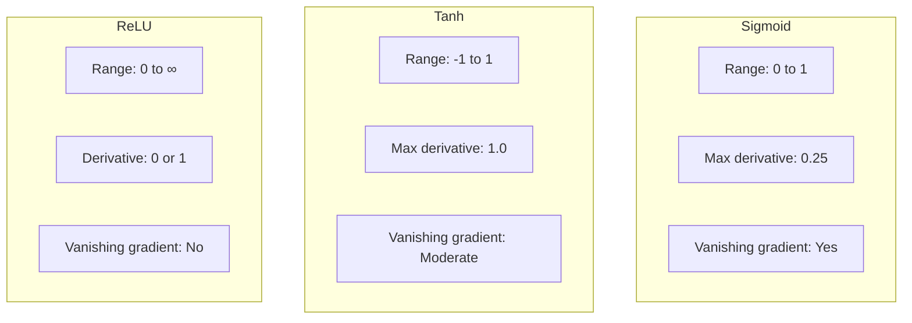
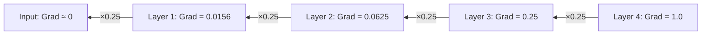

# Interview Questions: MNIST Activation Functions Comparison

This document contains 20 interview questions about activation functions and neural networks, with simple and technical answers.

---

## Table of Contents

1. [Basic Concepts (Q1-5)](#basic-concepts)
2. [Activation Functions (Q6-10)](#activation-functions)
3. [Vanishing Gradients (Q11-14)](#vanishing-gradients)
4. [Practical Applications (Q15-18)](#practical-applications)
5. [Advanced Topics (Q19-20)](#advanced-topics)

---

## Basic Concepts

### Q1: What is an activation function?

**Simple Answer (for 10-year-old):**
> An activation function is like a volume control on a speaker. It decides how loud (or quiet) each neuron's signal should be before passing it to the next layer.

**Technical Answer:**
> An activation function is a mathematical function applied to a neuron's output that introduces non-linearity into the network. Without activation functions, a neural network would be equivalent to a single linear transformation, regardless of depth.

**Mermaid Diagram:**
```mermaid
flowchart LR
    A[Input] --> B[Weighted Sum<br>z = Wx + b]
    B --> C[Activation<br>a = f(z)]
    C --> D[Output]
```

**Real-Life Analogy:**
Like a light dimmer - it takes an input (how much you turn the knob) and produces an output (light intensity) following a specific pattern.

**Common Mistakes:**
- ❌ Thinking all activations are the same
- ❌ Using Sigmoid in all hidden layers
- ❌ Forgetting activation in output layer

**Key Points:**
- Introduces non-linearity
- Different activations for different purposes
- Critical for deep learning to work

---

### Q2: Why do neural networks need activation functions?

**Simple Answer:**
> Without activation functions, no matter how many layers you stack, the network can only draw straight lines. With them, it can draw curvy, complex shapes!

**Technical Answer:**
> Activation functions are essential because:
> 1. **Non-linearity**: They enable the network to learn non-linear patterns
> 2. **Composability**: Without them, multiple linear layers collapse into one
> 3. **Universal approximation**: With non-linear activations, networks can approximate any continuous function

**Mathematical Proof:**
```
Linear layer: y = Wx + b
Two linear layers: y = W2(W1x + b1) + b2 = W2W1x + W2b1 + b2 = W'x + b'
Still just one linear layer!
```

---

### Q3: What is the difference between a neuron and a perceptron?

**Simple Answer:**
> A perceptron is like a simple yes/no voter. A neuron is a more flexible voter that can express "maybe" too!

**Technical Answer:**
> - **Perceptron**: Uses step function (output is 0 or 1), not differentiable
> - **Neuron**: Uses smooth activation (Sigmoid, ReLU, etc.), differentiable for gradient-based learning

---

### Q4: What is forward propagation?

**Simple Answer:**
> Forward propagation is like passing a note in class - the input goes from student to student until it reaches the final student (output).

**Technical Answer:**
> Forward propagation is the process of computing the network's output given an input:
> 1. Multiply inputs by weights
> 2. Add bias
> 3. Apply activation function
> 4. Pass to next layer
> 5. Repeat until output layer

---

### Q5: What is backpropagation?

**Simple Answer:**
> Backpropagation is like getting your test back with corrections. The errors go backward from the output to tell each layer how to improve.

**Technical Answer:**
> Backpropagation computes gradients of the loss with respect to all weights using the chain rule. It propagates the error signal backward through the network, enabling gradient-based optimization.

**Key Formula:**
```
∂L/∂w = ∂L/∂output × ∂output/∂hidden × ∂hidden/∂w
```

---

## Activation Functions

### Q6: Compare Sigmoid, Tanh, and ReLU.

**Simple Answer:**
| Function | What it does |
|----------|--------------|
| Sigmoid | Squashes to 0-1 (slow learner) |
| Tanh | Squashes to -1 to 1 (medium learner) |
| ReLU | Passes positive, blocks negative (fast learner) |

**Technical Answer:**

| Property | Sigmoid | Tanh | ReLU |
|----------|---------|------|------|
| Range | (0, 1) | (-1, 1) | [0, ∞) |
| Max derivative | 0.25 | 1.0 | 1 |
| Zero-centered | No | Yes | No |
| Vanishing gradient | Severe | Moderate | None (for positive) |
| Computation | Expensive | Expensive | Cheap |
| Dead neurons | No | No | Yes |

**Mermaid Diagram:**


---

### Q7: What is the dying ReLU problem?

**Simple Answer:**
> Dying ReLU is when a neuron gets "stuck" outputting zero forever, like a broken light bulb that can never turn on again.

**Technical Answer:**
> If a neuron's input is consistently negative, ReLU outputs 0, and its gradient is also 0. This means the weights never update, and the neuron is permanently inactive ("dead").

**Solution:**
```python
# Use Leaky ReLU instead
def leaky_relu(x, alpha=0.01):
    return max(alpha * x, x)
```

**When it happens:**
- High learning rate causes weights to become very negative
- Poor weight initialization
- Data not normalized

---

### Q8: Why is Sigmoid not used in hidden layers anymore?

**Simple Answer:**
> Sigmoid is like a very weak teacher whose feedback (gradients) gets quieter and quieter. By the time it reaches the first layer, the feedback is almost silent!

**Technical Answer:**
> Sigmoid suffers from:
> 1. **Vanishing gradients**: Max derivative is 0.25, causing gradients to shrink exponentially
> 2. **Not zero-centered**: All outputs are positive, causing inefficient gradient updates
> 3. **Saturation**: For large |x|, derivative ≈ 0

---

### Q9: When should you use Sigmoid?

**Simple Answer:**
> Use Sigmoid when you need a "probability" answer - like "70% chance it's a cat."

**Technical Answer:**
> Use Sigmoid for:
> 1. **Binary classification output**: When you need probability between 0-1
> 2. **Gate mechanisms**: In LSTM/GRU to control information flow
> 3. **Attention scores**: When outputs should be 0-1

---

### Q10: What is Softmax and how is it different from Sigmoid?

**Simple Answer:**
> Sigmoid gives separate probabilities for each class. Softmax makes all probabilities add up to 100%.

**Technical Answer:**
> - **Sigmoid**: Independent probabilities, don't sum to 1
> - **Softmax**: Normalized probabilities that sum to 1

```python
# Sigmoid: Each output independent
sigmoid([2, 1, 0]) → [0.88, 0.73, 0.50]  # Sum = 2.11

# Softmax: Outputs sum to 1
softmax([2, 1, 0]) → [0.67, 0.24, 0.09]  # Sum = 1.00
```

---

## Vanishing Gradients

### Q11: What is the vanishing gradient problem?

**Simple Answer:**
> Imagine a game of telephone with 10 people. By the end, the message is so distorted it's almost gone. That's what happens to gradients in deep networks with Sigmoid!

**Technical Answer:**
> The vanishing gradient problem occurs when gradients become exponentially small during backpropagation through many layers. This happens because:
> 1. Sigmoid's max derivative is 0.25
> 2. Gradients multiply at each layer: 0.25^n → 0 as n grows
> 3. Early layers receive almost no learning signal

**Mermaid Diagram:**


---

### Q12: How does ReLU solve vanishing gradients?

**Simple Answer:**
> ReLU is like an all-or-nothing switch. When it's "on" (positive input), the feedback passes through at full strength!

**Technical Answer:**
> ReLU's derivative is:
> - **1** for positive inputs → gradients pass through unchanged
> - **0** for negative inputs → that path doesn't contribute anyway

Since gradients are multiplied by 1 (not 0.25), they don't shrink through layers.

---

### Q13: What is the exploding gradient problem?

**Simple Answer:**
> Opposite of vanishing - the gradients get bigger and bigger until they "explode" into infinity!

**Technical Answer:**
> Exploding gradients occur when gradients grow exponentially during backpropagation, causing:
> - Weights to become NaN
> - Training to diverge
> - Loss to increase instead of decrease

**Solutions:**
1. **Gradient clipping**: Cap gradients at a maximum value
2. **Proper initialization**: Use Xavier or He initialization
3. **Batch normalization**: Normalize layer inputs

---

### Q14: What is gradient clipping?

**Simple Answer:**
> Gradient clipping is like putting a speed limit on learning - gradients can't go faster than a certain speed.

**Technical Answer:**
> Gradient clipping limits the magnitude of gradients during backpropagation:
> ```python
> if norm(gradient) > max_norm:
>     gradient = gradient * (max_norm / norm(gradient))
> ```

---

## Practical Applications

### Q15: Which activation function should I use for my neural network?

**Simple Answer:**
> Start with ReLU for hidden layers. Use Sigmoid for yes/no output, Softmax for multiple choice output.

**Technical Answer:**

| Layer Type | Recommended | Alternative |
|------------|-------------|-------------|
| Hidden (feedforward) | ReLU | Leaky ReLU, ELU |
| Hidden (RNN) | Tanh | GRU/LSTM |
| Output (binary) | Sigmoid | - |
| Output (multi-class) | Softmax | - |
| Output (regression) | Linear | - |

---

### Q16: How do you choose between ReLU and Leaky ReLU?

**Simple Answer:**
> If some neurons are "dying" (always zero), use Leaky ReLU to give them a chance to wake up!

**Technical Answer:**
> - **ReLU**: Simpler, faster, works well in most cases
> - **Leaky ReLU**: Use when observing dead neurons (outputs stuck at 0)

```python
# Leaky ReLU allows small negative gradient
leaky_relu(x) = x if x > 0 else 0.01 * x
```

---

### Q17: Why is batch normalization important?

**Simple Answer:**
> Batch normalization keeps the inputs to each layer "well-behaved" (not too big, not too small), making learning faster and more stable.

**Technical Answer:**
> Batch normalization:
> 1. Normalizes layer inputs to zero mean, unit variance
> 2. Reduces internal covariate shift
> 3. Acts as regularization
> 4. Allows higher learning rates
> 5. Reduces sensitivity to initialization

---

### Q18: What is He initialization and why is it used with ReLU?

**Simple Answer:**
> He initialization is a smart way to set initial weights so that neurons don't start too strong or too weak.

**Technical Answer:**
> He initialization sets weights with variance = 2/n, where n is the number of inputs. This accounts for ReLU killing half the values (negative → 0), maintaining variance through layers.

```python
# He initialization
weights = np.random.randn(n_in, n_out) * np.sqrt(2.0 / n_in)
```

---

## Advanced Topics

### Q19: How do activation functions affect interpretability?

**Simple Answer:**
> Sigmoid outputs are easy to explain (0.8 = 80% confident). ReLU outputs can be very large and harder to interpret directly.

**Technical Answer:**
> - **Sigmoid**: Outputs are probabilities (0-1), easily interpretable
> - **ReLU**: Unbounded outputs, interpretable relative to other neurons
> - **Softmax**: Outputs are class probabilities, easy to explain

---

### Q20: What are GELU and Swish? When would you use them?

**Simple Answer:**
> GELU and Swish are "smoother" versions of ReLU, used in modern models like BERT and GPT.

**Technical Answer:**
> - **GELU**: x × Φ(x), where Φ is the Gaussian CDF. Smooth approximation of ReLU.
> - **Swish**: x × sigmoid(x). Self-gated activation.

**When to use:**
- Transformers (BERT, GPT use GELU)
- When you want smoother optimization landscape
- State-of-the-art NLP models

---

## Quick Reference Card

### Top 5 Interview Questions

| Question | Key Answer |
|----------|------------|
| Why ReLU over Sigmoid? | No vanishing gradient (derivative = 1) |
| When to use Sigmoid? | Binary output, gates |
| Dying ReLU fix? | Leaky ReLU (small negative gradient) |
| Why activation needed? | Non-linearity for complex patterns |
| Softmax vs Sigmoid? | Softmax sums to 1, Sigmoid doesn't |
