# Problem Statement: MNIST Activation Functions Comparison

## 🧩 What Problem Are We Solving?

### Simple Explanation (Like Explaining to a 10-Year-Old)

Imagine you're a teacher teaching three different students to recognize handwritten numbers (0-9). Each student has a different way of "waking up" their brain:

- **Student A (Sigmoid)**: Gets excited slowly, like waking up on a lazy Sunday
- **Student B (Tanh)**: Gets excited moderately, like waking up for school
- **Student C (ReLU)**: Gets excited instantly, like waking up on Christmas morning!

We want to find out:
1. Which student learns the fastest?
2. Which student gets the best grades?
3. Which student's brain works best during learning?

### Technical Explanation

We're building **neural networks** (computer brains) to recognize handwritten digits (0-9) from the MNIST dataset. The key difference between our three networks is the **activation function** - this is like the "on/off switch" that decides how neurons pass information.

### Real-Life Analogy 🏫

| Concept | Real-Life Example |
|---------|-------------------|
| Neural Network | A student's brain |
| Activation Function | How quickly the student "wakes up" to learn |
| MNIST Images | Flash cards with handwritten numbers |
| Training | Studying and practicing with flash cards |
| Accuracy | Test score (percentage of correct answers) |
| Gradient | How well feedback reaches the brain |

---

## 🪜 Steps to Solve the Problem

```mermaid
flowchart TD
    A[📥 Step 1: Load MNIST Data] --> B[🔧 Step 2: Preprocess Data]
    B --> C[🏗️ Step 3: Build 3 Models]
    C --> D1[Model A: Sigmoid]
    C --> D2[Model B: Tanh]
    C --> D3[Model C: ReLU]
    D1 --> E[📚 Step 4: Train All Models]
    D2 --> E
    D3 --> E
    E --> F[📊 Step 5: Compare Results]
    F --> G[🔬 Step 6: Analyze Gradients]
    G --> H[📝 Step 7: Write Report]
```



### Step-by-Step Breakdown

#### Step 1: Load MNIST Data
**What:** Download 60,000 training images and 10,000 test images of handwritten digits
**Why:** We need examples to teach and test our neural networks
**How:** Use `tensorflow.keras.datasets.mnist`

#### Step 2: Preprocess Data
**What:** Flatten images (28x28 → 784) and normalize pixel values (0-255 → 0-1)
**Why:** Neural networks work better with flat vectors and small numbers
**How:** Reshape and divide by 255

#### Step 3: Build 3 Neural Network Models
**What:** Create three identical networks, only changing the activation function
**Architecture:** 784 → 128 → 64 → 10


#### Step 4: Train All Models
**What:** Each model learns for 20 epochs (20 full passes through all data)
**Settings:** batch_size=128, Adam optimizer, learning_rate=0.001
**Track:** Loss, accuracy, training time

#### Step 5: Compare Results with Visualizations
**What:** Create 4-5 plots comparing:
- Training/validation accuracy curves
- Training/validation loss curves
- Final test accuracies (bar chart)
- Training time per epoch

#### Step 6: Analyze Gradients
**What:** Compute how well feedback flows through each network
**Why:** To understand the "vanishing gradient problem"
**Measure:** Mean absolute gradient magnitude in first layer

#### Step 7: Write Deep Analysis Report
**What:** 400-500 word analysis answering:
- Which model learned fastest?
- Which achieved best accuracy?
- Which has strongest gradient flow?
- When would you use each activation function?

---

## 🎯 Expected Output

### Summary Table

| Model | Activation | Expected Accuracy | Expected Training Speed | Gradient Flow |
|-------|-----------|-------------------|------------------------|---------------|
| Model A | Sigmoid | ~97-98% | Slowest | Weak (vanishing) |
| Model B | Tanh | ~97-98% | Medium | Medium |
| Model C | ReLU | ~98% | Fastest | Strong |

### Visualization Outputs

1. **Accuracy Curves Plot** - Shows how accuracy improves over epochs for all 3 models
2. **Loss Curves Plot** - Shows how error decreases over epochs
3. **Final Accuracy Bar Chart** - Side-by-side comparison of test accuracies
4. **Training Time Bar Chart** - Time per epoch for each model
5. **Gradient Magnitude Bar Chart** - Visualizes vanishing gradient problem

### Sample Expected Results

```
Model A (Sigmoid): Test Accuracy = 97.5%, Gradient Magnitude = 0.0001
Model B (Tanh):    Test Accuracy = 97.8%, Gradient Magnitude = 0.0005
Model C (ReLU):    Test Accuracy = 98.2%, Gradient Magnitude = 0.0050
```

---

## 🧠 Why This Matters

### For Learning
- Understand how activation functions affect neural network behavior
- See the vanishing gradient problem in action
- Learn to compare and analyze machine learning models

### For Industry
- Choosing the right activation function is crucial in real AI projects
- Understanding trade-offs helps build better models
- These concepts are asked in AI/ML job interviews

### For Exams
- Common interview topic: "Compare Sigmoid, Tanh, and ReLU"
- Understanding gradients is fundamental to deep learning
- Ability to analyze and visualize results is a key skill

---

## 📋 Exam Focus Points

1. **Key Line to Remember:** ReLU is preferred because it doesn't suffer from vanishing gradients
2. **Typical Question:** "Why does Sigmoid cause vanishing gradients?"
   - **Answer:** Sigmoid squashes values to (0,1), and its derivative is max 0.25, so gradients multiply and shrink to near zero
3. **One-Line Summary:** Activation functions determine how neurons "fire" and affect how well a network can learn deep patterns
