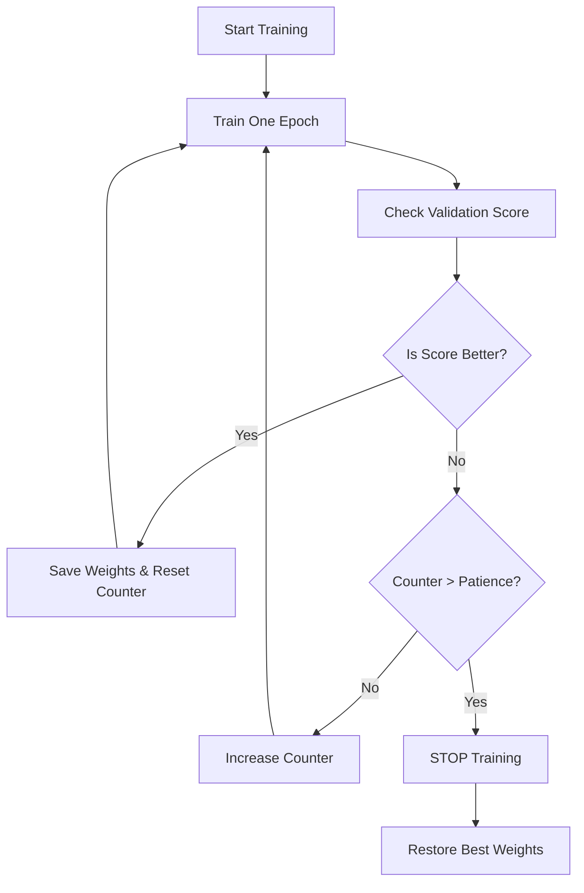

# 📚 Concepts Explained: The Medical Student's Brain

This document explains the core concepts used in our Medical Risk Classifier. We compare the AI model to a medical student learning to diagnose patients.

---

## 1. Early Stopping (The Strict Teacher)

### 1️⃣ Definition
Early Stopping is a technique where we monitor the model's performance on a validation set (mock exam) during simple training. If the model stops improving, we stop training immediately.

### 2️⃣ Why it is used
To prevent **Overfitting**. If a student keeps studying the same textbook for too long, they start memorizing page numbers instead of understanding concepts. Early stopping prevents this.

### 3️⃣ When to use it
- When training iterative models (Neural Networks, Gradient Boosting).
- When you don't know exactly how many "epochs" (study sessions) you need.

### 4️⃣ Where to use it
- Almost EVERY deep learning training pipeline.
- Used in Keras via `callbacks.EarlyStopping`.

### 5️⃣ Is this the only way?
| Method | Description | Pros | Cons |
| :--- | :--- | :--- | :--- |
| **Early Stopping** | Stop when validation metric stalls. | Automatic, saves time. | Might stop too early if noise exists. |
| **Fixed Epochs** | Train for exactly 100 epochs. | Simple. | Risk of underfitting or overfitting. |
| **Regularization** | Add math penalties (L1/L2). | Improvements generalization. | Doesn't stop training time. |

### 6️⃣ Explanation with Diagram


### 7️⃣ How to use it
```python
early_stop = callbacks.EarlyStopping(
    monitor='val_loss', 
    patience=4, 
    restore_best_weights=True
)
```
- `patience=4`: Allow 4 bad epochs before quitting.

### 8️⃣ How it works internally
It stores the "best score seen so far". At end of each epoch, it compares current score to best. If worse, it increments a counter. If counter hits `patience`, it calls `model.stop_training = True`.

### 9️⃣ Visual Summary
- **Goal:** Stop at peak performance.
- **Trigger:** Validation loss flattens or rises.
- **Safety Net:** `restore_best_weights=True` ensures we keep the best model, not the last one.

### 10️⃣ Advantages
- **Prevents Overfitting:** Major benefit.
- **Saves Time:** Why train for 100 hours if 10 is enough?
- **Saves Energy:** Less GPU usage.

### 11️⃣ Disadvantages / Limitations
- **Sensitive to Noise:** A temporary dip in performance might trigger it too soon.
- **Requires Validation Data:** You must set aside data for checking.

### 12️⃣ Exam & Interview Points
- **Q:** Why use `restore_best_weights`?
- **A:** Because the *last* model state might be worse than the *best* state if we waited for patience to run out.

---

## 2. Weight Decay / L2 Regularization (The Simplicity Rule)

### 1️⃣ Definition
A technique that adds a penalty to the loss function proportional to the size of the weights (squared).

### 2️⃣ Why it is used
To force the model to keep its "explanations" simple. Complex models (large weights) tend to overfit.

### 3️⃣ When to use it
- Small datasets.
- When model capacity (number of neurons) is large compared to data size.

### 4️⃣ Where to use it
- Added to layers in Neural Networks (`kernel_regularizer`).
- Standard in Linear/Logistic Regression (Ridge Regression).

### 5️⃣ Is this the only way?
| Method | Description | Difference |
| :--- | :--- | :--- |
| **L2 (Ridge)** | Penalty on Squared Weights. | Encourages small weights. Good for preventing overfitting. |
| **L1 (Lasso)** | Penalty on Absolute Weights. | Encourages ZERO weights (Feature Selection). |
| **Dropout** | Randomly turn off neurons. | Different mechanism, similar goal. |

### 6️⃣ Explanation with Diagram
Think of a curve fitting:
- **Low Decay:** Wobbly line hitting every point (Overfit).
- **High Decay:** Straight line (flatter), missing some points (Underfit).
- **Optimal Decay:** Smooth curve capturing the trend.

```mermaid
graph LR
    A[Loss Function] --> B{Calculate Error}
    B --> C[Add Penalty (Lambda * Weights^2)]
    C --> D[Total Loss Used for Updates]
```

### 7️⃣ How to use it
```python
layers.Dense(64, kernel_regularizer=regularizers.l2(0.001))
```

### 8️⃣ How it works internally
In gradient descent, when updating weights:
`New_Weight = Old_Weight - (Learning_Rate * Gradient) - (Decay_Rate * Old_Weight)`
It literally "decays" or shrinks the weight slightly at every step.

### 9️⃣ Visual Summary
- **Big Weights** = Complex, spikes Model.
- **Small Weights** = Smooth, general Model.
- **L2** pushes weights towards zero but rarely *exactly* zero.

### 10️⃣ Advantages
- **Robustness:** Small shifts in input don't cause huge shifts in output.
- **Generalization:** Works better on new data.

### 11️⃣ Disadvantages / Limitations
- **Hyperparameter:** You have to tune the decay rate (e.g., 1e-3 vs 1e-4).
- **Computation:** Slight overhead (negligible).

### 12️⃣ Exam & Interview Points
- **Q:** Difference between L1 and L2?
- **A:** L1 makes weights zero (sparsity), L2 makes them small (smoothness).

---

## 3. Stratified Train-Test Split (The Fair Lottery)

### 1️⃣ Definition
A way of splitting data where the percentage of samples for each class is preserved.

### 2️⃣ Why it is used
If 10% of patients have cancer, our training set AND test set should both have ~10% cancer cases. Random splitting might give the Train set 15% and Test set 0%, which is a disaster.

### 3️⃣ When to use it
- **ALWAYS** for classification tasks.
- Critical for Imbalanced Datasets (Fraud, Rare Diseases).

### 7️⃣ How to use it
```python
train_test_split(X, y, stratify=y)
```

### 10️⃣ Advantages
- **Representative:** Ensures evaluation is fair.
- **Stable:** Reduces variance in performance metrics.

---
## Jargon Glossary (For a 10-Year-Old)

- **Epoch:** One full read-through of the entire textbook (dataset).
- **Batch:** One page of the textbook read at a time.
- **Loss:** A score of how BAD the model is. Lower is better.
- **Accuracy:** The percentage of answers the model got right.
- **Weights:** The "strength" of connections in the brain. Stronger weights = more importance.
