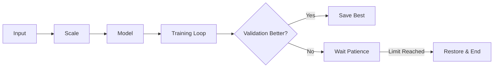

# ⚡ Interview Preparation: Quick Revision Sheet

## ⏱️ 30-Second Summary
- **Goal:** Train a Neural Network to detect Breast Cancer.
- **Problem:** Neural Networks are too smart; they memorize data (Overfitting).
- **Solution 1:** **Early Stopping** (Stop training when Validation Score drops).
- **Solution 2:** **Weight Decay (L2)** (Force weights to be small/simple).
- **Result:** A model that generalizes well to new patients.

---

## 🔑 Key Terms Glossary

| Term | Simple Definition | Analogy |
| :--- | :--- | :--- |
| **Overfitting** | Memorizing training data perfectly but failing new data. | Memorizing the answer key. |
| **Early Stopping** | Stopping training when improvement stalls. | Oven timer for cookies. |
| **Weight Decay** | Penalizing complex models to keep them simple. | "Keep it simple" rule. |
| **Epoch** | One full pass through the dataset. | Reading the textbook once. |
| **Validation Set** | Data used to check progress, not to train. | The Mock Exam. |

---

## 🆚 Comparison: Overfitting vs. Good Model

| Feature | Overfit Model | Good Model (Regularized) |
| :--- | :--- | :--- |
| **Training Accuracy** | 99.9% (Perfect) | 96% (Good) |
| **Test Accuracy** | 70% (Bad) | 95% (Good) |
| **Weights** | Huge (e.g., 500, -200) | Small (e.g., 0.1, -0.2) |
| **Decision Boundary** | Wobbly, crazy shapes | Smooth curve |

---

## 🏆 Top 5 Interview Questions

1.  **Why do we need a Validation Set?**
    *To have an unbiased "Mock Exam" for Early Stopping.*
2.  **What does L2 Regularization do to the weights?**
    *Pushes them towards zero (decays them).*
3.  **Why is `restore_best_weights=True` important?**
    *Because the model at the very end might be worse than the model 5 epochs ago.*
4.  **How does Scaling help L2 Regularization?**
    *Ensures all features are penalized equally.*
5.  **Can Early Stopping hurt performance?**
    *Yes, if `patience` is too low (stops too soon).*

---

## 🖼️ Visual Workflow

