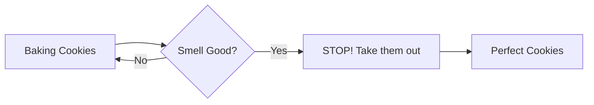

# 🎤 Interview Questions: Early Stopping & Regularization

## 🐣 Beginner Level (The "Explain Like I'm 10" Questions)

### Q1: Why did we stop training early? Why not just let it run forever?
**10-Year-Old Answer:** Imagine you are baking cookies. If you leave them in the oven too long, they burn. Early Stopping is like taking the cookies out exactly when they are golden brown, not burnt.
**Real-Life Analogy:** Stopping studying when you know the answers, so you don't start overthinking and getting confused.
**Diagram:**

### Q2: What is "Weight Decay"? It sounds scary!
**10-Year-Old Answer:** It's just a rule that says "Keep it simple." If you tell a lie, you have to remember a complicated story. If you tell the truth, it's simple. Weight Decay forces the computer to tell the simple truth.
**Real-Life Analogy:** A teacher telling you "Write the shortest answer possible."

---

## 👨‍💻 Technical Level (The "Hire Me" Questions)

### Q3: How does L2 Regularization (Weight Decay) actually prevent overfitting?
**Technical Answer:** L2 regularization adds a penalty term ($\lambda \sum w^2$) to the loss function. This forces the model to minimize not just the error, but also the magnitude of the weights. Smaller weights lead to a smoother decision boundary, reducing the model's sensitivity to noise in the training data.
**Key Point:** It trades a little bit of training bias for a huge reduction in variance (better generalization).

### Q4: Explain the `patience` parameter in Early Stopping.
**Technical Answer:** `patience` is the number of epochs to wait after the validation metric stops improving before actually stopping.
**Why it matters:** Validation loss is noisy. It might go up for 1 epoch and then down again. If `patience=0`, we might stop prematurely at a local bump. `patience=4` gives the model a chance to recover.

### Q5: What happens if I set `restore_best_weights=False`?
**Technical Answer:** The model will keep the weights from the *very last* epoch it ran. Since we waited `patience` epochs *after* the best point, these last weights are essentially "overcooked" or suboptimal. ALWAYS set it to `True`.

### Q6: Why did we scale the data?
**Technical Answer:** Gradient descent converges faster when features are on similar scales. Also, since L2 regularization penalizes weights, unscaled features (like "Area=1000") would require tiny weights compared to small features (like "Symmetry=0.1"), leading to uneven regularization penalties.

---

## ⚠️ Common Mistakes (The "Don't Do This" List)

1.  **Forgetting to Validated:** You CANNOT use Early Stopping without a validation set. The model needs a "Mock Exam" to know how it's doing.
2.  **Patience too small:** Stopping at the first sign of trouble (patience=0 or 1) often misses the global minimum.
3.  **Applying scaler to Target:** We usually scale inputs (X), not the output labels (y), especially in classification.

## 🧠 Memory Hook
- **Early Stopping** = "The oven timer."
- **Weight Decay** = "The keep-it-simple rule."
- **Validation Set** = "The mock exam."
