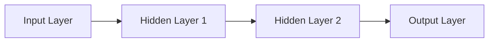

# 📚 Concepts Explained

## 1. Regression (The Task)

### 1. Definition
Regression is a way to predict a **continuous number** (like temperature, price, or height) based on input data. It answers "How much?" or "How many?".

### 2. Why it is used
To predict future values or estimate unknown quantities where the answer isn't just "Yes/No" or "Cat/Dog".

### 3. When to use it
- Predicting house prices based on size and location.
- Estimating the time a delivery will take.
- Forecasting stock market prices.

### 4. Where to use it
- **Finance**: Stock price prediction.
- **Healthcare**: Predicting patient recovery time.
- **Real Estate**: Estimating property value.

### 5. Is this the only way?
| Method | Description | Best For |
| :--- | :--- | :--- |
| **Regression** | Predicts a number. | Continuous values. |
| **Classification** | Predicts a category (Label). | Discrete groups. |
| **Clustering** | Groups similar items. | Unknown structure. |

### 6. Explanation with Diagram
```mermaid
graph LR
    A[Input: House Size] --> B[Model: Pattern Finder]
    B --> C[Output: Price ($500k)]
```

### 7. How to use it
```python
# Simple Linear Regression
model = LinearRegression()
model.fit(X_train, y_train)
prediction = model.predict(X_new)
```

### 8. How it works internally
The model tries to draw a line (or curve) that passes as close as possible to all data points. It minimizes the distance (error) between the line and the points.

### 9. Visual Summary
*   **Input**: Numbers (Features)
*   **Action**: Mathematics (Weights * Features + Bias)
*   **Output**: A specific Number

### 10. Advantages
*   Simple to understand (especially linear regression).
*   Gives precise estimates.

### 11. Disadvantages / Limitations
*   Can be sensitive to outliers (extreme values).
*   Complex patterns require complex models (Neural Networks).

### 12. Exam & Interview Points
*   **Q:** What is the difference between Regression and Classification?
*   **A:** Regression predicts a quantity (continuous); Classification predicts a label (discrete).

---

## 2. MLP (Multi-Layer Perceptron)

### 1. Definition
An MLP is a simple type of **Neural Network**. It consists of layers of "neurons" stacked together to learn complex patterns. It's like a team of decision-makers passing information forward.

### 2. Why it is used
To solve problems that are too complex for a simple straight line (Linear Regression). It can learn "curvy" and non-linear relationships.

### 3. When to use it
- When tabular data has complex interactions.
- Simple image or text classification tasks (though CNNs/Transformers are better there).

### 4. Where to use it
- **Credit Scoring**: Predicting risk based on many factors.
- **Simple Control Systems**: Robot arm movement.

### 5. Is this the only way?
No. You could use Random Forests, SVMs, or Gradient Boosting (XGBoost). MLPs are used when we want to leverage Deep Learning frameworks or learn representations.

### 6. Explanation with Diagram


### 7. How to use it (PyTorch)
```python
model = nn.Sequential(
    nn.Linear(10, 5), # Input -> Hidden
    nn.ReLU(),
    nn.Linear(5, 1)   # Hidden -> Output
)
```

### 8. How it works internally
1.  **Inputs** are multiplied by **Weights**.
2.  **Bias** is added.
3.  **Activation Function** (ReLU) decides if the neuron "fires".
4.  Process repeats for next layer.

### 9. Visual Summary
*   **Structure**: Input $\to$ Hidden $\to$ Output
*   **Function**: Universal Approximator (can learn almost any shape).

### 10. Advantages
*   Can learn very complex non-linear relationships.
*   Basis for Deep Learning.

### 11. Disadvantages / Limitations
*   Prone to **Overfitting** (memorizing data).
*   Hard to interpret ("Black Box").
*   Requires data scaling.

### 12. Exam & Interview Points
*   **Q:** Why do we need hidden layers?
*   **A:** To learn non-linear features and complex patterns.

---

## 3. SGD (Stochastic Gradient Descent) vs Adam

### 1. Definition
*   **SGD**: A simple optimization algorithm that updates weights using the gradient of a small batch of data. (The "Careful Hiker").
*   **Adam**: Adaptive Moment Estimation. It adjusts the learning rate for each parameter individually. (The "Smart Hiker" who adapts speed).

### 2. Why it is used
To minimize the Loss Function (Error). They guide the model to finding the best weights.

### 3. When to use it
*   **SGD**: When you need stability and potentially better final generalization (with tuning).
*   **Adam**: When you want fast convergence and less tuning (works well "out of the box").

### 4. Where to use it
*   **SGD**: Computer Vision (ResNets often use SGD + Momentum).
*   **Adam**: NLP (Transformers), general Deep Learning.

### 5. Is this the only way?
There are others: RMSprop, Adagrad, LBFGS (for small data).

### 6. Explanation with Diagram
```mermaid
graph TD
    A[Start on Mountain] --> B{Choose Guide}
    B -->|SGD| C[Fixed Steps Down]
    B -->|Adam| D[Adaptive Steps (Fast then Slow)]
    C --> E[Goal: Valley Bottom]
    D --> E
```

### 7. How to use it
```python
optimizer_sgd = optim.SGD(model.parameters(), lr=0.01)
optimizer_adam = optim.Adam(model.parameters(), lr=0.001)
```

### 8. How it works internally
*   **SGD**: $w = w - lr \times gradient$. Moves opposite to slope.
*   **Adam**: Keeps track of momentum (speed) and variance (volatility) to scale the step size for each weight.

### 9. Visual Summary
*   **SGD**: Consistent, sometimes slow, can get stuck in shallow valleys.
*   **Adam**: Fast start, sometimes overshoots, usually converges quicker.

### 10. Advantages
*   **SGD**: Better generalization often seen in research.
*   **Adam**: Fast, requires little tuning.

### 11. Disadvantages / Limitations
*   **SGD**: Slow convergence without Momentum. Hard to pick metrics.
*   **Adam**: Can fail to converge to the absolute best solution in some convex problems; generalization gap.

### 12. Exam & Interview Points
*   **Q:** Why is Adam often preferred over SGD?
*   **A:** It converges faster and handles sparse gradients better due to adaptive learning rates.

---
## Jargon Glossary

*   **Epoch**: One complete pass through the entire training dataset.
*   **Batch**: A small chunk of data processed at once.
*   **Learning Rate**: The size of the step the optimizer takes.
*   **Loss Function**: A measure of how "wrong" the model is.
*   **Overfitting**: When the model learns the training data too well but fails on new data.
