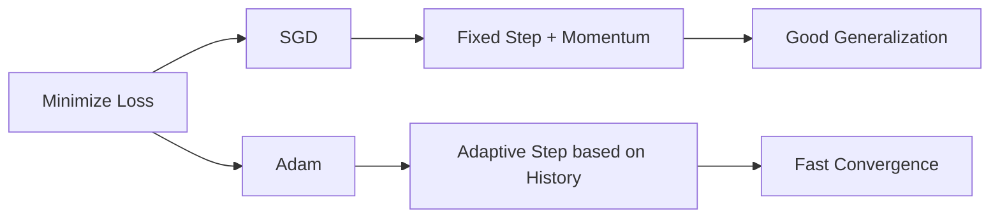

# 📋 Interview Preparation (Quick Sheet)

## ⏱️ 30-Second Summary
This project compares **SGD (Stochastic Gradient Descent)** and **Adam** optimizers on a regression task. We found that **Adam** usually converges faster initially because it adapts learning rates, while **SGD** is more stable and often generalizes better in the long run. We used a 3-layer MLP on a synthetic dataset.

## 🔑 Key Terms Glossary
*   **Optimizer**: Algorithm that updates weights.
*   **Loss Function**: Measures error (e.g., MSE).
*   **Learning Rate**: Step size of the optimizer.
*   **Epoch**: One pass through full data.
*   **Convergence**: Reaching the lowest error.

## 🔟 Top 10 Points to Remember
1.  **Adam** = Fast, Adaptive, Good default.
2.  **SGD** = Simple, Stable, Better Generalization (often).
3.  **Momentum** = Helps SGD get unstuck.
4.  **ReLU** = Fast non-linear activation.
5.  **Scaling** = Crucial for SGD (StandardScaler).
6.  **Loss Plateau** = Learning stalled (change LR or Optimizer).
7.  **Seed** = Necessary for fair comparison.
8.  **Validation Set** = Used to tune hyperparameters.
9.  **RMSE** = Root Mean Squared Error (interpretable units).
10. **Batch Size** = Trade-off between speed and stability.

## 🆚 Comparison Table

| Feature | SGD | Adam |
| :--- | :--- | :--- |
| **Speed** | Slower start | Fast start |
| **Learning Rate** | Fixed (mostly) | Adaptive |
| **Memory** | Low | High (stores states) |
| **Generalization** | Excellent | Good |
| **Tuning Needed** | High | Low |

## 🧠 Mermaid Concept Map


## 📜 Cheat Sheet Codes
```python
# SGD
optimizer = optim.SGD(model.parameters(), lr=0.01, momentum=0.9)

# Adam
optimizer = optim.Adam(model.parameters(), lr=0.001)

# Training Step
optimizer.zero_grad()
loss.backward()
optimizer.step()
```
