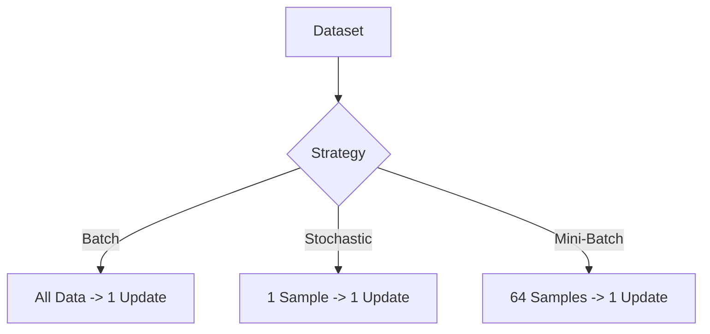

# 🎤 Interview Questions

## 1. Basic Concepts

### Q1: What is an Optimizer in Neural Networks?
*   **Simple Answer**: It's the "Guide" that tells the model how to change its weights to reduce errors.
*   **Technical Answer**: An algorithm that updates model parameters based on gradients to minimize the loss function.
*   **Real-Life Analogy**: A hiker trying to find the bottom of a valley in fog. The optimizer decides which way to step and how big the step should be.
*   **Mistake to Avoid**: Thinking the optimizer calculates the error (the Loss Function does that).

### Q2: What is the difference between Batch, Stochastic, and Mini-Batch Gradient Descent?
*   **Simple Answer**:
    *   **Batch**: Uses ALL data for one step (Slow, accurate).
    *   **Stochastic**: Uses ONE item for one step (Fast, wobble).
    *   **Mini-Batch**: Uses a SMALL GROUP (e.g., 64) for one step (Best of both).
*   **Diagram**:

## 2. SGD vs Adam

### Q3: Why does Adam usually converge faster than SGD?
*   **Answer**: Adam adapts the learning rate for *each parameter*. If a parameter needs large updates, Adam increases the step size. If it needs precise tuning, Adam decreases it. SGD uses the same step size for everyone (unless manually tuned).
*   **Key Point**: Adam uses "Momentum" + "RMSprop" logic.

### Q4: When would you prefer SGD over Adam?
*   **Answer**: When you want the absolute best generalization (performance on new data). Research shows SGD + Momentum often finds "flatter" minima which generalize better than the sharp minima Adam might find.

### Q5: What is "Momentum" in SGD?
*   **Simple Answer**: Think of a heavy ball rolling down a hill. Even if the slope changes slightly, the ball keeps moving in the same direction because of its weight/momentum. It helps the optimizer go through flat areas and not get stuck in small divots.

## 3. Project Specific

### Q6: Why did we standardize the data (StandardScaler)?
*   **Answer**: To make all features have a mean of 0 and variance of 1. This makes the "error surface" rounder, allowing SGD to descend straight towards the minimum rather than zigzagging.

### Q7: What does `torch.manual_seed(42)` do?
*   **Answer**: It ensures that the random initial weights of the neural network are the same every time we run the code. This is crucial for comparing two optimizers fairly—they must start from the exact same point.

### Q8: What implies that the model has "Plateaued"?
*   **Answer**: When the Training Loss or Validation Loss stops decreasing and stays flat for many epochs. It means the model has stopped learning.

### Q9: Why use ReLU activation?
*   **Answer**: It introduces non-linearity (allowing the model to learn curved patterns) and is computationally very fast. It also helps avoid the "vanishing gradient" problem compared to Sigmoid.

### Q10: Interpretation of Output
*   **Q:** If Adam has lower training loss but higher validation loss than SGD, what is happening?
*   **A:** Overfitting. Adam learned the training data too well (memorized noise) but failed to generalize. SGD might have learned the general patterns better.
