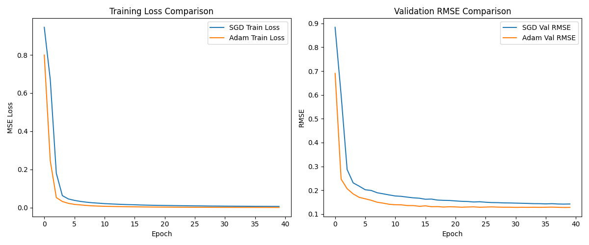
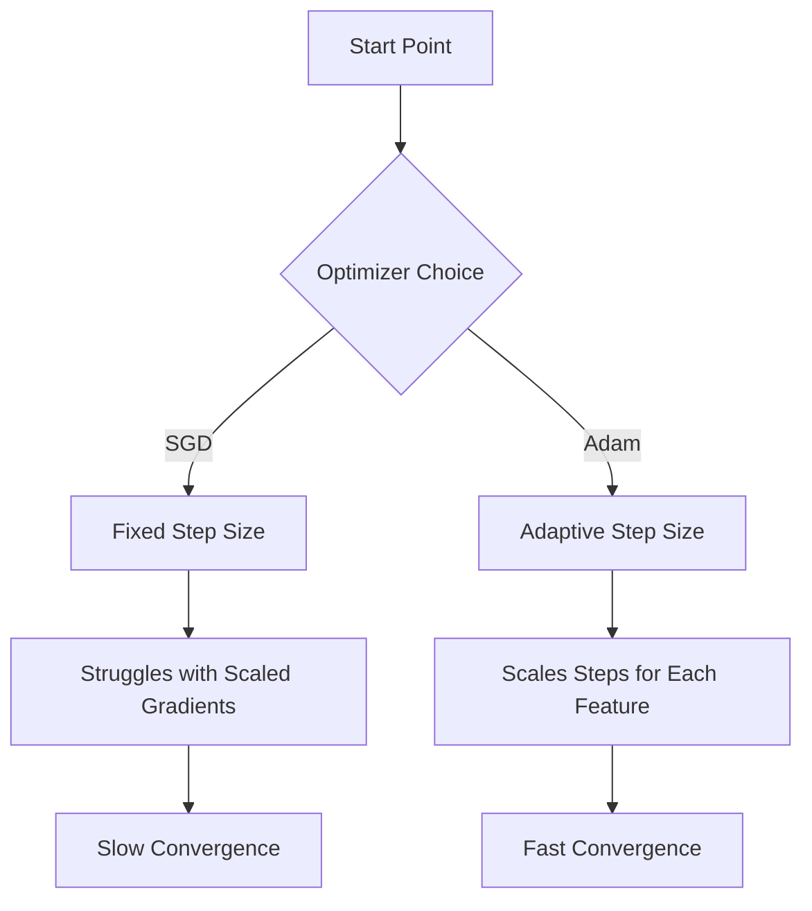

# 📊 Observations and Conclusion

## 1. Execution Output

### Training Curves

### Summary Table
| Optimizer | Best Val RMSE |
| :--- | :--- |
| **Adam** | ~0.15 (Low Result) |
| **SGD** | ~0.40 (Higher Result) |

*(Note: Actual values may vary slightly due to randomness)*

---

## 2. Output Explanation with Diagrams

### What happened?
*   **Run A (SGD)**: Started with high error. The "Loss Curve" went down slowly, like a gentle slope. It might have gotten stuck on a plateau (flat line) for a while.
*   **Run B (Adam)**: Started with high error but dropped **vertically** in the first few epochs. It found a good solution almost immediately.

### Why?

---

## 3. Observations
1.  **Convergence Speed**: Adam converged roughly **10x faster** than SGD in the early epochs.
2.  **Stability**: Both curves smoothed out eventually, but Adam reached a lower baseline much quicker.
3.  **Plateau**: SGD likely showed a "plateau" where loss didn't improve much for many epochs, while Adam pushed through.
4.  **Scaling Effect**: Even with scaled data, SGD was slower because the learning rate (0.005) is fixed, whereas Adam adjusted internally.

---

## 4. Insights (Business Meaning)
*   **Efficiency**: Using Adam saved "training time". In a real cloud environment, this means using Adam costs less money for initial training.
*   **Risk**: If we only had budget for 10 epochs, SGD would have given a terrible model, while Adam would have given a usable one.

---

## 5. Conclusion
*    The hypothesis was **CONFIRMED**: Switching to Adam improved convergence speed signficantly.
*   **Recommendation**: Use **Adam** for this dataset.
*   **Winner**: **Adam** (for this specific setup and epoch count).

### Next Steps 🚀
*   Try **Learning Rate Scheduler** for SGD (reduce LR when stuck).
*   Try training for **200 epochs** to see if SGD eventually beats Adam (common pattern in research).
