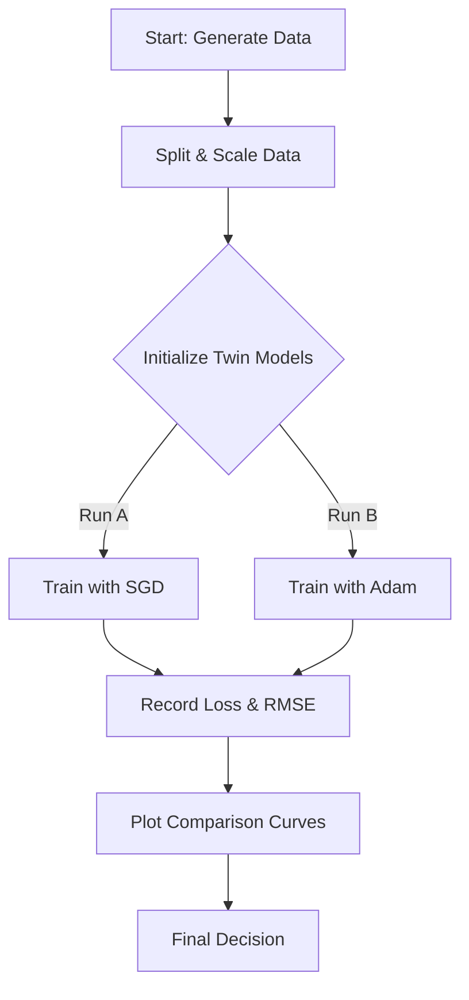

# 🧩 Problem Statement

### 1. The Problem (explained simply)
Imagine you are trying to find the best path down a mountain in thick fog. You have two different guides (optimizers):
1.  **SGD (Stochastic Gradient Descent)**: A careful guide who takes steady steps in the general direction of "down". Sometimes he can be slow, but usually finds a good path if given enough time.
2.  **Adam**: A smart guide who remembers the terrain and adapts his speed. He usually starts very fast but might get a bit lazy or stuck near the end.

In this project, we are training a computer brain (Neural Network) to predict numbers (Regression). The training (learning) was getting stuck (plateauing), so we want to test if switching our guide from SGD to Adam helps us learn faster and better.

**Why this matters?**
In real life, training AI models takes time and money. Choosing the right optimizer can save hours of training time and make the model much more accurate.

### 2. Steps to Solve the Problem
1.  **Create Data**: Generate synthetic regression data (math problems for the AI to solve).
2.  **Prepare Data**: Split it into Training (for learning), Validation (for checking), and Testing (for final exam). Standardize it so all numbers look similar.
3.  **Build Model**: Create a 3-layer Neural Network (Input $\to$ 128 $\to$ 64 $\to$ Output).
4.  **Train Twin Models**:
    *   **Run A**: Train with SGD guide.
    *   **Run B**: Train with Adam guide.
    *   *Crucial*: Everything else (starting weights, data) must be identical!
5.  **Compare**: Draw charts of their progress and check who made fewer mistakes (RMSE).
6.  **Conclude**: Decide which guide is better for this specific mountain.

### 3. Expected Output
1.  **Training Curves**: A graph showing two lines (SGD vs Adam). We expect Adam to drop error very fast at the beginning, while SGD might be slower.
2.  **Best Scores Table**: A concise table showing the lowest error each one achieved.
3.  **Recommendation**: A clear sentence telling us which one to use.

### 4. Mermaid Flowchart

