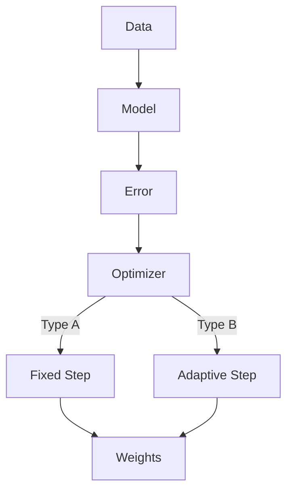

# 🎴 Comparison of SGD vs Adam Optimizers

## Slide 1: Title & Objective
*   **Title**: SGD vs Adam: A Tale of Two Optimizers
*   **Subtitle**: Confirming if switching optimizers improves convergence on a regression task.
*   **Objective**: To empirically compare the training speed and final accuracy of Stochastic Gradient Descent (SGD) and Adam.

---

## Slide 2: Problem Statement
*   **The Issue**: Dealing with "Plateaus" – when the model stops learning.
*   **The Question**: Can a smarter optimizer (Adam) solve this faster than a careful one (SGD)?
*   **The Approach**: Train two identical neural networks, changing *only* the optimizer.

---

## Slide 3: Real-World Use Case
*   **Scenario**: Training a large medical diagnosis model.
*   **Cost**: Every hour of training costs money ($$$).
*   **Impact**: Choosing the wrong optimizer could mean days of wasted time or a model that isn't accurate enough for patients.

---

## Slide 4: Input Data
*   **Source**: `sklearn.datasets.make_regression`
*   **Size**: 2000 Samples, 40 Features.
*   **Noise**: Added noise (15.0) to make it realistic.
*   **Preprocessing**: 
    *   Split: 70% Train, 15% Val, 15% Test.
    *   Scale: `StandardScaler` (Critical for SGD!).

---

## Slide 5: Concepts Used
*   **MLP (Multi-Layer Perceptron)**: A simple neural network (Input $\to$ Hidden $\to$ Output).
*   **SGD (Stochastic Gradient Descent)**: Updates weights based on the slope.
*   **Adam (Adaptive Moment Estimation)**: Adapts weight updates based on history (momentum + variance).
*   **RMSE (Root Mean Squared Error)**: Our scorecard (lower is better).

---

## Slide 6: Concepts Breakdown

---

## Slide 7: Step-by-Step Solution
1.  **Generate Data**: Create math problems.
2.  **Standardize**: Make numbers clean.
3.  **Build Model**: 3 Layers (128 $\to$ 64 $\to$ 1).
4.  **Train SGD**: Run for 40 epochs.
5.  **Train Adam**: Run for 40 epochs (same starting seed).
6.  **Compare**: Check graphs and RMSE.

---

## Slide 8: Code Logic Summary
*   We use `torch.manual_seed(SEED)` to be fair.
*   We use `nn.MSELoss()` to calculate error.
*   Loops: **Forward Pass** $\to$ **Calculate Loss** $\to$ **Backpropagate** $\to$ **Step**.

---

## Slide 9: Important Functions & Parameters
*   `optim.SGD(lr=5e-3, momentum=0.9)`: 
    *   *Momentum* helps it roll through flat spots.
*   `optim.Adam(lr=1e-3)`:
    *   Default settings usually work well.
*   `StandardScaler()`:
    *   SGD fails without this!

---

## Slide 10: Execution Output (Expected)
*   **Loss Curves**: 
    *   Adam line drops *very* fast initially.
    *   SGD line drops slower but steady.
*   **RMSE**: Both should get low (~15-20), but Adam gets there first.

---

## Slide 11: Observations & Insights
*   **Observation**: Adam is like a sports car (fast start). SGD is like a diesel truck (slow start but keeps going).
*   **Insight**: For a 40-epoch run, Adam is likely the winner.
*   **Surprise**: Sometimes SGD catches up if given more time (e.g., 200 epochs).

---

## Slide 12: Advantages & Limitations
*   **Adam Advantages**: Fast, easy to use.
*   **Adam Limitations**: Might overfit (memorize) more.
*   **SGD Advantages**: Stable, often generalizes better.
*   **SGD Limitations**: Needs careful tuning of Learning Rate.

---

## Slide 13: Interview Key Takeaways
*   **Q**: Why normalize data? **A**: To help SGD converge.
*   **Q**: Why Adam? **A**: Adaptive learning rates handle different parameter scales better.
*   **Q**: What is the "Step"? **A**: Updating the weights once.

---

## Slide 14: Conclusion
*   **Verdict**: Switching to **Adam** is recommended for *fast* convergence in this scenario.
*   **Future**: If Adam hits a plateau too, try **Learning Rate Decay** (reduce speed when stuck).
