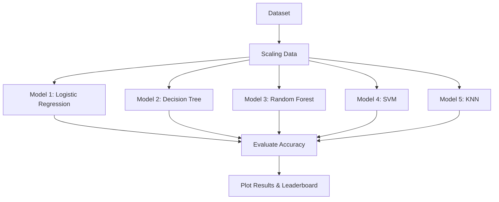

# 🧩 Problem Statement: The Ultimate Model Face-Off

### 1. Problem Statement
In the world of Machine Learning, choosing the right "brain" (algorithm) for your problem is the most important decision. There are many different types of brains: some are fast, some are smart, and some are simple. 

Wait, if we have so many options like **Logistic Regression**, **Decision Trees**, and **Random Forest**, which one should we use? 

The problem is that we don't know which model works best for a given set of data unless we compare them side-by-side on the same "playing field" (dataset).

### 2. Real-World Analogy: Selecting a Sports Team
Imagine you are a coach picking players for a team:
- **Logistic Regression** is like a player who follows a strict manual (Mathematical formula).
- **Decision Tree** is like a player who follows a flow-chart of "if-then" rules.
- **Random Forest** is a committee of 100 players who vote on every move.
- **SVM** is a player who tries to find the perfect "border" between teams.
- **KNN** is a player who just looks at what their neighbors are doing.

To find the best player, you have a **Tryout** (Experiment). You give everyone the same tasks and see who scores the highest!

### 3. Steps to Solve
1. **Load the Data**: Get a standard dataset (like the Breast Cancer dataset).
2. **Preprocess**: Clean the data and scale it (so every model gets a fair chance).
3. **Train the Models**: Teach all 5 models (LR, DT, RF, SVM, KNN) the same data.
4. **Evaluate**: Test them on new data.
5. **Compare**: Create a leaderboard based on Accuracy, Precision, and Recall.

### 4. Expected Output
A comprehensive comparison table and a "Leaderboard" chart showing which model is the champion for this specific dataset.

---

### 📊 Success Criteria
- [ ] All 5 models are trained successfully.
- [ ] Comparison table is generated.
- [ ] Results show which model is most accurate.

---

### 📉 Flow Diagram

