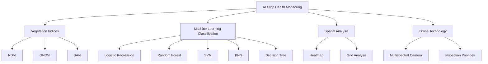
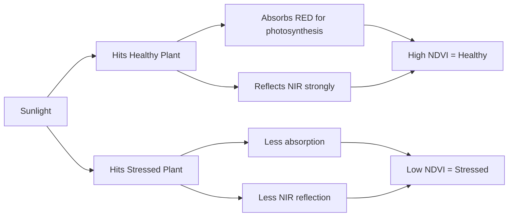
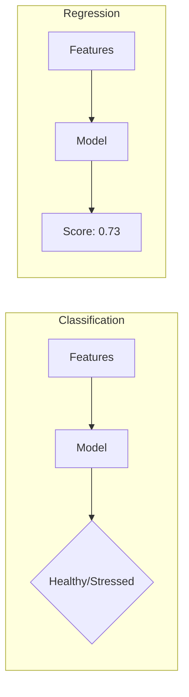
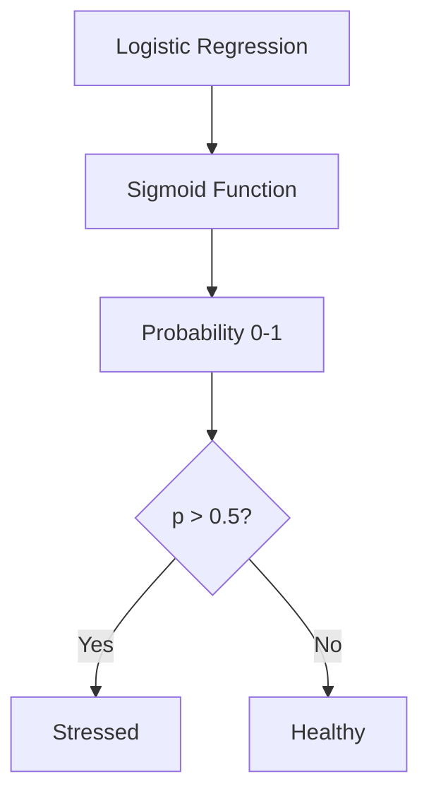

# 🏫 Classroom Simulation: AI-Based Crop Health Monitoring

## Topic Mind Map



---

## 📚 Classroom Dialogue (Telglish)

---

### Introduction

**👨‍🏫 Teacher:** Namaskaram students! Ippudu manam chala interesting topic chaduvukundaam - **AI-Based Crop Health Monitoring**. Idi agriculture lo revolution create chestundi. Meeru ready ga?

**👦 Beginner Student:** Sir, AI ante enti? Adi plants ki enti relation?

**👨‍🏫 Teacher:** Chala manchidi question! AI ante **Artificial Intelligence** - manushulu laaga think cheyagallige computer programs. Plants ki relation enti ante - manam drones use chesi plants photos teesukuntaam, AI analyze chesi healthy or stressed ani cheptundi.

**Real-Life Analogy:**
Doctor ki blood test results ichhinappudu, doctor chustadu - "Ah, BP high undi, sugar low undi" ani. Same way, drone photos teeskoni AI cheptundi - "Ee plant stressed undi, ee plant healthy undi!"

---

### Concept 1: NDVI (Vegetation Index)

**👨‍🏫 Teacher:** First concept - **NDVI (Normalized Difference Vegetation Index)**. Idi plants ki health score laanti.

**Formula:**
```
NDVI = (NIR - Red) / (NIR + Red)
```

**🧠 Clever Student:** Sir, NIR ante Near-Infrared kadha? Healthy plants ento doola NIR reflect chestaayi?

**👨‍🏫 Teacher:** Exactly! Healthy plants chlorophyll use chesi Red light absorb chestaayi photosynthesis kosam, but NIR light reflect chestaayi. Cell structure robust unte NIR reflection ekkuva. Idi chala important point!



**👦 Beginner Student:** Sir, range enti? 0 to 100 aa?

**👨‍🏫 Teacher:** Kaadu ra! NDVI range: **-1 to +1**
- **+1**: Very healthy, dense vegetation
- **0.5**: Moderate health
- **0**: No vegetation (bare soil)
- **-1**: Water bodies

**Numerical Example:**
Oka plant NIR = 0.8, Red = 0.1 give chesthe:
```
NDVI = (0.8 - 0.1) / (0.8 + 0.1) = 0.7 / 0.9 = 0.78
```
0.78 ante healthy plant! Arthama?

**💡 Curious Student:** Sir, only NDVI use chestama? Vere indices undaya?

**👨‍🏫 Teacher:** Excellent question! Chala indices untaayi:
- **GNDVI**: Green band use chestundi - chlorophyll content kosam
- **SAVI**: Soil-Adjusted - sparse vegetation areas lo better
- **EVI**: Enhanced - dense canopy lo saturation problem avoid chestundi

---

### Concept 2: Classification vs Regression

**⚔️ Debate Student:** Sir, enti classification use cheyyali? Regression vadite exact health score ivvochu kada?

**👨‍🏫 Teacher:** Manchidi point! But manam problem chuddam:
- **Classification**: "Is this Healthy or Stressed?" - Categories
- **Regression**: "What is the exact health score (0.73)?" - Numbers

Farmers ki easy ga understand avvalante "Healthy" or "Stressed" cheppte better. Exact 0.73 vs 0.71 difference vallaki practical ga useless!



---

### Concept 3: Train-Test Split

**👨‍🏫 Teacher:** ML lo chala important concept - **Train-Test Split**. 

**Analogy:**
Students ki textbook problems (Training) practice chesthe, exam (Testing) lo NEW questions vastaayi. Training questions lo practice chesina questions exam lo vestam ante - cheating!

Same way:
- **Training Data (80%)**: Model nerchukuntuundi
- **Testing Data (20%)**: Model ni test chestaam

**👦 Beginner Student:** Sir, 80-20 fixed aa? 70-30 vadocha?

**👨‍🏫 Teacher:** Ledu, fixed kaadu! Common splits:
- 80-20 (most common)
- 70-30 (when less data)
- 90-10 (when lots of data)

**🔍 Critique Student:** Sir, random ga split cheste class imbalance problem raadu?

**👨‍🏫 Teacher:** Aha! Ikkada `stratify` parameter use chestaam. Manam data lo 65% Healthy, 35% Stressed unte, training AND testing lo kuda same ratio maintain avutundi!

---

### Concept 4: Feature Scaling

**👨‍🏫 Teacher:** Ippudu **StandardScaler** gurinchi chuddam.

**Problem:**
- NDVI range: 0 to 1
- Moisture: 0 to 0.9
- Grid_x: 0 to 20

Different ranges untaayi! Eppudu KNN ki distance calculate chestunappudu, grid_x (0-20) dominate chestundi because bigger numbers!

**Solution - StandardScaler:**
```
z = (x - mean) / standard deviation
```

After scaling, all features have:
- Mean = 0
- Standard deviation = 1

**📋 Practical Student:** Sir, interview lo ask chestara idi?

**👨‍🏫 Teacher:** Definitely! **"Why do we need feature scaling?"** - chala common question. Answer: "Distance-based algorithms like KNN and SVM need scaled features to give equal importance to all features."

**⚠️ CRITICAL RULE:**
```python
# CORRECT
scaler.fit_transform(X_train)  # Fit on training
scaler.transform(X_test)       # Only transform test

# WRONG - Data Leakage!
scaler.fit_transform(X)  # Never fit on all data!
```

---

### Concept 5: Model Comparison (5 Models)

**👨‍🏫 Teacher:** Manam 5 models train chesaam:

| Model | Simple Explanation | Result |
|-------|-------------------|--------|
| **Logistic Regression** | Straight line boundary | 95.76% F1 🏆 |
| **Decision Tree** | Yes/No flowchart | 90.59% F1 |
| **Random Forest** | 100 trees voting | 89.57% F1 |
| **SVM** | Widest road between groups | 92.22% F1 |
| **KNN** | Ask 5 nearest neighbors | 86.96% F1 |

**🧠 Clever Student:** Sir, Logistic Regression simple model kada, ela win ayyindi complex Random Forest ni?

**👨‍🏫 Teacher:** Chala important observation! Reason:
1. Vegetation indices already **well-engineered features**
2. Class boundary is **nearly linear**
3. Simple models **don't overfit** on 1200 samples

Kabatti "Complex = Better" kaadu! **Right model for right problem** important.

**⚔️ Debate Student:** Random Forest 100 trees vote chestundi kada, adi ekkuva accurate avvalsi undhi...

**👨‍🏫 Teacher:** Theory lo correct, but:
- More trees = more variance in voting
- Small dataset (1200 samples) doesn't need such complexity
- Logistic Regression directly models probability



---

### Concept 6: Evaluation Metrics

**👨‍🏫 Teacher:** Ippudu **Precision, Recall, F1-Score** chuddam.

**Confusion Matrix:**
```
                Predicted
              Healthy    Stressed
Actual  Healthy   TN        FP
        Stressed  FN        TP
```

**👦 Beginner Student:** Sir, TN, FP, FN, TP ante enti?

**👨‍🏫 Teacher:** Simple ga cheptaa:
- **TP (True Positive)**: Actually Stressed, model "Stressed" cheppindi ✅
- **TN (True Negative)**: Actually Healthy, model "Healthy" cheppindi ✅
- **FP (False Positive)**: Actually Healthy, but model "Stressed" cheppindi ❌ (false alarm)
- **FN (False Negative)**: Actually Stressed, but model "Healthy" cheppindi ❌ (missed!)

**Formulas:**
```
Precision = TP / (TP + FP) = "When I say Stressed, am I right?"
Recall    = TP / (TP + FN) = "Of all Stressed plants, how many did I find?"
F1-Score  = 2 × (P × R) / (P + R) = Balance of both
```

**📋 Practical Student:** Sir, exam lo enni marks vestaru ivi?

**👨‍🏫 Teacher:** Chala important! 5-10 marks numerical question sure ga vastundi. Practice cheyandi formulas.

**🔍 Critique Student:** Sir, accuracy use cheste simple ga undhi kada, enti F1-Score?

**👨‍🏫 Teacher:** Class imbalance unnappudu accuracy misleading:
- 65% Healthy, 35% Stressed
- Model always says "Healthy" → 65% accuracy for free!
- But completely useless model!

F1-Score balances precision and recall, kabatti better metric.

---

### Concept 7: Spatial Analysis (Heatmap)

**👨‍🏫 Teacher:** Final concept - **Spatial Analysis**. Manam grid_x, grid_y coordinates use chesi heatmap create chestaam.

**💡 Curious Student:** Sir, heatmap endhuku? Table chudocha?

**👨‍🏫 Teacher:** Visualization power! Farmers ki table of 1200 rows ichhte confusion. But heatmap ichhte:
- 🟢 Green = Healthy
- 🔴 Red = Stressed

One look lo entire field pattern kanipistundi!

**Result from our project:**
- 361 CRITICAL zones (≥80% stress)
- 60.5% field is healthy
- Stress appears in clusters - probably water issue or pest in that area

---

### Code Walkthrough (Line-by-Line)

**👨‍🏫 Teacher:** Ippudu code chuddam step by step.

**1. Importing Libraries:**
```python
import pandas as pd        # Data tables kosam
import numpy as np         # Math operations kosam
import matplotlib.pyplot as plt  # Charts kosam
from sklearn.model_selection import train_test_split  # Data split
from sklearn.preprocessing import StandardScaler      # Scaling
```

**2. Loading Data:**
```python
df = pd.read_csv("data/crop_health_data.csv")
# df = DataFrame - Excel sheet laanti structure
# 1200 rows (grid cells), 15 columns (features + target)
```

**3. Train-Test Split:**
```python
X_train, X_test, y_train, y_test = train_test_split(
    X, y,                    # Features, Target
    test_size=0.2,          # 20% testing
    random_state=42,        # Reproducibility
    stratify=y              # Keep class ratio!
)
```

**4. Scaling:**
```python
scaler = StandardScaler()
X_train_scaled = scaler.fit_transform(X_train)  # Fit AND transform
X_test_scaled = scaler.transform(X_test)        # Only transform!
```

**5. Model Training:**
```python
model = LogisticRegression()
model.fit(X_train_scaled, y_train)  # Learning!
y_pred = model.predict(X_test_scaled)  # Predicting!
```

---

## Summary

**👨‍🏫 Teacher:** Ippudu manam cover chesina key points:

### Key Takeaways:
1. **NDVI = (NIR-Red)/(NIR+Red)** → Plant health score
2. **Stratified split** → Maintains class ratio
3. **StandardScaler** → Makes features fair
4. **Logistic Regression won** → Simple is sometimes best!
5. **F1-Score** → Better than accuracy for imbalanced data
6. **Heatmap** → Visual pattern recognition

### Common Mistakes:
1. ❌ Fitting scaler on test data (data leakage)
2. ❌ Using accuracy for imbalanced classes
3. ❌ Not stratifying train-test split
4. ❌ Assuming complex models always win

### Exam Question:
**Q:** Calculate F1-Score given TP=79, FP=2, FN=5
**A:** Precision = 79/81 = 0.975, Recall = 79/84 = 0.940, F1 = 2×(0.975×0.940)/(0.975+0.940) = 0.957

### Interview Question:
**Q:** Why did Logistic Regression beat Random Forest?
**A:** The vegetation indices are well-engineered features creating nearly linear class separation. Simpler models generalize better on small datasets (1200 samples).

---

## 📝 Assessment Section

---

## MCQ Section (10 Questions)

### Q1. What is the formula for NDVI?
- A) (Red - NIR) / (Red + NIR)
- B) **(NIR - Red) / (NIR + Red)** ✅
- C) (NIR + Red) / (NIR - Red)
- D) NIR × Red / 2

### Q2. What is the range of NDVI values?
- A) 0 to 1
- B) 0 to 100
- C) **-1 to +1** ✅
- D) -100 to +100

### Q3. Which model achieved the highest F1-Score in this project?
- A) Random Forest
- B) SVM
- C) **Logistic Regression** ✅
- D) KNN

### Q4. What does "stratify=y" do in train_test_split?
- A) Shuffles data randomly
- B) **Maintains class proportions in both sets** ✅
- C) Removes duplicates
- D) Increases dataset size

### Q5. StandardScaler transforms features to have:
- A) Range 0-1
- B) Range -1 to +1
- C) **Mean=0, Std=1** ✅
- D) No change

### Q6. What is Precision?
- A) TP / (TP + FN)
- B) **TP / (TP + FP)** ✅
- C) (TP + TN) / All
- D) 2PR / (P+R)

### Q7. F1-Score is:
- A) Average of precision and recall
- B) Product of precision and recall
- C) **Harmonic mean of precision and recall** ✅
- D) Sum of precision and recall

### Q8. Why is accuracy not suitable for imbalanced datasets?
- A) It's too complex
- B) **A model can get high accuracy by predicting majority class** ✅
- C) It doesn't work with binary classification
- D) It requires more data

### Q9. Healthy plants reflect more of which light?
- A) Red
- B) Blue
- C) **Near-Infrared (NIR)** ✅
- D) Green

### Q10. KNN is called a "lazy learner" because:
- A) It's slow
- B) **It stores all training data instead of learning patterns** ✅
- C) It uses less memory
- D) It doesn't need training data

---

### MCQ Answer Key

| Q | Answer | Explanation |
|---|--------|-------------|
| 1 | B | NDVI uses (NIR-Red)/(NIR+Red) formula |
| 2 | C | NDVI ranges from -1 (water) to +1 (dense vegetation) |
| 3 | C | Logistic Regression got 95.76% F1 |
| 4 | B | Stratify ensures same class ratio in train and test |
| 5 | C | StandardScaler normalizes to z-scores |
| 6 | B | Precision measures quality of positive predictions |
| 7 | C | F1 = 2PR/(P+R) which is harmonic mean |
| 8 | B | 65% accuracy for free just predicting "Healthy" |
| 9 | C | Healthy plants reflect NIR due to cell structure |
| 10 | B | KNN memorizes, doesn't generalize |

---

## MSQ Section (10 Questions)

### Q1. Select ALL that apply - Which are vegetation indices?
- A) ✅ NDVI
- B) ✅ GNDVI
- C) ✅ SAVI
- D) ❌ MSE

### Q2. Select ALL that apply - Feature scaling is needed for:
- A) ✅ KNN
- B) ✅ SVM
- C) ❌ Decision Tree
- D) ✅ Logistic Regression

### Q3. Select ALL that apply - Confusion matrix contains:
- A) ✅ True Positives
- B) ✅ False Negatives
- C) ✅ True Negatives
- D) ✅ False Positives

### Q4. Select ALL that apply - Why did Logistic Regression win?
- A) ✅ Well-engineered features
- B) ✅ Linear class boundary in data
- C) ❌ Most complex model
- D) ✅ Doesn't overfit on small data

### Q5. Select ALL that apply - StandardScaler:
- A) ✅ Subtracts mean
- B) ✅ Divides by standard deviation
- C) ❌ Uses min-max formula
- D) ✅ Should fit only on training data

### Q6. Select ALL that apply - Multispectral imaging captures:
- A) ✅ Red band
- B) ✅ NIR band
- C) ✅ Red-Edge band
- D) ✅ Green band

### Q7. Select ALL that apply - F1-Score is preferred when:
- A) ✅ Classes are imbalanced
- B) ❌ All samples are same class
- C) ✅ False negatives are costly
- D) ✅ False positives are costly

### Q8. Select ALL that apply - Random Forest:
- A) ✅ Uses multiple decision trees
- B) ✅ Takes majority vote
- C) ❌ Requires feature scaling
- D) ✅ Uses bagging technique

### Q9. Select ALL that apply - Signs of overfitting:
- A) ✅ High training accuracy, low test accuracy
- B) ❌ Both accuracies similar
- C) ✅ Model memorizes training data
- D) ❌ Model generalizes well

### Q10. Select ALL that apply - Heatmaps are useful for:
- A) ✅ Visualizing spatial patterns
- B) ✅ Identifying stress clusters
- C) ✅ Farmer communication
- D) ❌ Training ML models

---

### MSQ Answer Key

| Q | Answers | Explanation |
|---|---------|-------------|
| 1 | A,B,C | MSE is error metric, not vegetation index |
| 2 | A,B,D | Trees don't need scaling (split-based) |
| 3 | A,B,C,D | All four are part of confusion matrix |
| 4 | A,B,D | Simplicity advantages with engineered features |
| 5 | A,B,D | StandardScaler uses z-score formula |
| 6 | A,B,C,D | Multispectral captures multiple bands |
| 7 | A,C,D | F1 balances precision and recall |
| 8 | A,B,D | RF is ensemble of trees using bagging |
| 9 | A,C | Overfitting shows train-test gap |
| 10 | A,B,C | Heatmaps are for visualization, not training |

---

## Numerical/Scenario Section (10 Questions)

### Q1. Calculate NDVI
Given: NIR = 0.75, Red = 0.15
```
NDVI = (0.75 - 0.15) / (0.75 + 0.15) = 0.60 / 0.90 = 0.67
```
**Answer: NDVI = 0.67 (Moderate healthy vegetation)**

### Q2. Calculate F1-Score
Given: TP = 80, FP = 10, FN = 20
```
Precision = 80 / (80+10) = 80/90 = 0.889
Recall = 80 / (80+20) = 80/100 = 0.800
F1 = 2 × (0.889 × 0.800) / (0.889 + 0.800) = 1.422 / 1.689 = 0.842
```
**Answer: F1-Score = 84.2%**

### Q3. How many samples in training if total = 1000, test_size = 0.2?
```
Training = 1000 × (1 - 0.2) = 1000 × 0.8 = 800
Testing = 1000 × 0.2 = 200
```
**Answer: 800 training samples**

### Q4. After StandardScaler, what is z-score of x=10 if mean=8, std=2?
```
z = (x - mean) / std = (10 - 8) / 2 = 1.0
```
**Answer: z-score = 1.0**

### Q5. In KNN with K=5, 3 neighbors are Healthy, 2 are Stressed. What's prediction?
```
Majority vote: 3 Healthy > 2 Stressed
```
**Answer: Prediction = Healthy**

### Q6. Random Forest with n_estimators=100. If 60 trees predict Stressed and 40 predict Healthy, what's final prediction?
```
Majority: 60 > 40
```
**Answer: Stressed**

### Q7. If accuracy = 97%, but class distribution is 97% Healthy and 3% Stressed, is the model good?
```
A model predicting all "Healthy" gets 97% accuracy!
This is misleading - model may not detect any stressed crops.
```
**Answer: No! Check F1-Score for Stressed class.**

### Q8. Calculate Recall from confusion matrix: TP=75, FN=25
```
Recall = TP / (TP + FN) = 75 / 100 = 0.75
```
**Answer: Recall = 75%**

### Q9. NDVI threshold for healthy vegetation?
```
Generally: NDVI > 0.5 indicates healthy vegetation
NDVI < 0.3 may indicate stress
```
**Answer: NDVI > 0.5 typically healthy**

### Q10. 1200 grid cells, 361 critical (≥80% stress). What percentage?
```
Percentage = 361 / 1200 × 100 = 30.08%
```
**Answer: Approximately 30% of field is critically stressed**
