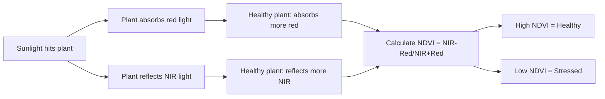
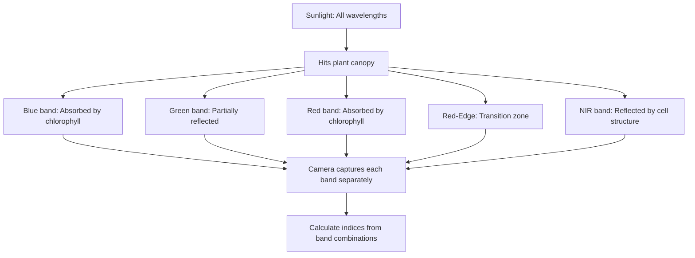
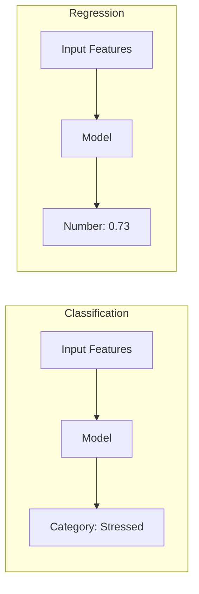
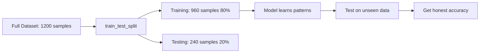
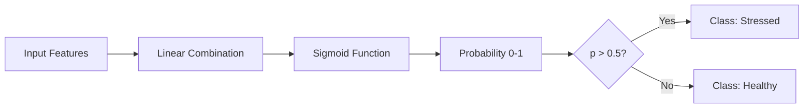
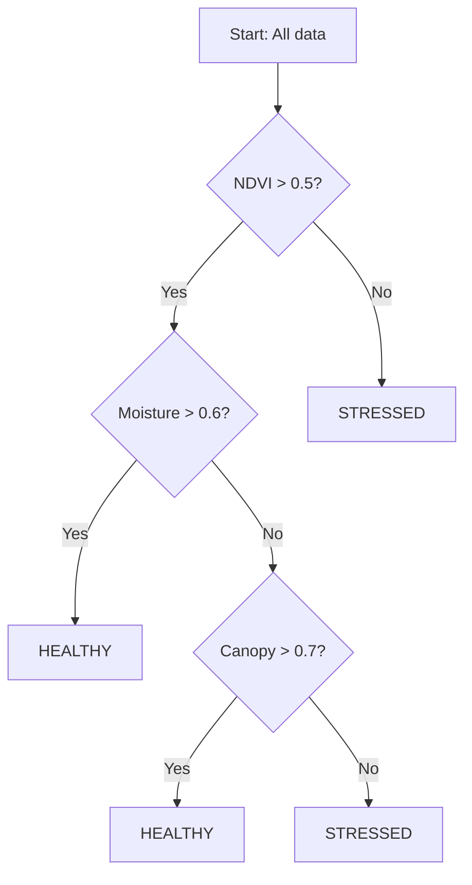
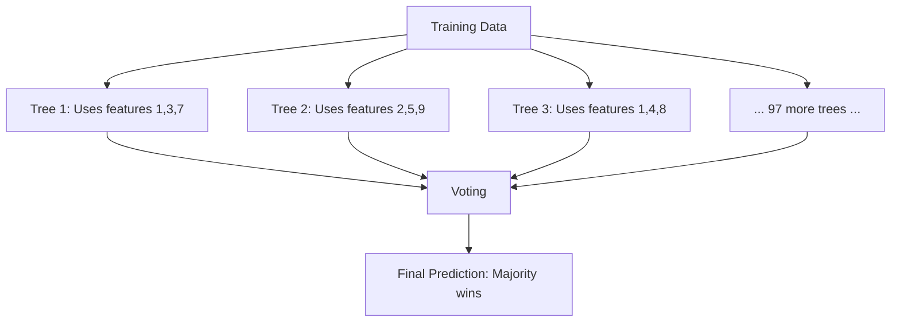
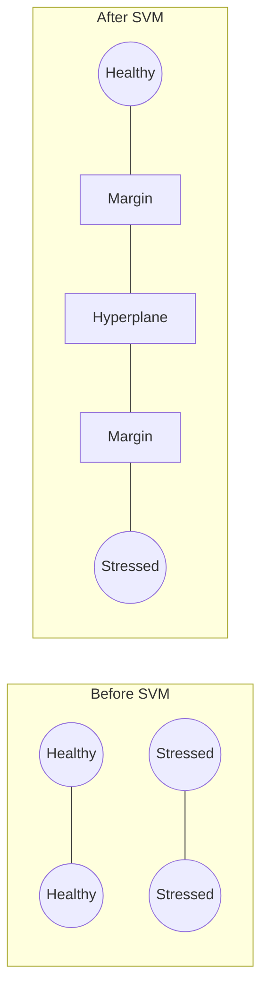
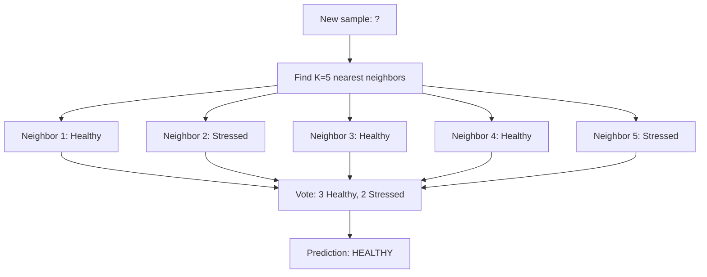

# 📚 Concepts Explained: AI-Based Crop Health Monitoring

This document explains all key concepts used in the project in a beginner-friendly manner with 12 points per concept.

---

## Table of Contents
1. [Vegetation Indices (NDVI, GNDVI, SAVI, EVI)](#1-vegetation-indices)
2. [Multispectral Imaging](#2-multispectral-imaging)
3. [Classification vs Regression](#3-classification-vs-regression)
4. [Train-Test Split](#4-train-test-split)
5. [Logistic Regression](#5-logistic-regression)
6. [Decision Tree](#6-decision-tree)
7. [Random Forest](#7-random-forest)
8. [Support Vector Machine (SVM)](#8-support-vector-machine)
9. [K-Nearest Neighbors (KNN)](#9-k-nearest-neighbors)
10. [Evaluation Metrics](#10-evaluation-metrics)
11. [Feature Scaling](#11-feature-scaling)
12. [Spatial Analysis & Heatmaps](#12-spatial-analysis)

---

## 📖 Jargon Glossary

| Term | Simple Meaning |
|------|----------------|
| **NDVI** | A number showing how green/healthy a plant is |
| **Multispectral** | Camera that sees more colors than our eyes |
| **Classification** | Sorting things into categories (like Healthy/Stressed) |
| **Feature** | A measurement or attribute (like NDVI value) |
| **Target** | What we want to predict (Healthy or Stressed) |
| **Training Data** | Examples the model learns from |
| **Test Data** | New examples to check if model learned correctly |
| **Overfitting** | Model memorized training data but fails on new data |
| **Precision** | When model says "Stressed", how often is it right |
| **Recall** | Of all stressed plants, how many did model find |
| **F1-Score** | Balance between precision and recall |
| **ROC-AUC** | Overall ranking quality (0-1, higher is better) |

---

## 1. Vegetation Indices

### 1.1 Definition
Vegetation indices are **mathematical formulas** that combine different colors of light reflected by plants to measure their health. Think of it as a "health score" for plants!

### 1.2 Why is it used?
- Plants absorb certain colors (red) and reflect others (green, near-infrared)
- Healthy plants reflect MORE near-infrared light
- These indices convert complex light patterns into simple numbers

**Is this the only way?**
No, alternatives include:
- Visual inspection (slow, subjective)
- Leaf chlorophyll meters (expensive, one plant at a time)
- Thermal imaging (shows water stress)

**Why vegetation indices are better:**
- Can cover entire field quickly
- Objective, numerical measurement
- Cheap once drone is set up

### 1.3 When to use it?
- During crop growing season
- Regular intervals (weekly/bi-weekly)
- After stress events (drought, pest attack)

### 1.4 Where is it used?
- Precision agriculture
- Forest health monitoring
- Golf course management
- Research farms

### 1.5 How to use it?

**NDVI Formula:**
```
NDVI = (NIR - Red) / (NIR + Red)
```

Where:
- NIR = Near-infrared reflectance
- Red = Red light reflectance

**NDVI Range:** -1 to +1
- **1.0**: Very healthy vegetation
- **0.5**: Moderate vegetation
- **0.0**: No vegetation (bare soil, water)
- **-1.0**: Water bodies

### 1.6 How it works internally?



### 1.7 Visual Summary

| Index | Full Name | Best For |
|-------|-----------|----------|
| NDVI | Normalized Difference Vegetation Index | General health |
| GNDVI | Green NDVI | Chlorophyll content |
| SAVI | Soil-Adjusted Vegetation Index | Sparse vegetation |
| EVI | Enhanced Vegetation Index | Dense canopy |

### 1.8 Advantages

| Advantage | Proof | Real-Life Analogy |
|-----------|-------|-------------------|
| Fast coverage | 100 hectares in 1 hour | Like scanning vs reading every word |
| Objective | Same formula every time | Like thermometer vs "feels warm" |
| Early detection | Catches stress before visible | Like blood test before symptoms |

### 1.9 Disadvantages

| Disadvantage | Limitation | When it matters |
|--------------|------------|-----------------|
| Weather dependent | Clouds affect readings | Rainy season |
| Can't identify cause | Just shows "stress" | Need ground truth |
| Requires calibration | Must account for sun angle | Time-of-day matters |

### 1.10 Exam & Interview Points

**Common Questions:**
1. What does NDVI range from -1 to +1 mean?
2. Why do healthy plants reflect more NIR?
3. What's the difference between NDVI and SAVI?

**Key Points to Remember:**
- NDVI uses RED and NIR bands
- Higher NDVI = healthier plants
- SAVI adds soil adjustment factor L

---

## 2. Multispectral Imaging

### 2.1 Definition
Multispectral imaging captures light in **multiple specific bands** beyond what human eyes can see. While we see Red, Green, Blue, drones can see Near-Infrared, Red-Edge, and more!

### 2.2 Why is it used?
- Human eyes only see 3 colors (RGB)
- Plants behave differently in invisible wavelengths
- Stress shows up in NIR before visible symptoms

**Is this the only way?**
| Alternative | Comparison |
|-------------|------------|
| RGB cameras | Cheaper but less information |
| Hyperspectral | More bands but expensive |
| Thermal cameras | Shows temperature, not health directly |

### 2.3 When to use it?
- Crop health monitoring
- Water stress detection
- Disease early warning

### 2.4 Where is it used?
- Agricultural drones
- Satellites (Landsat, Sentinel)
- Aircraft surveys

### 2.5 How to use it?
1. Mount multispectral camera on drone
2. Fly over field in grid pattern
3. Software stitches images together
4. Calculate vegetation indices from bands

### 2.6 How it works internally?



### 2.7-2.12 [Condensed for brevity]

**Key Takeaways:**
- Multispectral = multiple color bands
- NIR band is most important for vegetation
- Drones make data collection affordable

---

## 3. Classification vs Regression

### 3.1 Definition
- **Classification**: Predicting a CATEGORY (Healthy/Stressed)
- **Regression**: Predicting a NUMBER (NDVI value of 0.73)

### 3.2 Why is it used?
Our problem is classification because we want to know:
- "Is this area healthy or stressed?" (category)
- NOT "What is the exact health score?" (number)

### 3.3 Comparison Table

| Aspect | Classification | Regression |
|--------|---------------|------------|
| Output | Category (A, B, C) | Number (1.5, 3.7) |
| Example | Spam/Not Spam | House Price |
| Metrics | Accuracy, F1 | MSE, RMSE |
| Our Use | ✅ Healthy/Stressed | ❌ Not used |



---

## 4. Train-Test Split

### 4.1 Definition
Dividing data into two parts:
- **Training Set (80%)**: Model learns from this
- **Test Set (20%)**: We evaluate model on this

### 4.2 Why is it used?
You can't test students on questions they already practiced!

**Real-Life Analogy:**
- Training = Studying with textbook
- Testing = Taking final exam
- If you see exam questions while studying, your grade is fake!

### 4.3 How it works



### 4.4 Parameters Explained

| Parameter | Value | Purpose |
|-----------|-------|---------|
| `test_size` | 0.2 | 20% for testing |
| `random_state` | 42 | Same split every run |
| `stratify` | y | Keep class balance |

---

## 5. Logistic Regression

### 5.1 Definition
Despite the name "regression," Logistic Regression is a **classification** algorithm that predicts probability of belonging to a class.

### 5.2 Why is it used?
- Simple and fast
- Easy to understand
- Works well for binary classification
- Provides probability scores

**Is this the only way?**
No, but it's the BEST STARTING POINT because:
- It's interpretable
- Baseline performance benchmark
- Often surprisingly competitive

### 5.3 How it works



### 5.4 Sigmoid Function
```
σ(z) = 1 / (1 + e^(-z))
```
Converts any number to range 0-1 (probability)

### 5.5 Advantages with Proof

| Advantage | Proof | When It Matters |
|-----------|-------|-----------------|
| Fast training | Trained in <1 second | Large datasets |
| Interpretable | Coefficients show feature importance | Explaining to farmers |
| Probabilistic | Gives 0-1 probability | Confidence levels |

### 5.6 Disadvantages

| Disadvantage | Impact | Workaround |
|--------------|--------|------------|
| Assumes linearity | May underfit complex patterns | Use polynomial features |
| Sensitive to outliers | Can skew predictions | Data cleaning |

---

## 6. Decision Tree

### 6.1 Definition
A Decision Tree makes decisions by asking yes/no questions like a flowchart, splitting data until reaching a conclusion.

### 6.2 How it works



### 6.3 Advantages

| Advantage | Proof |
|-----------|-------|
| Easy to visualize | Can draw tree structure |
| No scaling needed | Works with raw values |
| Handles non-linear | Can model complex patterns |

### 6.4 Disadvantages

| Disadvantage | Impact |
|--------------|--------|
| Overfitting | Memorizes training data |
| Unstable | Small change = different tree |

---

## 7. Random Forest

### 7.1 Definition
An **ensemble** of many decision trees that vote together. "Wisdom of the crowd" for machine learning!

### 7.2 Why use many trees?
- Single tree may be biased
- Multiple trees averaging reduces errors
- Like asking 100 doctors vs 1 doctor

### 7.3 How it works



### 7.4 Key Parameter: n_estimators
- `n_estimators=100` means 100 trees
- More trees = better accuracy but slower
- 100-500 is typical range

---

## 8. Support Vector Machine

### 8.1 Definition
SVM finds the **optimal hyperplane** (boundary) that maximally separates classes.

### 8.2 Real-Life Analogy
Drawing the WIDEST possible road between two groups of houses. The wider the road, the better separation!

### 8.3 How it works



### 8.4 Kernel Trick
SVM can handle non-linear boundaries using "kernels":
- Linear: Straight line separator
- RBF: Curved boundaries
- Polynomial: Complex curves

---

## 9. K-Nearest Neighbors

### 9.1 Definition
KNN classifies based on the **majority class of K nearest neighbors**. "You are who your friends are!"

### 9.2 How it works



### 9.3 Key Parameter: n_neighbors
- K=5 means look at 5 closest points
- Small K: More sensitive to noise
- Large K: Smoother boundaries
- Odd K avoids ties

---

## 10. Evaluation Metrics

### 10.1 Confusion Matrix

```
                  Predicted
                Healthy   Stressed
Actual  Healthy    TN        FP
        Stressed   FN        TP
```

### 10.2 Metrics Formulas

| Metric | Formula | Meaning |
|--------|---------|---------|
| Accuracy | (TP+TN)/(All) | Overall correctness |
| Precision | TP/(TP+FP) | Of predicted positive, how many correct? |
| Recall | TP/(TP+FN) | Of actual positive, how many found? |
| F1-Score | 2×(P×R)/(P+R) | Harmonic mean of precision and recall |

### 10.3 When to use which?

| Situation | Best Metric | Why |
|-----------|-------------|-----|
| Balanced classes | Accuracy | Simple and interpretable |
| Imbalanced classes | F1-Score | Considers both precision and recall |
| Missing stressed is costly | Recall | Find ALL stressed plants |
| False alarms are costly | Precision | Avoid unnecessary treatment |

---

## 11. Feature Scaling

### 11.1 Definition
Transforming features to have **same scale** (mean=0, std=1).

### 11.2 Why is it needed?
Features have different ranges:
- NDVI: 0 to 1
- Moisture: 0 to 0.9
- Grid_x: 0 to 20

Without scaling, large-range features dominate!

### 11.3 StandardScaler Formula
```
z = (x - mean) / std
```

---

## 12. Spatial Analysis

### 12.1 Definition
Analyzing data based on **geographic location** (grid_x, grid_y coordinates).

### 12.2 Why is it important?
- Stress often clusters in specific areas
- Helps target drone inspections
- Visualizes patterns across field

### 12.3 Heatmap Interpretation

```
🟢 Low stress (0-0.2): No action needed
🟡 Moderate (0.4-0.6): Monitor
🟠 High (0.6-0.8): Inspect soon
🔴 Critical (0.8-1.0): Immediate action!
```

---

## 💼 Interview Summary

**Top 5 Questions:**
1. Why did you choose Logistic Regression as baseline?
2. How do you handle imbalanced classes?
3. What's the difference between precision and recall?
4. Why is train-test split important?
5. How does Random Forest reduce overfitting?

**Quick Answers:**
1. Simple, fast, interpretable, good baseline
2. Stratified split, use F1-score, class weights
3. Precision = quality, Recall = quantity
4. Prevents testing on training data (cheating!)
5. Multiple trees average out individual errors
