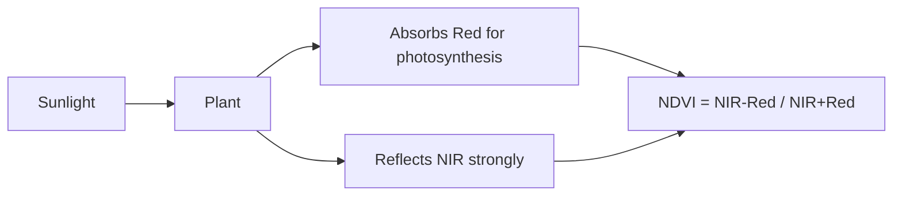
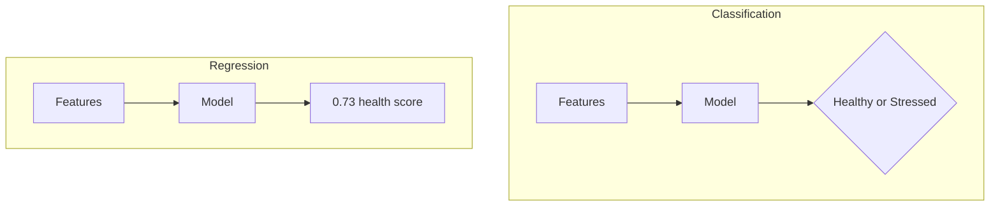
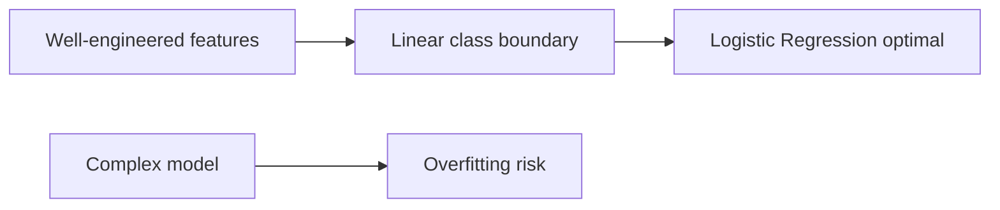
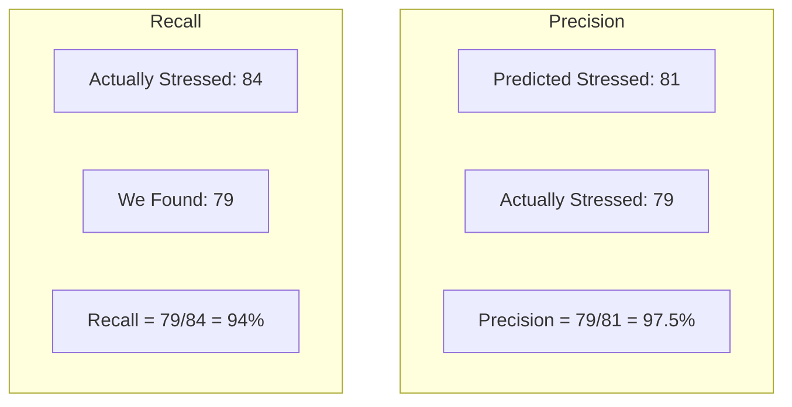
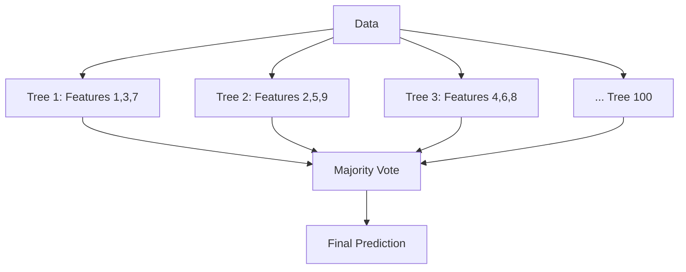

# 🎤 Interview Questions: AI Crop Health Monitoring

## 20 Interview Questions with Detailed Answers

---

### Q1: What is NDVI and why is it important for crop health monitoring?

**Simple Answer (For 10-year-old):**
NDVI is a number that tells us how green and healthy a plant is. It's like a "health score" from 0 to 1 - higher means healthier!

**Technical Answer:**
NDVI (Normalized Difference Vegetation Index) = (NIR - Red) / (NIR + Red), where NIR is near-infrared reflectance. Healthy vegetation absorbs red light for photosynthesis and reflects NIR light. Higher NDVI (0.6-1.0) indicates dense, healthy vegetation.



**Real-Life Analogy:** Like a blood oxygen meter - it shines light and measures reflection to determine health!

**Common Mistakes:**
- Confusing NDVI with chlorophyll content (related but not same)
- Assuming NDVI = 1 always means perfect health

**Key Points:**
- Range: -1 to +1
- Healthy: 0.5-1.0
- Water/bare soil: 0 or negative

---

### Q2: Why did you use classification instead of regression?

**Simple Answer:**
We want to put plants in groups (Healthy or Stressed) - that's classification. If we wanted to predict a number (like exact health score), we'd use regression.

**Technical Answer:**
Classification outputs discrete categories while regression outputs continuous values. Our target variable is binary (Healthy/Stressed), making this a binary classification problem. We evaluated using F1-Score rather than MSE because we need to classify, not predict exact values.



---

### Q3: Explain train-test split. Why is it critical?

**Simple Answer:**
We split data into practice questions (training) and exam questions (testing). You can't cheat by practicing with exam questions!

**Technical Answer:**
Train-test split divides data into training set (80%) for model learning and test set (20%) for unbiased evaluation. This prevents data leakage and overfitting. We used stratified sampling to maintain class proportions in both sets.

**Real-Life Analogy:** Students study from textbook (training) and are tested on unseen questions (testing).

**Common Mistakes:**
- Testing on training data (gives falsely high accuracy)
- Not stratifying (test set might be all one class)
- Fitting scaler on test data (data leakage!)

---

### Q4: Why did Logistic Regression beat Random Forest?

**Simple Answer:**
Sometimes simple tools work better! The data was already well-organized (vegetation indices), so a simple model was enough.

**Technical Answer:**
The vegetation indices derived from multispectral imagery are engineered features with strong linear relationships to crop health. This makes the decision boundary nearly linear, which Logistic Regression handles optimally. Random Forest with 100 trees may have introduced unnecessary complexity, slightly overfitting to training data.



---

### Q5: What is the difference between Precision and Recall?

**Simple Answer:**
- **Precision:** When I say it's stressed, am I right?
- **Recall:** Of all stressed plants, did I find them all?

**Technical Answer:**

| Metric | Formula | Question Answered |
|--------|---------|-------------------|
| Precision | TP/(TP+FP) | Of predicted positive, how many are correct? |
| Recall | TP/(TP+FN) | Of actual positive, how many did we catch? |



**When each matters:**
- **High Precision needed:** False alarms are expensive (treating healthy crops)
- **High Recall needed:** Missing stressed crops is dangerous (crop loss)

---

### Q6: What is F1-Score and why did you use it?

**Simple Answer:**
F1-Score is the average of precision and recall. We used it because our data had more healthy plants than stressed ones.

**Technical Answer:**
F1-Score = 2 × (Precision × Recall) / (Precision + Recall). It's the harmonic mean, penalizing extreme differences between precision and recall. With imbalanced classes (65% healthy, 35% stressed), accuracy alone is misleading - a model predicting all "healthy" gets 65% accuracy but is useless!

---

### Q7: How does StandardScaler work?

**Simple Answer:**
It makes all features "fair" by converting them to the same scale.

**Technical Answer:**
StandardScaler transforms features to have mean=0 and std=1 using: z = (x - μ) / σ

**Critical Rule:**
```python
# Fit ONLY on training data
scaler.fit_transform(X_train)  # Learn μ and σ from training
scaler.transform(X_test)       # Apply using training's μ and σ
```

**Why?** Using test data statistics causes data leakage!

---

### Q8: Explain Random Forest algorithm.

**Simple Answer:**
It's like asking 100 different people and going with the majority vote!

**Technical Answer:**
Random Forest is an ensemble of decision trees trained on random subsets of data (bagging) and random subsets of features. Final prediction is majority vote (classification) or average (regression).



---

### Q9: What is ROC-AUC?

**Simple Answer:**
It measures how good the model is at ranking (putting stressed before healthy).

**Technical Answer:**
ROC (Receiver Operating Characteristic) curve plots True Positive Rate vs False Positive Rate at various thresholds. AUC (Area Under Curve) summarizes this - 1.0 is perfect, 0.5 is random guessing.

Our model's ROC-AUC of 99.81% means it almost perfectly ranks stressed plants higher than healthy ones.

---

### Q10: Why is stratified sampling important?

**Simple Answer:**
It makes sure both training and test have the same mix of healthy/stressed.

**Technical Answer:**
With 65% healthy and 35% stressed, random splitting might create a test set that's 80% healthy and 20% stressed by chance. Stratification ensures both sets maintain the original 65/35 ratio, enabling fair evaluation.

---

### Q11: What is a confusion matrix?

**Simple Answer:**
A table showing what the model got right and wrong.

**Technical Answer:**

```
                Predicted
              Healthy  Stressed
Actual  Healthy   TN       FP
        Stressed  FN       TP
```

- **TN:** Correctly identified healthy
- **FP:** Healthy but predicted stressed (false alarm)
- **FN:** Stressed but predicted healthy (missed!)
- **TP:** Correctly identified stressed

---

### Q12: How does KNN work?

**Simple Answer:**
Look at your 5 nearest neighbors. If 3 are stressed and 2 are healthy, you're stressed!

**Technical Answer:**
KNN is a lazy learner that stores all training data. For prediction, it finds K nearest points using distance metrics (Euclidean) and takes majority class.

**Key Parameter:** K=5 (odd to avoid ties)

---

### Q13: What is feature scaling and when is it needed?

**Simple Answer:**
Making all measurements use the same "units" so they're fair to compare.

**Technical Answer:**
Feature scaling normalizes feature ranges. Needed for:
- Distance-based models (KNN, SVM)
- Gradient-based optimization (Logistic Regression)

NOT needed for:
- Tree-based models (Decision Tree, Random Forest)

---

### Q14: How did you handle class imbalance?

**Simple Answer:**
We used stratified split and F1-Score instead of accuracy.

**Technical Answer:**
1. **Stratified train-test split** maintains class proportions
2. **F1-Score** balances precision and recall
3. Could also use: SMOTE, class weights, oversampling

---

### Q15: What is overfitting and how to detect it?

**Simple Answer:**
When the model memorizes answers instead of learning patterns.

**Technical Answer:**
Overfitting occurs when model performs well on training data but poorly on test data.

**Detection:** Large gap between training and test accuracy.

**Prevention:**
- Cross-validation
- Regularization
- Simpler models
- More training data

---

### Q16: Explain the bias-variance tradeoff.

**Simple Answer:**
Simple models might be too dumb (bias), complex models might memorize (variance). Find the balance!

**Technical Answer:**
- **High Bias:** Model too simple, underfits (e.g., linear model on curved data)
- **High Variance:** Model too complex, overfits (e.g., deep tree on small data)

Optimal model minimizes total error = Bias² + Variance.

---

### Q17: What is multispectral imaging?

**Simple Answer:**
A camera that sees more colors than our eyes - including invisible ones!

**Technical Answer:**
Multispectral cameras capture light in specific wavelength bands (Blue, Green, Red, Red-Edge, NIR). Each band reveals different plant properties - NIR shows cell structure, Red-Edge shows chlorophyll transition.

---

### Q18: Why use drones for crop monitoring?

**Simple Answer:**
Drones fly over quickly and see everything a farmer walking would take days to see!

**Technical Answer:**
Benefits:
- Cover 100+ hectares in hours
- Capture consistent data
- Reach difficult terrain
- Cost-effective vs satellites
- On-demand flights

---

### Q19: How would you improve this model?

**Simple Answer:**
Add more data, include weather, and track changes over time.

**Technical Answer:**
1. **Temporal analysis:** Track trends over growing season
2. **Weather integration:** Correlate with temperature/rainfall
3. **Multi-class:** Identify stress CAUSE (drought, pest, disease)
4. **Deep learning:** CNN on raw imagery
5. **Larger dataset:** More samples for generalization

---

### Q20: What real-world challenges might you face?

**Simple Answer:**
Weather can mess up drone flights, and AI might not know WHY plants are sick.

**Technical Answer:**
1. **Cloud cover** affects multispectral readings
2. **Temporal variation** - morning vs afternoon values differ
3. **Crop type differences** - NDVI thresholds vary by crop
4. **Ground truth validation** - need farmer feedback
5. **Computational cost** - processing large fields
6. **Edge cases** - young plants, mixed cropping

---

## Quick Reference Card

| Concept | One-liner |
|---------|-----------|
| NDVI | (NIR-Red)/(NIR+Red), range -1 to 1 |
| Precision | Of predicted positive, how many correct? |
| Recall | Of actual positive, how many caught? |
| F1-Score | Harmonic mean of P and R |
| Stratify | Keep class ratios in train/test |
| StandardScaler | z = (x - mean) / std |
| Confusion Matrix | TP, TN, FP, FN table |
