# 📊 Observations and Conclusion

## Execution Output Summary

The AI Crop Health Monitoring pipeline executed successfully with the following results:

### Dataset Information
- **Total Samples:** 1,200 grid cells
- **Features:** 13 vegetation indices
- **Target Classes:** Healthy (2), Stressed (1)
- **Missing Values:** 0 (complete dataset)

### Class Distribution
| Class | Count | Percentage |
|-------|-------|------------|
| 🟢 Healthy | ~780 | 65% |
| 🔴 Stressed | ~420 | 35% |

---

## Model Performance Results

### Model Comparison Table (Sorted by F1-Score)

| Model | Accuracy | Precision | Recall | F1-Score | ROC-AUC |
|-------|----------|-----------|--------|----------|---------|
| **Logistic Regression** | **97.08%** | **97.53%** | **94.05%** | **95.76%** | **99.81%** |
| SVM | 94.58% | 92.77% | 91.67% | 92.22% | 99.31% |
| Decision Tree | 93.33% | 89.53% | 91.67% | 90.59% | 92.95% |
| Random Forest | 92.92% | 92.41% | 86.90% | 89.57% | 98.17% |
| KNN | 91.25% | 90.91% | 83.33% | 86.96% | 97.44% |

### 🏆 Best Model: Logistic Regression


---

## Output Visualizations

### 1. Confusion Matrix Analysis

```
Predicted:     Healthy    Stressed
             ┌─────────┬──────────┐
Actual:      │         │          │
Healthy      │   154   │    2     │  (156 total)
             ├─────────┼──────────┤
Stressed     │    5    │   79     │  (84 total)
             └─────────┴──────────┘
                                    Total: 240
```

**Interpretation:**
- **True Negatives (TN):** 154 - Healthy correctly identified as Healthy ✅
- **False Positives (FP):** 2 - Healthy incorrectly labeled Stressed ⚠️
- **False Negatives (FN):** 5 - Stressed incorrectly labeled Healthy ❌
- **True Positives (TP):** 79 - Stressed correctly identified as Stressed ✅

### 2. Field Stress Heatmap

```mermaid
graph TD
    subgraph Field Layout
        A[🟢 60.5% Healthy zones]
        B[🔴 30.1% CRITICAL stress]
        C[🟠 3.1% HIGH priority]
        D[🟡 3.2% MODERATE]
        E[🟢 3.1% LOW priority]
    end
```



---

## Observations

### 1. Model Performance Observations

| Observation | Detail | Implication |
|-------------|--------|-------------|
| Logistic Regression outperformed complex models | F1=95.76% vs Random Forest=89.57% | Simpler isn't always worse |
| High ROC-AUC across all models | >97% for all except Decision Tree | Good class separability |
| Decision Tree had lowest performance | Likely overfitting | Needs pruning |

### 2. Data Quality Observations

- **No missing values** - Data was pre-processed well
- **Moderate class imbalance** (65/35) - Stratified split handled this
- **All features numerical** - No encoding needed except target

### 3. Spatial Pattern Observations

```
Pattern: Stress clusters in specific grid regions
Finding: High stress in grid areas (5-10, 12-17)
Cause: Possibly water stress or soil issues in that zone
Action: Targeted drone inspection recommended
```

---

## Insights

### 1. Why Logistic Regression Won


**Key Insight:** The vegetation indices are ALREADY well-engineered features from multispectral analysis, making the classification task nearly linear.

### 2. Stress Detection Effectiveness

| Metric | Value | Business Impact |
|--------|-------|-----------------|
| Recall | 94.05% | Catches most stressed areas |
| Precision | 97.53% | Very few false alarms |
| Miss Rate | 5.95% | Only ~6% stressed areas missed |

### 3. Spatial Stress Distribution

- **361 CRITICAL zones** (30.1%) need immediate attention
- Stress appears **clustered** rather than random
- Suggests **localized issues** (not field-wide problem)

---

## Conclusion

### Summary

1. **Best Model:** Logistic Regression with 95.76% F1-Score
2. **Architecture Choice:** Simple linear model beats complex ensembles
3. **Spatial Analysis:** 30% of field has critical stress requiring inspection
4. **Recommendation:** Deploy drone to 361 critical grid cells first

### Was the Problem Solved? ✅ YES

| Objective | Achieved | Evidence |
|-----------|----------|----------|
| Understand vegetation indices | ✅ | Documented 13 features |
| Train ML classification models | ✅ | 5 models compared |
| Generate stress heatmap | ✅ | Spatial visualization created |
| Provide drone recommendations | ✅ | Priority zones identified |

### Future Improvements

1. **Add temporal data** - Track stress changes over time
2. **Include weather data** - Correlate with temperature/rainfall
3. **Multi-class classification** - Identify CAUSE of stress
4. **Deep learning** - Use raw imagery instead of indices

---

## Exam Focus Points

### Key Lines to Remember

1. Logistic Regression achieved **highest F1-Score of 95.76%**
2. Dataset had **1,200 samples** with **13 vegetation features**
3. **361 critical zones** identified for immediate inspection
4. Stratified train-test split with **80-20 ratio**

### Typical Exam Questions

**Q: Why did Logistic Regression outperform Random Forest?**
A: The vegetation indices are well-engineered features that create nearly linear class separation, making Logistic Regression optimal.

**Q: What does high ROC-AUC (99.81%) indicate?**
A: The model has excellent discrimination ability between healthy and stressed classes.

**Q: Why use F1-Score instead of Accuracy?**
A: With imbalanced classes (65/35), accuracy can be misleading. F1-Score balances precision and recall.
