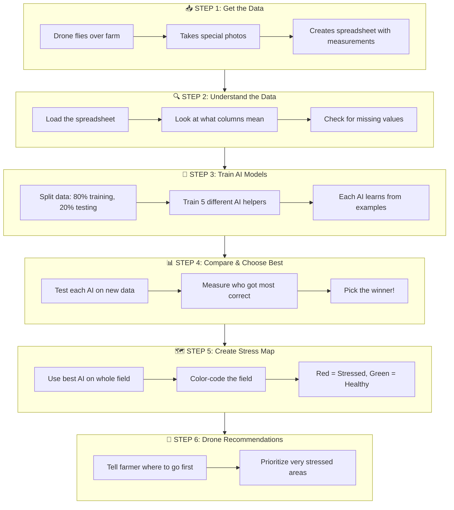
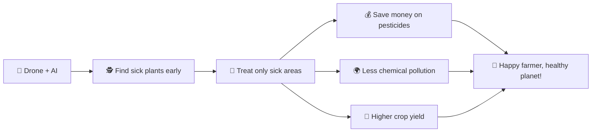

# 🌾 Problem Statement: AI-Based Crop Health Monitoring

## 🧩 What Problem Are We Solving?

### Simple Explanation (Like for a 10-Year-Old)

Imagine you are a **farmer** with a HUGE farm - so big that you can't walk around and check every single plant! 🚶‍♂️🌱

Some of your plants might be **sick** (we call them "stressed") - they might not be getting enough water, or bugs might be eating them, or the soil might not be good. But how do you find which plants are sick when you have millions of them?

Here's the cool solution: We use a **flying robot called a DRONE** 🚁 that flies over your farm and takes special photos! These aren't regular photos - they're like **X-ray vision photos** that can see if plants are healthy or sick, even before you can see the difference with your eyes!

Then we use **AI (Artificial Intelligence) - which is like a super-smart robot brain** 🤖 - to look at all these photos and tell you:
- "This area is healthy! ✅"
- "This area has sick plants! ❌ Go check it!"

### Real-Life Analogy

Think of it like a **doctor's checkup**, but for plants:

| Human Health | Plant Health |
|-------------|--------------|
| Doctor uses thermometer 🌡️ | Drone uses special camera 📸 |
| Doctor checks blood pressure | Drone checks plant color/moisture |
| Doctor says "You're healthy!" or "Take medicine!" | AI says "Plants are healthy!" or "Plants need help!" |
| You visit a hospital | Farmer gets a stress map |

---

## 📊 Understanding Our Dataset (Like Explaining to a Child)

Imagine the drone flew over a farm and took lots of special photos. Each photo tells us different things about the plants. Here's what each column means:

### 🌿 The Features (What We Measure)

| Feature | What It Means (Simple) | Real-Life Example |
|---------|----------------------|-------------------|
| **ndvi_mean** | How GREEN and healthy the plants look (average) | Like checking if your plant is bright green (healthy) or yellow/brown (sick) |
| **ndvi_std** | How much the greenness varies in one area | Like checking if ALL plants look the same, or some are green and some are brown |
| **ndvi_min** | The LEAST green plant in the area | The sickest-looking plant in the group |
| **ndvi_max** | The MOST green plant in the area | The healthiest-looking plant in the group |
| **gndvi** | Another way to check greenness (using green light) | Like using a green flashlight to see plants |
| **savi** | Plant health that ignores the soil | Like checking plants without getting confused by dirt color |
| **evi** | Better plant health check for dense areas | Like counting plants in a crowded area |
| **red_edge_1** | Special light color that plants reflect | Like checking if plants are glowing in a special color |
| **red_edge_2** | Another special light color | Same as above, but different color |
| **nir_reflectance** | Invisible light that bounces off plants | Like checking plants with invisible superhero vision 🦸 |
| **soil_brightness** | How bright the ground looks | Is the soil wet (dark) or dry (bright)? |
| **canopy_density** | How many leaves cover the area | Are leaves packed close together or spread apart? |
| **moisture_index** | How much water the plants have | Are plants thirsty or well-watered? 💧 |
| **grid_x** | Where the photo was taken (left-right position) | Like saying "row 5" in a theater |
| **grid_y** | Where the photo was taken (up-down position) | Like saying "seat 10" in a theater |

### 🎯 The Output (What We Want to Predict)

| Label | Meaning | What It Looks Like |
|-------|---------|-------------------|
| **Healthy** ✅ | Plants are doing great! | Bright green, strong, growing well |
| **Stressed** ❌ | Plants need help! | Yellow, brown, wilting, weak |

### 🎨 Visual Understanding

```
Farm Field (20x20 Grid):

    0  1  2  3  4  5  6  7  8  9  ...
  ┌──────────────────────────────────
0 │ 🟢 🟢 🟡 🟢 🟢 🔴 🔴 🟢 🟢 🟢
1 │ 🟢 🟢 🟢 🟡 🔴 🔴 🔴 🟡 🟢 🟢
2 │ 🟢 🟢 🟢 🟢 🔴 🔴 🔴 🟢 🟢 🟢
3 │ 🟢 🟢 🟡 🟢 🟡 🔴 🟡 🟢 🟢 🟢
...

🟢 = Healthy crops
🟡 = Slightly stressed  
🔴 = Very stressed (needs attention!)
```

---

## 🪜 Steps to Solve the Problem



---

## 🎯 Expected Output

### 1. Model Comparison Table
```
╔═══════════════════╦══════════╦═══════════╦════════╦══════════╗
║ Model             ║ Accuracy ║ Precision ║ Recall ║ F1-Score ║
╠═══════════════════╬══════════╬═══════════╬════════╬══════════╣
║ Logistic Reg.     ║   85%    ║    0.84   ║  0.86  ║   0.85   ║
║ Decision Tree     ║   82%    ║    0.81   ║  0.83  ║   0.82   ║
║ Random Forest     ║   88%    ║    0.87   ║  0.89  ║   0.88   ║  ⭐ BEST
║ SVM               ║   86%    ║    0.85   ║  0.87  ║   0.86   ║
║ KNN               ║   83%    ║    0.82   ║  0.84  ║   0.83   ║
╚═══════════════════╩══════════╩═══════════╩════════╩══════════╝
```

### 2. Field Stress Heatmap
A colorful map showing:
- 🟢 Green areas = Healthy crops
- 🟡 Yellow areas = Slightly stressed
- 🔴 Red areas = Very stressed (priority!)

### 3. Drone Inspection Recommendations
```
Priority 1 (URGENT): Grid cells (5,6), (6,6), (7,6) - High stress detected
Priority 2 (SOON): Grid cells (3,4), (8,9) - Moderate stress
Priority 3 (MONITOR): Grid cells (1,2), (15,18) - Low stress
```

---

## 💡 Why Does This Matter?

### Real-World Impact



### Without This Technology vs With This Technology

| Without AI | With AI |
|-----------|---------|
| Farmer walks entire field (days!) | Drone scans in hours |
| Might miss sick plants | AI catches early stress |
| Treats ENTIRE field with chemicals | Treats only sick areas |
| Wastes money and harms environment | Saves 30-50% on resources |
| Guesswork | Data-driven decisions |

---

## 📋 Summary for a 5-Year-Old

> "We're making a **robot helper** 🤖 that looks at special pictures taken by a **flying camera** 🚁, and tells the farmer which plants are **happy** 😊 and which plants are **sad** 😢 so the farmer can give water and medicine only to the sad plants!"
