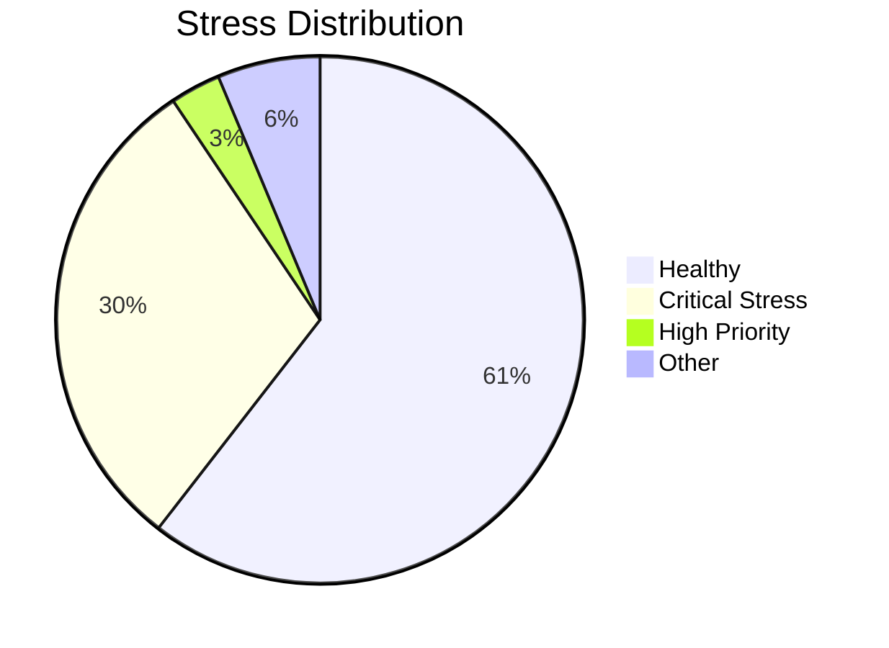

# 🌾 AI-Based Crop Health Monitoring
## Using Drone Multispectral Data

---

# Slide 1: Title & Objective

## 🎯 Project Goal

Build an AI system that:
- Analyzes drone-captured vegetation data
- Classifies crops as **Healthy** or **Stressed**
- Creates spatial heatmaps for inspection

**Key Outcome:** 95.76% F1-Score with Logistic Regression

---

# Slide 2: Problem Statement

## ❓ The Challenge


**Solution:** Drones + AI = Automated Crop Monitoring

---

# Slide 3: Real-World Use Case

## 🌍 Where This Is Used

| Industry | Application |
|----------|-------------|
| **Agriculture** | Crop stress detection |
| **Forestry** | Tree health monitoring |
| **Research** | Phenotyping experiments |
| **Insurance** | Damage assessment |

**Market Size:** Precision agriculture worth $12B+ globally

---

# Slide 4: Input Data

## 📊 Dataset Overview

- **Samples:** 1,200 grid cells
- **Features:** 13 vegetation indices
- **Target:** Healthy (65%) vs Stressed (35%)

**Key Features:**
| Index | Measures |
|-------|----------|
| NDVI | Overall greenness |
| Moisture Index | Water content |
| Canopy Density | Leaf coverage |

---

# Slide 5: Concepts Used (High Level)

## 🧠 ML Pipeline


**Models:** Logistic Regression, Decision Tree, Random Forest, SVM, KNN

---

# Slide 6: Concepts Breakdown

## 📚 Key Concepts Simplified

| Concept | Simple Explanation |
|---------|-------------------|
| **NDVI** | Plant health score (0 to 1) |
| **Classification** | Sorting into categories |
| **Train-Test Split** | Study vs exam questions |
| **F1-Score** | Balance of precision & recall |
| **Heatmap** | Colorful stress map |

---

# Slide 7: Step-by-Step Solution

## 🪜 Pipeline Steps

1. **Load Data** → 1,200 samples, 13 features
2. **Encode Labels** → Healthy=0, Stressed=1
3. **Split Data** → 80% train, 20% test (stratified)
4. **Scale Features** → StandardScaler (mean=0, std=1)
5. **Train Models** → 5 algorithms
6. **Evaluate** → F1-Score comparison
7. **Spatial Analysis** → Generate heatmap

---

# Slide 8: Code Logic Summary

## 💻 Key Code Patterns

```python
# Data Split (stratified)
X_train, X_test, y_train, y_test = train_test_split(
    X, y, test_size=0.2, stratify=y)

# Scaling (fit on train only!)
scaler.fit_transform(X_train)
scaler.transform(X_test)

# Model Training
model.fit(X_train_scaled, y_train)
y_pred = model.predict(X_test_scaled)
```

---

# Slide 9: Important Functions

## ⚙️ Parameters That Matter

| Function | Key Parameter | Purpose |
|----------|---------------|---------|
| `train_test_split` | `stratify=y` | Keep class ratio |
| `StandardScaler` | fit on train only | Avoid data leakage |
| `RandomForest` | `n_estimators=100` | 100 trees voting |
| `KNN` | `n_neighbors=5` | Check 5 nearest |

---

# Slide 10: Execution Output

## 📈 Results

### Model Comparison
| Model | F1-Score | ROC-AUC |
|-------|----------|---------|
| **Logistic Regression** | **95.76%** | **99.81%** |
| SVM | 92.22% | 99.31% |
| Decision Tree | 90.59% | 92.95% |
| Random Forest | 89.57% | 98.17% |
| KNN | 86.96% | 97.44% |

🏆 **Winner: Logistic Regression**

---

# Slide 11: Observations & Insights

## 🔍 Key Findings



**Insights:**
- Simple model beat complex ensembles
- Stress clusters in specific zones
- 361 critical cells need immediate attention

---

# Slide 12: Advantages & Limitations

## ✅ Strengths

| Advantage | Evidence |
|-----------|----------|
| High accuracy | 97% overall |
| Fast inference | Logistic Regression |
| Interpretable | Coefficient analysis |

## ⚠️ Limitations

| Limitation | Impact |
|------------|--------|
| Single snapshot | No temporal trends |
| Binary only | Can't identify stress cause |
| Weather dependent | Clouds affect readings |

---

# Slide 13: Interview Takeaways

## 💼 Key Points to Remember

1. **Why Logistic Regression won?**
   - Well-engineered features → linear boundary

2. **How to handle imbalance?**
   - Stratify split + F1-Score

3. **Data leakage prevention?**
   - Never fit scaler on test data

4. **Why this matters?**
   - Early stress detection saves crops!

---

# Slide 14: Conclusion

## 🎯 Summary

✅ Built end-to-end crop health ML pipeline
✅ Compared 5 classification models
✅ Logistic Regression achieved **95.76% F1-Score**
✅ Identified **361 critical zones** for inspection
✅ Created spatial heatmap for targeted action

## 🚀 Future Improvements
- Time-series analysis
- Multi-class stress identification
- Deep learning on raw imagery

---

# Thank You! 🌾🚁

**Questions?**

```
Remember:
NDVI = (NIR - Red) / (NIR + Red)
F1 = 2 × (P × R) / (P + R)
```
