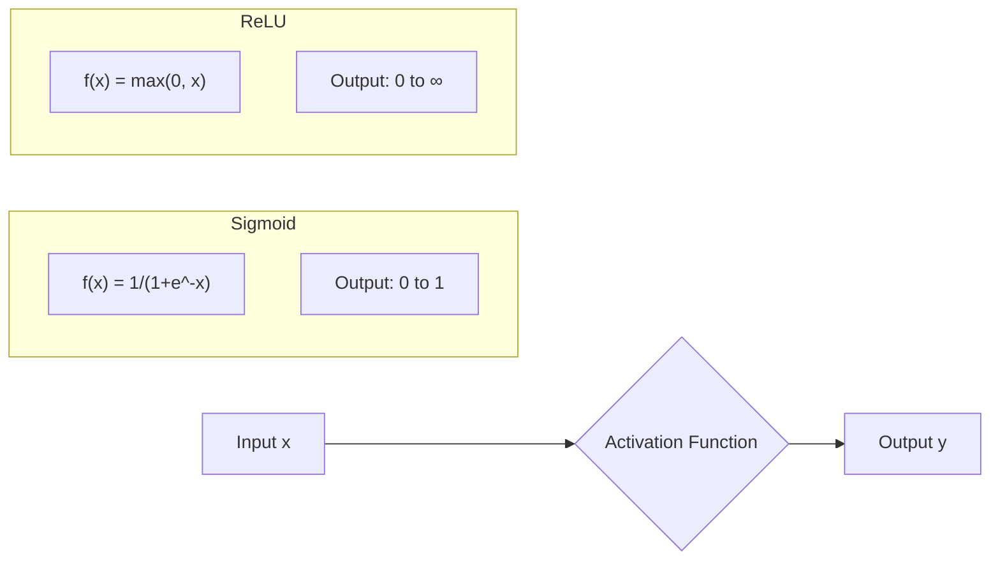
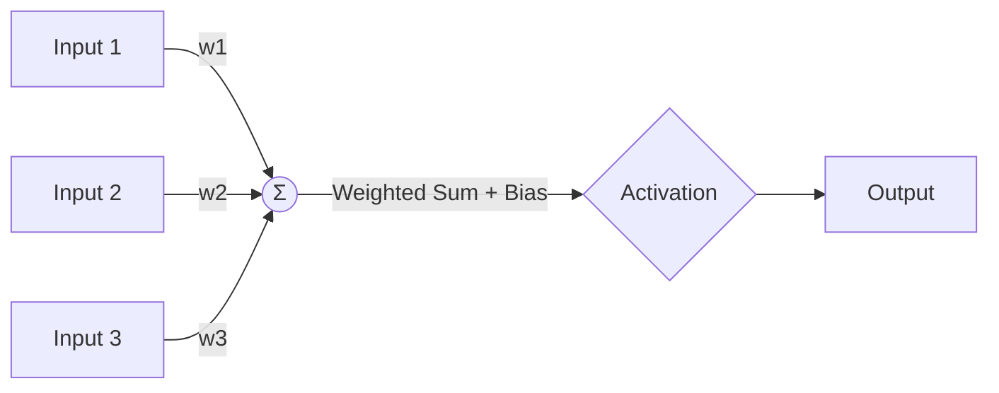
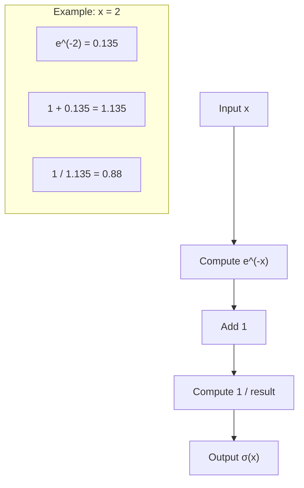
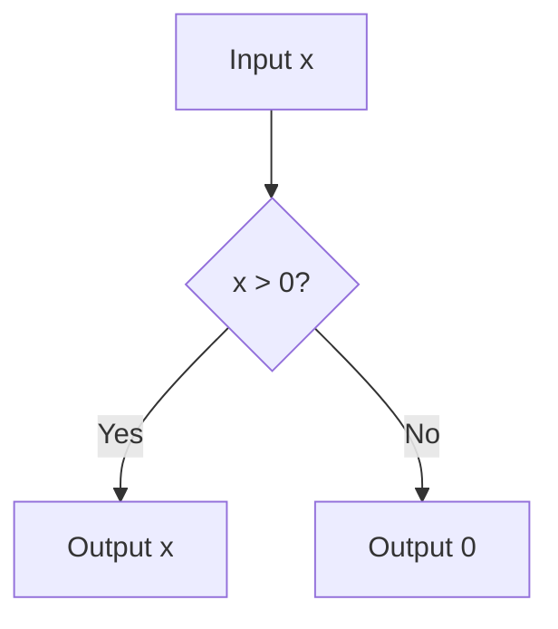
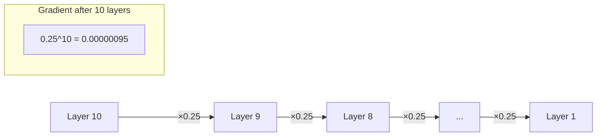
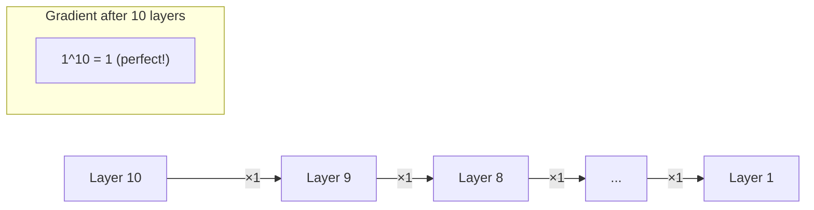
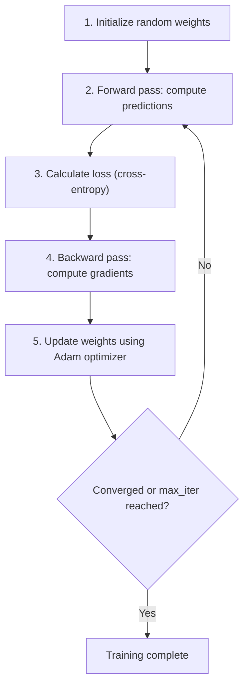
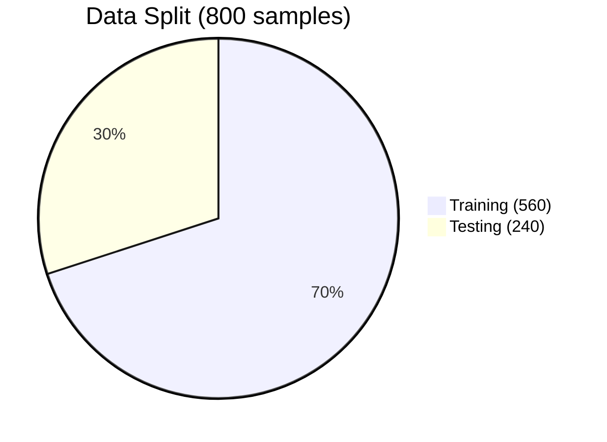

# Concepts Explained: Sigmoid vs ReLU Activation Functions

> **Purpose**: This file is the CORE THEORY + CONCEPT file for understanding all concepts used in the Sigmoid vs ReLU Activation comparison project.

---

## Table of Contents

1. [Activation Functions Overview](#1-activation-functions-overview)
2. [Sigmoid (Logistic) Activation](#2-sigmoid-logistic-activation)
3. [ReLU Activation](#3-relu-activation)
4. [Vanishing Gradient Problem](#4-vanishing-gradient-problem)
5. [MLPClassifier (Neural Network)](#5-mlpclassifier-neural-network)
6. [StandardScaler (Feature Standardization)](#6-standardscaler-feature-standardization)
7. [Train-Test Split](#7-train-test-split)
8. [Loss Function & Loss Curve](#8-loss-function--loss-curve)
9. [Confusion Matrix](#9-confusion-matrix)
10. [Key Library Imports](#10-key-library-imports)

---

## 1. Activation Functions Overview

### 1.1 Definition

> **Simple Definition**: An activation function is a mathematical "gate" that decides whether a neuron should "fire" (activate) or not based on its input.
>
> **Exam-Friendly Wording**: Activation functions introduce non-linearity into neural networks, enabling them to learn complex patterns.

### 1.2 Why It Is Used

| Problem It Solves | Explanation |
|-------------------|-------------|
| Linear limitation | Without activation functions, a neural network is just a linear equation (y = mx + b), unable to learn curves or complex patterns |
| Decision making | Determines which neurons should be active and how much signal to pass forward |
| Feature transformation | Transforms input signals into meaningful representations |

**Why needed in this project**: We're classifying moon-shaped data that requires a curved (non-linear) decision boundary. Without activation functions, our neural network could only draw straight lines!

### 1.3 When to Use It

- **Always** in hidden layers of neural networks
- When the problem requires learning non-linear patterns
- When combining multiple features into complex representations

### 1.4 Where to Use It

| Application | Activation Used |
|-------------|-----------------|
| Hidden layers (modern networks) | ReLU or variants |
| Hidden layers (older networks) | Sigmoid or Tanh |
| Binary classification output | Sigmoid |
| Multi-class classification output | Softmax |
| Regression output | Linear/Identity |

### 1.5 Is This the Only Way?

| Alternative | Description | Why Sigmoid/ReLU Chosen |
|-------------|-------------|-------------------------|
| Tanh | Similar to Sigmoid, outputs -1 to 1 | Still has vanishing gradient |
| Leaky ReLU | ReLU variant, allows small negative values | More complex, not needed for shallow network |
| ELU | Exponential Linear Unit | Computationally expensive |
| Swish | x × sigmoid(x) | Newer, less understood |

**Why Sigmoid and ReLU were chosen**: These are the two most foundational and widely-studied activation functions, perfect for understanding the core concepts.

### 1.6 Explanation with Diagrams



**How a neuron works**:


1. Inputs are multiplied by weights
2. Weighted inputs are summed with bias
3. Sum passes through activation function
4. Output goes to next layer

### 1.7 How to Use It

**In sklearn's MLPClassifier**:
```python
# Syntax
MLPClassifier(activation='logistic')  # For Sigmoid
MLPClassifier(activation='relu')      # For ReLU
```

**Parameter Options**:
- `'identity'` - No transformation (f(x) = x)
- `'logistic'` - Sigmoid function
- `'tanh'` - Hyperbolic tangent
- `'relu'` - Rectified Linear Unit (default)

### 1.8 How It Works Internally

**Step-by-step internal process**:

1. **Forward Pass**: Each neuron computes `output = activation(weights · inputs + bias)`
2. **Backward Pass**: Gradients are computed using the activation's derivative
3. **Weight Update**: Weights are adjusted based on gradients

**Memory/Processing**:
- Sigmoid: Requires exponential calculation (slower)
- ReLU: Simple comparison operation (faster)

### 1.9 Visual Summary

```
ACTIVATION FUNCTIONS AT A GLANCE
================================
                    Sigmoid              ReLU
                    --------             ----
  Formula:          1/(1+e^-x)           max(0, x)
  Output Range:     [0, 1]               [0, ∞)
  Gradient:         Can vanish           Constant (0 or 1)
  Speed:            Slower               Faster
  Modern Usage:     Output layer         Hidden layers
```

### 1.10 Advantages

| Activation | Advantages |
|------------|------------|
| Sigmoid | Smooth gradient, probability output (0-1), good for binary output |
| ReLU | Fast computation, no vanishing gradient, sparse activation |

### 1.11 Disadvantages / Limitations

| Activation | Disadvantages |
|------------|---------------|
| Sigmoid | Vanishing gradient, slow computation, not zero-centered |
| ReLU | Dead neurons (for negative inputs), unbounded output |

### 1.12 Exam & Interview Points

**Key Points to Memorize**:
1. Sigmoid squashes values between 0 and 1
2. ReLU outputs 0 for negative inputs, x for positive
3. Vanishing gradient makes Sigmoid slow for deep networks
4. ReLU is preferred for hidden layers in modern networks
5. Sigmoid is still used for binary classification output layers

**Common Exam Questions**:
- Q: Why is ReLU preferred over Sigmoid?
- A: ReLU doesn't suffer from vanishing gradients and is computationally faster.

**Common Interview Questions**:
- Q: When would you still use Sigmoid?
- A: For binary classification output layers where probability interpretation is needed.

---

## 2. Sigmoid (Logistic) Activation

### 2.1 Definition

> **Simple Definition**: Sigmoid is an S-shaped curve that squeezes any input into a value between 0 and 1.
>
> **Real-life Analogy**: Like a dimmer switch that smoothly controls light from completely off (0) to completely on (1).

**Mathematical Formula**:
```
σ(x) = 1 / (1 + e^(-x))
```

### 2.2 Why It Is Used

| Reason | Explanation |
|--------|-------------|
| Probability output | Values between 0-1 can be interpreted as probabilities |
| Smooth gradient | Differentiable everywhere, required for backpropagation |
| Historical importance | Was the dominant activation in early neural networks |

**Is this the only way?**: No! Tanh is similar but outputs -1 to 1. Softmax is used for multi-class probability output.

### 2.3 When to Use It

✅ **Use Sigmoid when**:
- Binary classification output layer
- You need probability interpretation
- Gating mechanisms (LSTM, GRU)

❌ **Don't use when**:
- Deep hidden layers (vanishing gradient)
- Speed is critical
- You need zero-centered outputs

### 2.4 Where to Use It

| Industry | Application |
|----------|-------------|
| Healthcare | Disease probability prediction |
| Finance | Fraud detection (yes/no probability) |
| Marketing | Customer churn prediction |
| Email | Spam detection |

### 2.5 Is This the Only Way?

| Alternative | When to Use Instead |
|-------------|---------------------|
| Tanh | When you need zero-centered outputs (-1 to 1) |
| ReLU | For hidden layers in deep networks |
| Softmax | For multi-class classification output |

**Why Sigmoid is better for binary output**: Directly interpretable as probability (0.7 = 70% chance of class 1).

### 2.6 How It Works Internally



**Derivative for backpropagation**:
```
σ'(x) = σ(x) × (1 - σ(x))
```

**Problem**: When σ(x) is close to 0 or 1, the derivative becomes very small → **Vanishing Gradient**!

### 2.7 Sample Input/Output

| Input (x) | Output σ(x) | Interpretation |
|-----------|-------------|----------------|
| -10 | 0.00005 | Almost certainly class 0 |
| -2 | 0.12 | Probably class 0 |
| 0 | 0.5 | Uncertain (50/50) |
| 2 | 0.88 | Probably class 1 |
| 10 | 0.99995 | Almost certainly class 1 |

### 2.8 Exam & Interview Points

**Memorize**:
1. Formula: σ(x) = 1/(1+e^(-x))
2. Output range: [0, 1]
3. Derivative: σ(x)(1-σ(x))
4. Problem: Vanishing gradients in deep networks

**Interview Q&A**:
- Q: What's the maximum value of sigmoid's derivative?
- A: 0.25 (at x=0), which shows gradients are always attenuated.

---

## 3. ReLU Activation

### 3.1 Definition

> **Simple Definition**: ReLU (Rectified Linear Unit) outputs the input if positive, otherwise outputs zero.
>
> **Real-life Analogy**: Like a one-way door - positive values pass through unchanged, negative values are blocked (become 0).

**Mathematical Formula**:
```
f(x) = max(0, x)
```

### 3.2 Why It Is Used

| Reason | Explanation |
|--------|-------------|
| Fast computation | Simple comparison (x > 0?) vs exponential |
| No vanishing gradient | Gradient is 1 for positive values |
| Sparse activation | Many neurons output 0, making network efficient |
| Proven success | Dominant in deep learning since 2012 (AlexNet) |

**Is this the only way?**: Variants like Leaky ReLU and ELU exist but ReLU remains the default choice.

### 3.3 When to Use It

✅ **Use ReLU when**:
- Hidden layers of any neural network
- Speed and efficiency matter
- Deep networks (5+ layers)
- Default choice when unsure

❌ **Don't use when**:
- Output layer (use appropriate activation for task)
- Dealing with "dying ReLU" problem (try Leaky ReLU)
- Negative values are meaningful (try Tanh or linear)

### 3.4 Where to Use It

| Industry | Application |
|----------|-------------|
| Computer Vision | CNNs for image classification |
| NLP | Transformer models (BERT, GPT) |
| Speech | Voice recognition systems |
| Games | Reinforcement learning agents |

### 3.5 How It Works Internally



**Derivative for backpropagation**:
```
f'(x) = 1 if x > 0
f'(x) = 0 if x ≤ 0
```

**Why this matters**: Gradient of 1 means perfect gradient flow - no vanishing!

### 3.6 Sample Input/Output

| Input (x) | Output f(x) | Gradient f'(x) |
|-----------|-------------|----------------|
| -5 | 0 | 0 |
| -0.001 | 0 | 0 |
| 0 | 0 | 0 (or undefined) |
| 0.001 | 0.001 | 1 |
| 5 | 5 | 1 |

### 3.7 Comparison: ReLU vs Sigmoid

| Aspect | ReLU | Sigmoid |
|--------|------|---------|
| Computation | 1 comparison | Exponential + division |
| Speed | ~6x faster | Slower |
| Gradient | 0 or 1 | Between 0 and 0.25 |
| Vanishing gradient | No | Yes |
| Output range | [0, ∞) | [0, 1] |
| Sparsity | High (many zeros) | Low (all values used) |
| Modern usage | Hidden layers | Output layer |

### 3.8 Exam & Interview Points

**Memorize**:
1. Formula: f(x) = max(0, x)
2. Gradient: 1 for positive, 0 for negative
3. Advantage: Prevents vanishing gradients
4. Problem: "Dead neurons" - neurons stuck at 0

**Interview Q&A**:
- Q: What is the "dying ReLU" problem?
- A: If a neuron's input is always negative, it always outputs 0, its gradient is always 0, and it never learns (it "dies"). Solution: Use Leaky ReLU.

---

## 4. Vanishing Gradient Problem

### 4.1 Definition

> **Simple Definition**: When gradients become extremely small during backpropagation, making weight updates nearly zero and stopping learning.
>
> **Real-life Analogy**: Like playing telephone with 100 people - by the time the message reaches the end, it's so distorted/quiet that it's useless.

### 4.2 Why It Happens



**The Math**:
- Sigmoid's max gradient = 0.25
- After 10 layers: 0.25^10 ≈ 0.00000095
- This tiny gradient can't update weights meaningfully!

### 4.3 How ReLU Solves It



ReLU's gradient of 1 means gradients flow unchanged through the network!

### 4.4 Why This Matters for Our Project

In our experiment:
- Sigmoid model: Loss decreased slowly after initial epochs
- ReLU model: Loss decreased rapidly and consistently

The loss curves directly show this effect!

### 4.5 Exam & Interview Points

**Memorize**:
1. Sigmoid max gradient = 0.25, multiplied across layers → tiny gradients
2. ReLU gradient = 1 for positive inputs → gradients preserved
3. Solution: Use ReLU for hidden layers

**Interview Q&A**:
- Q: How does vanishing gradient affect training?
- A: Early layers learn very slowly or not at all because weight updates become negligible.

---

## 5. MLPClassifier (Neural Network)

### 5.1 Definition

> **Simple Definition**: MLPClassifier is a neural network from sklearn that learns patterns from data to classify samples into categories.
>
> **Exam-Friendly**: Multi-Layer Perceptron Classifier - a feedforward artificial neural network that uses backpropagation for classification.

### 5.2 Why It Is Used

| Problem It Solves | Explanation |
|-------------------|-------------|
| Non-linear classification | Can learn curved decision boundaries (unlike logistic regression) |
| Complex patterns | Captures intricate relationships between features |
| Scalability | Works on datasets of various sizes |

**Why needed in this project**: The make_moons dataset has a curved boundary that simple classifiers can't learn.

### 5.3 Key Parameters Explained

#### `hidden_layer_sizes=(20, 20)`

| Aspect | Explanation |
|--------|-------------|
| **What** | Tuple defining neurons per hidden layer |
| **Why** | Controls network capacity and complexity |
| **How** | (20, 20) = 2 layers with 20 neurons each |
| **When** | Start small, increase if underfitting |
| **Where** | All MLPClassifier use cases |

**Architecture visualization**:
```
Input (2 features)
      ↓
Hidden Layer 1 (20 neurons — activation applied here)
      ↓
Hidden Layer 2 (20 neurons — activation applied here)
      ↓
Output Layer (2 classes)
```

#### `activation='logistic'` or `activation='relu'`

| Value | Function | Formula |
|-------|----------|---------|
| `'logistic'` | Sigmoid | 1/(1+e^(-x)) |
| `'relu'` | ReLU | max(0, x) |
| `'tanh'` | Tanh | (e^x - e^(-x))/(e^x + e^(-x)) |

#### `max_iter=300`

| Aspect | Explanation |
|--------|-------------|
| **What** | Maximum training iterations (epochs) |
| **Why** | Limits training time, prevents infinite loops |
| **How** | Training stops at 300 or when converged |
| **Default** | 200 |

#### `solver='adam'`

| Solver | When to Use |
|--------|-------------|
| `'adam'` | Default choice, works well for most cases |
| `'sgd'` | When you want to tune learning rate schedule |
| `'lbfgs'` | Small datasets (< 10,000 samples) |

#### `random_state=21`

| Aspect | Explanation |
|--------|-------------|
| **What** | Seed for reproducibility |
| **Why** | Same seed = same results every run |
| **How** | Controls weight initialization and data shuffling |

### 5.4 How It Works Internally



### 5.5 Important Attributes After Training

| Attribute | Description |
|-----------|-------------|
| `loss_curve_` | Loss value at each iteration (for plotting) |
| `n_iter_` | Actual number of iterations used |
| `loss_` | Final loss value |
| `coefs_` | Learned weights |
| `intercepts_` | Learned biases |

### 5.6 Exam & Interview Points

**Memorize**:
1. MLP = Multi-Layer Perceptron
2. Uses backpropagation for learning
3. `hidden_layer_sizes` defines architecture
4. `activation` controls non-linearity
5. `loss_curve_` shows training progress

**Interview Q&A**:
- Q: What's the difference between epochs and iterations in sklearn?
- A: In MLPClassifier, one iteration = one epoch = one pass through entire training data.

---

## 6. StandardScaler (Feature Standardization)

### 6.1 Definition

> **Simple Definition**: StandardScaler transforms features to have mean=0 and standard deviation=1.
>
> **Real-life Analogy**: Like converting different currencies to a common currency for fair comparison.

**Formula**:
```
z = (x - mean) / std
```

### 6.2 Why It Is Used

| Problem | Without Scaling | With Scaling |
|---------|-----------------|--------------|
| Different scales | Feature A: 0-1, Feature B: 0-1000 | Both: roughly -3 to +3 |
| Gradient descent | Zigzag path, slow convergence | Direct path, fast convergence |
| Feature dominance | Large-scale features dominate | All features contribute equally |

**Why needed in this project**: Neural networks are sensitive to feature scales. Without standardization, training would be unstable.

### 6.3 Correct Usage Pattern

```python
# CORRECT: Fit only on training data
scaler = StandardScaler()
X_train_scaled = scaler.fit_transform(X_train)  # Learn mean/std from train
X_test_scaled = scaler.transform(X_test)        # Apply same transformation

# WRONG: Don't fit on test data!
# X_test_scaled = scaler.fit_transform(X_test)  # This causes data leakage!
```

### 6.4 Why fit_transform vs transform?

| Method | When | Why |
|--------|------|-----|
| `fit_transform()` | Training data only | Learns and applies statistics |
| `transform()` | Test/new data | Applies already-learned statistics |

**Data Leakage Prevention**: If we fit on test data, the model "sees" test statistics during training, giving unrealistically good results.

### 6.5 Exam & Interview Points

**Memorize**:
1. Formula: z = (x - μ) / σ
2. Always fit on training data only
3. Neural networks require standardization
4. Prevents feature dominance

**Interview Q&A**:
- Q: Why can't we use MinMaxScaler instead?
- A: We can! But StandardScaler is preferred for neural networks because it handles outliers better and works well with normally distributed data.

---

## 7. Train-Test Split

### 7.1 Definition

> **Simple Definition**: Dividing data into separate sets for training and evaluating the model.
>
> **Real-life Analogy**: Like having practice exams (training) and the final exam (testing) with different questions.

### 7.2 Why It Is Used

| Without Split | With Split |
|---------------|------------|
| Model memorizes training data | Model must generalize |
| 100% "accuracy" on training | True accuracy on unseen data |
| No idea how model performs on new data | Realistic performance estimate |

### 7.3 The 70/30 Split



| Split | Samples | Purpose |
|-------|---------|---------|
| Training (70%) | 560 | Model learns patterns |
| Testing (30%) | 240 | Evaluate generalization |

### 7.4 Parameter: `random_state`

```python
# Same random_state = same split every time
X_train, X_test, y_train, y_test = train_test_split(
    X, y, test_size=0.3, random_state=21
)
```

**Why important**: Reproducibility! Anyone running the code gets identical results.

### 7.5 Exam & Interview Points

**Memorize**:
1. Training set: for learning
2. Test set: for evaluation
3. Never train on test data
4. Common splits: 70/30, 80/20, 60/20/20 (train/val/test)

**Interview Q&A**:
- Q: What's the difference between validation set and test set?
- A: Validation is used during training for hyperparameter tuning; test set is held out until the very end for final evaluation.

---

## 8. Loss Function & Loss Curve

### 8.1 Definition

> **Simple Definition**: Loss measures how wrong the model's predictions are. Lower loss = better predictions.
>
> **Real-life Analogy**: Like a golf score - lower is better!

### 8.2 Cross-Entropy Loss (Used in Classification)

**Formula**:
```
Loss = -[y·log(p) + (1-y)·log(1-p)]
```

Where:
- y = true label (0 or 1)
- p = predicted probability

### 8.3 Loss Curve Interpretation

```
Loss
  |
  |\
  | \      Good training: 
  |  \     Loss decreases steadily
  |   \____________________
  |________________________ Iterations
```

| Curve Shape | Meaning |
|-------------|---------|
| Steep drop, then flat | Normal, healthy training |
| Never decreases | Learning rate too low or model too simple |
| Goes up and down | Learning rate too high |
| Drops then increases | Overfitting (need regularization) |

### 8.4 Our Project's Loss Curves

| Model | Behavior | Explanation |
|-------|----------|-------------|
| ReLU | Steep initial drop | Strong gradients → fast learning |
| Sigmoid | Gradual decrease | Weak gradients → slow learning |

### 8.5 Exam & Interview Points

**Memorize**:
1. Loss = error measure
2. Lower loss = better predictions
3. Cross-entropy for classification, MSE for regression
4. Loss curve shows training progress

---

## 9. Confusion Matrix

### 9.1 Definition

> **Simple Definition**: A table showing where the model got predictions right and wrong.
>
> **Real-life Analogy**: Like a report card showing exactly which topics you passed/failed.

### 9.2 Structure

```
                  Predicted
              |  0  |  1  |
         -----+-----+-----+
    True   0  | TN  | FP  |
         -----+-----+-----+
           1  | FN  | TP  |
         -----+-----+-----+
```

| Term | Meaning | Example |
|------|---------|---------|
| TN (True Negative) | Correctly predicted 0 | Healthy patient, predicted healthy |
| TP (True Positive) | Correctly predicted 1 | Sick patient, predicted sick |
| FP (False Positive) | Wrongly predicted 1 | Healthy patient, predicted sick |
| FN (False Negative) | Wrongly predicted 0 | Sick patient, predicted healthy |

### 9.3 Our Project's Results

**Sigmoid Confusion Matrix**:
```
[[104,  15],
 [ 15, 106]]
```
- 210 correct predictions (104 + 106)
- 30 errors (15 + 15)
- Accuracy: 210/240 = 87.5%

**ReLU Confusion Matrix**:
```
[[112,   7],
 [  3, 118]]
```
- 230 correct predictions (112 + 118)
- 10 errors (7 + 3)
- Accuracy: 230/240 = 95.8%

### 9.4 Exam & Interview Points

**Memorize**:
1. Rows = actual class, Columns = predicted class
2. Diagonal = correct predictions
3. Off-diagonal = errors
4. Accuracy = (TP + TN) / Total

---

## 10. Key Library Imports

### 10.1 NumPy (`import numpy as np`)

| Aspect | Explanation |
|--------|-------------|
| **What** | Numerical computing library |
| **Why** | Fast array operations, used by all ML libraries |
| **How** | `np` is the standard alias |

### 10.2 Matplotlib (`import matplotlib.pyplot as plt`)

| Aspect | Explanation |
|--------|-------------|
| **What** | Plotting library |
| **Why** | Create visualizations (loss curves, confusion matrices) |
| **How** | `plt` is the standard alias |

### 10.3 scikit-learn Imports

| Import | Purpose |
|--------|---------|
| `make_moons` | Generate toy dataset |
| `train_test_split` | Split data |
| `StandardScaler` | Normalize features |
| `MLPClassifier` | Neural network model |
| `accuracy_score` | Calculate accuracy |
| `confusion_matrix` | Generate confusion matrix |
| `ConfusionMatrixDisplay` | Visualize confusion matrix |

### 10.4 Exam & Interview Points

**Memorize**:
1. `np` = NumPy
2. `plt` = matplotlib.pyplot
3. sklearn has preprocessing, model_selection, neural_network, metrics modules

---

## Quick Reference Summary

| Concept | Key Takeaway |
|---------|--------------|
| Sigmoid | S-curve, 0-1 output, vanishing gradients |
| ReLU | max(0,x), fast, no vanishing gradient |
| Vanishing Gradient | Sigmoid shrinks gradients, ReLU preserves them |
| MLPClassifier | sklearn's neural network |
| StandardScaler | Mean=0, Std=1 transformation |
| Train-Test Split | Separate data for learning vs evaluation |
| Loss Curve | Shows training progress |
| Confusion Matrix | Shows where model makes mistakes |

---

*This document follows the CONCEPTS_EXPLAINED structure required by Section 11.2 of the project guidelines.*
