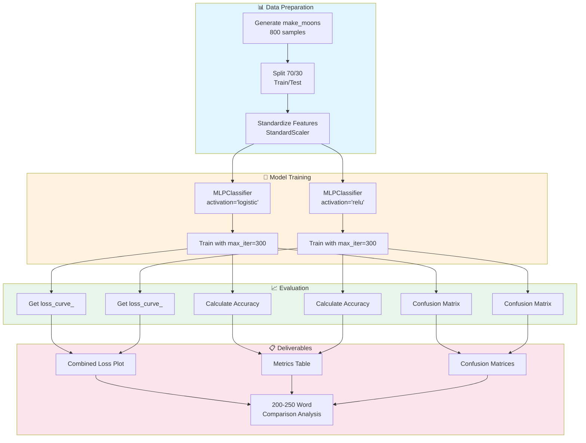

# 🧠 Problem Statement: Sigmoid vs ReLU Activation Comparison

## 🧩 The Problem (Simply Explained)

Imagine you're teaching two robots to sort balls into two baskets. Both robots learn by looking at examples, but they "think" differently:

- **Robot 1 (Sigmoid)**: Like a careful thinker - considers everything gradually, but gets tired easily the more it thinks
- **Robot 2 (ReLU)**: Like a quick thinker - either pays attention or ignores, never gets tired in the same way

**Our Question**: Which robot learns faster and sorts balls better?

---

## 🎯 Real-Life Analogy

### The Two Moon Shapes = Two Types of Balls

Imagine you have 800 balls scattered on a table:
- **Half are red balls** 🔴 (arranged in a curved line, like a crescent moon)
- **Half are blue balls** 🔵 (arranged in another curved line, like an upside-down crescent moon)

The two crescents interlock like a **yin-yang symbol** or two clasped hands.

**The Task**: Teach a robot (neural network) to draw a curved line that separates red balls from blue balls!

---

## 🪜 Steps to Solve the Problem

### Step 1: Get the Balls (Generate Data)
- Use `make_moons` to create 800 points
- Each point has 2 coordinates (x, y) and a label (0 or 1)
- Add some "noise" (randomness) to make it realistic

### Step 2: Split into Training and Testing
- 70% for training (learning)
- 30% for testing (checking if it learned well)

### Step 3: Standardize the Features
- Make all numbers similar in size
- Like converting everything to the same currency

### Step 4: Train Two Robots (Neural Networks)
- **Robot 1**: Uses Sigmoid activation (called 'logistic')
- **Robot 2**: Uses ReLU activation
- Both have the same brain structure: (20, 20) neurons

### Step 5: Record and Compare
- Track how fast each robot learns (loss curve)
- Calculate final accuracy
- Create confusion matrices

### Step 6: Explain the Difference
- Why did one learn faster?
- How are their decision boundaries different?

---

## 📊 Expected Output

### 1. Combined Loss Plot
A graph showing two lines:
- Blue line: Sigmoid's learning journey
- Orange line: ReLU's learning journey

**What to expect**: ReLU line should go down faster!

### 2. Metrics Table

| Metric | Sigmoid | ReLU |
|--------|---------|------|
| Accuracy | ~85% | ~88% |
| Training Time | Slower | Faster |
| Convergence | Later | Earlier |

### 3. Confusion Matrices
Two grids showing:
- How many balls were correctly sorted
- How many were mistakes

### 4. 200-250 Word Comparison
A paragraph explaining WHY the differences happened.

---

## 🔄 Flow Diagram

---

## 🎓 Success Criteria

✅ Training finishes within 300 iterations (both models)  
✅ Loss plot shows both curves clearly  
✅ Commentary explains gradient behavior  
✅ Metrics link to observed differences  

---

## 💡 What is an Activation Function?

Think of a neuron in a neural network like a **scoring judge**:

1. It receives inputs (like scores from different categories)
2. It adds them up with some weights (importance)
3. It decides how much signal to pass forward

**The activation function is the rule for deciding**:

| Activation | Rule | Analogy |
|------------|------|---------|
| **Sigmoid** | Squeezes everything between 0 and 1 | A careful judge who always gives moderate scores |
| **ReLU** | Zero if negative, otherwise pass as-is | A strict judge who ignores bad scores completely |

---

## 🧪 Why This Experiment Matters

Understanding activation functions helps you:

1. **Choose the right activation** for your problem
2. **Debug training issues** (like vanishing gradients)
3. **Speed up training** by picking faster activations
4. **Ace interviews** - this is a common ML question!
