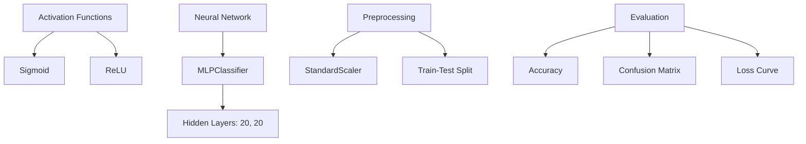
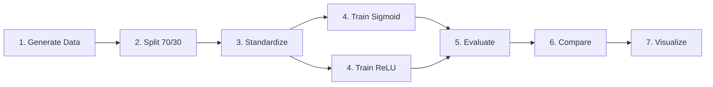
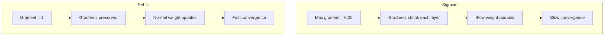

# Sigmoid vs ReLU Activation Functions
## A Comparative Study on Neural Network Activations

---

<!-- slide -->

## 📋 Objective

Compare **Sigmoid** and **ReLU** activation functions in a shallow neural network using the make_moons dataset.

### Learning Goals
- Understand how activation choice affects learning
- Observe the vanishing gradient problem
- Analyze convergence speed differences
- Interpret loss curves and accuracy metrics

---

<!-- slide -->

## 🧩 Problem Statement

### The Challenge
Classify non-linear data (two interleaving half-circles) using neural networks with different activation functions.

### Why It Matters
- Activation functions are the **core of neural learning**
- Wrong choice leads to **slow training** or **poor results**
- Industry moved from Sigmoid to ReLU around 2012

### Key Question
> Why does ReLU train faster and achieve better accuracy than Sigmoid?

---

<!-- slide -->

## 🌍 Real-World Use Case

### Where Activation Functions Impact Results

| Industry | Application | Activation Choice |
|----------|-------------|-------------------|
| Healthcare | Disease prediction | Sigmoid (output) + ReLU (hidden) |
| Finance | Fraud detection | ReLU for speed |
| Computer Vision | Image classification | ReLU (default) |
| NLP | Text classification | ReLU or Tanh |

### Example: Image Recognition
- AlexNet (2012) used ReLU
- Achieved breakthrough accuracy
- Trained **6x faster** than Sigmoid alternatives

---

<!-- slide -->

## 📊 Input Data

### make_moons Dataset

```
Configuration:
├── n_samples: 800 points
├── noise: 0.25 (25% Gaussian noise)
├── Classes: 2 (interleaving half-circles)
└── random_state: 21 (reproducibility)
```

### Data Split
| Set | Samples | Percentage |
|-----|---------|------------|
| Training | 560 | 70% |
| Testing | 240 | 30% |

### Preprocessing
- StandardScaler applied (mean=0, std=1)
- Fit on training, transform test

---

<!-- slide -->

## 🔑 Concepts Used (High Level)



---

<!-- slide -->

## 🧠 Concepts Breakdown

### Sigmoid (Logistic)
| Property | Value |
|----------|-------|
| Formula | σ(x) = 1/(1+e^(-x)) |
| Output Range | [0, 1] |
| Max Gradient | 0.25 |
| Problem | Vanishing gradients |

### ReLU (Rectified Linear Unit)
| Property | Value |
|----------|-------|
| Formula | f(x) = max(0, x) |
| Output Range | [0, ∞) |
| Gradient | 0 or 1 |
| Advantage | No vanishing gradient |

---

<!-- slide -->

## 🔄 Step-by-Step Solution Flow



### Detailed Steps
1. **Generate**: 800 make_moons samples
2. **Split**: 560 train, 240 test
3. **Standardize**: mean=0, std=1
4. **Train**: Two MLPClassifiers (20,20)
5. **Evaluate**: Accuracy, confusion matrix
6. **Compare**: Loss curves, metrics
7. **Visualize**: Plots and analysis

---

<!-- slide -->

## 💻 Code Logic Summary

```python
# 1. Generate data
X, y = make_moons(n_samples=800, noise=0.25)

# 2. Split and scale
X_train, X_test = train_test_split(X, y, test_size=0.3)
scaler = StandardScaler()
X_train = scaler.fit_transform(X_train)

# 3. Train models (ONLY difference is activation)
sigmoid_model = MLPClassifier(
    hidden_layer_sizes=(20, 20),
    activation='logistic'  # ← Sigmoid
)
relu_model = MLPClassifier(
    hidden_layer_sizes=(20, 20),
    activation='relu'      # ← ReLU
)

# 4. Evaluate
accuracy = accuracy_score(y_test, predictions)
```

---

<!-- slide -->

## ⚙️ Important Functions & Parameters

### MLPClassifier

| Parameter | Value | Purpose |
|-----------|-------|---------|
| `hidden_layer_sizes` | (20, 20) | 2 layers, 20 neurons each |
| `activation` | 'logistic'/'relu' | Activation function |
| `max_iter` | 300 | Maximum epochs |
| `solver` | 'adam' | Optimizer |
| `random_state` | 21 | Reproducibility |

### Key Attributes After Training
| Attribute | Description |
|-----------|-------------|
| `loss_curve_` | Loss at each iteration |
| `n_iter_` | Iterations used |
| `loss_` | Final loss value |

---

<!-- slide -->

## 📈 Execution Output

### Metrics Comparison

| Metric | Sigmoid | ReLU | Winner |
|--------|---------|------|--------|
| **Accuracy** | 87.50% | 95.83% | 🏆 ReLU |
| **Final Loss** | 0.3060 | 0.1105 | 🏆 ReLU |
| **Iterations** | 273 | 300 | — |

### Confusion Matrix Summary
| Model | Correct | Errors |
|-------|---------|--------|
| Sigmoid | 210 | 30 |
| ReLU | 230 | 10 |

**ReLU has 67% fewer errors!**

---

<!-- slide -->

## 📉 Loss Curve Analysis

### Visual Comparison

```
Loss
0.8 |\.
    | \______ Sigmoid (gradual)
0.4 |  \
    |   \_________ ReLU (steep then flat)
0.1 |______________
    0    100   200   300  Iterations
```

### Key Observations
1. **ReLU drops faster**: Steep decline in first 50 epochs
2. **Sigmoid is gradual**: Slow, steady descent
3. **ReLU reaches lower loss**: 0.11 vs 0.31

---

<!-- slide -->

## 🔍 Observations & Insights

### Why ReLU Outperformed Sigmoid



### The Math
- **Sigmoid**: 0.25 × 0.25 = 0.0625 (after 2 layers!)
- **ReLU**: 1 × 1 = 1 (perfect gradient flow)

---

<!-- slide -->

## ✅ Advantages & Limitations

### Sigmoid
| ✅ Advantages | ❌ Limitations |
|---------------|----------------|
| Probability output (0-1) | Vanishing gradients |
| Smooth gradient | Slow computation |
| Good for binary output | Not zero-centered |

### ReLU
| ✅ Advantages | ❌ Limitations |
|---------------|----------------|
| No vanishing gradient | Dying neurons possible |
| Fast (just max) | Unbounded output |
| Sparse activation | Not for output layer |

---

<!-- slide -->

## 💼 Interview Key Takeaways

### Must-Know Facts
1. **Sigmoid**: σ(x) = 1/(1+e^-x), output [0,1], gradient ≤ 0.25
2. **ReLU**: max(0,x), gradient = 1 for positive
3. **Vanishing gradients**: Why Sigmoid fails in deep networks
4. **Default choice**: ReLU for hidden, Sigmoid for binary output

### Common Questions
| Question | Short Answer |
|----------|--------------|
| Why prefer ReLU? | No vanishing gradients, faster |
| When use Sigmoid? | Binary output layer |
| What is dying ReLU? | Neurons stuck at 0 |

---

<!-- slide -->

## 🎯 Conclusion

### Summary
- **ReLU achieved 95.83%** vs Sigmoid's **87.50%** (8.33% improvement)
- **ReLU trained faster** with steeper loss curve descent
- **Gradient behavior** is the root cause of the difference

### Recommendations
| Layer Type | Recommended Activation |
|------------|----------------------|
| Hidden layers | ReLU (default) |
| Binary output | Sigmoid |
| Multi-class output | Softmax |

### Final Verdict
> For hidden layers, use ReLU. Reserve Sigmoid for binary classification output layers where probability interpretation is needed.

---

<!-- slide -->

## 📚 Quick Reference Card

```
┌─────────────────────────────────────────┐
│     SIGMOID vs ReLU QUICK REFERENCE     │
├─────────────────────────────────────────┤
│ SIGMOID                                 │
│  • Formula: 1/(1+e^-x)                  │
│  • Range: [0, 1]                        │
│  • Gradient: ≤ 0.25                     │
│  • Use: Binary output layer             │
│  • Problem: Vanishing gradients         │
├─────────────────────────────────────────┤
│ RELU                                    │
│  • Formula: max(0, x)                   │
│  • Range: [0, ∞)                        │
│  • Gradient: 0 or 1                     │
│  • Use: Hidden layers (default)         │
│  • Problem: Dying neurons               │
├─────────────────────────────────────────┤
│ EXPERIMENT RESULTS                      │
│  • ReLU: 95.83% accuracy                │
│  • Sigmoid: 87.50% accuracy             │
│  • Winner: ReLU (+8.33%)                │
└─────────────────────────────────────────┘
```

---

*Sigmoid vs ReLU Activation Comparison | Created following NotebookLM-style guidelines*
