# Concepts Explained: K-Means Cluster Quality Evaluation

This document provides comprehensive explanations of all concepts used in this project, following the 12-point structure.

---

## Table of Contents

1. [K-Means Clustering](#1-k-means-clustering)
2. [Feature Standardization (StandardScaler)](#2-feature-standardization-standardscaler)
3. [Inertia (WCSS)](#3-inertia-wcss)
4. [Silhouette Score](#4-silhouette-score)
5. [Elbow Method](#5-elbow-method)
6. [k-means++ Initialization](#6-k-means-initialization)
7. [Jargon Glossary](#7-jargon-glossary)

---

## 1. K-Means Clustering

### 1.1 Definition

**Simple Definition**: K-Means is a way to group similar things together automatically.

**Technical Definition**: K-Means is an unsupervised machine learning algorithm that partitions n data points into k clusters, where each point belongs to the cluster with the nearest mean (centroid).

**Exam-Friendly**: "K-Means is a clustering algorithm that divides data into k groups by minimizing within-cluster variance."

---

### 1.2 Why It Is Used

**Problem It Solves**: When you have lots of data points and want to find natural groupings without knowing the groups beforehand.

**Why Needed In This Project**: We want to group iris flowers based on their measurements (sepal/petal length & width) without using the actual species labels.

**Real-Life Analogy**: 
Imagine you're a teacher with 30 students, and you want to form study groups. You observe that some students:
- Always sit together
- Have similar test scores
- Like the same subjects

K-Means helps you automatically form groups where students in the same group are similar!

---

### 1.3 When To Use It

| Use K-Means When | Don't Use When |
|------------------|----------------|
| You know the number of clusters | Clusters have weird shapes (use DBSCAN) |
| Clusters are spherical/round | Clusters have very different sizes |
| Data is numeric | Data is categorical |
| You need fast results | Order of data matters (use time series) |

---

### 1.4 Where To Use It


---

### 1.5 Is This The Only Way?

| Algorithm | When Better Than K-Means | When Worse |
|-----------|--------------------------|------------|
| **DBSCAN** | Non-spherical clusters, unknown k | Varying densities |
| **Hierarchical** | Need dendrogram, unknown k | Large datasets |
| **GMM** | Soft clustering needed | Slower |
| **K-Medoids** | Outliers present | Slower |

**Why K-Means Chosen**: Fast, simple, works well for iris dataset (approximately spherical clusters).

---

### 1.6 Explanation with Diagrams

```mermaid
flowchart TD
    subgraph Step1["Step 1: Initialize"]
        A[🎲 Randomly place k centroids]
    end
    
    subgraph Step2["Step 2: Assign"]
        B[📏 Calculate distance from each point to each centroid]
        C[🏷️ Assign each point to nearest centroid]
    end
    
    subgraph Step3["Step 3: Update"]
        D[📍 Move each centroid to mean of assigned points]
    end
    
    subgraph Step4["Step 4: Check"]
        E{Centroids moved?}
        F[✅ Done! Clusters found]
    end
    
    Step1 --> Step2
    B --> C
    Step2 --> Step3
    Step3 --> Step4
    E -->|Yes| Step2
    E -->|No| F
```



**How It Works Step-by-Step**:

1. **Initialize**: Place k random points as initial cluster centers (centroids)
2. **Assign**: For each data point, find the nearest centroid → assign to that cluster
3. **Update**: Move each centroid to the average position of all points in its cluster
4. **Repeat**: Steps 2-3 until centroids stop moving (convergence)

---

### 1.7 How To Use It

**Syntax**:
```python
from sklearn.cluster import KMeans

# Create the model
kmeans = KMeans(n_clusters=3, init='k-means++', n_init='auto', random_state=42)

# Fit to data
kmeans.fit(X)

# Get cluster labels
labels = kmeans.labels_  # [0, 1, 2, 0, 1, ...]

# Get cluster centers
centers = kmeans.cluster_centers_  # 3x4 array
```

**Key Parameters**:
| Parameter | Purpose | Default |
|-----------|---------|---------|
| `n_clusters` | Number of clusters (k) | 8 |
| `init` | Initialization method | 'k-means++' |
| `n_init` | Number of runs | 'auto' |
| `max_iter` | Max iterations | 300 |
| `random_state` | Reproducibility seed | None |

---

### 1.8 How It Works Internally

**Step-by-Step Internal Working**:

1. **Centroid Initialization** (k-means++):
   - Pick first centroid randomly
   - For each subsequent centroid, pick point with probability proportional to squared distance from nearest existing centroid
   
2. **Distance Calculation**:
   - For each point x and centroid c:
   - Distance = √[(x₁-c₁)² + (x₂-c₂)² + ... + (xₙ-cₙ)²] (Euclidean)

3. **Cluster Assignment**:
   - Point goes to cluster with minimum distance

4. **Centroid Update**:
   - New centroid = mean of all assigned points
   - c_new = (1/n) × Σ(all points in cluster)

5. **Convergence Check**:
   - If centroids moved less than tolerance, stop
   - Otherwise, repeat from step 2

---

### 1.9 Visual Summary

```
┌─────────────────────────────────────────────────────────┐
│                    K-MEANS SUMMARY                      │
├─────────────────────────────────────────────────────────┤
│  INPUT:  Data points + number of clusters (k)          │
│  OUTPUT: Cluster labels + centroids                    │
├─────────────────────────────────────────────────────────┤
│  GOAL:   Minimize within-cluster sum of squares (WCSS) │
├─────────────────────────────────────────────────────────┤
│  STEPS:  Initialize → Assign → Update → Repeat         │
└─────────────────────────────────────────────────────────┘
```

---

### 1.10 Advantages

| Advantage | Proof | Real-Life Analogy |
|-----------|-------|-------------------|
| **Fast** | O(n×k×iterations), linear in n | Like sorting laundry by color - quick glance, done! |
| **Simple** | Only 1 hyperparameter (k) | Like choosing how many groups for a game |
| **Scalable** | Works on millions of points | Can organize a huge library |
| **Interpretable** | Centroids are actual data means | Group averages make sense |

---

### 1.11 Disadvantages / Limitations

| Disadvantage | Why It Happens | When It Matters |
|--------------|----------------|-----------------|
| **Must specify k** | Algorithm needs k upfront | Unknown number of natural groups |
| **Sensitive to initialization** | Random start → different results | Need reproducible results |
| **Assumes spherical clusters** | Uses Euclidean distance | Elongated or complex shapes |
| **Sensitive to outliers** | Mean is affected by extremes | Noisy data |

---

### 1.12 Exam & Interview Points

**Key Points to Memorize**:
1. K-Means minimizes inertia (WCSS)
2. Converges to local minimum, not global
3. Time complexity: O(n × k × i × d) where i=iterations, d=dimensions
4. k-means++ gives better initialization than random

**Common Questions**:

Q: "How does K-Means decide cluster membership?"
A: "Each point is assigned to the cluster whose centroid is nearest, using Euclidean distance."

Q: "What is the objective function of K-Means?"
A: "Minimize within-cluster sum of squares (WCSS/inertia): Σᵢ Σₓ∈Cᵢ ||x - μᵢ||²"

Q: "Why won't K-Means always find the global optimum?"
A: "Because it uses gradient descent which can get stuck in local minima depending on initial centroid positions."

---

## 2. Feature Standardization (StandardScaler)

### 2.1 Definition

**Simple Definition**: Making all measurements use the same "scoring system" so they're fair to compare.

**Technical Definition**: StandardScaler transforms features by subtracting the mean and dividing by the standard deviation, resulting in features with mean=0 and std=1.

**Formula**: z = (x - μ) / σ

---

### 2.2 Why It Is Used

**Problem It Solves**: Features have different scales (e.g., age: 0-100, salary: 0-1,000,000).

**Why Needed In This Project**: 
- Sepal length: ~5-8 cm
- Petal width: ~0-2.5 cm

Without standardization, sepal length would dominate K-Means distance calculations!

**Real-Life Analogy**: 
If you compare a student's Math score (out of 100) with their Essay score (out of 10), the Math score seems 10× more important. Standardization is like converting both to percentages so they're fair!

---

### 2.3 When To Use It

| Use StandardScaler | Don't Use |
|--------------------|-----------|
| Distance-based algorithms (K-Means, KNN) | Tree-based algorithms (Random Forest) |
| Neural networks | Already normalized data |
| PCA, gradient descent | Categorical features |

---

### 2.4 Where To Use It

- **Machine Learning preprocessing**
- **Feature engineering pipelines**
- **Before any distance calculation**
- **Neural network inputs**

---

### 2.5 Is This The Only Way?

| Scaler | Formula | When To Use |
|--------|---------|-------------|
| **StandardScaler** | (x-μ)/σ | Normal distribution, no bounded range |
| **MinMaxScaler** | (x-min)/(max-min) | Need 0-1 range, known bounds |
| **RobustScaler** | (x-median)/IQR | Outliers present |
| **MaxAbsScaler** | x/max(|x|) | Sparse data |

**Why StandardScaler Chosen**: Iris data is approximately normally distributed, no extreme outliers.

---

### 2.6 Explanation with Diagrams

```mermaid
flowchart LR
    subgraph Before["Before Standardization"]
        A1[Sepal Length<br/>4.3 - 7.9 cm]
        A2[Sepal Width<br/>2.0 - 4.4 cm]
        A3[Petal Length<br/>1.0 - 6.9 cm]
        A4[Petal Width<br/>0.1 - 2.5 cm]
    end
    
    subgraph Transform["StandardScaler"]
        B["z = (x - μ) / σ"]
    end
    
    subgraph After["After Standardization"]
        C1[Sepal Length<br/>-1.87 to 2.49]
        C2[Sepal Width<br/>-2.43 to 3.09]
        C3[Petal Length<br/>-1.57 to 1.78]
        C4[Petal Width<br/>-1.44 to 1.71]
    end
    
    Before --> Transform --> After
```



---

### 2.7 How To Use It

```python
from sklearn.preprocessing import StandardScaler

# Create scaler
scaler = StandardScaler()

# Fit (learn μ, σ) and transform (apply formula)
X_scaled = scaler.fit_transform(X)

# Or separately:
scaler.fit(X_train)           # Learn from training data
X_train_scaled = scaler.transform(X_train)
X_test_scaled = scaler.transform(X_test)  # Use same μ, σ
```

---

### 2.8 How It Works Internally

1. **Fit**:
   - Calculate mean for each column: μⱼ = (1/n) × Σxᵢⱼ
   - Calculate std for each column: σⱼ = √[(1/n) × Σ(xᵢⱼ - μⱼ)²]

2. **Transform**:
   - For each value: zᵢⱼ = (xᵢⱼ - μⱼ) / σⱼ

---

### 2.9 Visual Summary

```
┌────────────────────────────────────────────────────────┐
│              STANDARDSCALER SUMMARY                    │
├────────────────────────────────────────────────────────┤
│  INPUT:  Raw features with different scales            │
│  OUTPUT: Scaled features with mean=0, std=1            │
├────────────────────────────────────────────────────────┤
│  FORMULA: z = (x - mean) / standard_deviation          │
├────────────────────────────────────────────────────────┤
│  REMEMBER: Fit on TRAIN, Transform on BOTH             │
└────────────────────────────────────────────────────────┘
```

---

### 2.10 Advantages

| Advantage | Proof |
|-----------|-------|
| **Fair comparison** | All features contribute equally |
| **Faster convergence** | Gradient descent works better |
| **Required by many algorithms** | K-Means, SVM, Neural Networks |

---

### 2.11 Disadvantages / Limitations

| Disadvantage | Solution |
|--------------|----------|
| **Destroys original scale** | Keep original copy |
| **Sensitive to outliers** | Use RobustScaler instead |
| **Must store μ, σ** | Save scaler object |

---

### 2.12 Exam & Interview Points

Q: "Why must you fit_transform on training data but only transform on test data?"
A: "To prevent data leakage - test data must not influence the scaling parameters."

Q: "What happens if you don't standardize before K-Means?"
A: "Features with larger scales dominate distance calculations, leading to poor clusters."

---

## 3. Inertia (WCSS)

### 3.1 Definition

**Simple Definition**: How "spread out" points are within their clusters. Lower = tighter clusters.

**Technical Definition**: Inertia (Within-Cluster Sum of Squares) is the sum of squared distances from each point to its assigned centroid.

**Formula**: Inertia = Σᵢ Σₓ∈Cᵢ ||x - μᵢ||²

---

### 3.2 Why It Is Used

**Problem It Solves**: Need a number to measure cluster "tightness" or "cohesion".

**Why Needed In This Project**: To compare different k values - which k gives tighter clusters?

**Analogy**: Like measuring how close students sit to their group leader. Lower = students are closer to their leader!

---

### 3.3 When To Use It

- **Finding optimal k** (Elbow method)
- **Comparing clustering results**
- **Tracking K-Means convergence**

---

### 3.4 Where To Use It

- Elbow method for k selection
- Model comparison
- Clustering quality assessment

---

### 3.5 Is This The Only Way?

| Metric | Measures | Better for |
|--------|----------|------------|
| **Inertia** | Within-cluster tightness only | Elbow method |
| **Silhouette** | Tightness + separation | Overall quality |
| **Calinski-Harabasz** | Ratio of between/within variance | Compact, separated |
| **Davies-Bouldin** | Average cluster similarity | Lower = better |

---

### 3.6 Explanation with Diagrams

```mermaid
flowchart TD
    subgraph Cluster1["Cluster 1"]
        C1((Centroid 1))
        P1((Point A))
        P2((Point B))
        P3((Point C))
    end
    
    C1 -.- |"d₁²"| P1
    C1 -.- |"d₂²"| P2
    C1 -.- |"d₃²"| P3
    
    Result["Inertia for Cluster 1 = d₁² + d₂² + d₃²"]
    
    Cluster1 --> Result
```



**Total Inertia** = Sum of inertia for all clusters

---

### 3.7 How To Use It

```python
# After fitting KMeans
kmeans.fit(X)

# Access inertia
inertia = kmeans.inertia_
print(f"Inertia: {inertia}")
```

---

### 3.8 How It Works Internally

1. For each cluster i with centroid μᵢ:
   - For each point x in cluster i:
     - Calculate squared distance: ||x - μᵢ||²
   - Sum all squared distances

2. Sum across all clusters

---

### 3.9 Visual Summary

```
LOW INERTIA:                    HIGH INERTIA:
  Points clustered tightly        Points spread out
         ●●●                         ●    ●
         ●●●                       ●   ●     ●
        [Centroid]                 [Centroid]
```

---

### 3.10 Advantages

| Advantage | Why |
|-----------|-----|
| **Built into K-Means** | Objective function it minimizes |
| **Easy to interpret** | Lower = tighter clusters |
| **Fast to compute** | Already calculated during fitting |

---

### 3.11 Disadvantages / Limitations

| Disadvantage | Why |
|--------------|-----|
| **Always decreases with k** | More clusters = smaller inertia (even if meaningless) |
| **Doesn't measure separation** | Good inertia doesn't mean well-separated |
| **Scale dependent** | Must standardize first |

---

### 3.12 Exam & Interview Points

Q: "Why does inertia always decrease as k increases?"
A: "With more clusters, points are closer to their centroids. At k=n, every point is its own cluster with inertia=0."

Q: "What's the relationship between inertia and K-Means objective?"
A: "K-Means minimizes inertia - it's the exact objective function."

---

## 4. Silhouette Score

### 4.1 Definition

**Simple Definition**: How well each point fits in its cluster vs. the next best cluster. Range: -1 to +1.

**Technical Definition**: For each sample, silhouette = (b - a) / max(a, b), where:
- a = mean distance to other points in same cluster
- b = mean distance to points in nearest other cluster

---

### 4.2 Why It Is Used

**Problem It Solves**: Need a single number that considers BOTH cohesion AND separation.

**Why Needed**: Unlike inertia, silhouette tells us if clusters are actually distinct from each other.

**Analogy**: 
- a = How well you know your classmates
- b = How well you know the next closest class
- If you know your classmates much better → High silhouette → You're in the right class!

---

### 4.3 When To Use It

- Choosing optimal k
- Validating cluster quality
- Detecting misclassified points

---

### 4.4 Where To Use It

- Any clustering task
- Cluster validation
- k selection when elbow is unclear

---

### 4.5 Is This The Only Way?

Silhouette is preferred when:
- You need a single interpretable metric
- You want to check individual point assignments
- Elbow method is unclear

---

### 4.6 Explanation with Diagrams


---

### 4.7 How To Use It

```python
from sklearn.metrics import silhouette_score, silhouette_samples

# Overall score (average)
score = silhouette_score(X, labels)

# Per-sample scores
sample_scores = silhouette_samples(X, labels)
```

---

### 4.8 How It Works Internally

For each point i:

1. Calculate **a(i)**: mean distance to all other points in same cluster
2. Calculate **b(i)**: mean distance to all points in the NEAREST other cluster
3. Calculate **s(i)** = (b(i) - a(i)) / max(a(i), b(i))

Final score = mean of all s(i)

---

### 4.9 Visual Summary

```
┌─────────────────────────────────────────────────────────┐
│              SILHOUETTE INTERPRETATION                  │
├─────────────────────────────────────────────────────────┤
│  +1.0  │  Perfect! Far from others, close to own       │
│  +0.5  │  Good clustering                              │
│   0.0  │  On cluster boundary                          │
│  -0.5  │  Probably in wrong cluster                    │
│  -1.0  │  Definitely in wrong cluster                  │
└─────────────────────────────────────────────────────────┘
```

---

### 4.10 Advantages

| Advantage | Proof |
|-----------|-------|
| **Bounded range** | -1 to +1 easy to interpret |
| **Considers separation** | Unlike inertia |
| **Per-sample analysis** | Find misclassified points |

---

### 4.11 Disadvantages / Limitations

| Disadvantage | Why |
|--------------|-----|
| **Slower** | O(n²) pairwise distances |
| **Assumes convex clusters** | Like K-Means |
| **Can give high score for wrong k** | Doesn't guarantee correct k |

---

### 4.12 Exam & Interview Points

Q: "What does a negative silhouette score mean?"
A: "The point is closer to another cluster than its own - likely misclassified."

Q: "Which is better: high inertia or high silhouette?"
A: "LOW inertia (tighter clusters), HIGH silhouette (better separated)."

---

## 5. Elbow Method

### 5.1 Definition

**Simple Definition**: A visual method to find the best k by looking for the "elbow" in the inertia plot.

**Technical Definition**: Plot inertia vs k; the optimal k is where the curve bends (elbow point) - where increasing k gives diminishing returns.

---

### 5.2 Why It Is Used

**Problem**: How to choose k when we don't know the true number of clusters?

**Solution**: Find where additional clusters stop giving significant improvement.

**Analogy**: Like adding salt to food - first few pinches make a big difference, but after a point, more salt doesn't help much. The "elbow" is where you should stop!

---

### 5.3 When To Use It

- K-Means k selection
- Any algorithm requiring number of clusters
- Quick visual analysis

---

### 5.4 Where To Use It

- Exploratory data analysis
- Hyperparameter tuning
- Model selection

---

### 5.5 Is This The Only Way?

| Method | Type | Better When |
|--------|------|-------------|
| **Elbow** | Visual | Quick analysis, clear bend |
| **Silhouette** | Quantitative | Need definitive answer |
| **Gap Statistic** | Statistical | Rigorous comparison to random |
| **Domain Knowledge** | Expert | You know the actual groups |

---

### 5.6 Explanation with Diagrams

```mermaid
graph LR
    subgraph Plot["Elbow Plot"]
        k2["k=2"]
        k3["k=3 ← ELBOW"]
        k4["k=4"]
        k5["k=5"]
        k6["k=6"]
    end
    
    k2 -->|"Steep drop"| k3
    k3 -->|"Gradual"| k4
    k4 -->|"Gradual"| k5
    k5 -->|"Gradual"| k6
```



---

### 5.7 How To Use It

```python
inertias = []
K_range = range(2, 11)

for k in K_range:
    kmeans = KMeans(n_clusters=k)
    kmeans.fit(X)
    inertias.append(kmeans.inertia_)

plt.plot(K_range, inertias, 'bo-')
plt.xlabel('k')
plt.ylabel('Inertia')
plt.title('Elbow Method')
plt.show()
```

---

### 5.8 How It Works Internally

1. Run K-Means for each k value
2. Record inertia for each k
3. Plot k vs inertia
4. Find the "elbow" - where curve bends

---

### 5.9 Visual Summary

```
Inertia │
        │●
        │  ●
        │    ●  ← Elbow point (optimal k)
        │      ●───●───●───●
        └────────────────────── k
         2  3  4  5  6  7  8
```

---

### 5.10 Advantages

| Advantage | Why |
|-----------|-----|
| **Visual/intuitive** | Easy to explain |
| **Fast** | Just need inertia values |
| **Works for most cases** | Common first approach |

---

### 5.11 Disadvantages / Limitations

| Disadvantage | Solution |
|--------------|----------|
| **Subjective** | Use silhouette too |
| **May be unclear** | Combine with other methods |
| **Doesn't consider separation** | Add silhouette analysis |

---

### 5.12 Exam & Interview Points

Q: "Why is it called the 'elbow' method?"
A: "The optimal k is at the 'elbow' point where the curve bends, like a human elbow."

Q: "What if there's no clear elbow?"
A: "Use silhouette score, gap statistic, or domain knowledge to decide."

---

## 6. k-means++ Initialization

### 6.1 Definition

**Simple Definition**: A smart way to pick starting points that are spread out.

**Technical Definition**: An initialization algorithm that selects initial centroids with probability proportional to squared distance from nearest existing centroid.

---

### 6.2 Why It Is Used

**Problem**: Random initialization can put centroids close together → bad final clusters.

**Solution**: k-means++ spreads centroids far apart initially.

**Analogy**: If opening 3 coffee shops in a city, you wouldn't put them all on the same street! k-means++ spreads them across the city first.

---

### 6.3 When To Use It

- Always with K-Means (it's the default!)
- Any centroid-based clustering

---

### 6.4 Where To Use It

- Default in scikit-learn KMeans
- Any K-Means implementation

---

### 6.5 Is This The Only Way?

| Initialization | Description | When to Use |
|----------------|-------------|-------------|
| **k-means++** | Spread out initial centroids | Default, best general choice |
| **random** | Randomly pick k points | Fast, less predictable |
| **k-means\|\|** | Parallel version | Very large datasets |

---

### 6.6 Explanation with Diagrams

```mermaid
flowchart TD
    A[1. Pick first centroid randomly] --> B[2. For each remaining centroid:]
    B --> C[Calculate D²: squared distance to nearest centroid]
    C --> D[Pick point with probability ~ D²]
    D --> E[Repeat until k centroids chosen]
    E --> F[Start K-Means algorithm]
```



---

### 6.7 How To Use It

```python
# k-means++ is DEFAULT
kmeans = KMeans(n_clusters=3, init='k-means++')

# Explicit random (not recommended)
kmeans = KMeans(n_clusters=3, init='random')
```

---

### 6.8 How It Works Internally

1. Choose first centroid uniformly at random
2. For each remaining centroid:
   - Calculate D(x) = distance from x to nearest centroid
   - Choose next centroid with probability ∝ D(x)²
3. Proceed with standard K-Means

---

### 6.9 Visual Summary

```
Random Init:              k-means++ Init:
  × ×                       ×
  (both in corner)              
                                    ×
                                        ×
  (poor start)              (spread out - good!)
```

---

### 6.10 Advantages

| Advantage | Proof |
|-----------|-------|
| **Better final clusters** | Shown in research papers |
| **Faster convergence** | Fewer iterations needed |
| **More reproducible** | Less variance in results |

---

### 6.11 Disadvantages / Limitations

| Disadvantage | Why |
|--------------|-----|
| **Slightly slower init** | O(n×k) vs O(k) |
| **Still not optimal** | Just better than random |

---

### 6.12 Exam & Interview Points

Q: "How does k-means++ differ from random initialization?"
A: "k-means++ selects centroids that are far apart, using probability proportional to squared distance. Random picks uniformly."

Q: "Why probability proportional to D² instead of D?"
A: "D² emphasizes distant points more strongly, ensuring better spread."

---

## 7. Jargon Glossary

| Term | Simple Explanation |
|------|-------------------|
| **Cluster** | A group of similar things |
| **Centroid** | The "center" of a cluster (mean point) |
| **Inertia** | How spread out points are in their clusters |
| **Silhouette** | Score showing if points are in the right cluster |
| **WCSS** | Within-Cluster Sum of Squares (same as inertia) |
| **Convergence** | When the algorithm stops because nothing changes |
| **Euclidean Distance** | Straight-line distance between two points |
| **Feature** | A measurement or characteristic (column) |
| **Sample** | One data point (row) |
| **Standardization** | Making features comparable by scaling |
| **n_clusters** | Number of groups (k) |
| **init** | Method to pick starting centroids |
| **n_init** | How many times to run with different starts |
| **Labels** | Which cluster each point belongs to |
| **fit()** | Learn from data |
| **transform()** | Apply what was learned |
| **fit_transform()** | Learn and apply in one step |
| **Elbow Point** | Where the curve bends (optimal k) |
| **Unsupervised** | Learning without labels (no "right answer") |
