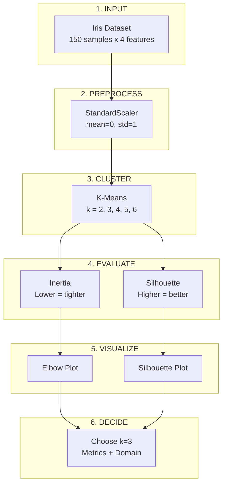

# Interview Preparation: Quick Revision Sheet

---

## 1. High-Level Project Summary

### Problem (2-3 lines)
We have 150 iris flowers with 4 measurements each. We want to find the optimal number of clusters (k) using K-Means, evaluating quality with inertia and silhouette metrics.

### Solution Approach (4 bullets)
- Standardized features using StandardScaler
- Ran K-Means for k = 2, 3, 4, 5, 6
- Evaluated using inertia (elbow method) and silhouette score
- Chose k=3 based on metrics + domain knowledge (3 iris species)

---

## 2. Core Concepts - Interview View

### K-Means Clustering
| Aspect | Answer |
|--------|--------|
| What | Algorithm to group similar data points |
| Why | Find patterns without labels |
| When to use | Numeric data, known k, spherical clusters |
| When NOT | Unknown k, non-spherical clusters, outliers |

### StandardScaler
| Aspect | Answer |
|--------|--------|
| What | Transforms features to mean=0, std=1 |
| Why | Fair distance calculations |
| When to use | Before K-Means, KNN, Neural Networks |
| When NOT | Tree-based algorithms, categorical data |

### Inertia
| Aspect | Answer |
|--------|--------|
| What | Sum of squared distances to centroids |
| Why | Measure cluster tightness |
| When to use | Elbow method for k selection |
| When NOT | As sole metric (doesn't measure separation) |

### Silhouette Score
| Aspect | Answer |
|--------|--------|
| What | Measures cohesion + separation (-1 to +1) |
| Why | Single metric for cluster quality |
| When to use | Validating clusters, finding optimal k |
| When NOT | Very large datasets (O(n²) complexity) |

---

## 3. Key Terms Glossary

| Term | Definition |
|------|------------|
| **Cluster** | Group of similar data points |
| **Centroid** | Center point of a cluster |
| **Inertia** | WCSS - cluster tightness measure |
| **Silhouette** | Cluster quality score (-1 to +1) |
| **Elbow Point** | Where inertia curve bends |
| **k-means++** | Smart centroid initialization |
| **WCSS** | Within-Cluster Sum of Squares |
| **n_init** | Number of K-Means restarts |
| **Convergence** | When centroids stop moving |
| **Unsupervised** | Learning without labels |

---

## 4. Top 10 Points to Remember

1. **K-Means minimizes INERTIA** (not silhouette)
2. **Standardize BEFORE clustering** (not after)
3. **Silhouette range**: -1 to +1 (higher = better)
4. **Inertia ALWAYS decreases** as k increases
5. **k-means++ is default** and better than random
6. **K-Means finds LOCAL minimum**, not global
7. **fit() on train, transform() on both** train and test
8. **Negative silhouette** = point in wrong cluster
9. **Elbow point** = where diminishing returns start
10. **Domain knowledge** can override metrics

---

## 5. Comparison Tables

### Inertia vs Silhouette

| Aspect | Inertia | Silhouette |
|--------|---------|------------|
| Measures | Cohesion only | Cohesion + Separation |
| Range | 0 to ∞ | -1 to +1 |
| Goal | Lower | Higher |
| k trend | Always decreases | Can peak |
| Used for | Elbow method | Overall quality |

### StandardScaler vs MinMaxScaler

| Aspect | StandardScaler | MinMaxScaler |
|--------|----------------|--------------|
| Formula | (x-μ)/σ | (x-min)/(max-min) |
| Range | Unbounded | 0 to 1 |
| Use when | Normal distribution | Need bounded range |
| Outliers | Sensitive | Very sensitive |

### fit() vs transform() vs fit_transform()

| Method | Does | When to Use |
|--------|------|-------------|
| fit() | Learns parameters | Training data |
| transform() | Applies learned params | Test data |
| fit_transform() | Both | Training data (shortcut) |

### K-Means vs DBSCAN

| Aspect | K-Means | DBSCAN |
|--------|---------|--------|
| k required | Yes | No |
| Cluster shape | Spherical | Any shape |
| Handles outliers | Poorly | Well |
| Speed | Fast | Medium |

---

## 6. Cheat Sheet

```
STANDARDSCALER:
  z = (x - mean) / std
  Result: mean=0, std=1

K-MEANS:
  kmeans = KMeans(n_clusters=3, init='k-means++', random_state=42)
  kmeans.fit(X_scaled)
  labels = kmeans.labels_
  inertia = kmeans.inertia_

SILHOUETTE:
  s = (b - a) / max(a, b)
  a = distance to own cluster
  b = distance to nearest other
  Range: -1 (wrong) to +1 (perfect)

ELBOW METHOD:
  Plot inertia vs k
  Find "bend" in curve
  That's optimal k

KEY SKLEARN IMPORTS:
  from sklearn.preprocessing import StandardScaler
  from sklearn.cluster import KMeans
  from sklearn.metrics import silhouette_score
  from sklearn.datasets import load_iris
```

---

## 7. Mermaid Summary Diagram



---

## 8. Common Interview Questions - Quick Answers

| Question | Quick Answer |
|----------|--------------|
| "What is K-Means?" | Clustering algorithm that groups n points into k clusters by minimizing inertia |
| "Why standardize?" | Ensures equal feature contribution in distance calculations |
| "What's inertia?" | Sum of squared distances from points to cluster centroids |
| "What's silhouette?" | Score from -1 to +1 measuring clustering quality |
| "Elbow method?" | Visual technique to find optimal k where inertia curve bends |
| "k-means++?" | Smart initialization that spreads initial centroids apart |
| "Global vs local minimum?" | K-Means finds local minimum, not guaranteed global |
| "Why k=3 over k=2?" | Domain knowledge - Iris has 3 actual species |
| "n_init purpose?" | Run algorithm multiple times, keep best result |
| "Negative silhouette?" | Point likely in wrong cluster |

---

## 9. 30-Second Summary

> K-Means clustering groups data into k clusters by minimizing within-cluster distances (inertia). Before clustering, standardize features so all contribute equally. Use the Elbow Method (inertia vs k plot) to find optimal k where curve bends. Validate with silhouette score (-1 to +1, higher = better). For Iris data with 3 species, we chose k=3 despite k=2 having higher silhouette, demonstrating that domain knowledge can override metrics.

---

## 10. Day-Before-Interview Checklist

- [ ] Can explain K-Means in 30 seconds
- [ ] Know formula: z = (x - μ) / σ
- [ ] Know silhouette formula: s = (b-a)/max(a,b)
- [ ] Understand elbow method visually
- [ ] Know k-means++ vs random initialization
- [ ] Can explain why we chose k=3
- [ ] Remember: inertia↓ as k↑, silhouette can peak
- [ ] Know fit() vs transform() difference
- [ ] Can draw simple K-Means diagram
- [ ] Ready for "why not k=2?" question
