# Interview Questions: K-Means Cluster Quality Evaluation

This document contains 20 interview questions covering all concepts in this project.

---

## Question 1: What is K-Means Clustering?

### Simple Answer (for 10-year-old):
K-Means is like sorting your toys into k different boxes, where each box has similar toys. The algorithm finds the best way to group things that look alike!

### Technical Answer (for interviewer):
K-Means is an unsupervised machine learning algorithm that partitions n observations into k clusters by minimizing within-cluster variance (inertia). It iteratively assigns points to the nearest centroid and updates centroids to the mean of assigned points until convergence.

### Mermaid Diagram:
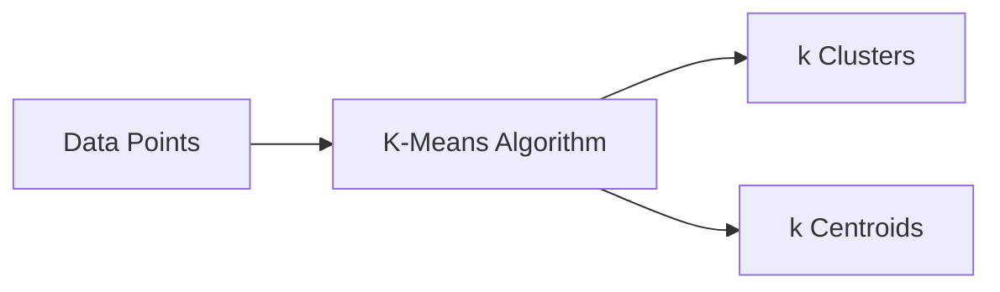

### Real-Life Analogy:
Imagine organizing a playground into groups for different games. K-Means automatically puts kids who like similar things together!

### Common Mistakes:
- Forgetting to specify k (it's required!)
- Not standardizing features first
- Assuming it always finds the best solution (it finds local minimum)

### Key Points:
- Unsupervised (no labels needed)
- Must specify k beforehand
- Uses Euclidean distance
- Converges to local, not global minimum

---

## Question 2: Why do we standardize features before K-Means?

### Simple Answer:
If one measurement is in centimeters and another in kilometers, the big numbers will unfairly dominate. Standardizing makes everything "fair play"!

### Technical Answer:
K-Means uses Euclidean distance. Features with larger scales will dominate distance calculations. StandardScaler transforms features to have mean=0 and std=1, ensuring equal contribution from all features.

### Mermaid Diagram:
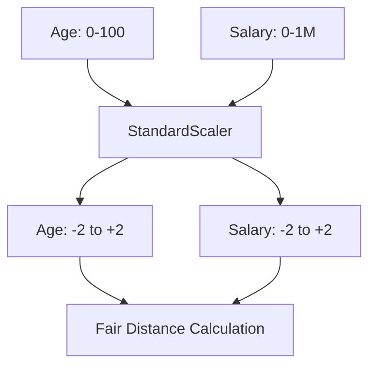

### Real-Life Analogy:
Like converting dollars to rupees before comparing - you need the same "currency" to compare prices!

### Common Mistakes:
- Fitting scaler on test data (data leakage!)
- Not saving the scaler for new data
- Standardizing categorical features

### Key Points:
- Formula: z = (x - μ) / σ
- Fit on train, transform on both train and test
- Essential for distance-based algorithms

---

## Question 3: What is Inertia in K-Means?

### Simple Answer:
Inertia measures how close students are to their group leader. Lower inertia = students sitting closer to their leader = tighter groups!

### Technical Answer:
Inertia (WCSS - Within-Cluster Sum of Squares) is the sum of squared distances from each point to its assigned cluster centroid. It's the objective function that K-Means minimizes.

**Formula**: Inertia = Σᵢ Σₓ∈Cᵢ ||x - μᵢ||²

### Mermaid Diagram:
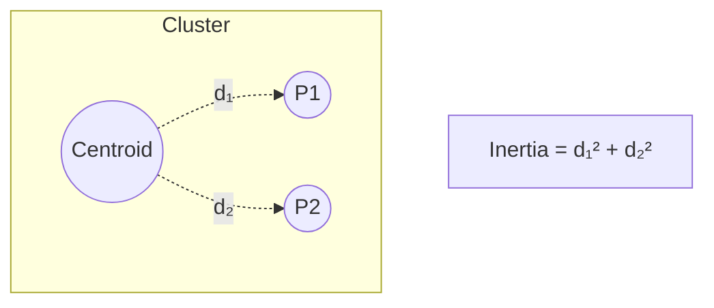

### Real-Life Analogy:
Like measuring how far kids in a study group are from the group's meeting point. Closer = better group!

### Common Mistakes:
- Thinking lower is always better (can lead to overfitting)
- Not considering that inertia ALWAYS decreases with more k

### Key Points:
- Lower = tighter clusters
- Always decreases as k increases
- Access via `kmeans.inertia_`

---

## Question 4: What is Silhouette Score?

### Simple Answer:
It's like asking each student: "Do you feel you belong in your group?" A high score means "Yes, I love my group!" A low score means "I might belong elsewhere."

### Technical Answer:
Silhouette score measures how similar a point is to its own cluster compared to other clusters. Range: -1 to +1.

**Formula**: s(i) = (b(i) - a(i)) / max(a(i), b(i))
- a(i) = mean distance to points in same cluster
- b(i) = mean distance to nearest other cluster

### Mermaid Diagram:
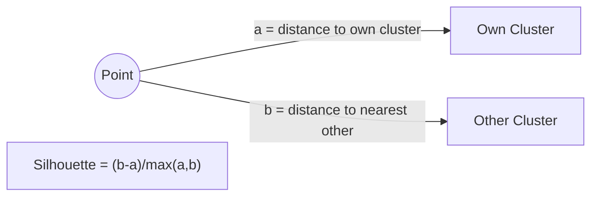

### Real-Life Analogy:
If you know your classmates well (low a) and don't know other classes (high b), you're in the right class!

### Common Mistakes:
- Thinking only positive scores are valid (negative = likely misclassified)
- Using only silhouette without domain knowledge

### Key Points:
- Range: -1 to +1
- Higher = better clustering
- +1 = perfect, 0 = boundary, -1 = wrong cluster

---

## Question 5: What is the Elbow Method?

### Simple Answer:
Plot how "tight" groups are vs number of groups. Find where adding more groups stops helping much - that's the "elbow"!

### Technical Answer:
The Elbow Method plots inertia vs k and identifies the point where the rate of decrease sharply changes (elbow point), indicating optimal k.

### Mermaid Diagram:
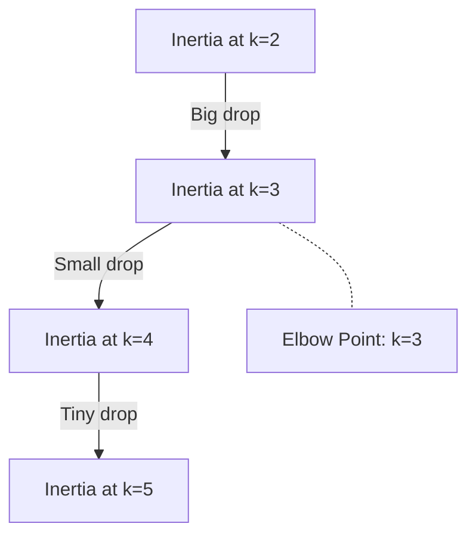

### Real-Life Analogy:
Like adding ice to a hot drink - first few cubes cool it a lot, but later cubes barely help. Stop at the "elbow"!

### Common Mistakes:
- Expecting a clear elbow always (sometimes it's not obvious)
- Using only elbow without other validation

### Key Points:
- Visual method
- Find where diminishing returns start
- Combine with silhouette for better decision

---

## Question 6: What is k-means++ initialization?

### Simple Answer:
Instead of randomly picking starting points, pick them far apart from each other. Like opening stores in different neighborhoods, not all on one street!

### Technical Answer:
k-means++ selects initial centroids with probability proportional to D²(x), where D(x) is the distance to the nearest existing centroid. This ensures well-spread initial centroids.

### Mermaid Diagram:
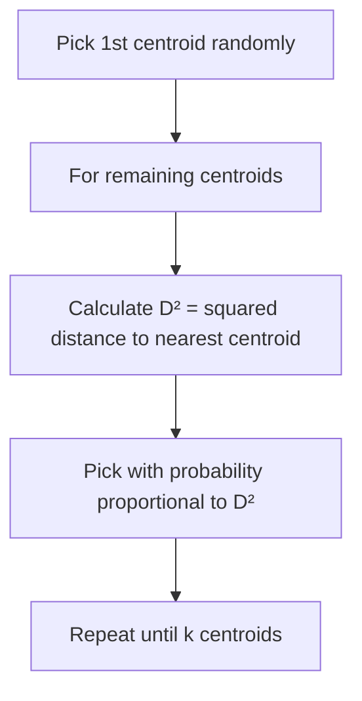

### Real-Life Analogy:
Opening pizza shops - put first one anywhere, then put next ones far from existing ones to cover more area!

### Common Mistakes:
- Thinking random is equally good (it's not!)
- Not understanding why D² instead of D

### Key Points:
- Default in scikit-learn
- Better than random initialization
- Leads to faster convergence

---

## Question 7: Why did we choose k=3 instead of k=2?

### Simple Answer:
Even though k=2 had a slightly better "fit" score, we know there ARE 3 types of iris flowers. We trust the real world over the score!

### Technical Answer:
k=2 had higher silhouette (0.58) but merges Versicolor and Virginica species. k=3 (silhouette 0.48) matches the biological reality of 3 iris species. Domain knowledge was used to break the tie.

### Mermaid Diagram:
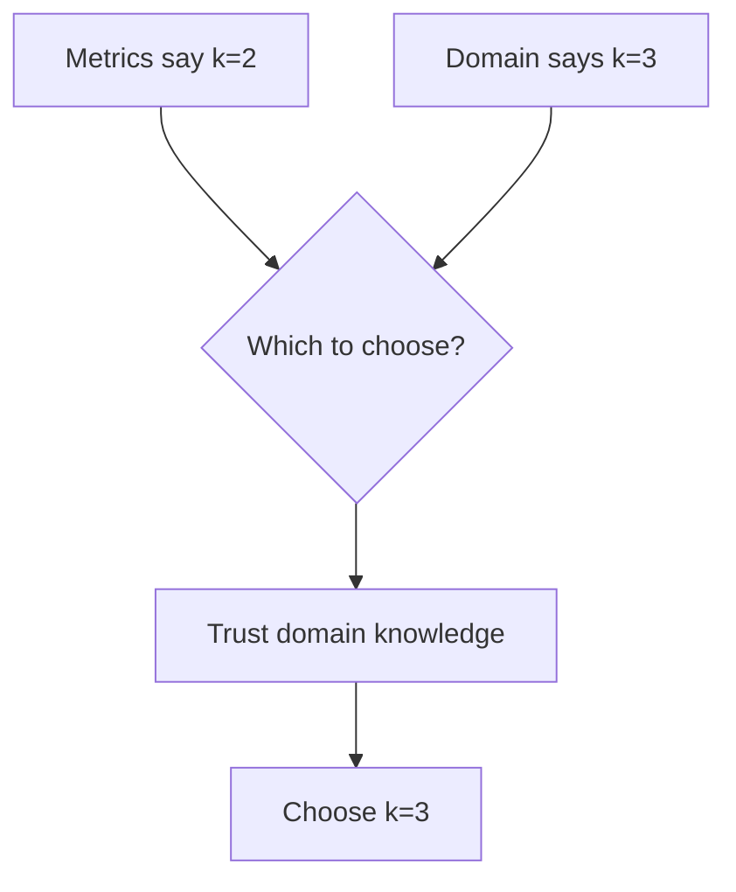

### Real-Life Analogy:
If math says 2 groups are optimal, but you KNOW there are 3 student clubs, trust your knowledge!

### Common Mistakes:
- Blindly following metrics
- Ignoring domain expertise

### Key Points:
- Metrics are guides, not absolute truth
- Domain knowledge matters
- Real Iris has 3 species

---

## Question 8: What does a negative silhouette score mean?

### Simple Answer:
A negative score means "I'm in the wrong group!" - like a basketball player accidentally in the chess club.

### Technical Answer:
A negative silhouette indicates that a point is on average closer to points in another cluster than to points in its own cluster. It's likely misclassified.

### Mermaid Diagram:
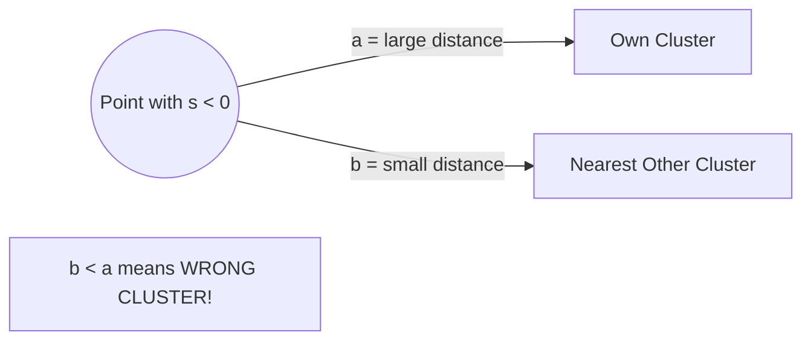

### Key Points:
- Indicates potential misclassification
- Useful for detecting problematic assignments
- Common at cluster boundaries

---

## Question 9: Can K-Means guarantee finding the best clustering?

### Simple Answer:
No! It's like finding the lowest valley while blindfolded - you might end up in a small dip instead of the deepest valley.

### Technical Answer:
K-Means converges to a local minimum, not global minimum. The final result depends on initial centroid positions. Running multiple times with different initializations (n_init) helps find better solutions.

### Mermaid Diagram:
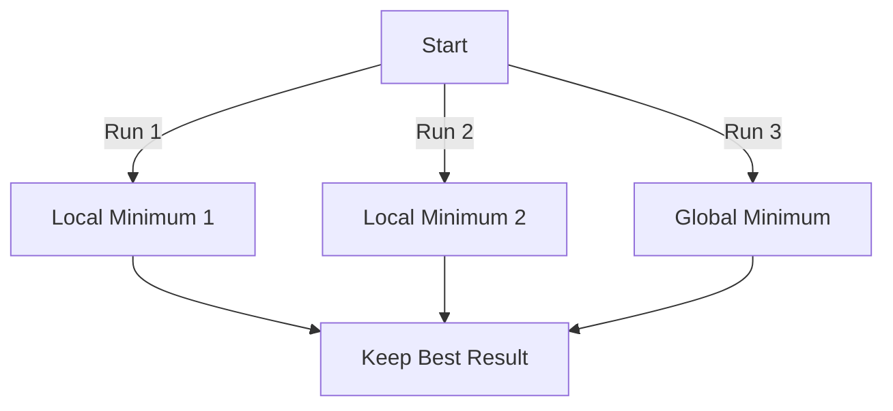

### Key Points:
- Local, not global minimum
- Use n_init > 1
- k-means++ helps

---

## Question 10: What's the time complexity of K-Means?

### Simple Answer:
It's fast! Increases nicely with data size, number of clusters, and iterations.

### Technical Answer:
Time complexity: O(n × k × i × d)
- n = number of samples
- k = number of clusters
- i = number of iterations
- d = number of features

Linear in all parameters, making it very scalable.

### Key Points:
- Linear complexity
- Scales well to large datasets
- Main cost is distance calculations

---

## Question 11: When should you NOT use K-Means?

### Simple Answer:
- When you don't know how many groups exist
- When groups have weird shapes (not round)
- When there are troublemaker data points (outliers)

### Technical Answer:
Avoid K-Means when:
1. Clusters are non-spherical (use DBSCAN)
2. Clusters have varying sizes/densities
3. Data has many outliers (use K-Medoids)
4. Number of clusters is unknown (use hierarchical)

### Mermaid Diagram:
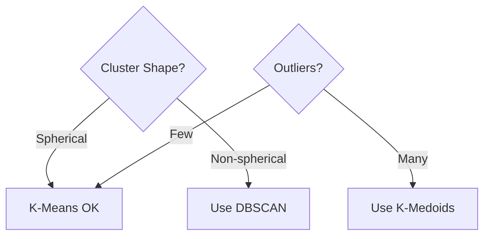

---

## Question 12: What happens if you don't set random_state?

### Simple Answer:
You'll get different results every time you run - like rolling dice!

### Technical Answer:
Without random_state, the random number generator uses different seeds, leading to different initial centroids and potentially different final clusters. Setting random_state ensures reproducibility.

### Key Points:
- Set for reproducibility
- Any integer works
- Important for debugging and comparison

---

## Question 13: What's the difference between fit() and fit_transform()?

### Simple Answer:
- `fit()` = Learn from data
- `transform()` = Apply what you learned
- `fit_transform()` = Learn AND apply in one step

### Technical Answer:
- `fit()`: Computes parameters (mean, std for scaler; centroids for K-Means)
- `transform()`: Applies learned parameters to data
- `fit_transform()`: Combines both, often with optimizations

### Key Points:
- fit_transform() for training data
- transform() only for test data
- Never fit on test data!

---

## Question 14: How do you interpret the elbow plot if there's no clear elbow?

### Simple Answer:
If you can't find the "bend," use other methods like silhouette or ask an expert who knows the data.

### Technical Answer:
When elbow is unclear:
1. Use silhouette score (choose k with highest score)
2. Use gap statistic (compares to random)
3. Apply domain knowledge
4. Try multiple methods and validate

### Key Points:
- Elbow isn't always clear
- Combine multiple methods
- Domain knowledge is valuable

---

## Question 15: Why use n_init='auto' instead of a specific number?

### Simple Answer:
Let the smart algorithm decide how many times to try!

### Technical Answer:
'auto' in recent scikit-learn versions uses heuristics to determine optimal number of initializations based on the initialization method. For k-means++, it may use fewer runs since k-means++ already provides good initial centroids.

### Key Points:
- Balance between quality and speed
- k-means++ needs fewer restarts
- 'auto' is smart default

---

## Question 16: What's the difference between inertia and silhouette?

### Simple Answer:
- Inertia: How close students are to their group leader (tightness)
- Silhouette: How happy students are in their group vs other groups (belonging)

### Technical Answer:
| Aspect | Inertia | Silhouette |
|--------|---------|------------|
| Measures | Within-cluster compactness | Compactness + Separation |
| Range | 0 to ∞ | -1 to +1 |
| Goal | Lower is better | Higher is better |
| K dependency | Always decreases with k | Can peak at optimal k |

### Key Points:
- Inertia: cohesion only
- Silhouette: cohesion + separation
- Use both for better decision

---

## Question 17: How do outliers affect K-Means?

### Simple Answer:
One "troublemaker" point can drag the group center away from everyone else!

### Technical Answer:
K-Means uses mean for centroids. Outliers can:
1. Pull centroids toward outlier positions
2. Create their own clusters
3. Distort distance calculations

Solutions: Use K-Medoids, preprocess outliers, or use robust algorithms.

### Key Points:
- Mean is sensitive to outliers
- Consider K-Medoids for robustness
- Preprocess data to handle outliers

---

## Question 18: Why standardize BEFORE clustering, not after?

### Simple Answer:
Clustering uses distances. If scales are different during clustering, the results are already wrong!

### Technical Answer:
K-Means assigns points based on Euclidean distance. If features aren't standardized BEFORE clustering, distance calculations are biased toward high-scale features. Standardizing after is meaningless - clusters are already determined.

### Key Points:
- Order matters!
- Standardize → Cluster → Analyze
- Never standardize after clustering

---

## Question 19: What are cluster labels in scikit-learn?

### Simple Answer:
Labels are like name tags saying "You belong to Group 0" or "You belong to Group 2."

### Technical Answer:
`kmeans.labels_` is an array of integers (0 to k-1) indicating cluster membership for each sample. labels[i] shows which cluster sample i belongs to.

```python
labels = kmeans.labels_
# Array: [0, 1, 1, 2, 0, 2, ...]
# Meaning: sample 0 → cluster 0, sample 1 → cluster 1, etc.
```

### Key Points:
- Integer array of length n_samples
- Values from 0 to k-1
- Access after fitting

---

## Question 20: How do you choose between k=2 and k=3 when metrics conflict?

### Simple Answer:
Ask someone who knows the data! In our case, we KNOW there are 3 types of flowers.

### Technical Answer:
When metrics conflict:
1. **Domain knowledge first**: Real Iris has 3 species
2. **Consider purpose**: If biology matters, match reality
3. **Examine tradeoffs**: k=2 merges species, k=3 preserves them
4. **Visualize**: Plot clusters to understand differences

Our choice: k=3 because it matches biological ground truth despite slightly lower silhouette.

### Mermaid Diagram:
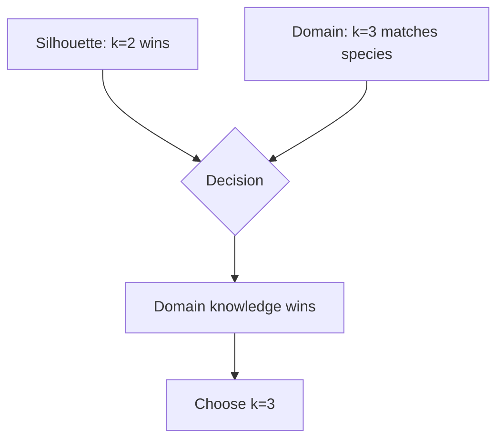

### Key Points:
- Metrics are guides, not rules
- Domain expertise matters
- Consider practical implications
