# Problem Statement: K-Means Cluster Quality Evaluation

## 🧩 What Problem Are We Solving?

Imagine you are a teacher with 150 students. You want to **divide them into groups** for a group project, but you don't know how many groups to create. Should it be 2 groups? 3 groups? 5 groups?

You want to make sure:
1. **Students in the same group are similar** (they sit close together in class)
2. **Students in different groups are different** (they sit far apart)

This is exactly what we're doing with the **Iris flower dataset**! We have 150 flowers, and we want to group them based on their measurements. But how many groups (clusters) should we create?

---

## 🌺 Real-Life Analogy: Sorting Fruits

Think of sorting fruits in a supermarket:
- 🍎 Apples go in one basket
- 🍊 Oranges go in another basket
- 🍌 Bananas go in a third basket

But what if you don't know the fruit names? You just have measurements like:
- How round is it?
- How big is it?
- What color is it?

K-Means clustering helps you **automatically group similar fruits together** without knowing their names!

---

## 🪜 Steps to Solve the Problem

```mermaid
flowchart TD
    A[📥 Load Iris Dataset<br/>150 flowers, 4 measurements] --> B[📏 Standardize Features<br/>Make all measurements comparable]
    B --> C[🔄 Run K-Means<br/>Try k = 2, 3, 4, 5, 6]
    C --> D[📊 Calculate Metrics<br/>Inertia + Silhouette Score]
    D --> E[📈 Create Elbow Plot<br/>Find where curve bends]
    E --> F[📉 Create Silhouette Plot<br/>Visualize cluster quality]
    F --> G[✍️ Justify Choice of k<br/>Balance cohesion + separation]
    G --> H[✅ Final Answer<br/>Best number of clusters]
```

---

## 📋 Step-by-Step Breakdown

### Step 1: Load the Iris Dataset
- Get 150 flower samples with 4 features each
- Features: sepal length, sepal width, petal length, petal width

### Step 2: Standardize Features
- **Why?** Different features have different scales (like mixing meters and centimeters)
- **How?** Transform each feature to have mean=0 and standard deviation=1

### Step 3: Run K-Means Clustering
- Try different values of k (number of groups): 2, 3, 4, 5, 6
- Use `k-means++` initialization (smart starting points)
- Use `n_init='auto'` (let algorithm decide how many times to run)

### Step 4: Calculate Quality Metrics
- **Inertia**: Measures how tight/compact the clusters are (lower = better)
- **Silhouette Score**: Measures how well-separated clusters are (-1 to +1, higher = better)

### Step 5: Create Visualizations
- **Elbow Plot**: Plot inertia vs k, look for the "elbow" (bend)
- **Silhouette Plot**: Show how well each sample fits in its cluster

### Step 6: Choose the Best k
- Balance between cohesion (tightness) and separation (distinctness)
- Consider domain knowledge (real iris has 3 species!)

---

## 🎯 Expected Output

### 1. Metrics Table

| k | Inertia | Silhouette Score |
|---|---------|------------------|
| 2 | ~150    | ~0.58            |
| 3 | ~78     | ~0.55            |
| 4 | ~57     | ~0.50            |
| 5 | ~46     | ~0.49            |
| 6 | ~39     | ~0.36            |

### 2. Elbow Plot
- X-axis: Number of clusters (k)
- Y-axis: Inertia (WCSS)
- Look for the "elbow" where the curve bends

### 3. Silhouette Plot
- Shows how well each sample fits in its assigned cluster
- Wider bars = better cluster assignment

### 4. Written Justification
A clear explanation (under 200 words) of why we chose a specific k value.

---

## ✅ Success Criteria

| Criterion | Description |
|-----------|-------------|
| Metrics Table | No missing values, all k values present |
| Elbow Plot | Has title, axis labels, annotations |
| Silhouette Plot | Has title, axis labels, clear visualization |
| Justification | Mentions cohesion AND separation, < 200 words |
