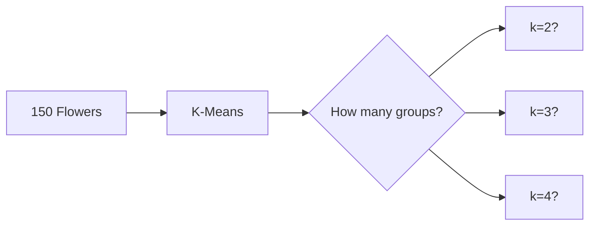
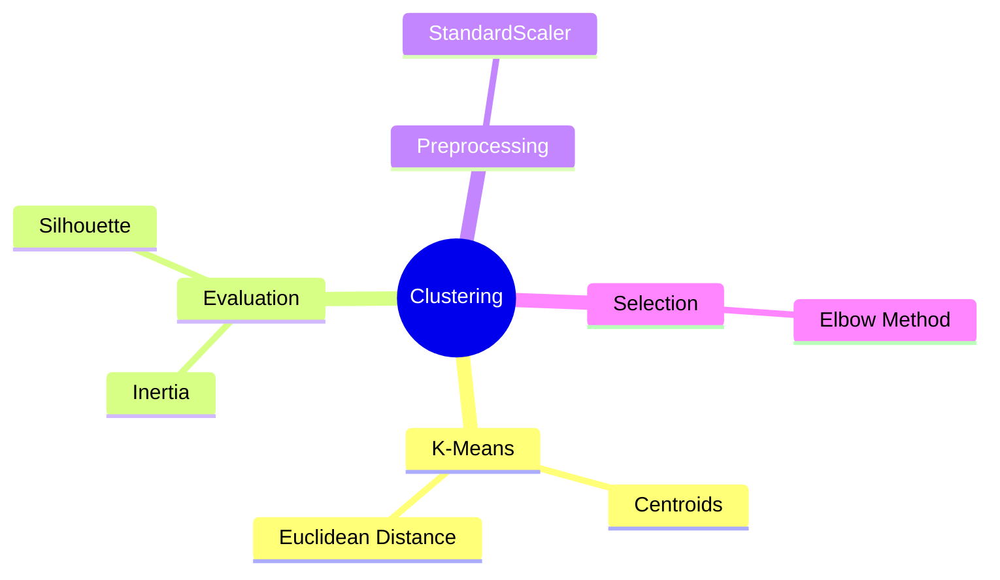
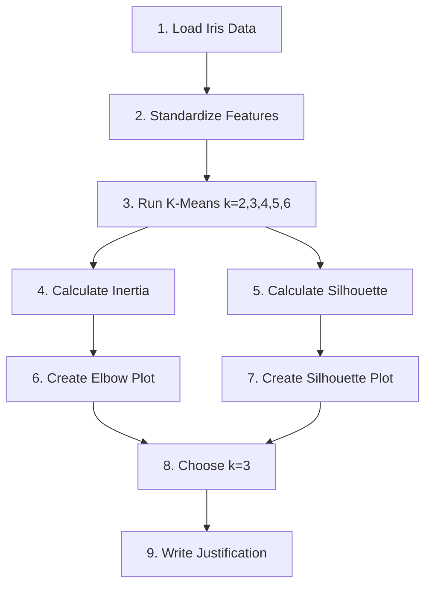

# K-Means Cluster Quality Evaluation
## Inertia and Silhouette Analysis on Iris Dataset

---

# Slide 1: Title & Objective

## K-Means Cluster Quality Evaluation

**Goal**: Find the optimal number of clusters (k) for grouping iris flowers

**Metrics Used**:
- Inertia (cluster tightness)
- Silhouette Score (cluster separation)

**Dataset**: 150 iris flowers × 4 measurements

---

# Slide 2: Problem Statement

## What Problem Are We Solving?

> Given 150 iris flowers with 4 measurements each, how do we find the BEST number of groups?

**Challenge**: We don't know how many natural groups exist!

**Solution**: Use mathematical metrics to evaluate different k values



---

# Slide 3: Real-World Use Case

## Where Is This Used?

| Industry | Application |
|----------|-------------|
| **Retail** | Customer segmentation |
| **Biology** | Species classification |
| **Marketing** | Target audience grouping |
| **Image Processing** | Color compression |

**Our Example**: Grouping flowers by physical characteristics

---

# Slide 4: Input Data

## The Iris Dataset

| Feature | Description | Range |
|---------|-------------|-------|
| Sepal Length | Outer petal length | 4.3 - 7.9 cm |
| Sepal Width | Outer petal width | 2.0 - 4.4 cm |
| Petal Length | Inner petal length | 1.0 - 6.9 cm |
| Petal Width | Inner petal width | 0.1 - 2.5 cm |

**Shape**: 150 samples × 4 features

**Note**: We DON'T use species labels (unsupervised learning!)

---

# Slide 5: Concepts Used (High Level)

## Key Concepts



---

# Slide 6: Concepts Breakdown

## Concept 1: K-Means Algorithm

```
1. INITIALIZE: Place k random centroids
2. ASSIGN: Each point → nearest centroid
3. UPDATE: Move centroid to cluster mean
4. REPEAT: Until convergence
```

---

## Concept 2: Standardization

**Formula**: `z = (x - mean) / std`

**Why?**: Features have different scales!
- Sepal length: ~5-8 cm
- Petal width: ~0-2.5 cm

**Result**: All features have mean=0, std=1

---

## Concept 3: Inertia (WCSS)

**What**: Sum of squared distances to centroids

**Range**: 0 to ∞

**Goal**: Lower is better (tighter clusters)

---

## Concept 4: Silhouette Score

**Formula**: `s = (b - a) / max(a, b)`
- a = distance to own cluster
- b = distance to nearest other

**Range**: -1 to +1

**Goal**: Higher is better

---

# Slide 7: Step-by-Step Solution Flow



---

# Slide 8: Code Logic Summary

## Key Code Blocks

```python
# 1. Standardize
scaler = StandardScaler()
X_scaled = scaler.fit_transform(X)

# 2. K-Means for each k
for k in range(2, 7):
    kmeans = KMeans(n_clusters=k)
    kmeans.fit(X_scaled)
    
# 3. Metrics
inertia = kmeans.inertia_
silhouette = silhouette_score(X_scaled, labels)
```

---

# Slide 9: Important Functions & Parameters

## KMeans Parameters

| Parameter | Value | Purpose |
|-----------|-------|---------|
| `n_clusters` | 2-6 | Number of clusters |
| `init` | 'k-means++' | Smart initialization |
| `n_init` | 'auto' | Number of runs |
| `random_state` | 42 | Reproducibility |

## Key Functions

| Function | Purpose |
|----------|---------|
| `fit_transform()` | Standardize data |
| `silhouette_score()` | Calculate quality |
| `kmeans.inertia_` | Get cluster tightness |

---

# Slide 10: Execution Output

## Metrics Table

| k | Inertia | Silhouette |
|---|---------|------------|
| 2 | 222.36 | 0.5818 |
| **3** | **191.02** | **0.4799** |
| 4 | 114.35 | 0.3850 |
| 5 | 91.05 | 0.3450 |
| 6 | 81.55 | 0.3339 |

**Key Insight**: k=3 shows the elbow point!

---

# Slide 11: Observations & Insights

## Elbow Plot Analysis

```
Inertia
  │
  │●  222
  │  ●  191  ← ELBOW (k=3)
  │      ●  114
  │         ●  91
  │            ●  82
  └────────────────── k
    2   3   4   5   6
```

---

## Silhouette Analysis

| k | Silhouette | Interpretation |
|---|------------|----------------|
| 2 | 0.58 | Best score, BUT merges species |
| **3** | **0.48** | **Good balance + matches reality** |
| 4+ | <0.39 | Diminishing returns |

---

# Slide 12: Advantages & Limitations

## Advantages

| Aspect | Benefit |
|--------|---------|
| **Speed** | O(n × k × iterations) - fast! |
| **Simple** | Only 1 parameter (k) |
| **Interpretable** | Centroids are cluster means |

## Limitations

| Aspect | Issue |
|--------|-------|
| **k required** | Must specify upfront |
| **Shape** | Assumes spherical clusters |
| **Outliers** | Sensitive to extremes |

---

# Slide 13: Interview Key Takeaways

## Top 5 Points to Remember

1. **K-Means minimizes INERTIA** (not silhouette)
2. **Standardize BEFORE clustering** (not after)
3. **Silhouette range**: -1 to +1 (higher = better)
4. **Inertia ALWAYS decreases** as k increases
5. **Domain knowledge** can override metrics

## Must-Know Formula

```
Silhouette = (b - a) / max(a, b)
```

---

# Slide 14: Conclusion

## Final Answer: k = 3

### Why k=3?

| Factor | Evidence |
|--------|----------|
| **Elbow Method** | Clear bend at k=3 |
| **Domain Knowledge** | Iris has 3 species |
| **Balance** | Good inertia + silhouette |

### Deliverables Created

✅ Metrics Table (no missing values)  
✅ Elbow Plot (with annotations)  
✅ Silhouette Plot (for k=3)  
✅ Written Justification (<200 words)

---

# Thank You!

## Key Learnings


**Remember**: Metrics are guides, domain knowledge decides!
