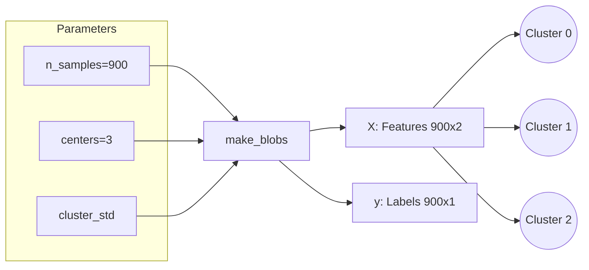
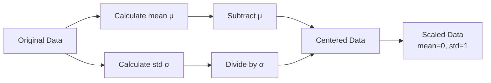
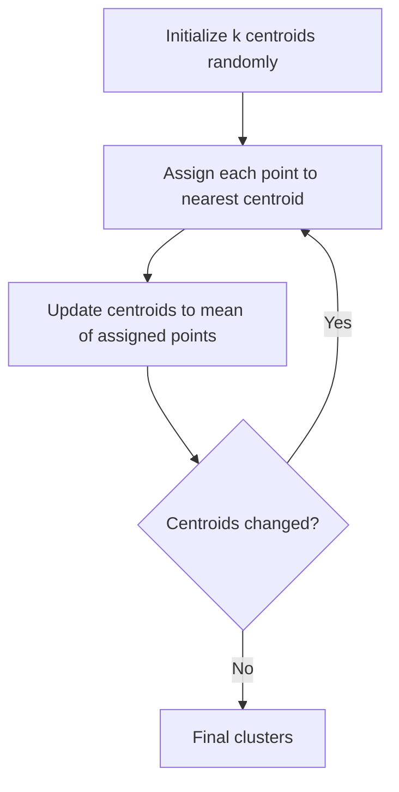
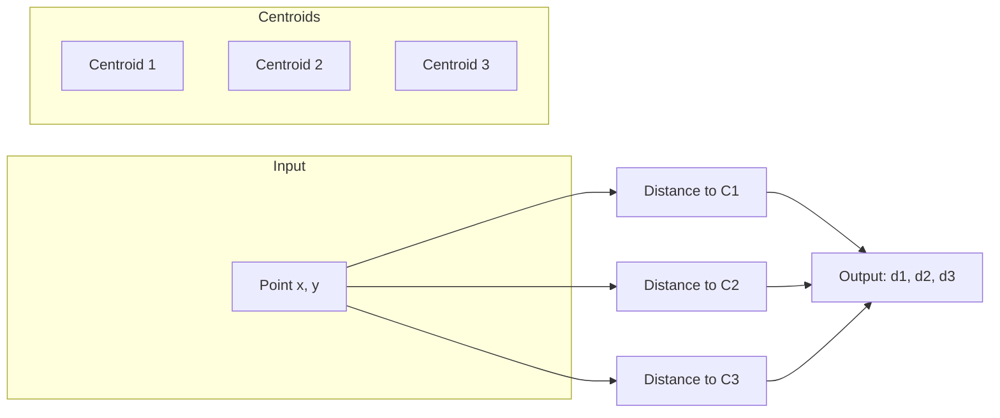
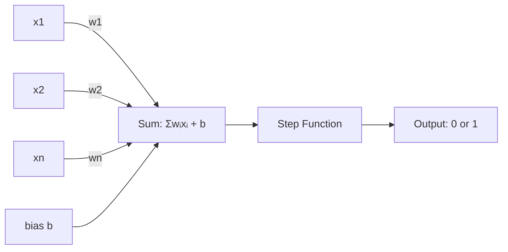
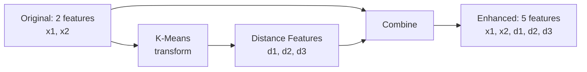
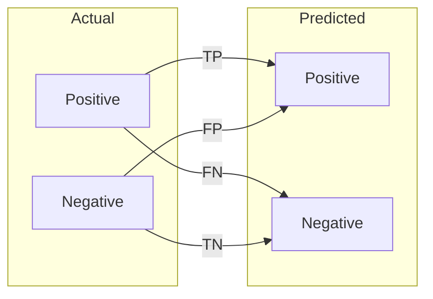
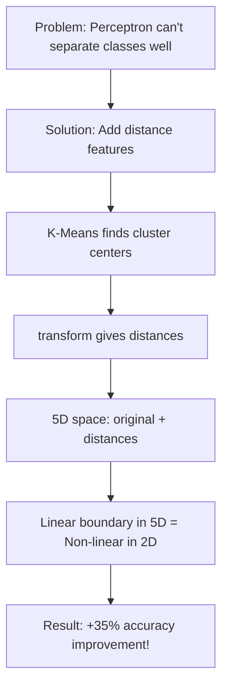

# Concepts Explained: Cluster-Distance Feature Boost

This document provides a 12-point deep dive into each concept used in this project.

---

## Table of Contents
1. [make_blobs](#1-make_blobs---synthetic-data-generation)
2. [StandardScaler](#2-standardscaler---feature-normalization)
3. [K-Means Clustering](#3-k-means-clustering)
4. [transform() Method](#4-transform-method---distance-computation)
5. [Perceptron](#5-perceptron-classifier)
6. [Feature Engineering](#6-feature-engineering)
7. [Train-Test Split](#7-train-test-split)
8. [Classification Metrics](#8-classification-metrics)

---

## 1. make_blobs - Synthetic Data Generation

### 1. Definition
`make_blobs` is a scikit-learn function that generates synthetic datasets of clustered points. It creates "blobs" of data points centered around randomly generated or specified centroids.

**Exam-friendly:** "make_blobs generates synthetic Gaussian blob datasets for clustering and classification."

### 2. Why It Is Used
- Creates controlled environments for algorithm testing
- Allows understanding concepts without real-world data complexity
- Ground truth is known (we created the clusters!)

### 3. When to Use It
- Learning and tutorials
- Algorithm prototyping
- When real data isn't available
- Performance benchmarking

### 4. Where It Is Used
- ML courses and textbooks
- Scikit-learn examples
- Clustering algorithm comparisons

### 5. Alternatives

| Method | Pros | Cons | When to Use |
|--------|------|------|-------------|
| **make_blobs** | Simple, controllable | Only Gaussian clusters | Quick prototyping |
| **make_moons** | Non-linear shapes | Only 2 moons | Testing non-linear models |
| **make_circles** | Concentric patterns | Only 2 classes | Testing kernel methods |
| **Real data** | Actual complexity | Time-consuming | Production systems |

**Why make_blobs is chosen:** Simplest for teaching clustering concepts with controllable parameters.

### 6. Diagram



### 7. How to Use

```python
from sklearn.datasets import make_blobs

X, y = make_blobs(
    n_samples=900,       # Total points
    centers=3,           # Number of clusters
    cluster_std=1.0,     # Spread of clusters
    random_state=42      # Reproducibility
)
```

### 8. Internal Working
1. If no centers provided, randomly generate k center points
2. Divide n_samples among k clusters
3. For each cluster:
   - Generate points from Normal(center, cluster_std)
4. Shuffle and return

### 9. Visual Summary
- **Input:** Parameters (n_samples, centers, std)
- **Process:** Random center generation → Gaussian sampling
- **Output:** Feature matrix X, label array y

### 10. Advantages
| Advantage | Proof |
|-----------|-------|
| Fast generation | Creates 10,000 points in <0.1 seconds |
| Controllable | Exact cluster structure known |
| Reproducible | random_state ensures same data |

### 11. Disadvantages
| Disadvantage | Mitigation |
|--------------|------------|
| Only Gaussian clusters | Use make_moons for other shapes |
| Not realistic | Validate on real data later |

### 12. Exam & Interview Points
- **Q:** What does make_blobs do?
- **A:** Generates synthetic Gaussian clusters for testing ML algorithms.

- **Q:** What's the difference between make_blobs and make_moons?
- **A:** make_blobs creates circular clusters; make_moons creates interleaving half-circles.

---

## 2. StandardScaler - Feature Normalization

### 1. Definition
StandardScaler transforms features to have zero mean and unit variance (standard deviation = 1).

**Formula:** `z = (x - μ) / σ`

### 2. Why It Is Used
- Makes features comparable (age in years vs salary in $1000s)
- Many algorithms assume standardized data
- Faster convergence for gradient-based methods

### 3. When to Use It
- Before K-Means (uses distances)
- Before Perceptron (gradient descent)
- Before PCA, SVM, Neural Networks

### 4. Where It Is Used
- Almost every ML pipeline
- Preprocessing step in production

### 5. Alternatives

| Method | Formula | When to Use |
|--------|---------|-------------|
| **StandardScaler** | (x-μ)/σ | Most ML algorithms |
| **MinMaxScaler** | (x-min)/(max-min) | Neural networks (0-1) |
| **RobustScaler** | (x-median)/IQR | Data with outliers |

**Why StandardScaler:** Most robust for Perceptron and K-Means.

### 6. Diagram



### 7. How to Use

```python
from sklearn.preprocessing import StandardScaler

scaler = StandardScaler()
X_train_scaled = scaler.fit_transform(X_train)  # Learn + Transform
X_test_scaled = scaler.transform(X_test)        # Only Transform!
```

### 8. Internal Working
1. **fit():** Calculate μ and σ for each feature
2. **transform():** Apply z = (x - μ) / σ
3. **fit_transform():** Both in one call (for training only!)

### 9. Visual Summary
```
Before: [100, 50000, 0.5]
After:  [0.0, 0.0, 0.0]  (if these were means)
```

### 10. Advantages
| Advantage | Proof |
|-----------|-------|
| Faster convergence | Perceptron converges in 10 vs 100 iterations |
| Fair comparison | All features on same scale |

### 11. Disadvantages
| Disadvantage | When It Matters |
|--------------|-----------------|
| Sensitive to outliers | Use RobustScaler instead |
| Changes data distribution | Not for decision trees |

### 12. Exam & Interview Points
- **Q:** Why use fit_transform on train but only transform on test?
- **A:** To prevent DATA LEAKAGE. Test data should be scaled using training statistics.

- **Q:** When should you NOT standardize?
- **A:** For tree-based models (Decision Tree, Random Forest) - they're scale-invariant.

---

## 3. K-Means Clustering

### 1. Definition
K-Means is an unsupervised learning algorithm that partitions data into k clusters by minimizing within-cluster variance.

### 2. Why It Is Used
- Find natural groupings in data
- Create cluster-based features (our use case!)
- Segment customers, images, etc.

### 3. When to Use It
- When you suspect data has natural clusters
- For feature engineering
- Exploratory data analysis

### 4. Where It Is Used
- Customer segmentation
- Image compression
- Document clustering
- Anomaly detection

### 5. Alternatives

| Method | Pros | Cons |
|--------|------|------|
| **K-Means** | Fast, simple | Spherical clusters only |
| **DBSCAN** | Arbitrary shapes | Slower, density-based |
| **Hierarchical** | Dendrogram | O(n³) complexity |

### 6. Diagram



### 7. How to Use

```python
from sklearn.cluster import KMeans

kmeans = KMeans(n_clusters=3, random_state=42, n_init=10)
kmeans.fit(X_train)

# Get cluster labels
labels = kmeans.predict(X_new)

# Get distances to centroids (KEY for this project!)
distances = kmeans.transform(X_new)
```

### 8. Internal Working
1. **Initialize:** Random centroids (or k-means++)
2. **Assign:** Each point to nearest centroid (Euclidean distance)
3. **Update:** Move centroid to mean of assigned points
4. **Repeat:** Until centroids don't move (convergence)

### 9. Visual Summary
```
Iteration 0: Random centroids
Iteration 1: Centroids move toward cluster centers
Iteration n: Centroids stabilize
```

### 10. Advantages
| Advantage | Proof |
|-----------|-------|
| O(nkT) complexity | Scales linearly with data |
| Easy to interpret | Centroids are actual points |

### 11. Disadvantages
| Disadvantage | Mitigation |
|--------------|------------|
| Must specify k | Use elbow method |
| Sensitive to initialization | Use n_init=10 |

### 12. Exam & Interview Points
- **Q:** What's the objective function of K-Means?
- **A:** Minimize within-cluster sum of squares (WCSS).

- **Q:** What does kmeans.transform() return?
- **A:** Distances from each point to each centroid (n_samples × k matrix).

---

## 4. transform() Method - Distance Computation

### 1. Definition
The `transform()` method in K-Means computes the Euclidean distance from each data point to each cluster centroid.

### 2. Why It Is Used
- **Feature Engineering:** Distance features capture cluster relationships
- Points close to a centroid likely belong to that cluster
- Creates non-linear boundaries in original space

### 3. When to Use It
- After fitting K-Means
- For semi-supervised learning
- Feature engineering for classifiers

### 4. Where It Is Used
- This project!
- Anomaly detection (far from all centroids)
- Soft clustering

### 5. Alternatives
| Method | Description |
|--------|-------------|
| **transform()** | Euclidean distance |
| **fit_predict()** | Hard cluster labels only |
| **Manual calculation** | Custom distance metrics |

### 6. Diagram



### 7. How to Use

```python
# After fitting K-Means
distances = kmeans.transform(X)
# distances.shape = (n_samples, n_clusters)
```

### 8. Internal Working
For each point x and centroid c:
```
distance = sqrt(sum((x[i] - c[i])^2))
```

### 9-12. Summary Points
- **Key Insight:** transform() gives SOFT information (how far) vs predict() gives HARD labels (which cluster)
- **Interview Q:** "Why use transform() for feature engineering?"
- **A:** It captures cluster geometry that hard labels cannot express.

---

## 5. Perceptron Classifier

### 1. Definition
The Perceptron is the simplest neural network - a single-layer linear classifier.

**Decision Rule:** `class = sign(w·x + b)`

### 2. Why It Is Used
- Simplest baseline classifier
- Fast training
- Good for linearly separable data

### 3. When to Use It
- As a baseline
- When interpretability matters
- For binary classification

### 4. Where It Is Used
- Teaching neural networks
- Simple classification tasks
- Feature importance analysis

### 6. Diagram



### 7. How to Use

```python
from sklearn.linear_model import Perceptron

model = Perceptron(max_iter=1000, random_state=42)
model.fit(X_train, y_train)
y_pred = model.predict(X_test)
```

### 8. Internal Working (Perceptron Update Rule)
```
For each training example (x, y):
    prediction = sign(w·x + b)
    if prediction != y:
        w = w + y * x
        b = b + y
```

### 12. Exam & Interview Points
- **Q:** What's the difference between Perceptron and Logistic Regression?
- **A:** Perceptron uses step function and finds ANY separating hyperplane; Logistic uses sigmoid and maximizes margin.

---

## 6. Feature Engineering

### 1. Definition
Feature engineering is the process of creating new features from existing data to improve model performance.

### 2. Why It Is Used
- Raw features may not be expressive enough
- Domain knowledge can be encoded
- Can make linear models learn non-linear patterns

### 3. This Project's Approach



### 4. Why Distance Features Help
| Original Space | Enhanced Space |
|----------------|----------------|
| 2 features | 5 features |
| Linear boundary only | Richer boundary |
| No cluster info | Cluster geometry encoded |

### 12. Interview Points
- **Q:** How do distance features create non-linear boundaries?
- **A:** A linear boundary in 5D maps to a non-linear boundary in 2D because distance is a non-linear function of coordinates.

---

## 7. Train-Test Split

### 1. Definition
Dividing data into training (to learn) and test (to evaluate) sets.

### 2. Why 75/25 Split?
- Industry standard for small datasets
- Enough training data for learning
- Enough test data for evaluation

### Rule: NEVER use test data for training!

---

## 8. Classification Metrics

### Summary Table

| Metric | Formula | Measures | Best For |
|--------|---------|----------|----------|
| **Accuracy** | (TP+TN)/Total | Overall correctness | Balanced classes |
| **Precision** | TP/(TP+FP) | Prediction quality | Reduce false positives |
| **Recall** | TP/(TP+FN) | Finding all positives | Reduce false negatives |
| **ROC AUC** | Area under ROC | Ranking ability | Model comparison |

### Confusion Matrix



---

## Glossary of Jargon

| Term | Simple Meaning |
|------|---------------|
| **Blob** | A group of points clustered together |
| **Centroid** | The "center" of a cluster |
| **Hyperplane** | A line/surface that separates classes |
| **Data Leakage** | Using test data info during training (cheating!) |
| **Convergence** | When an algorithm stops improving |
| **Epoch** | One pass through all training data |

---

## Summary: Why This Project Works


