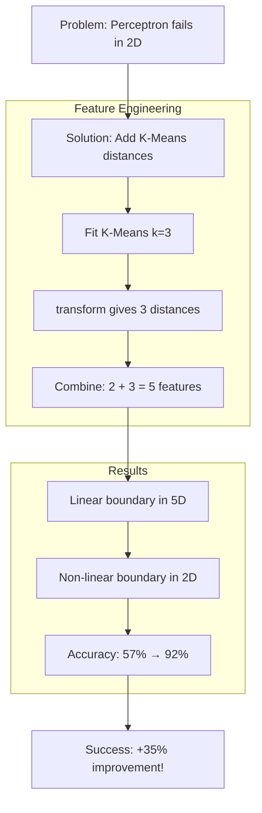

# Interview Preparation: Quick Revision Sheet

---

## 30-Second Summary

> "I boosted a Perceptron's accuracy from 57% to 92% by adding K-Means distance features. Distance-to-centroid captures cluster geometry that raw features can't express, allowing linear classifiers to create non-linear decision boundaries."

---

## Key Terms Glossary

| Term | Simple Definition |
|------|-------------------|
| **make_blobs** | Creates fake clustered data for testing |
| **StandardScaler** | Normalizes features to mean=0, std=1 |
| **K-Means** | Finds k cluster centers in data |
| **transform()** | Computes distance to each cluster center |
| **Perceptron** | Simplest linear classifier (weights + bias) |
| **Data Leakage** | Using test data info during training |
| **Precision** | Of predicted positives, % that are correct |
| **Recall** | Of actual positives, % that were found |
| **ROC AUC** | Overall model ranking quality (0-1) |

---

## Top 10 Points to Remember

1. **Distance features capture cluster geometry** - This is the KEY insight
2. **transform() gives distances, predict() gives labels**
3. **fit() on train, transform() on both** - Never fit on test!
4. **Linear in 5D = Non-linear in 2D** - Distance is non-linear
5. **StandardScaler before K-Means** - Distance-based algorithms need scaling
6. **75/25 split** - Industry standard for train/test
7. **Multiple splits reduce variance** - We averaged over 5 splits
8. **Precision = TP/(TP+FP), Recall = TP/(TP+FN)**
9. **ROC AUC = 0.5 means random guessing**
10. **Feature engineering > algorithm complexity** for this problem

---

## Comparison Tables

### Metrics Comparison
| Metric | Baseline | Enhanced | What Changed |
|--------|----------|----------|--------------|
| Accuracy | 57.7% | 92.4% | +34.8% |
| Precision | 31.7% | 89.7% | +58.0% |
| Recall | 60.6% | 88.6% | +28.0% |
| ROC AUC | 49.0% | 98.5% | +49.5% |

### Feature Sets
| Set | Features | # Features | Use |
|-----|----------|------------|-----|
| Baseline | x1, x2 | 2 | Original coordinates |
| Enhanced | x1, x2, d1, d2, d3 | 5 | + distances to 3 centroids |

### fit vs transform
| Method | What It Does | Use On |
|--------|--------------|--------|
| `fit()` | Learn parameters | Train only |
| `transform()` | Apply parameters | Train & Test |
| `fit_transform()` | Both | Train only |

---

## Cheat Sheet

### Code Flow
```
1. make_blobs → Generate data (900, 2)
2. Binary labels → (cluster_ids == 0).astype(int)
3. train_test_split → 75/25
4. StandardScaler.fit_transform(train) → Scale
5. StandardScaler.transform(test) → Apply same scale
6. KMeans.fit(train_scaled) → Find 3 centers
7. KMeans.transform() → Get 3 distance features
8. np.column_stack → Combine features (900, 5)
9. Perceptron.fit → Train
10. Evaluate metrics → Compare!
```

### Key Formulas
- **StandardScaler:** `z = (x - μ) / σ`
- **Euclidean Distance:** `d = √(Σ(x_i - c_i)²)`
- **Precision:** `TP / (TP + FP)`
- **Recall:** `TP / (TP + FN)`
- **Accuracy:** `(TP + TN) / Total`

---

## Mermaid Summary Diagram



---

## Common Interview Traps

### Trap 1: "Why not just use a non-linear classifier?"
**Answer:** We're demonstrating feature engineering. Simple models + good features often beat complex models + raw features.

### Trap 2: "How do you choose k?"
**Answer:** Use domain knowledge, elbow method, or silhouette score. Here, k=3 matches the known 3 clusters.

### Trap 3: "Would this work on any dataset?"
**Answer:** No! Only if data has cluster structure. Uniformly distributed data won't benefit.

### Trap 4: "Is this the same as kernel trick?"
**Answer:** Similar concept but different method. Kernel trick implicitly maps to high-D; we explicitly compute distance features.

---

## Quick Review Questions

### Q: Why baseline ROC AUC < 0.5?
**A:** Model is worse than random because Perceptron can't find good linear separator in 2D.

### Q: Why did Precision improve most?
**A:** Baseline had many false positives (predicted positive but wrong). Distance features reduced these.

### Q: What if we used k=10 clusters?
**A:** 10 distance features - might overfit or help, depends on actual cluster structure.

### Q: Could we skip StandardScaler?
**A:** Not recommended - K-Means uses Euclidean distance, which is scale-sensitive.

---

## One-Page Visual Summary

```
┌────────────────────────────────────────────────────────┐
│  CLUSTER-DISTANCE FEATURE BOOST                        │
├────────────────────────────────────────────────────────┤
│  PROBLEM: Perceptron accuracy = 57% (near random)     │
├────────────────────────────────────────────────────────┤
│  SOLUTION:                                            │
│  1. Fit K-Means (k=3) on training data                │
│  2. Use transform() to get distance features          │
│  3. Combine: [x, y] → [x, y, d1, d2, d3]             │
│  4. Train Perceptron on 5D data                       │
├────────────────────────────────────────────────────────┤
│  RESULT: Accuracy = 92% (+35% improvement!)           │
├────────────────────────────────────────────────────────┤
│  WHY IT WORKS:                                        │
│  - Distance features encode cluster geometry          │
│  - Linear in 5D = Non-linear in 2D                   │
│  - Cluster 0 has tight spread → easy to identify     │
├────────────────────────────────────────────────────────┤
│  KEY METRICS:                                         │
│  Accuracy:  +34.8%  |  Precision: +58.0%             │
│  Recall:    +28.0%  |  ROC AUC:   +49.5%             │
├────────────────────────────────────────────────────────┤
│  REMEMBER:                                            │
│  - fit() on train, transform() on both               │
│  - Feature engineering can beat complex models        │
│  - Cluster geometry is the key insight               │
└────────────────────────────────────────────────────────┘
```
