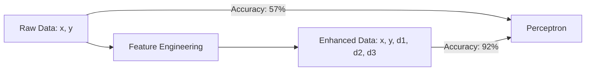
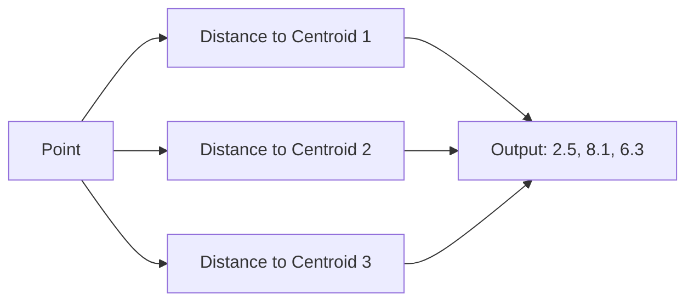
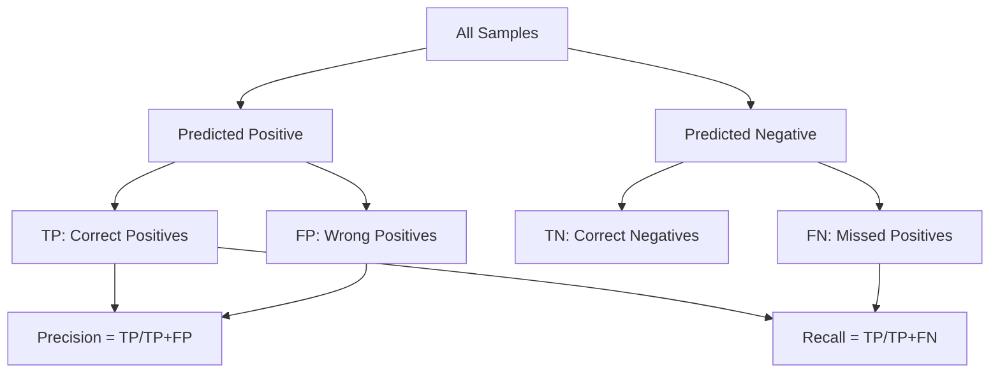
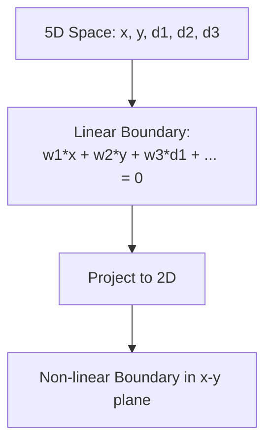

# Interview Questions: Cluster-Distance Feature Boost

This document contains **20 interview questions** with detailed answers, diagrams, and analogies.

---

## Q1: What is feature engineering?

### Simple Answer (for 10-year-old)
Creating new clues from existing information to help make better guesses.

**Analogy:** Like figuring out a student is in "Class A" not just from their height, but also from how close they sit to the Class A area.

### Technical Answer
Feature engineering is the process of transforming raw data into meaningful features that better represent the underlying problem, improving model performance.

### Diagram


---

## Q2: Why does adding distance features help the Perceptron?

### Simple Answer
The Perceptron only knows how to draw straight lines. Distance features give it extra information about how points group together.

### Technical Answer
Distance features encode cluster geometry in the feature space. A linear boundary in the enhanced 5D space maps to a non-linear boundary in the original 2D space, allowing better separation.

### Common Mistake
Thinking more features ALWAYS help. Only features that capture relevant patterns help.

---

## Q3: What is the K-Means transform() method?

### Simple Answer
It measures how far each point is from each cluster center.

### Technical Answer
`kmeans.transform(X)` returns an (n_samples, k) matrix where entry [i,j] is the Euclidean distance from point i to centroid j.

### Diagram


---

## Q4: What happens if you use fit_transform on test data?

### Simple Answer
You're cheating! You're peeking at test answers to help you study.

### Technical Answer
This causes **data leakage** - test data statistics influence the model, giving unrealistic performance estimates.

### Correct Approach
```python
scaler.fit(X_train)      # Learn from train
X_train_scaled = scaler.transform(X_train)
X_test_scaled = scaler.transform(X_test)  # Apply train stats
```

---

## Q5: Why is the baseline ROC AUC close to 0.5?

### Simple Answer
0.5 means random guessing. The baseline is barely better than flipping a coin.

### Technical Answer
ROC AUC = 0.5 indicates the model cannot rank positive samples higher than negative samples. The linear boundary in 2D cannot effectively separate the classes.

---

## Q6: Explain the difference between Precision and Recall.

### Simple Answer
- **Precision:** Of the ones I said "yes" to, how many were correct?
- **Recall:** Of all the actual "yes" cases, how many did I find?

### Technical Answer
- **Precision = TP / (TP + FP)** - Quality of positive predictions
- **Recall = TP / (TP + FN)** - Completeness of finding positives

### Diagram


---

## Q7: What does StandardScaler do?

### Simple Answer
Makes all numbers comparable by putting them on the same scale.

### Technical Answer
Transforms features to have zero mean and unit variance: `z = (x - μ) / σ`

### Why It Matters
K-Means uses Euclidean distance, which is sensitive to scale. Without scaling, features with larger values dominate.

---

## Q8: Why use 5 random splits instead of 1?

### Simple Answer
One test might be lucky or unlucky. Averaging many tests gives a reliable answer.

### Technical Answer
Cross-validation reduces variance in performance estimates. Single splits can be misleadingly optimistic or pessimistic due to random sampling.

---

## Q9: What is the Perceptron update rule?

### Simple Answer
If you guess wrong, adjust your weights toward the correct answer.

### Technical Answer
```
if prediction != actual:
    w = w + actual * x
    b = b + actual
```

---

## Q10: How does a linear boundary in 5D create a non-linear boundary in 2D?

### Simple Answer
It's like shadow puppets - a simple hand position (5D) can create complex shapes (2D shadow).

### Technical Answer
The distance function is non-linear: `d = sqrt((x-c1)² + (y-c2)²)`. When a linear boundary depends on these distances, projecting back to the original (x,y) space reveals non-linear separation.

### Diagram


---

## Q11: What is make_blobs used for?

### Simple Answer
Creating fake data with known clusters for practice.

### Technical Answer
`make_blobs` generates isotropic Gaussian blobs for clustering experiments, with controllable cluster count, size, and spread.

---

## Q12: Why set random_state?

### Simple Answer
So you get the same results every time you run the code.

### Technical Answer
`random_state` seeds the random number generator, ensuring reproducibility for debugging, comparison, and sharing results.

---

## Q13: What's the difference between fit() and transform()?

### Simple Answer
- **fit():** Learn the pattern from data
- **transform():** Apply that pattern to data

### Technical Answer
- **fit():** Calculate parameters (mean, std for scaler; centroids for K-Means)
- **transform():** Apply learned parameters (scale data; compute distances)

---

## Q14: Why did Precision improve more than Recall?

### Simple Answer
The baseline had many false alarms. Enhanced model has fewer false alarms.

### Technical Answer
Low baseline precision (32%) indicates high false positive rate. Distance features help the model better identify TRUE positives, reducing false positives dramatically.

---

## Q15: What happens with more clusters (higher k)?

### Simple Answer
More distance features, possibly more information, but also more complexity.

### Technical Answer
- Higher k → more distance features → potential overfitting
- Optimal k depends on actual data structure
- Use elbow method or silhouette score to choose k

---

## Q16: Could we use other classifiers instead of Perceptron?

### Simple Answer
Yes! Logistic Regression or SVM might work even better.

### Technical Answer
The distance features would likely improve any linear classifier. Non-linear classifiers (Random Forest, SVM with RBF kernel) might not benefit as much since they can learn non-linear boundaries directly.

---

## Q17: What is data leakage?

### Simple Answer
Accidentally giving the model hints from test data during training.

### Technical Answer
Data leakage occurs when information from outside the training set influences model building, leading to overly optimistic performance estimates.

### Example
Using `scaler.fit_transform(X_test)` instead of `scaler.transform(X_test)`.

---

## Q18: Why is cluster 0 standard deviation smaller?

### Simple Answer
The data was created that way ([1.0, 1.2, 1.4]).

### Technical Answer
We specified `cluster_std=[1.0, 1.2, 1.4]` in make_blobs, making cluster 0 the tightest cluster.

---

## Q19: How would you explain this project in an interview?

### Model Answer
> "I demonstrated that feature engineering can dramatically improve a simple classifier. By adding distance-to-centroid features from K-Means clustering, a Perceptron's accuracy jumped from 58% to 92%. This works because distance features capture cluster geometry that raw coordinates cannot express, effectively allowing a linear classifier to create non-linear decision boundaries."

---

## Q20: What are the limitations of this approach?

### Simple Answer
- Works best when data has clear clusters
- Must choose k correctly
- Adds computational cost

### Technical Answer
1. **Cluster assumption:** Data must have cluster structure
2. **k selection:** Wrong k can hurt performance
3. **Curse of dimensionality:** Too many clusters → too many features
4. **Computational cost:** K-Means adds O(nkT) training time

---

## Key Points to Remember

1. Feature engineering can outperform algorithm complexity
2. Transform() gives distances, predict() gives labels
3. Never fit on test data (data leakage)
4. Linear in high-D = non-linear in low-D
5. Cluster geometry is captured by distance features
