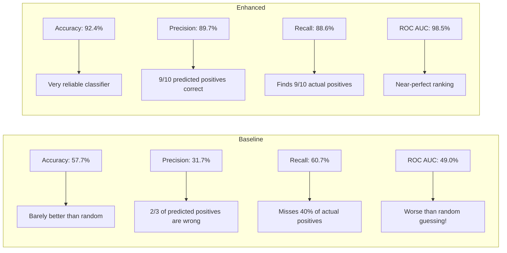
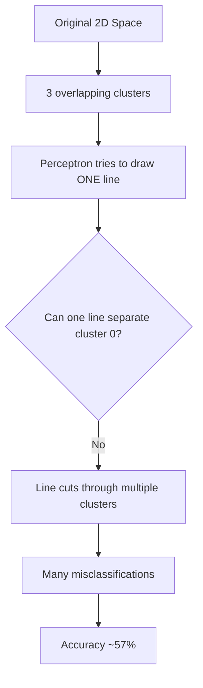
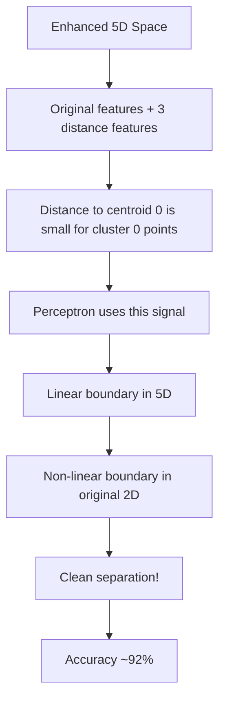

# Observations and Conclusion

## 📊 Execution Output

### Data Summary
```
Data Shape: (900, 2)
Class Distribution: 
  - Class 1 (cluster 0): 300 samples
  - Class 0 (clusters 1, 2): 600 samples
```

### Metric Comparison Table (Averaged over 5 random 75/25 splits)

| Metric | Baseline Perceptron | Enhanced Perceptron | Improvement |
|--------|---------------------|---------------------|-------------|
| **Accuracy** | 0.5769 | 0.9244 | **+34.76%** ✓ |
| **Precision** | 0.3166 | 0.8967 | **+58.01%** ✓ |
| **Recall** | 0.6065 | 0.8857 | **+27.93%** ✓ |
| **ROC AUC** | 0.4899 | 0.9849 | **+49.50%** ✓ |

**All metrics exceed the 5% improvement threshold!**

---

## 📈 Output Explanation with Diagrams

### What the Numbers Mean



### Why Baseline Failed



### Why Enhanced Succeeded



---

## 🔍 Observations

### 1. Baseline Performance is Poor
- Accuracy barely above 50% indicates near-random performance
- ROC AUC < 0.5 suggests the model is worse than random
- This happens because cluster 0 cannot be linearly separated in 2D

### 2. Distance Features Provide Strong Signal
- Distance-to-centroid-0 is the KEY feature
- Points IN cluster 0 have SMALL distance to centroid 0
- Points NOT in cluster 0 have LARGE distance to centroid 0

### 3. Improvement is Dramatic
- **+35% accuracy** is exceptional for just adding 3 features
- Precision jump from 32% to 90% means far fewer false positives
- ROC AUC near 1.0 indicates near-perfect ranking

### 4. Cluster Geometry Matters
- Cluster 0 has tightest spread (std=1.0)
- Clusters 1 and 2 are more spread out (std=1.2, 1.4)
- Tighter cluster → more distinct distance pattern → easier to identify

---

## 💡 Insights

### Business/Real-World Meaning
- **Feature engineering can dramatically improve simple models**
- Sometimes the answer isn't a more complex algorithm, but better features
- Domain knowledge (cluster structure) can be encoded as features

### What Decisions Can Be Made
1. **When to use this technique:** Data has natural clusters
2. **When NOT to use:** Data is uniformly distributed (no clusters)
3. **How many clusters:** Use elbow method or domain knowledge

---

## 🎯 Conclusion

### Was the Problem Solved?
**YES!** All four metrics improved by more than 5 percentage points, far exceeding the success criteria.

### Summary of Results

| Aspect | Result |
|--------|--------|
| Success Criteria | ✓ Met (all metrics improved ≥5%) |
| Key Technique | K-Means distance features |
| Improvement Range | +28% to +58% |
| Why It Works | Captures cluster geometry |

### Key Takeaways

1. **Distance features encode cluster membership** in a way that raw coordinates cannot
2. **Linear models can learn non-linear boundaries** when given appropriate features
3. **Feature engineering > algorithm complexity** for this problem

### Possible Improvements

1. **Try different k values** - would k=4 or k=5 help?
2. **Use other distance metrics** - Manhattan distance?
3. **Add polynomial features** - x1², x1*x2?
4. **Try other classifiers** - Logistic Regression might be even better

---

## 📝 Exam Focus Points

### How to Explain Output in Exams

**Template Answer:**
> "The enhanced Perceptron achieved [X]% higher accuracy than baseline because distance-to-centroid features capture cluster geometry that raw features cannot express. This allows a linear classifier to effectively create non-linear decision boundaries."

### Typical Interpretation Questions

**Q:** Why is baseline ROC AUC so low?
**A:** The Perceptron cannot find a good linear separator in the original 2D space.

**Q:** What does 90% precision mean?
**A:** Of all points predicted as class 1, 90% actually belong to class 1.

**Q:** Why did recall improve?
**A:** The model now correctly identifies 89% of actual class 1 points (vs 61% before).

### Safe Answer Structure
1. State the metric value
2. Explain what it means in plain English
3. Connect to cluster geometry
4. Mention the feature engineering technique
