# Problem Statement: Cluster-Distance Feature Boost

## 🧩 What Problem Are We Solving?

Imagine you're a teacher who wants to identify which student belongs to "Class A" and which doesn't. You have some basic information about each student (like height and weight), but it's hard to tell them apart just from that.

**The Problem:** A simple classifier (Perceptron) isn't very good at separating these students using just the basic features.

**The Solution:** We can give the classifier **extra hints** by telling it how far each student is from the "center" of each group. This is like saying:
- "This student is very close to the Class A center"
- "This student is far from the Class A center"

These extra hints are called **distance-to-centroid features**, and they help the classifier make better decisions!

---

## 🪜 Steps to Solve the Problem

```mermaid
flowchart TD
    A[🎲 Step 1: Generate Data] -->|make_blobs| B[📊 900 samples, 3 clusters]
    B --> C[🏷️ Step 2: Create Labels]
    C -->|cluster 0 = 1, others = 0| D[Binary Classification Problem]
    D --> E[📐 Step 3: Standardize Features]
    E -->|StandardScaler| F[Mean=0, Std=1]
    F --> G[🔵 Step 4: Fit K-Means]
    G -->|k=3 clusters| H[Find 3 Cluster Centers]
    H --> I[📏 Step 5: Compute Distances]
    I -->|kmeans.transform| J[3 Distance Features]
    J --> K[🔗 Step 6: Combine Features]
    K --> L[Original 2 + Distance 3 = 5 Features]
    L --> M[🤖 Step 7: Train Models]
    M --> N[Baseline: 2 features]
    M --> O[Enhanced: 5 features]
    N --> P[📈 Step 8: Compare Metrics]
    O --> P
    P --> Q[✅ Which Model is Better?]
```

### Step-by-Step Breakdown

| Step | What We Do | Why We Do It | Real-Life Analogy |
|------|-----------|--------------|-------------------|
| 1 | Generate 900 data points in 3 clusters | Create our "students" with 2 features | Creating a class roster with height and weight |
| 2 | Label cluster 0 as "1", others as "0" | Turn it into a binary problem | Marking "Class A" vs "Not Class A" |
| 3 | Standardize features | Make all features comparable | Converting everyone's height to z-scores |
| 4 | Fit K-Means (k=3) | Find the center of each group | Finding the "average student" in each class |
| 5 | Compute distances | Measure how far each point is from each center | How far is each student from each class average? |
| 6 | Combine features | Give the model more information | Adding "class proximity" to the student records |
| 7 | Train 2 Perceptrons | Compare baseline vs enhanced | Test two grading systems |
| 8 | Compare metrics | See which model is better | Which grading system is more accurate? |

---

## 🎯 Expected Output

### 1. Metric Comparison Table

| Metric | Baseline Perceptron | Enhanced Perceptron | Improvement |
|--------|---------------------|---------------------|-------------|
| Accuracy | ~0.65 | ~0.78 | +13% ✅ |
| Precision | ~0.60 | ~0.72 | +12% ✅ |
| Recall | ~0.55 | ~0.85 | +30% ✅ |
| ROC AUC | ~0.70 | ~0.88 | +18% ✅ |

### 2. 200-Word Explanation

The enhanced model should outperform the baseline because:
- Distance features capture **cluster geometry** (how points relate to cluster centers)
- The Perceptron can use these distances to draw **better decision boundaries**
- Points close to cluster 0's center are likely to be class "1"

---

## 📊 Visualization Preview

---

## 🔑 Key Terms Explained Simply

| Term | Simple Meaning | Analogy |
|------|---------------|---------|
| **make_blobs** | Creates fake data points in groups | Making groups of dots on paper |
| **StandardScaler** | Makes numbers comparable | Converting dollars to percentages |
| **K-Means** | Finds group centers automatically | Finding the "center" of each friend group |
| **transform** | Measures distance to each center | How far are you from each group? |
| **Perceptron** | Simple brain that draws a line | Drawing a dividing line between groups |
| **ROC AUC** | How good is the model overall? | Overall grade for the classifier |

---

## ✅ Success Criteria

1. **Quantitative**: Enhanced model improves at least one metric by ≥5%
2. **Qualitative**: Explanation references cluster geometry and boundary shifts
3. **Complete**: All deliverables (code, notebook, documentation, slides)
