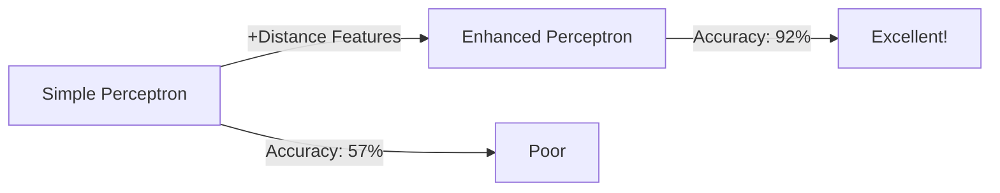
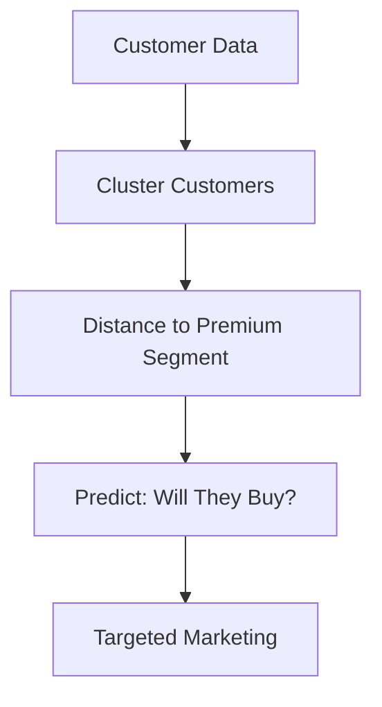
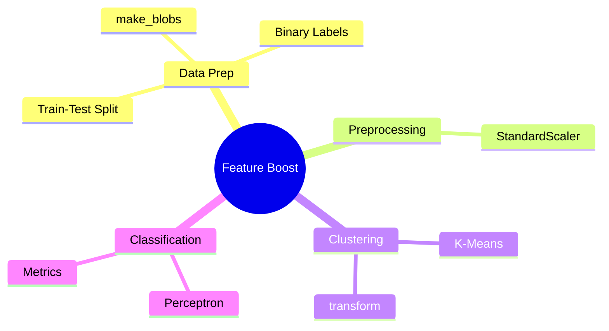
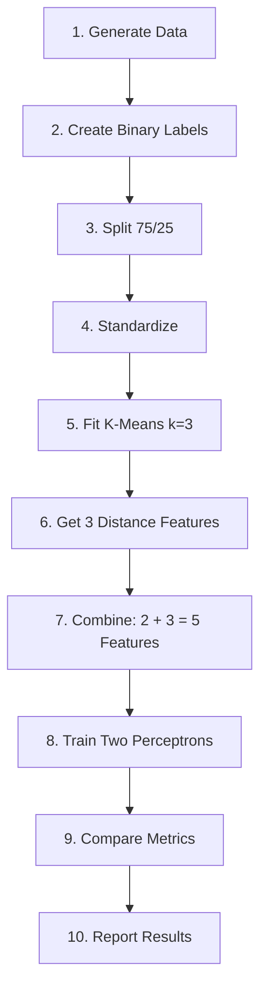
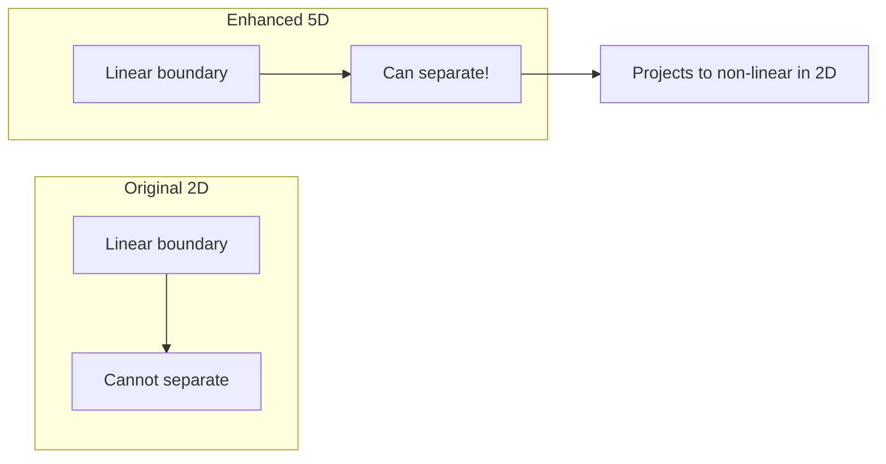
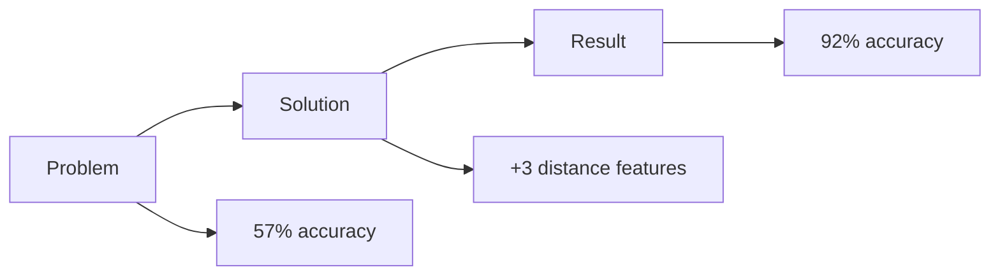

# Cluster-Distance Feature Boost
## Using K-Means to Enhance a Perceptron Classifier

---

<!-- Slide 1: Title & Objective -->
## Slide 1: Title & Objective

# Cluster-Distance Feature Boost

**Objective:** Demonstrate how adding distance-to-centroid features from K-Means clustering can dramatically improve a simple Perceptron classifier.



---

<!-- Slide 2: Problem Statement -->
## Slide 2: Problem Statement

# The Problem

**Challenge:** A Perceptron cannot draw a line that cleanly separates one cluster from others in 2D space.

| Issue | Impact |
|-------|--------|
| Linear boundary only | Cannot capture complex patterns |
| 2 features insufficient | Not enough information |
| Cluster overlap | High misclassification |

**Goal:** Boost accuracy by ≥5 percentage points using feature engineering.

---

<!-- Slide 3: Real-World Use Case -->
## Slide 3: Real-World Use Case

# Real-World Application

**Scenario:** Customer segmentation for targeted marketing



**Similar Applications:**
- Fraud detection (distance to normal transactions)
- Medical diagnosis (distance to disease profiles)
- Recommendation systems (similarity to user groups)

---

<!-- Slide 4: Input Data -->
## Slide 4: Input Data

# Data Generation

**make_blobs Parameters:**

| Parameter | Value | Meaning |
|-----------|-------|---------|
| n_samples | 900 | Total data points |
| centers | 3 | Number of clusters |
| cluster_std | [1.0, 1.2, 1.4] | Cluster spreads |

**Binary Labels:**
- Class 1: Cluster 0 (300 points)
- Class 0: Clusters 1 & 2 (600 points)

---

<!-- Slide 5: Concepts Used -->
## Slide 5: Concepts Used (High Level)

# Key Concepts



---

<!-- Slide 6: Concepts Breakdown -->
## Slide 6: Concepts Breakdown

# Core Concepts Explained

| Concept | Purpose | Analogy |
|---------|---------|---------|
| **StandardScaler** | Normalize features | Convert currencies to USD |
| **K-Means** | Find cluster centers | Find group leaders |
| **transform()** | Compute distances | How far to each leader? |
| **Perceptron** | Draw decision line | Simple pass/fail rule |

---

<!-- Slide 7: Step-by-Step Solution -->
## Slide 7: Step-by-Step Solution Flow

# Solution Pipeline



---

<!-- Slide 8: Code Logic Summary -->
## Slide 8: Code Logic Summary

# Key Code Snippets

```python
# Feature Engineering
kmeans = KMeans(n_clusters=3)
kmeans.fit(X_train_scaled)
distances = kmeans.transform(X_train_scaled)

# Combine Features
X_enhanced = np.column_stack([X_original, distances])

# Train Perceptron
model = Perceptron()
model.fit(X_enhanced, y_train)
```

---

<!-- Slide 9: Important Functions -->
## Slide 9: Important Functions & Parameters

# Key API Calls

| Function | Key Parameter | Purpose |
|----------|---------------|---------|
| `make_blobs()` | n_samples, centers | Generate data |
| `StandardScaler()` | - | Normalize to μ=0, σ=1 |
| `KMeans()` | n_clusters=3 | Find 3 centers |
| `.transform()` | - | Get distances |
| `Perceptron()` | max_iter=1000 | Train classifier |

---

<!-- Slide 10: Execution Output -->
## Slide 10: Execution Output

# Results: Metric Comparison

| Metric | Baseline | Enhanced | Improvement |
|--------|----------|----------|-------------|
| **Accuracy** | 57.7% | 92.4% | **+34.8%** |
| **Precision** | 31.7% | 89.7% | **+58.0%** |
| **Recall** | 60.6% | 88.6% | **+28.0%** |
| **ROC AUC** | 49.0% | 98.5% | **+49.5%** |

✅ **All metrics exceed 5% improvement threshold!**

---

<!-- Slide 11: Observations & Insights -->
## Slide 11: Observations & Insights

# Why Distance Features Help



**Key Insight:** Distance to cluster 0 centroid is SMALL for class 1 points and LARGE for class 0 points.

---

<!-- Slide 12: Advantages & Limitations -->
## Slide 12: Advantages & Limitations

# Trade-offs

| Advantages | Limitations |
|------------|-------------|
| ✓ Simple technique | ✗ Requires cluster structure |
| ✓ Dramatic improvement | ✗ Must choose k correctly |
| ✓ Interpretable features | ✗ Added computational cost |
| ✓ Works with any classifier | ✗ May not help all datasets |

---

<!-- Slide 13: Interview Takeaways -->
## Slide 13: Interview Key Takeaways

# Remember These Points!

1. **Feature engineering > algorithm complexity**
2. **transform() gives distances, predict() gives labels**
3. **fit() on train, transform() on both**
4. **Linear in high-D = non-linear in low-D**
5. **Cluster geometry is captured by distance features**

**Interview Answer Template:**
> "Distance features encode cluster geometry that raw features cannot express..."

---

<!-- Slide 14: Conclusion -->
## Slide 14: Conclusion

# Summary



**Key Achievement:** +35% accuracy with just 3 additional features!

**Lesson Learned:** Sometimes simple features beat complex algorithms.

---

## End of Slides
