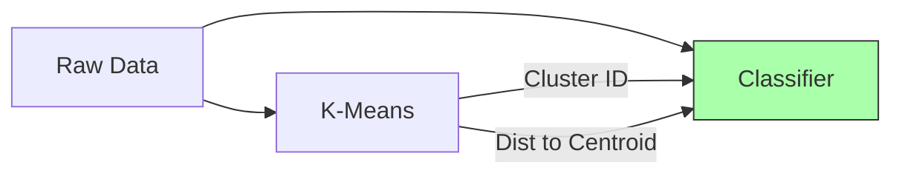

# 📚 Concepts Explained

## 1. K-Means Clustering

### 1. Definition
K-Means is an unsupervised machine learning algorithm that groups data points into 'k' clusters based on their similarity. It's like sorting a pile of colorful socks into separate heaps based on their color.

### 2. Why it is used
It helps to find hidden patterns or groupings in unlabeled data without any human supervision.

### 3. When to use it
Use it when you have a large dataset and you want to segment it into distinct groups, but you don't know the groups beforehand.

### 4. Where to use it
- **Customer Segmentation:** Grouping customers by purchasing behavior.
- **Image Compression:** Reducing the number of colors in an image.
- **Document Clustering:** Organizing articles by topic.

### 5. Is this the only way?
No. Alternatives include:
| Algorithm | Best For | Difference |
|-----------|----------|------------|
| Hierarchical Clustering | Small datasets | Builds a tree of clusters |
| DBSCAN | Noisy data | Finds clusters of arbitrary shapes |
| **K-Means** | **General purpose** | **Fast and simple for spherical clusters** |

### 6. Explanation with Diagrams
```mermaid
graph TD
    A[Start: Random Centroids] --> B[Assign Points to Nearest Centroid]
    B --> C[Calculate New Centroids (Mean)]
    C --> D{Centroids Moved?}
    D -- Yes --> B
    D -- No --> E[Stop: Clusters Found]
```
Imagine throwing 4 hoops onto a scatter plot of data.
1. Each data point runs to the nearest hoop.
2. The hoop moves to the center of its points.
3. Repeat until the hoops stop moving.

### 7. How to use it
```python
from sklearn.cluster import KMeans
kmeans = KMeans(n_clusters=4)
kmeans.fit(X_train)
labels = kmeans.predict(X_test)
```
- `n_clusters`: The number of groups you want (k).

### 8. How it works internally
1. **Initialize:** Pick k random points as starting centers (centroids).
2. **Assign:** Measure distance from every point to every centroid. Assign point to best (closest) centroid.
3. **Update:** Calculate the average position (mean) of all points in a cluster. Move the centroid there.
4. **Repeat:** Keep doing 2 & 3 until centroids stabilize.

### 9. Visual Summary
- **Input:** Unlabeled dots.
- **Process:** Iterative refinement of centers.
- **Output:** Labeled dots (clusters).

### 10. Advantages
- **Fast:** Very efficient for large datasets.
- **Simple:** Easy to understand and implement.
- **Scalable:** Works well with many samples.

### 11. Disadvantages / Limitations
- **Must choose k:** You need to guess the number of clusters.
- **Spherical assumption:** Assumes clusters are round balls. Fails on "banana" shapes.
- **Outliers:** Sensitive to noisy data points.

### 12. Exam & Interview Points
- **Q:** How do you choose k? **A:** Elbow method or Silhouette score.
- **Q:** Is it deterministic? **A:** No, random initialization can lead to different results (fix with `random_state`).
- **Q:** What is complexity? **A:** O(n * k * i * d) (linear width n).

---

## 2. Perceptron

### 1. Definition
The Perceptron is the simplest type of artificial neural network—a single-layer linear classifier. It's the "hello world" of neural networks.

### 2. Why it is used
It's used to classify data that can be separated by a straight line (linearly separable). It mimics a single biological neuron.

### 3. When to use it
Use it for simple binary classification tasks where the data is clearly separated, or for educational purposes to understand neural nets.

### 4. Where to use it
- **Simple Logic Gates:** Implementing AND/OR gates.
- **Fast filtering:** High-speed, low-resource binary decisions.

### 5. Is this the only way?
No.
| Algorithm | Best For | Difference |
|-----------|----------|------------|
| Logistic Regression | Probabilities | Gives probability, not just yes/no |
| SVM | Margins | Finds the *widest* gap between classes |
| **Perceptron** | **Simplicity** | **Updates weights only on errors** |

### 6. Explanation with Diagrams
```mermaid
graph LR
    I1[Input 1] --> S((Sum))
    I2[Input 2] --> S
    I3[Input 3] --> S
    S --> A[Activation Function]
    A --> O[Output (0 or 1)]
    
    style S fill:#f9f,stroke:#333
    style A fill:#bbf,stroke:#333
```
Detailed flow: Inputs (x) are multiplied by weights (w), summed up, added to a bias (b). If sum > 0, output 1, else 0.

### 7. How to use it
```python
from sklearn.linear_model import Perceptron
clf = Perceptron()
clf.fit(X_train, y_train)
y_pred = clf.predict(X_test)
```

### 8. How it works internally
It learns by mistake.
1. Predict class.
2. If correct, do nothing.
3. If wrong, nudge weights towards the correct inputs.
   `weights = weights + learning_rate * (target - predicted) * input`

### 9. Visual Summary
- **Think:** A line that moves every time it makes a mistake until it separates the dots.

### 10. Advantages
- **Simple:** Easiest to explain.
- **Online Learning:** Can learn one sample at a time (great for streams).

### 11. Disadvantages / Limitations
- **Linear only:** CANNOT solve XOR problem (non-linear data).
- **No probabilities:** Only gives strict 0 or 1.

### 12. Exam & Interview Points
- **Q:** Can Perceptron solve XOR? **A:** No, because XOR is not linearly separable.
- **Q:** What happens if data isn't separable? **A:** It will never converge (loop forever unless stopped).

---

## 3. Feature Augmentation (with K-Means)

### 1. Definition
Creating NEW features based on cluster information to give the model "hints" about the data structure.

### 2. Why it is used
Simple models like Perceptron struggle with complex data. Adding "cluster distance" features effectively transforms non-linear data into a more separable form.

### 3. When to use it
When your simple model is underfitting (too dumb) and you suspect there are natural groupings in the data.

### 4. Where to use it
- **Complex Classification:** Helping linear models solve non-linear problems.
- **Hybrid Models:** Combining unsupervised and supervised learning.

### 5. Is this the only way?
No. You could use:
- **Polynomial Features:** `x^2`, `x*y` (Explodes feature count).
- **Kernels (SVM):** Mathematical trickery (Compute intensive).
- **Deep Learning:** Layers of neurons (Data hungry).

### 6. Explanation with Diagrams

It's like telling a student not just the math problem, but also "Hint: This is a Geometry problem". The hint makes it easier to solve.

### 7. How to use it
See `augment_features` function in code.
We append `[cluster_one_hot, distances_to_centroids]` to the original `X`.

### 8. How it works internally
We map the data into a higher-dimensional space where it might be linearly separable.
- Original: 13 dimensions.
- Augmented: 21 dimensions.
The extra dimensions represent "closeness to specific archetypes".

### 9. Visual Summary
Adding columns to your Excel sheet that say "Is Type A?", "Distance to Type A", etc.

### 10. Advantages
- **Boosts Accuracy:** Makes simple models powerful.
- **Interpretable:** We know what the new features mean ("Closeness to cluster 1").

### 11. Disadvantages / Limitations
- **Data Leakage Risk:** MUST fit K-Means only on training data.
- **Dimensionality:** Increases number of features (curse of dimensionality if k is huge).

### 12. Exam & Interview Points
- **Q:** Why fit K-Means on train only? **A:** To prevent test data info from leaking into the model training.
- **Q:** Does this turn Perceptron into a non-linear classifier? **A:** Not strictly, but it operates on non-linear features, achieving a non-linear decision boundary in original space.

---

## 4. Jargon Buster (Glossary)

| Term | Simple Explanation |
|------|-------------------|
| **Stratified CV** | Splitting data like a deck of cards, ensuring every hand has equal Aces, Kings, Queens. |
| **One-Hot Encoding** | Converting identifying numbers (1, 2, 3) into flags ([1,0,0], [0,1,0], [0,0,1]). |
| **Centroid** | The geometric center (average) of a cluster. The "capital city" of the group. |
| **StandardScaler** | Resizing data rulers so measuring "inches" and "miles" gives comparable numbers (mean=0, std=1). |
| **Inertia** | How tightly packed a cluster is. Lower is better. |
