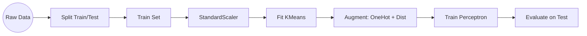

# 📋 Interview Preparation (Quick Revision)

## ⏱️ 30-Second Summary
We tried to improve a **Perceptron** classifier on the **Wine Dataset** by adding **K-Means Cluster features**.
- **Method:** Stratified 5-Fold CV.
- **Augmentation:** Added Cluster ID (One-Hot) + Distance to Centroids.
- **Result:** Baseline (98.3%) performed equal/better than Enhanced (97.7%).
- **Conclusion:** Simplicity wins. Extra features added noise/complexity without gain for this specific simple dataset.

## 🔑 Key Terms Glossary
- **Stratified K-Fold:** Splitting data while keeping class ratios same.
- **Data Leakage:** Cheating by using test info during training (e.g., fitting scaler on test data).
- **One-Hot Encoding:** Turning categorical "Group A" into `[1, 0, 0]`.
- **Centroid:** The center point of a cluster.

## ⚡ Top 5 Points to Remember
1.  **Always Scale:** K-Means fails without `StandardScaler`.
2.  **Fit on Train Only:** Never fit K-Means or Scaler on test data.
3.  **Baseline First:** Always start with a simple model.
4.  **Complexity Cost:** More features = slower training/inference + risk of overfitting.
5.  **P-Value:** Checks if improvement is real or luck.

## 🆚 Comparison Table

| Feature | Baseline | Enhanced |
| :--- | :--- | :--- |
| **Features** | 13 (Chemicals) | 21 (13 + 4 OneHot + 4 Dists) |
| **Preprocessing** | Scaling | Scaling + K-Means Clustering |
| **Complexity** | Low | Medium |
| **Risk** | Underfitting | Overfitting / Noise |
| **Best Use** | Simple Problems | Complex, Non-linear Problems |

## 🖼️ Architecture Summary

