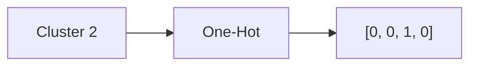

# 🎤 Interview Questions & Answers

## 🟢 Beginner Level (For the 10-year-old in you)

### Q1. What is the difference between specific features and cluster features?
**Simple Answer:**
Specific features are like "Height" and "Weight". Cluster features are like "Group Type" (Small, Medium, Big).
**Analogy:**
- Original Feature: "This fruit is red and round."
- Cluster Feature: "This fruit belongs to the Apple family."
It gives a high-level summary.

### Q2. Why did we split the data into 5 parts (folds)?
**Simple Answer:**
To make sure our test was fair. If we only tested on the easy questions, we might think we are smarter than we are.
**Analogy:**
Like taking 5 different quizzes in school instead of just one. If you pass all 5, you really know the subject!

### Q3. What is a "Baseline"?
**Simple Answer:**
The starting point to beat.
**Analogy:**
If you run a race in 10 minutes (Baseline), training with special shoes (Enhanced) should make you faster. If you run in 11 minutes, the shoes didn't help!

---

## 🟡 Intermediate Level (For the Junior Data Scientist)

### Q4. Why did we fit K-Means on *training* data only?
**Answer:**
To prevent **Data Leakage**. If we use test data to maintain centroids, our model "sees" the answers before the exam.
**Real-World Check:**
In production, you receive a *single* new data point. You can't re-cluster the whole world every time. You must use existing centroids.

### Q5. What is the "Curse of Dimensionality"?
**Answer:**
As you add more features (dimensions), you need exponentially more data to generalize well.
**In this project:**
We went from 13 → 21 features. With only 178 samples, we risked making the space too empty, making it harder for the Perceptron to find a good boundary.

### Q6. Why Perceptron and not Random Forest?
**Answer:**
Because the goal was to test the *feature augmentation*. Perceptron is a weak, linear learner. If K-Means helps, it shows up clearly. Random Forest is already so strong it might hide the benefit of the extra features.

### Q7. Explain "One-Hot Encoding" for clusters.
**Answer:**
Converting a category "Cluster 2" into a vector `[0, 0, 1, 0]`.
**Diagram:**

**Why?** Mathematical models can't understand "Cluster 2" is different from "Cluster 1" just by the number. They need separate switches.

---

## 🔴 Expert Level (For the Senior ML Engineer)

### Q8. Interpret the p-value in our context.
**Answer:**
If `p > 0.05`, we cannot reject the null hypothesis. It means the difference between Baseline (98.3%) and Enhanced (97.7%) is statistically insignificant. We should choose the simpler model (Baseline) due to Occam's Razor.

### Q9. When would K-Means features actually fail?
**Answer:**
1. **Clusters are irrelevant:** The natural grouping of data has nothing to do with the label (e.g., clustering students by shoe size to predict math grades).
2. **K is wrong:** Choosing k=4 when there are really only 2 groups forces artificial boundaries.

### Q10. What is the operational cost of this pipeline?
**Answer:**
- **Storage:** Need to save the K-Means model (centroids) along with the Perceptron.
- **Latency:** Inference requires calculating distances to 4 centroids for every request.
- **Maintenance:** Drift in data distribution requires retraining BOTH K-Means and Perceptron.

---

## 🧠 Behavioral / Scenario Questions

### Q11. Your boss asks: "Why did you build a worse model?"
**Answer:**
"I didn't build a worse model; I conducted an experiment. We proved that for this specific dataset, complexity is unnecessary. This saves us engineering time and compute resources in production. A negative result is still a valuable business insight."

### Q12. How would you improve this if accuracy was the only goal?
**Answer:**
- Switch algorithm: Use XGBoost or Random Forest.
- Hyperparameter tuning: Grid Search for Perceptron (alpha, penalty).
- Better Preprocessing: Try PCA instead of K-Means features.

### Q13. Explain "Stratified" to a non-technical stakeholder.
**Answer:**
"Imagine we are testing a soup. If we only scoop from the top, we get only broth. If we scoop from bottom, only chunks. Stratified means we stir the soup properly so every scoop (fold) has the right mix of broth and chunks."

### Q14. What if the data was imbalanced (99% Class 0)?
**Answer:**
Accuracy becomes useless (99% accuracy by always guessing 0).
We would rely entirely on **F1-Score** or **ROC-AUC**.

### Q15. Can we use K-Means features for Regression?
**Answer:**
Yes! Knowing which "cluster" a house belongs to (e.g., "Luxury vs Budget") is a very strong predictor for its price. The technique is identical: One-Hot Cluster ID + Distances.
