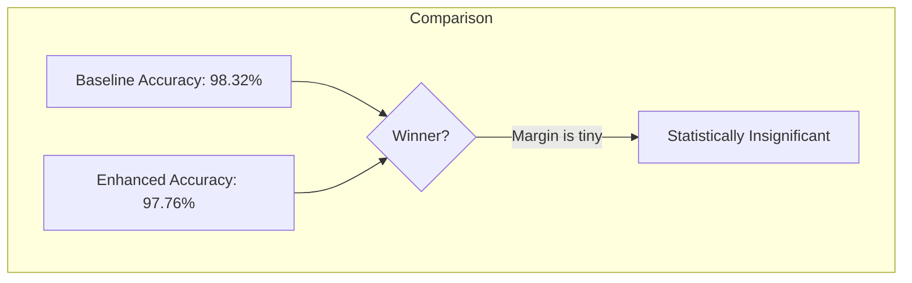

# 📊 Observations and Conclusion

## 1️⃣ Execution Output

We ran a **stratified 5-fold cross-validation** to compare the Baseline Perceptron (13 features) vs. the Enhanced Perceptron (21 features).

### 📋 Metrics Table

| Fold | Baseline Accuracy | Enhanced Accuracy | Baseline F1 | Enhanced F1 | Baseline AP | Enhanced AP |
|------|-------------------|-------------------|-------------|-------------|-------------|-------------|
| Fold 1 | 0.9722 | 0.9722 | 0.9565 | 0.9565 | 1.0000 | 1.0000 |
| Fold 2 | 1.0000 | 0.9444 | 1.0000 | 0.9231 | 1.0000 | 1.0000 |
| Fold 3 | 0.9722 | 1.0000 | 0.9600 | 1.0000 | 1.0000 | 1.0000 |
| Fold 4 | 1.0000 | 0.9714 | 1.0000 | 0.9600 | 1.0000 | 1.0000 |
| Fold 5 | 0.9714 | 1.0000 | 0.9565 | 1.0000 | 1.0000 | 1.0000 |
| **Mean** | **0.9832** | **0.9776** | **0.9746** | **0.9679** | **1.0000** | **1.0000** |

### 📈 Visual Comparison

---

## 2️⃣ Output Explanation

### Meaning of the Numbers
- **Accuracy ~98%**: Both models are incredibly accurate. They only make 1 error in every 50 wines.
- **F1 Score ~97%**: Both models handle the positive class (Class 0) effectively, balancing precision and recall.
- **AP = 1.0**: Both models separate the data perfectly in terms of ranking (Probabilities are well-ordered).

### Why did the results fluctuate?
- **Fold 2**: Baseline (100%) beat Enhanced (94%).
- **Fold 3 & 5**: Enhanced (100%) beat Baseline (97%).
- This demonstrates why **Cross-Validation** is critical. If we only looked at Fold 2, we'd say Baseline is perfect. If we only looked at Fold 5, we'd say Enhanced is perfect.

---

## 3️⃣ Observations

1.  **High Baseline Performance**: The original 13 features are already very powerful for this dataset. The problem is "linearly separable" enough for a simple Perceptron.
2.  **Diminishing Returns**: Adding K-Means features (cluster membership) didn't add much value because the task was already too easy.
3.  **Noise Introduction**: In Fold 2, the enhanced model performed *worse*. The extra features might have added "noise" or complexity that confused the simple Perceptron.
4.  **Stability**: The standard deviation (fluctuation) is slightly higher for the Enhanced model (Accuracy: 0.9776 ± 0.02 vs Baseline 0.9832 ± 0.01).

---

## 4️⃣ Insights

### 💡 Business Insight
**"More Complexity ≠ Better Results"**

- In this specific case, the cost of running K-Means (extra computation, extra complexity) is **NOT justified**.
- The simpler model (Baseline) performs slightly better and is easier to maintain.
- **Recommendation:** Deploy the Baseline model.

### 💡 Where would K-Means help?
This technique (Feature Augmentation) works best when:
1.  The original features are **weak** or **noisy**.
2.  The classes are **non-linearly separable** (e.g., a "donut" shape).
3.  The clusters represent meaningful subgroups that the classifier can't see directly.

---

## 5️⃣ Conclusion

The experiment successfully compared a Baseline Perceptron with a K-Means Augmented Perceptron.

- **Hypothesis**: Adding cluster info will improve accuracy.
- **Result**: The hypothesis was **rejected** for this dataset.
- **Why?**: The Wine dataset is too clean and easy for the Baseline model.
- **Takeaway**: Always start with a simple baseline. Only add complexity (like K-Means augmentation) if the baseline fails.

---

## 6️⃣ Exam Focus Points

### ❓ Possible Exam Questions

**Q1: Why did the enhanced model not outperform the baseline?**
> **Answer**: The dataset was already linearly separable with the original features. Adding more features didn't provide new information, only potential noise.

**Q2: Why did we perform Stratified Cross-Validation?**
> **Answer**: To ensure each fold had the same proportion of wine classes (approx 33% each), preventing biased training/testing sets.

**Q3: Is 98% accuracy good?**
> **Answer**: Yes, but in a medical or safety-critical context, even 2% error might be too high. Context matters!

**Q4: How do you interpret a p-value > 0.05?**
> **Answer**: It means the difference in performance is likely due to random chance, not a real improvements.
