# Problem Statement: K-Means Feature Augmentation + Perceptron

## 🧩 What Problem Are We Solving?

Imagine you're a **wine expert** trying to identify wines from a specific vineyard (Class 0). You have 13 measurements about each wine (like alcohol content, color intensity, etc.), but your current classifier (Perceptron) isn't accurate enough.

**The Question:** Can we make the classifier smarter by first grouping similar wines together (using K-Means clustering) and then telling the classifier which group each wine belongs to?

### Real-Life Analogy: The Restaurant Recommendation System

Think of it like a food delivery app:

1. **Original Approach (Baseline):** Recommend restaurants based only on user ratings
2. **Enhanced Approach (Feature Augmentation):** 
   - First, group users into 4 types (budget-conscious, foodies, health-focused, convenience-seekers)
   - Tell the system which group each user belongs to
   - Also tell it how similar the user is to each group
   - Now the system has MORE information to make better recommendations!

---

## 🪜 Steps to Solve the Problem

```mermaid
flowchart TD
    A[📥 Load Wine Dataset<br>178 samples, 13 features] --> B[🏷️ Create Binary Labels<br>Class 0 = Positive<br>Class 1,2 = Negative]
    B --> C[📊 Standardize Features<br>Mean=0, Std=1]
    C --> D[🔄 5-Fold Cross-Validation Loop]
    
    D --> E[📂 Split into Train/Test]
    E --> F[🎯 Fit K-Means k=4<br>ON TRAINING DATA ONLY!]
    
    F --> G1[🧮 Baseline Perceptron<br>Original 13 Features]
    F --> G2[✨ Enhanced Perceptron<br>13 + 4 one-hot + 4 distances = 21 Features]
    
    G1 --> H[📈 Calculate Metrics<br>Accuracy, F1, Avg Precision]
    G2 --> H
    
    H --> I{All 5 Folds<br>Complete?}
    I -->|No| D
    I -->|Yes| J[📊 Compare Results<br>Statistical Testing]
    
    J --> K[📝 Executive Summary<br>Production Recommendation]
```

### Step-by-Step Breakdown

| Step | What We Do | Why |
|------|------------|-----|
| 1 | Load Wine dataset | Get our 178 wine samples with 13 chemical features |
| 2 | Create binary labels | Convert 3-class problem to 2-class (Class 0 vs rest) |
| 3 | Standardize features | Make all features comparable (same scale) |
| 4 | Set up 5-fold CV | Split data 5 ways for robust evaluation |
| 5 | Fit K-Means (k=4) | Find 4 natural groups in training wines |
| 6 | Create augmented features | Add cluster membership + distances to centroids |
| 7 | Train baseline Perceptron | On original 13 features |
| 8 | Train enhanced Perceptron | On 21 augmented features |
| 9 | Calculate metrics | Accuracy, F1-score, Average Precision |
| 10 | Statistical testing | Is the difference real or just luck? |
| 11 | Executive summary | Recommend for production or not |

---

## ⚠️ Critical Concept: Why K-Means Per Fold?

```mermaid
flowchart LR
    subgraph WRONG["❌ WRONG: Data Leakage"]
        W1[Fit K-Means on ALL data] --> W2[Test data clusters<br>influenced training]
        W2 --> W3[Overly optimistic results]
    end
    
    subgraph RIGHT["✅ RIGHT: No Leakage"]
        R1[Fit K-Means on<br>TRAINING data only] --> R2[Test data treated as<br>truly unseen]
        R2 --> R3[Realistic results]
    end
```

**Why This Matters:** If we fit K-Means on ALL the data (including test samples), the test samples influence where centroids are placed. This is like peeking at the exam answers before the test—the results look good but aren't real!

---

## 🎯 Expected Output

### 1. Cross-Validation Metric Table

| Fold | Baseline Accuracy | Enhanced Accuracy | Baseline F1 | Enhanced F1 | Baseline AP | Enhanced AP |
|------|-------------------|-------------------|-------------|-------------|-------------|-------------|
| 1 | 0.XX | 0.XX | 0.XX | 0.XX | 0.XX | 0.XX |
| 2 | 0.XX | 0.XX | 0.XX | 0.XX | 0.XX | 0.XX |
| ... | ... | ... | ... | ... | ... | ... |
| **Mean ± Std** | X.XX ± X.XX | X.XX ± X.XX | X.XX ± X.XX | X.XX ± X.XX | X.XX ± X.XX | X.XX ± X.XX |

### 2. Comparison Bar Plot

A side-by-side bar chart showing:
- Baseline vs Enhanced for each metric
- Error bars showing standard deviation
- Clear visual comparison

### 3. Executive Summary (400-450 words)

A production recommendation covering:
- Which pipeline performs better
- Statistical significance (p-value)
- Operational considerations (complexity, training time)
- Final recommendation

---

## ✅ Success Criteria

1. **Metric Improvement:** Enhanced pipeline improves at least 2 metrics OR provides evidence-based explanation if not
2. **Statistical Significance:** Summary references p-values and significance
3. **Operational Impact:** Summary discusses complexity/time tradeoffs
4. **No Data Leakage:** K-Means fit ONLY on training folds

---

## 📚 Key Terms (Jargon Buster)

| Term | Simple Meaning |
|------|----------------|
| **K-Means** | Grouping similar things into k buckets |
| **Perceptron** | Simplest brain cell that makes yes/no decisions |
| **Feature Augmentation** | Adding more information to help the model |
| **One-Hot Encoding** | Writing "Cluster 2" as [0, 0, 1, 0] |
| **Centroid Distance** | How far a point is from each group center |
| **Stratified CV** | Keeping class proportions equal in each split |
| **Average Precision** | How well we rank positive samples |
| **p-value** | Probability the difference happened by chance |
