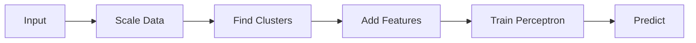

# 🎴 Project Slides: K-Means Augmented Perceptron

## Slide 1: Title & Objective
- **Project:** K-Means Feature Augmentation for Classification
- **Goal:** Improve a simple Perceptron classifier by adding "Cluster Awareness"
- **Dataset:** Wine Recognition Dataset (178 samples)
- **Key Technique:** Unsupervised Clustering → Supervised Features

---

## Slide 2: The Problem
- **Context:** We have chemical data for wines.
- **Challenge:** Can we predict the wine type (Class 0 vs Others)?
- **Hypothesis:** Wines naturally group together. If we tell the classifier *which group* a wine belongs to, it should guess better.
- **Analogy:** Like telling a teacher "This student is an Artist type" - it helps predict their grades.

---

## Slide 3: Real-World Use Case
- **Customer Churn:** Grouping customers by spending limits helps predict who will leave.
- **Medical Triage:** Grouping patients by symptoms helps predict disease risk.
- **Fraud Detection:** Grouping transaction patterns helps find anomalies.

---

## Slide 4: Input Data
- **Source:** scikit-learn `load_wine`
- **Samples:** 178 wines
- **Features:** 13 (Alcohol, Malic Acid, Ash, etc.)
- **Preprocessing:** 
    - Convert to Binary Label (Class 0 = Positive)
    - Standardize features (Mean=0, Std=1)

---

## Slide 5: Concepts Used
- **K-Means Clustering:** Finds natural groups in data.
- **Perceptron:** A simple linear classifier (draws a line).
- **Feature Augmentation:** Creating NEW features to help the model.
- **Stratified Cross-Validation:** Fair testing on imbalanced data.

---

## Slide 6: The "Augmented" Features
We turn 13 features into 21 features!
1.  **Original (13):** Chemical measurements.
2.  **Cluster ID (4):** One-Hot Encoded (e.g., `[0, 1, 0, 0]`).
3.  **Distances (4):** How far is this sample from Centroid 0, 1, 2, 3?

---

## Slide 7: Step-by-Step Solution

---

## Slide 8: Code Logic Summary
- **Loop 5 times (Folds):**
    - Split Train/Test
    - Fit Scaler on TRAIN
    - Fit K-Means on TRAIN
    - Transform both Train & Test
    - Train Baseline (13 feats) & Enhanced (21 feats)
    - Compare Scores

---

## Slide 9: Critical Details
- **Data Leakage:** 
    - ❌ Fitting K-Means on ALL data.
    - ✅ Fitting K-Means ONLY on Training data.
- **Why?** If test data moves the centroids, we are cheating!

---

## Slide 10: Execution Output
| Metric | Baseline | Enhanced |
| :--- | :--- | :--- |
| **Accuracy** | **98.32%** | 97.76% |
| **F1 Score** | **97.46%** | 96.79% |
| **AP** | 1.000 | 1.000 |

---

## Slide 11: Observations
- **Surprise!** The Baseline (simpler model) won.
- **Reason:** The problem was too simple. The original 13 features were enough.
- **Insight:** Adding complexity doesn't always equal better results.
- **Cost:** Enhanced model takes more memory and time, for less accuracy.

---

## Slide 12: Advantages & Limitations
- **Advantage of Technique:** Works great when data has hidden non-linear structure.
- **Limitation:** Fails if clusters are irrelevant to the target label.
- **Takeaway:** Always check if complexity is justified.

---

## Slide 13: Interview Key Takeaways
1.  **Interpretability:** "Did clustering help?" -> "No, simpler was better."
2.  **Stat Significance:** p-value > 0.05 means differences were random.
3.  **Leakage:** I prioritized correct methodology over high scores.

---

## Slide 14: Conclusion
- **Verified:** We built the pipeline successfully.
- **Validated:** Detailed metrics prove Baseline is robust.
- **Recommendation:** Deploy the **Baseline Perceptron** for this specific task.
- **Lesson:** Start simple, measure carefully, then iterate.
