```mermaid
graph LR
    x1[Input x1] --> w1((w1))
    x2[Input x2] --> w2((w2))
    w1 --> Sum((Sum Σ))
    w2 --> Sum
    b[Bias b] --> Sum
    Sum -->|z = w·x + b| Act{Activation}
    Act -->|z > 0| Out1[Output 1]
    Act -->|z <= 0| Out0[Output 0]
```

# 📚 Concepts Explained

This document explains every core concept used in the **Adaptive Perceptron for Concept Drift** project.

---

## 1. Concept Drift

### 1. Definition
**Concept Drift** is when the statistical properties of the data stream change over time, meaning the "rules" the model learned in the past are no longer valid for the future.
*Analogy:* Studying for a History exam, but on the exam day, the questions are about Geography. The "concept" of the exam drifted.

### 2. Why it is used (Why we study it)
In real-world applications, data is rarely static. We need to understand drift to build systems that don't fail as the world changes.

### 3. When to use it
You don't "use" drift; you **detect and handle** it when your data comes from a dynamic source (time-series, user behavior, sensors).

### 4. Where to use it
- **Fraud Detection:** Scammers change tactics (drift).
- **Recommendation Systems:** User interests change over time (drift).
- **Stock Market:** Market rules change during crises (drift).

### 5. Is this the only way?
No. There are different types of changes:
| Type | Description |
|---|---|
| **Concept Drift** | The relationship between X and Y changes (Real Change). |
| **Data Drift/Covariate Shift** | The distribution of X changes, but the rule stays the same (Virtual Change). |

### 6. Explanation with Diagrams


```mermaid
graph LR
    A[Time 1: Summer] -->|Data: Sun, Ice Cream| B(Model: Sell Ice Cream)
    B --> C[Metric: High Sales]
    C --> D[Time 2: Winter]
    D -->|Data: Snow, Cold| B
    B -->|Prediction: Sell Ice Cream| E[Metric: LOW Sales 📉]
    E --> F[Concept DRIFT Detected!]
```

### 7. How to use it (Detection)
In code, we detect it by monitoring accuracy.
```python
if accuracy < threshold:
    print("Drift Detected!")
```

### 8. How it works internally
The environment (generative process) producing the data changes parameters (e.g., mean, variance, or decision boundary). The model's error rate spikes because its learned weights $w$ essentially solve for the wrong equation.

### 9. Visual Summary
- **Stable Data:** 🟢 Accuracy is high line.
- **Drift:** 📉 Accuracy crashes.
- **Adaptation:** 📈 Accuracy recovers.

### 10. Advantages (of Handling it)
- **Longevity:** Model survives for years without manual retraining.
- **Reliability:** System admits when it's unsure or failing.

### 11. Disadvantages / Limitations
- **False Alarms:** Noise can look like drift, triggering unnecessary resets.
- **Lag:** Detection takes time; you will make mistakes before you realize drift happened.

### 12. Exam & Interview Points
- **Q:** What is the difference between Concept Drift and Data Drift? (A: Concept drift = P(y|X) changes; Data drift = P(X) changes).
- **Q:** How do you handle it? (A: Retrain window, decay weights, or ensemble models).

---

## 2. Perceptron

### 1. Definition
The **Perceptron** is the simplest type of artificial neural network. It simulates a single neuron that takes inputs, sums them up, and fires (outputs 1) if the sum is above a threshold.

### 2. Why it is used
It is the building block of Deep Learning. It handles **Linearly Separable** data perfectly.

### 3. When to use it
- For simple binary classification.
- As a baseline model.
- For streaming data (Online Learning) because it's fast.

### 4. Where to use it
- Logic Gates (AND, OR).
- Simple hardware implementations.

### 5. Is this the only way?
No.
| Model | Comparison |
|---|---|
| **Perceptron** | Linear decision boundary. Simple. No probabilities. |
| **Logistic Regression** | Smooth probability output. |
| **SVM** | Finds the *widest* margin. Better generalization. |

### 6. Explanation with Diagrams


### 7. How to use it
```python
model = Perceptron()
model.fit(X, y)
```

### 8. How it works internally
It calculates a weighted sum $z = w_1x_1 + w_2x_2 + ... + b$.
If $z > 0$, prediction is 1. If not, 0.
**Update Rule:** $w_{new} = w_{old} + \eta \cdot (y_{true} - y_{pred}) \cdot x$.
It nudges weights closer to the correct answer.

### 9. Visual Summary
- Think of a line cutting a paper in two.
- Points on one side are "Class 1", other side "Class 0".
- Training rotates the line to separate the dots correctly.

### 10. Advantages
- **Fast:** Very low computation.
- **Online:** Can learn one sample at a time.
- **Guaranteed Convergence:** If data is separable, it *will* find a solution.

### 11. Disadvantages / Limitations
- **XOR Problem:** Cannot solve non-linear problems (like XOR).
- **Unstable:** Decision boundary shifts wildly with new data.

### 12. Exam & Interview Points
- **Q:** Can a Perceptron solve XOR? (A: No, only linearly separable problems).
- **Q:** What is the learning rule? (A: $w = w + \Delta w$, where $\Delta w = \eta(y-y')x$).

---

## 3. Adaptive Learning Rate (Decay)

### 1. Definition
**Adaptive Learning Rate** means changing the speed of learning ($\eta$) during training. **Decay** means slowing it down over time.
*Analogy:* When you drive to a new city, you drive fast on the highway (High LR). When you reach the destination neighborhood, you drive slow to find the exact house (Low LR).

### 2. Why it is used
To converge efficiently. High LR for speed initially; Low LR for precision at the end.

### 3. When to use it
Almost always in Gradient Descent (Deep Learning, Neural Networks).

### 4. Where to use it
SGD, Adam, RMSProp (internal mechanisms).

### 5. Is this the only way?
| Strategy | Description |
|---|---|
| **Constant LR** | Simple, but can overshoot or take forever. |
| **Decay** | Deterministic decrease ($LR \times 0.9$). |
| **Adaptive (Adam)** | Each weight has its own LR based on past gradients. Best modern practice. |

### 6. Explanation with Diagrams


### 7. How to use it
```python
lr = lr * decay_rate
```

### 8. How it works internally
Simply multiplies the scalar learning rate variable by a factor $< 1$ (e.g., 0.9) regularly. This reduces the magnitude of weight updates $|\Delta w|$.

### 9. Visual Summary
- Big jumps initially (Exploring).
- Small steps later (Exploiting/Refining).

### 10. Advantages
- **Convergence:** Helps settle into the minimum/optimal solution.
- **Stability:** Prevents oscillating around the solution.

### 11. Disadvantages
- **Too Fast Decay:** Learning stops before reaching the goal.
- **Drift Logic Conflict:** If LR is too small when Drift happens, the model cannot adapt quickly enough! (That's why we rely on Reset in this project).

### 12. Exam & Interview Points
- **Q:** Why decay learning rate? (A: To balance convergence speed vs precision).
- **Q:** What if decay is too fast? (A: Underfitting/Premature convergence).

---

## 4. Validation Buffer (Sliding Window)

### 1. Definition
A **Validation Buffer** or Sliding Window is a subset of the most recent data reserved for testing the model's current performance, distinct from the training data.

### 2. Why it is used
To get a real-time health check of the model. You cannot evaluate on data you just trained on (overfitting risk), although in online learning pre-quential (test-then-train) is common.

### 3. When to use it
In Streaming Data and Time Series analysis.

### 4. Where to use it
Monitoring dashboards for ML models in production.

### 5. Is this the only way?
| Method | Description |
|---|---|
| **Holdout (Static)** | Standard Train/Test split. Bad for streams. |
| **Sliding Window** | Last N samples. Good for current trend. |
| **Growing Window** | All past data. Good for cumulative metrics, bad for drift detection. |

### 6. Explanation with Diagrams


### 7. How to use it
```python
X_train, X_val = split(batch)
model.predict(X_val)
```

### 8. How it works internally
It creates a temporary dataset of recent samples. The model predicts on them, compares with ground truth, and computes a score.

### 9. Visual Summary
- Like looking in the rear-view mirror to see how well you just drove.

### 10. Advantages
- **Immediate Feedback:** Instant adaptation trigger.
- **Relevance:** Measures performance on *current* data distribution.

### 11. Disadvantages
- **Data Hungry:** You "waste" data on validation that could be used for training.
- **Variance:** Small buffer sizes lead to noisy metrics (Acc jumps up and down randomly).

### 12. Exam & Interview Points
- **Q:** Why validation buffer in streams? (A: To detect concept drift without supervision delay).
- **Q:** Trade-off of window size? (A: Small = Fast but noisy; Large = Stable but slow to detect change).
