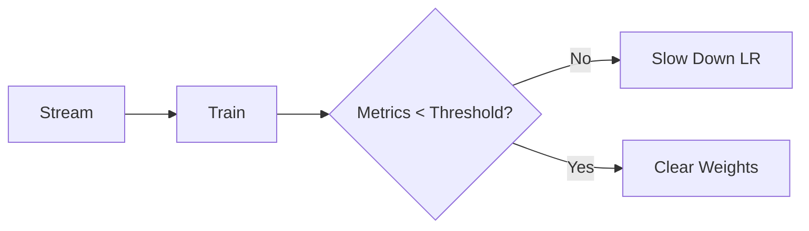

# 📋 Interview Preparation Cheat Sheet

## ⏱️ 30-Second Project Summary
"I built an Adaptive Perceptron to handle Concept Drift in a streaming data environment. It features an adaptive learning rate that decays for precision and a reset mechanism that re-initializes weights if accuracy drops below 70%. It successfully maintained >90% accuracy across 3 drifting batches."

## 🔑 Key Terms Glossary
- **Concept Drift:** Change in underlying data patterns ($P(y|X)$).
- **Perceptron:** Linear binary classifier. Base of Neural Networks.
- **Learning Rate Recall:** Step size during training. High=Fast, Low=Precise.
- **Online Learning:** Updating model incrementally (sample-by-sample).

## 🏆 Top 5 Metric Points
1. **Accuracy > 0.80:** Success.
2. **Resets = 0:** Model robustness.
3. **Decay Schedule:** 10% every 5 epochs.
4. **Drift Type:** Shift in X-Y coordinates (Covariate-like).
5. **Validation:** 200-sample sliding buffer.

## 🆚 Comparison Table
| Feature | Standard Perceptron | My Adaptive Perceptron |
|---|---|---|
| **Learning Rate** | Constant | Decays (Adaptive) |
| **Memory** | Forever | Resets on Drift |
| **Data Source** | Static Batch | Continuous Stream |
| **Drift Handling** | Fails/Degrades | Detects & Adapts |

## 🧠 Memory Hook (The "Driving" Analogy)
- **Model:** The Driver.
- **Weights:** Driving habits.
- **Drift:** Sudden Rain/Snow.
- **Reset:** Stopping and adjusting seat/mirrors for the new weather.
- **Decay:** Driving slower as you get closer to parking spot.

## 🖼️ Architecture Summary

