# 🧩 Problem Statement

## 1. The Problem: Concept Drift
Imagine you are a student preparing for a math exam. You study hard and learn all the formulas for **Algebra**. But, when you go to the exam hall, you find out the questions are now about **Geometry**! Your old formulas (Algebra) don't work well anymore. You need to **adapt**—maybe unlearn some old rules and learn new ones quickly.

In Machine Learning, this is called **Concept Drift**. Data changes over time. A model trained on old data (Algebra) might fail on new data (Geometry).

**The Task:**
We need to build a **Perceptron** (a simple reliable learner) that watches a stream of data. If the data changes (drifts) and the Perceptron starts making mistakes, it should:
1. **Notice the drop in accuracy.**
2. **Adjust itself** (reset weights or change learning speed) to handle the new data.

---

## 2. Why This Matches Real World?
- **Stock Market:** Patterns in 2020 (Covid) are different from 2025. A trading bot must adapt.
- **Email Spam:** Hackers change spam words daily. A spam filter track these changes.
- **Weather Prediction:** Seasonal changes (Summer to Winter) require model adaptation.

---

## 3. Steps to Solve the Problem

### Step 1: Create the Changing Data (Drifting Stream)
We will generate synthetic data batches. We will manually "push" (shift) the data points around to simulate drift.
- **Batch 1:** Normal Data.
- **Batch 2:** Shifted Data (Small Drift).
- **Batch 3:** Heavily Shifted Data (Big Drift).

### Step 2: Build the Adaptive Perceptron
We write a Perceptron from scratch (or modify one). It will have special powers:
- **Decay Learning Rate:** It slows down learning when things are stable (to be precise).
- **Reset Mechanism:** If accuracy drops below 70% (Panic Mode!), it resets its memory (weights) to learn the new pattern fresh.

### Step 3: Stream and Train
We feed the data batch-by-batch.
- Train on current batch.
- Test on a small validation buffer.
- Check if we need to reset.

### Step 4: Analyze Results
We will look at two main things:
- **Accuracy Timeline:** Did accuracy dip when drift happened? Did it recover?
- **Resets:** How many times did it panic and reset?

---

## 4. Expected Output
We expect to see:
1. **High Accuracy** initially.
2. **Drop in Accuracy** when the data shifts (Batch 2 & 3).
3. **Recovery** after the model detects the drop and resets/adapts.
4. **Final Accuracy > 80%** proving the adaptation worked.

### Visual Flow

```mermaid
graph TD
    A[Start: Data Stream] -->|Batch 1| B(Train Perceptron)
    B --> C{Check Accuracy}
    C -->|High Accuracy > 70%| D[Keep Learning Parameters]
    C -->|Low Accuracy < 70%| E[⚠️ RESET WEIGHTS]
    D --> F[Next Batch]
    E --> F
    F -->|Batch 2: Drift!| B
```

---

## 5. Exam Focus Points
- **Concept Drift:** Change in statistical properties of the target variable over time.
- **Adaptive Learning:** Changing the learning rate during training (e.g., decay).
- **Forggetting Mechanism:** Resetting weights to "forget" old obsolete data.
- **Online Learning:** Learning one batch/sample at a time, not the whole dataset at once.
